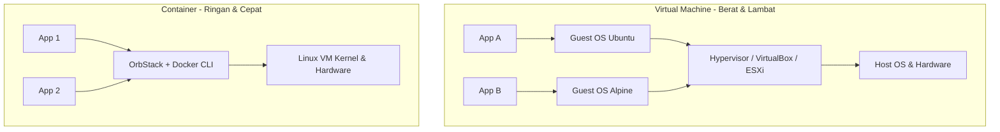
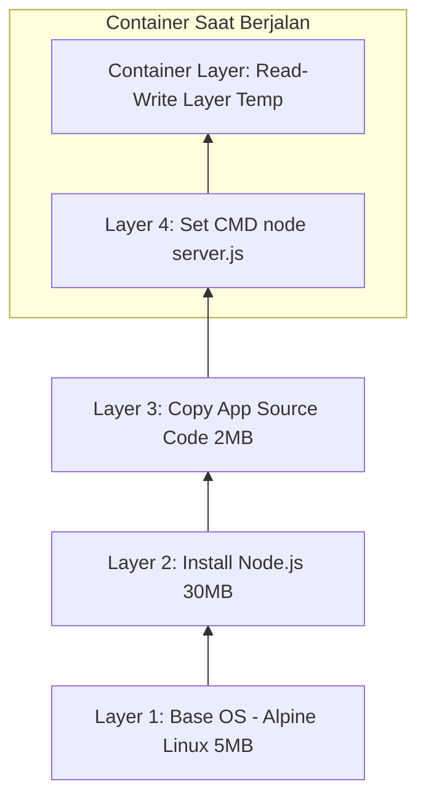
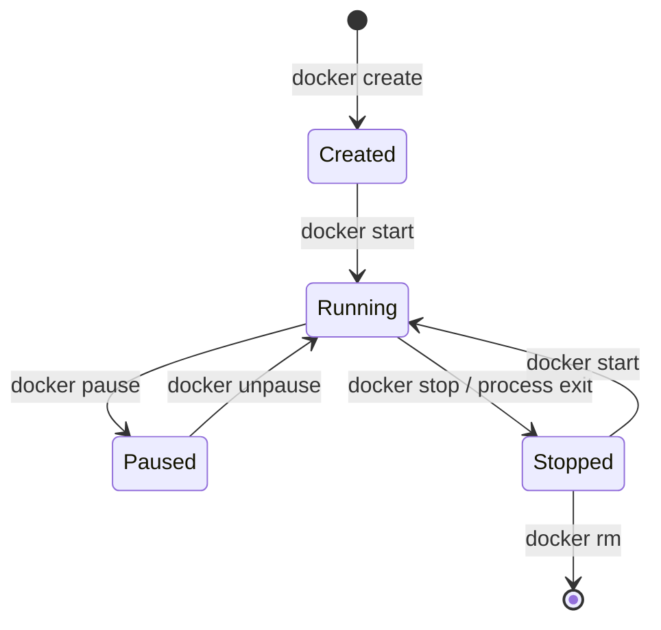

# Modul 01: Fundamental Container & OCI

> **Target Pembelajaran:** Memahami perbedaan Container vs Virtual Machine, konsep dasar OCI Image, cara kerja Image Layer, OrbStack sebagai runtime container lokal di macOS, serta Siklus Hidup Container (Container Lifecycle) dalam bahasa yang ramah pemula.

---

## 1. Mengapa Butuh Container?

Sebelum mengenal Container, mari kita pahami masalah klasik dalam pengembangan perangkat lunak yang sering disebut **"It works on my machine!"** (Di laptop saya jalan, tapi di server error).

```
   [ Laptop Developer ]                    [ Server Production ]
┌─────────────────────────┐             ┌─────────────────────────┐
│ Node.js v18.2.0         │   Deploy    │ Node.js v14.1.0         │
│ OS macOS                │ ──────────> │ OS Ubuntu Linux         │
│ Lib X v2.1              │             │ Lib X v1.0 (Missing!)   │
│   ==> JALAN NORMAL      │             │   ==> CRASH / ERROR     │
└─────────────────────────┘             └─────────────────────────┘
```

**Penyebab Utama Masalah Ini:**
- Perbedaan versi Bahasa Pemrograman/Runtime.
- Perbedaan Sistem Operasi (OS) dan Library/Dependency.
- Perbedaan Konfigurasi Environment Variable & Filesystem.

**Solusi Container:**
Container membungkus aplikasi **beserta seluruh dependency, library, dan konfigurasinya** ke dalam satu paket terisolasi. Di mana pun paket ini dijalankan (laptop, server on-premise, cloud), hasilnya akan **100% sama**.

---

## 2. Container vs Virtual Machine (VM)

Secara sederhana:
- **Virtual Machine (VM)** memvirtualisasikan **Hardware** (membutuhkan Guest OS lengkap di setiap VM).
- **Container** memvirtualisasikan **Sistem Operasi (Kernel)** (berbagi Kernel OS Host yang sama).

### Arsitektur Visual



### Tabel Perbandingan

| Komponen / Karakteristik | Virtual Machine (VM) | Container |
| :--- | :--- | :--- |
| **Abstraksi** | Hardware (CPU, RAM, Disk, NIC) | OS Kernel (Process Isolation) |
| **Guest OS** | Membutuhkan OS terpisah (bisa ratusan MB - GB) | Tidak ada Guest OS (hanya beberapa MB) |
| **Waktu Booting** | Hitungan menit | Hitungan detik atau milidetik |
| **Penggunaan Resource** | Tinggi (RAM & CPU dialokasikan secara independen) | Sangat Efisien (menggunakan resource sesuai kebutuhan) |
| **Isolasi** | Sangat Kuat (Hardware-level isolation) | Kuat (Process & Namespace isolation) |
| **Analogi** | Rumah Sendiri (Memiliki dapur, kamar mandi, & pagar sendiri) | Kamar Apartemen (Berbagi fondasi, air, & listrik gedung) |

---

## 3. Standardisasi OCI (Open Container Initiative)

Dahulu, teknologi container didominasi oleh Docker dengan format propietary-nya. Agar industri tidak tergantung pada satu vendor, dibentuklah **OCI (Open Container Initiative)**.

OCI menetapkan 2 standar utama:
1. **OCI Image Specification:** Standar format paket gambar container (bagaimana file dipaketkan).
2. **OCI Runtime Specification:** Standar cara menjalankan container (bagaimana proses diisolasi pada kernel).

Dampaknya, image yang dibuat menggunakan Docker atau OrbStack dapat dijalankan dengan **containerd**, **CRI-O**, atau **k3s/Kubernetes** tanpa modifikasi selama image tersebut mengikuti standar OCI.

---

## 4. Mengenal OrbStack: Runtime Container Lokal untuk macOS

Dalam modul ini, kita menggunakan **OrbStack** sebagai runtime container lokal di macOS. OrbStack menjalankan lingkungan Linux yang ringan di belakang layar dan menyediakan Docker-compatible engine, sehingga command praktik menggunakan `docker` tetap kompatibel dengan tool ekosistem container dan k3d.

```
       OrbStack di macOS                    Kubernetes di k3s/k3d
  ┌────────────────────────┐             ┌────────────────────────┐
  │  Docker CLI             │             │  containerd / CRI       │
  │  docker build/run       │             │  Pod menjalankan image   │
  └───────────┬────────────┘             └───────────┬────────────┘
              │ Docker API / OCI                       │ OCI Image
              ▼                                        ▼
  ┌────────────────────────┐             ┌────────────────────────┐
  │ OrbStack Linux VM      │             │ Kubernetes Node Runtime │
  │ Container runtime      │             │ (k3s/containerd)        │
  └────────────────────────┘             └────────────────────────┘
```

**Mengapa Memilih OrbStack untuk Lab Lokal?**
1. **Integrasi macOS:** OrbStack menyediakan Linux VM yang ringan untuk menjalankan container dan tool Linux tanpa mengelola VM secara manual.
2. **Docker-compatible CLI:** Perintah `docker build`, `docker run`, `docker images`, dan `docker save` dapat digunakan oleh materi dan mudah diintegrasikan dengan k3d.
3. **OCI-compatible:** Image yang dibuat tetap mengikuti format OCI dan dapat dipindahkan ke registry atau diimpor ke k3s/Kubernetes.
4. **Batasan platform:** OrbStack ditujukan terutama untuk macOS. Pada Linux gunakan k3s native atau runtime container yang tersedia; pada Windows gunakan Docker Desktop/WSL2 atau alternatif yang disetujui tim.

OrbStack adalah runtime lokal, bukan pengganti builder di GitLab CI. Pipeline CI pada modul berikut tetap menggunakan builder yang tersedia di runner Linux, seperti Podman atau Kaniko.

> Untuk detail instalasi dan verifikasi OrbStack, lihat [Panduan Instalasi & Persiapan Environment](./03-instalasi-persiapan.md).

---

## 5. Anatomi Image Layer & Copy-on-Write (CoW)

Container Image dibentuk dari gabungan beberapa **Image Layer** yang bersifat **Read-Only**.



### Cara Kerja Copy-on-Write (CoW):
1. **Read-Only Layers:** Semua layer image dari base OS hingga kode aplikasi bersifat *immutable* (tidak dapat diubah).
2. **Read-Write Layer (Container Layer):** Saat container dijalankan, sistem membuat 1 layer tipis paling atas yang bersifat sementara (*writable*).
3. Jika container mengubah suatu file dari image, file tersebut di-copy ke Read-Write Layer lalu dimodifikasi di sana. Layer asal tidak tersentuh.
4. **Efisiensi:** Jika 10 container dijalankan dari 1 image yang sama, kesepuluh container akan berbagi Read-Only Layer yang sama di disk storage, hanya Read-Write Layer masing-masing yang berbeda.

---

## 6. Container Lifecycle (Siklus Hidup Container)

Proses container melalui beberapa tahapan state utama:



### Penjelasan State:
- **Created:** Container sudah dibuat (layer writable siap), tetapi proses utama aplikasi belum berjalan.
- **Running:** Proses aplikasi sedang aktif berjalan di dalam CPU & Memory host.
- **Paused:** Proses dalam container di-suspend (diberhentikan sementara di memory).
- **Stopped:** Proses utama telah berhenti (misal via `docker stop` atau aplikasi exit 0/1).
- **Destroyed (Removed):** Container beserta Writable Layer-nya dihapus permanen dari storage disk.

---

## Ringkasan Modul 01

- **Container** mengisolasi aplikasi di tingkat OS Kernel, membuatnya jauh lebih ringan & cepat dibanding VM.
- Standardisasi **OCI** menjamin interoperabilitas container engine.
- **OrbStack** menyediakan runtime container lokal yang terintegrasi dengan macOS dan Docker-compatible CLI.
- **Image Layer** memanfaatkan mekanisme *Copy-on-Write* sehingga penggunaan storage disk sangat hemat.
