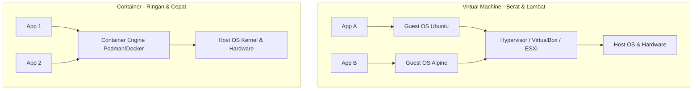
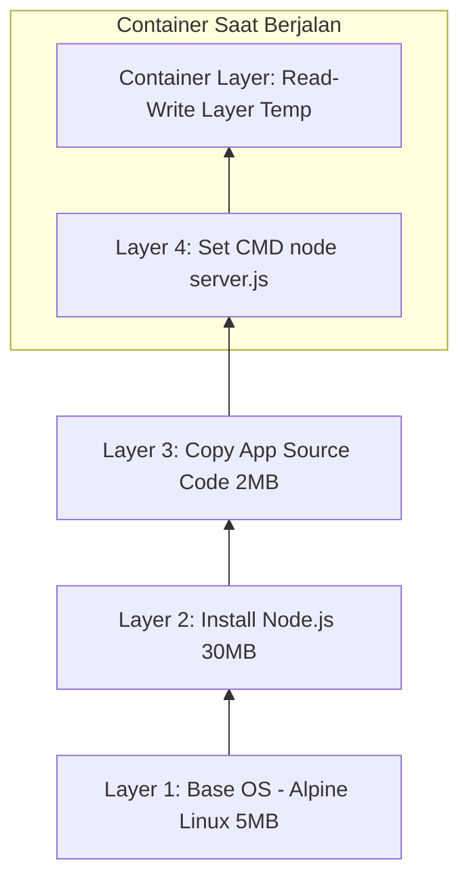
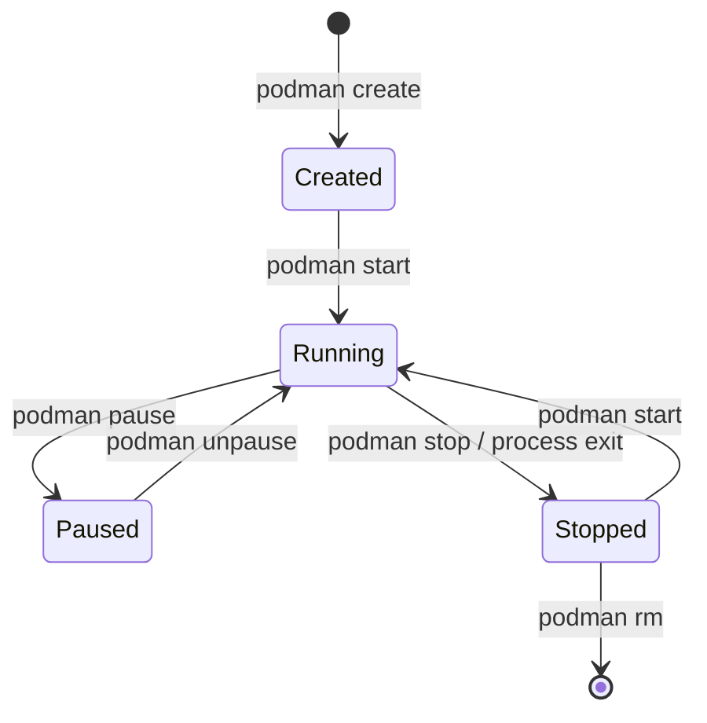

# Modul 01: Fundamental Container & OCI

> **Target Pembelajaran:** Memahami perbedaan Container vs Virtual Machine, konsep dasar OCI Image, cara kerja Image Layer, Podman, serta Siklus Hidup Container (Container Lifecycle) dalam bahasa yang ramah pemula.

---

## 1. Mengapa Butuh Container?

Sebelum mengenal Container, mari kita pahami masalah klasik dalam pengembangan perangkat lunak yang sering disebut **"It works on my machine!"** (Di laptop saya jalan, tapi di server error).

```
   [ Laptop Developer ]                    [ Server Production ]
┌─────────────────────────┐             ┌─────────────────────────┐
│ Node.js v18.2.0         │   Deploy    │ Node.js v14.1.0         │
│ OS macOS                │ ──────────> │ OS Ubuntu Linux         │
│ Lib X v2.1              │             │ Lib X v1.0 (Missing!)   │
│   ==> JALAN NORMAL      │             │   ==> CRASH / ERROR     │
└─────────────────────────┘             └─────────────────────────┘
```

**Penyebab Utama Masalah Ini:**
- Perbedaan versi Bahasa Pemrograman/Runtime.
- Perbedaan Sistem Operasi (OS) dan Library/Dependency.
- Perbedaan Konfigurasi Environment Variable & Filesystem.

**Solusi Container:**
Container membungkus aplikasi **beserta seluruh dependency, library, dan konfigurasinya** ke dalam satu paket terisolasi. Di mana pun paket ini dijalankan (laptop, server on-premise, cloud), hasilnya akan **100% sama**.

---

## 2. Container vs Virtual Machine (VM)

Secara sederhana:
- **Virtual Machine (VM)** memvirtualisasikan **Hardware** (membutuhkan Guest OS lengkap di setiap VM).
- **Container** memvirtualisasikan **Sistem Operasi (Kernel)** (berbagi Kernel OS Host yang sama).

### Arsitektur Visual



### Tabel Perbandingan

| Komponen / Karakteristik | Virtual Machine (VM) | Container |
| :--- | :--- | :--- |
| **Abstraksi** | Hardware (CPU, RAM, Disk, NIC) | OS Kernel (Process Isolation) |
| **Guest OS** | Membutuhkan OS terpisah (bisa ratusan MB - GB) | Tidak ada Guest OS (hanya beberapa MB) |
| **Waktu Booting** | Hitungan menit | Hitungan detik atau milidetik |
| **Penggunaan Resource** | Tinggi (RAM & CPU dialokasikan secara independen) | Sangat Efisien (menggunakan resource sesuai kebutuhan) |
| **Isolasi** | Sangat Kuat (Hardware-level isolation) | Kuat (Process & Namespace isolation) |
| **Analogi** | Rumah Sendiri (Memiliki dapur, kamar mandi, & pagar sendiri) | Kamar Apartemen (Berbagi fondasi, air, & listrik gedung) |

---

## 3. Standardisasi OCI (Open Container Initiative)

Dahulu, teknologi container didominasi oleh Docker dengan format propietary-nya. Agar industri tidak tergantung pada satu vendor, dibentuklah **OCI (Open Container Initiative)**.

OCI menetapkan 2 standar utama:
1. **OCI Image Specification:** Standar format paket gambar container (bagaimana file dipaketkan).
2. **OCI Runtime Specification:** Standar cara menjalankan container (bagaimana proses diisolasi pada kernel).

Dampaknya, image yang dibuat menggunakan Docker dapat dijalankan dengan **Podman**, **crio**, **containerd**, atau **k3s/Kubernetes** tanpa modifikasi sama sekali!

---

## 4. Mengenal Podman: Mengapa Podman?

Dalam modul ini, kita menggunakan **Podman** sebagai Container Engine utama.

```
       Docker (Klasik)                    Podman (Modern & Secure)
  ┌────────────────────────┐             ┌────────────────────────┐
  │   CLI (docker run)     │             │   CLI (podman run)     │
  └───────────┬────────────┘             └───────────┬────────────┘
              │ Socket                               │ Direct Process
              ▼                                      ▼
  ┌────────────────────────┐             ┌────────────────────────┐
  │ Docker Daemon (root)   │             │   Fork/Exec (Non-root) │
  └────────────────────────┘             └────────────────────────┘
```

**Mengapa Memilih Podman daripada Docker?**
1. **Daemonless (Tanpa Daemon Tunggal):** Docker mengandalkan `dockerd` yang selalu berjalan sebagai `root`. Jika daemon mati, seluruh container ikut mati. Podman berjalan sebagai proses mandiri (*fork-exec model*).
2. **Rootless (Lebih Aman):** Podman dapat membuat dan menjalankan container tanpa privilege root (user biasa), meningkatkan keamanan sistem secara drastis.
3. **K8s-Friendly:** Podman mendukung pembuatan manifest Kubernetes YAML secara native (`podman generate kube` / `podman play kube`).
4. **Kompatibilitas CLI:** Perintah Podman identik dengan Docker. Anda bisa membuat alias `alias docker=podman`.

---

## 5. Anatomi Image Layer & Copy-on-Write (CoW)

Container Image dibentuk dari gabungan beberapa **Image Layer** yang bersifat **Read-Only**.



### Cara Kerja Copy-on-Write (CoW):
1. **Read-Only Layers:** Semua layer image dari base OS hingga kode aplikasi bersifat *immutable* (tidak dapat diubah).
2. **Read-Write Layer (Container Layer):** Saat container dijalankan, sistem membuat 1 layer tipis paling atas yang bersifat sementara (*writable*).
3. Jika container mengubah suatu file dari image, file tersebut di-copy ke Read-Write Layer lalu dimodifikasi di sana. Layer asal tidak tersentuh.
4. **Efisiensi:** Jika 10 container dijalankan dari 1 image yang sama, kesepuluh container akan berbagi Read-Only Layer yang sama di disk storage, hanya Read-Write Layer masing-masing yang berbeda.

---

## 6. Container Lifecycle (Siklus Hidup Container)

Proses container melalui beberapa tahapan state utama:



### Penjelasan State:
- **Created:** Container sudah dibuat (layer writable siap), tetapi proses utama aplikasi belum berjalan.
- **Running:** Proses aplikasi sedang aktif berjalan di dalam CPU & Memory host.
- **Paused:** Proses dalam container di-suspend (diberhentikan sementara di memory).
- **Stopped:** Proses utama telah berhenti (misal via `podman stop` atau aplikasi exit 0/1).
- **Destroyed (Removed):** Container beserta Writable Layer-nya dihapus permanen dari storage disk.

---

## Ringkasan Modul 01

- **Container** mengisolasi aplikasi di tingkat OS Kernel, membuatnya jauh lebih ringan & cepat dibanding VM.
- Standardisasi **OCI** menjamin interoperabilitas container engine.
- **Podman** menawarkan solusi container modern: *Daemonless*, *Rootless*, dan *Kubernetes Native*.
- **Image Layer** memanfaatkan mekanisme *Copy-on-Write* sehingga penggunaan storage disk sangat hemat.
