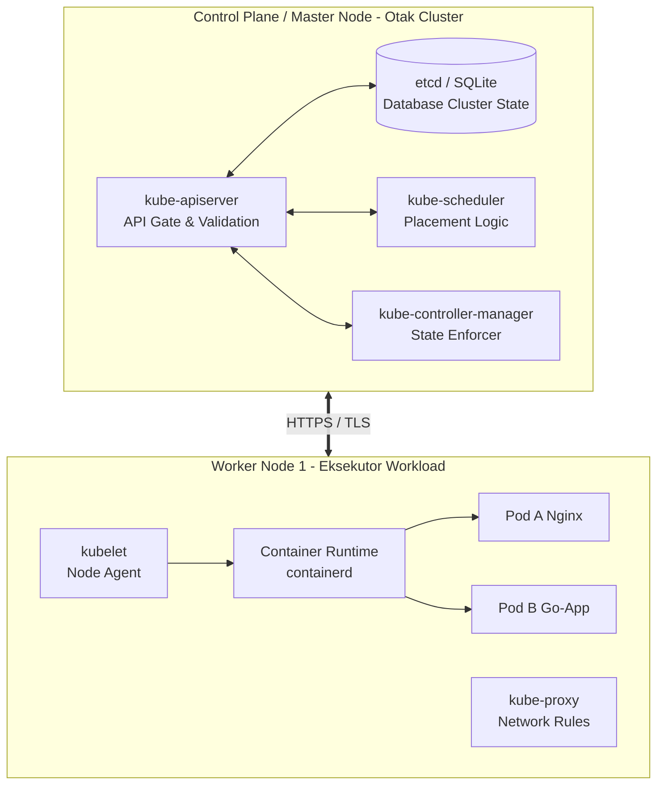
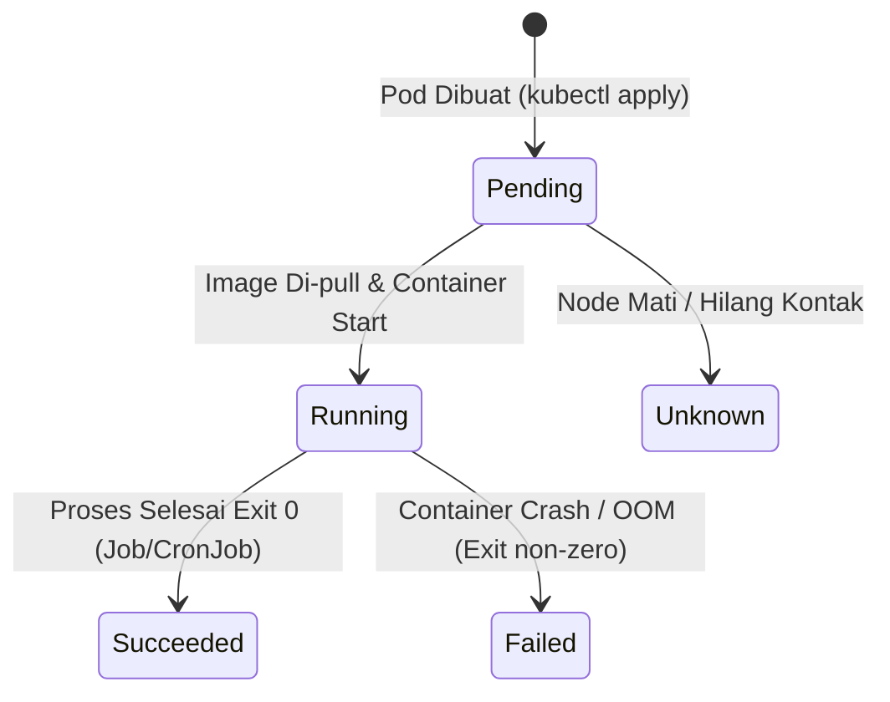

# Modul 02: Arsitektur Kubernetes & k3s

> **Target Pembelajaran:** Memahami arsitektur Kubernetes (Control Plane vs Worker Node), komponen internal (API Server, etcd, Scheduler, kubelet), serta Pod dan Siklus Hidupnya.

---

## 1. Pengantar Kubernetes & k3s

### Mengapa Butuh Orchestration?
Container bagus untuk mengemas 1 aplikasi. Namun jika Anda punya **100+ container**, bagaimana cara:
- Menentukan di server mana container harus berjalan?
- Melakukan restart otomatis jika container crash (*Auto-healing*)?
- Menambah jumlah container saat traffic melonjak (*Auto-scaling*)?
- Mengatur jalur lalu lintas data & load balancing (*Routing*)?

**Kubernetes (K8s)** adalah sistem orchestrator container sumber terbuka yang menangani semua tugas otomasi di atas.

### Apa itu k3s?
**k3s** adalah distribusi Kubernetes resmi yang sangat ringan (certified CNCF) buatan Rancher.
- Ukuran binary < 100 MB.
- Membutuhkan RAM hanya ~512 MB.
- Mengganti `etcd` berat bawaan dengan **SQLite** (opsional untuk single-node/dev) atau etcd tertanam.
- Sangat cocok untuk pengembangan lokal di laptop, edge computing, dan IoT.

---

## 2. Arsitektur Cluster Kubernetes

Kubernetes menggunakan arsitektur **Master-Worker** (atau *Control Plane - Node*).



---

## 3. Komponen Utama Kubernetes

### A. Control Plane (Otak Pengendali)

1. **`kube-apiserver` (Gerbang Utama):**
   - Merupakan pintu masuk tunggal untuk semua perintah (dari `kubectl`, UI Dashboard, atau komponen lain).
   - Memvalidasi dan mengonfigurasi data untuk objek API seperti Pods, Services, Deployments.

2. **`etcd` (Penyimpanan Status Cluster):**
   - Database *key-value* terdistribusi yang menyimpan **seluruh informasi status cluster** (Single Source of Truth).
   - Catatan: Di **k3s**, etcd digantikan oleh SQLite secara default agar hemat memori pada single-node laptop.

3. **`kube-scheduler` (Penentu Lokasi):**
   - Bertanggung jawab memilih Worker Node mana yang paling cocok untuk menjalankan Pod baru berdasarkan ketersediaan CPU, RAM, affinity, dll.

4. **`kube-controller-manager` (Pengatur Status):**
   - Mengendalikan berbagai *control loop* background. Contohnya: jika ada Pod mati, Node Controller/Deployment Controller akan membuat Pod baru agar sesuai dengan *desired state*.

---

### B. Worker Node (Tempat Workload Berjalan)

1. **`kubelet` (Kapten Node):**
   - Agent yang berjalan di setiap Worker Node.
   - Bertugas menerima instruksi dari API Server dan memastikan container di dalam Pod berjalan sesuai spesifikasi.

2. **`kube-proxy` (Manajer Jaringan):**
   - Memelihara aturan jaringan (*network rules*) di setiap node. Memungkinkan komunikasi antar Pod dan routing lalu lintas Service.

3. **Container Runtime (CRI):**
   - Perangkat lunak yang benar-benar menjalankan container (misal: `containerd` atau `CRI-O`). k3s menyertakan `containerd` secara bawaan.

---

## 4. Konsep Pod & Pod Lifecycle

### Apa itu Pod?
Di Kubernetes, Anda **tidak menjalankan Container secara langsung**, melainkan dibungkus di dalam **Pod**.

> **Definisi Pod:** Unit terkecil yang dapat dideploy di Kubernetes. Satu Pod dapat berisi 1 Container (paling umum) atau beberapa Container (*Multi-container pod / Sidecar pattern*) yang berbagi IP Address, Port, dan Volume Storage yang sama.

```
┌────────────────────────────────────────────────────────┐
│ Pod (IP: 10.42.0.15)                                   │
│                                                        │
│  ┌──────────────────────┐    ┌──────────────────────┐  │
│  │ Main Container       │    │ Sidecar Container    │  │
│  │ (App Nginx/Go)       │    │ (Log Shipper/Fluentd)│  │
│  │ Port 8080            │    │ Reads Shared Volume  │  │
│  └──────────────────────┘    └──────────────────────┘  │
│                                                        │
│  Shared Storage (Volume) & Shared Network Namespace    │
└────────────────────────────────────────────────────────┘
```

---

### Pod Lifecycle (Siklus Hidup Pod)

Status/Phase sebuah Pod bergerak dalam alur sebagai berikut:



### Penjelasan Phase Utama Pod:

| Status (Phase) | Deskripsi |
| :--- | :--- |
| **Pending** | Pod telah diterima oleh API Server, tetapi satu atau lebih container belum berhasil dibuat/dijalankan (sedang memilih Node atau mem-pull image). |
| **Running** | Pod telah terikat ke sebuah Node, dan seluruh container telah berhasil dibuat. Minimal ada 1 container yang sedang berjalan/start. |
| **Succeeded** | Seluruh container di dalam Pod telah selesai menjalankan tugasnya dan berhenti secara sukses (Exit Code 0). |
| **Failed** | Seluruh container telah berhenti, dan minimal ada 1 container yang berhenti karena kesalahan (*CrashLoopBackOff*, Exit Code non-zero). |
| **Unknown** | Status Pod tidak dapat diperoleh (biasanya karena komunikasi API Server ke kubelet pada Node terputus). |

---

## Ringkasan Modul 02

- **Kubernetes** adalah orchestrator container; **k3s** adalah distribusi K8s super ringan yang cocok untuk laptop.
- **Control Plane** (API Server, etcd, Scheduler, Controller) bertindak sebagai otak; **Worker Node** (kubelet, kube-proxy, CRI) menjalankan workload.
- **Pod** adalah unit terkecil di K8s yang membungkus 1 atau lebih container yang saling berbagi network & storage.
