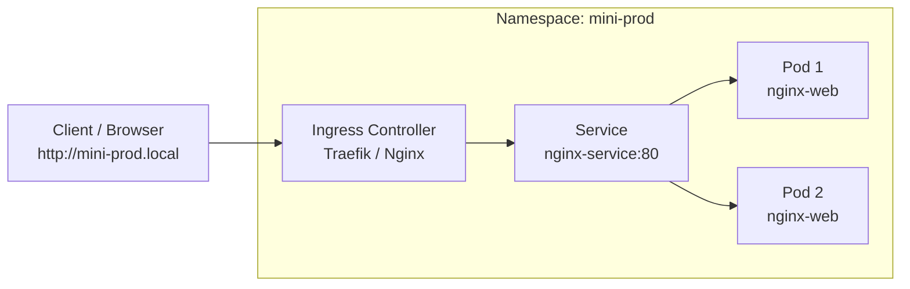

# Modul 05: Lab Hands-on — Deploy Nginx Production-Ready (Tanpa Helm)

> **Target Pembelajaran:** Praktik langsung membuat objek Kubernetes dari nol menggunakan file YAML manifest: **Namespace → Deployment → Service → Ingress**, serta membuktikan fitur Auto-Healing Kubernetes.

---

## 0. Prasyarat dan Hasil Akhir

Sebelum memulai, pastikan hal berikut tersedia:

- Cluster Kubernetes lokal aktif, misalnya k3s atau k3d.
- `kubectl` sudah terpasang dan terhubung ke cluster yang benar.
- Ingress Controller aktif jika ingin menguji akses melalui `mini-prod.local`.
- Port lokal yang digunakan untuk `port-forward` tidak sedang dipakai proses lain.

Periksa koneksi ke cluster:

```bash
kubectl version --short
kubectl cluster-info
kubectl get nodes -o wide
kubectl config current-context
```

Setelah lab selesai, Anda seharusnya dapat menjelaskan dan membuktikan bahwa:

1. Namespace `mini-prod` mengisolasi resource lab.
2. Deployment `nginx-web` menjaga dua replika Pod Nginx.
3. Service `nginx-service` menemukan Pod melalui label selector dan menyediakan
   alamat internal yang stabil.
4. Ingress meneruskan host `mini-prod.local` ke Service.
5. Deployment membuat Pod pengganti ketika salah satu Pod dihapus.

> **Catatan:** `kubectl version --short` tidak tersedia pada beberapa versi
> kubectl terbaru. Jika command tersebut gagal, gunakan `kubectl version`.

---

## 1. Arsitektur Lab

Di dalam lab ini, kita akan membangun alur trafik sebagai berikut:



---

## 1.1 Mengapa Resource Diterapkan Berurutan?

Resource memiliki hubungan dependensi berikut:

```text
01-namespace.yaml  ->  02-deployment.yaml  ->  03-service.yaml  ->  04-ingress.yaml
       ruang                 Pod                 alamat internal       akses HTTP
```

- Namespace harus ada sebelum Deployment, Service, dan Ingress yang menunjuk ke
  `namespace: mini-prod` dibuat.
- Deployment harus membuat Pod sebelum Service dapat menemukan endpoint yang
  sehat.
- Service harus ada sebelum Ingress dapat meneruskan traffic ke backend.
- Ingress Controller harus aktif agar objek Ingress benar-benar menerima traffic.

Kubernetes bersifat deklaratif. Anda menyatakan kondisi akhir melalui YAML,
lalu Kubernetes Controller berusaha mencocokkan kondisi aktual dengan kondisi
tersebut. Karena itu `kubectl apply` dapat dijalankan kembali ketika konfigurasi
tidak berubah tanpa membuat resource duplikat.

---

## 2. Langkah Demi Langkah (Step-by-Step)

Pastikan terminal Anda sudah berada di direktori `minggu-01/manifests/`.

```bash
cd minggu-01/manifests
```

### 2.0 Memeriksa Manifest Sebelum Apply

Jangan langsung menerapkan YAML yang belum dibaca. Tampilkan isi file dan
validasi bentuk resource secara lokal terlebih dahulu:

```bash
ls
cat 01-namespace.yaml
cat 02-deployment.yaml
cat 03-service.yaml
cat 04-ingress.yaml

# Validasi tanpa membuat resource di cluster
kubectl apply --dry-run=client -f 01-namespace.yaml
kubectl apply --dry-run=client -f 02-deployment.yaml
kubectl apply --dry-run=client -f 03-service.yaml
kubectl apply --dry-run=client -f 04-ingress.yaml

# Bandingkan manifest dengan kondisi cluster
kubectl diff -f 01-namespace.yaml
```

Penjelasan command:

| Command atau flag | Fungsi |
| --- | --- |
| `kubectl apply -f FILE` | Membuat resource baru atau memperbarui resource dari file deklaratif. |
| `-f FILE` | Menentukan file manifest yang dibaca kubectl. |
| `--dry-run=client` | Memeriksa manifest dari sisi client tanpa mengubah cluster. |
| `kubectl diff -f FILE` | Membandingkan manifest dengan konfigurasi resource di cluster. |
| `kubectl get RESOURCE -o yaml` | Membaca konfigurasi aktual yang tersimpan di API server. |

### 2.0.1 Anatomi Umum YAML Kubernetes

Keempat manifest menggunakan pola dasar berikut:

```yaml
apiVersion: v1          # Versi API resource
kind: Namespace         # Jenis resource
metadata:               # Identitas dan metadata resource
  name: mini-prod
spec:                   # Kondisi yang diinginkan, jika kind memilikinya
```

- `apiVersion` menentukan API Kubernetes yang digunakan. Contohnya `v1` untuk
  Namespace dan Service, `apps/v1` untuk Deployment, serta
  `networking.k8s.io/v1` untuk Ingress.
- `kind` menentukan tipe objek yang akan dibuat.
- `metadata.name` adalah nama resource yang digunakan pada command dan referensi
  resource lain.
- `metadata.namespace` menempatkan resource namespaced ke ruang `mini-prod`.
- `metadata.labels` menyimpan pasangan key-value untuk pengelompokan dan selector.
- `spec` menyatakan kondisi akhir yang diinginkan. Isi `spec` berbeda untuk setiap
  `kind`.

> Namespace sendiri adalah resource tingkat cluster, sehingga manifest Namespace
> tidak memiliki `metadata.namespace`.

---

### Langkah 1: Membuat Namespace

**Namespace** berfungsi sebagai ruang isolasi logis (seperti folder virtual) agar resource tidak bercampur dengan resource lain di cluster.

1. **Jalankan Perintah:**
   ```bash
   kubectl apply -f 01-namespace.yaml
   ```

2. **Verifikasi Hasil:**
   ```bash
   kubectl get namespaces
   ```
   *Pastikan namespace `mini-prod` berada dalam status `Active`.*

3. **Baca konfigurasi aktual:**
   ```bash
   kubectl get namespace mini-prod -o yaml
   kubectl describe namespace mini-prod
   ```

### Penjelasan `01-namespace.yaml`

```yaml
apiVersion: v1
kind: Namespace
metadata:
  name: mini-prod
  labels:
    env: development
    learning-week: "01"
```

| Bagian YAML | Penjelasan |
| --- | --- |
| `apiVersion: v1` | Namespace memakai core API Kubernetes versi `v1`. |
| `kind: Namespace` | Meminta Kubernetes membuat ruang isolasi logis. |
| `metadata.name` | Nama namespace yang dipakai oleh manifest berikutnya dan flag `-n mini-prod`. |
| `metadata.labels.env` | Label lingkungan. Label belum membatasi akses dengan sendirinya, tetapi dapat dipakai policy atau query. |
| `metadata.labels.learning-week` | Penanda bahwa resource dibuat untuk materi Minggu 1. Nilai ditulis sebagai string agar tidak diperlakukan sebagai angka. |

`kubectl get namespaces` menampilkan ringkasan semua namespace. Flag `-o yaml`
meminta konfigurasi lengkap dari API server, sedangkan `describe` menampilkan
detail operasional dan event yang berkaitan dengan resource.

---

### Langkah 2: Membuat Deployment (Workload)

**Deployment** bertanggung jawab mengelola Pod (menciptakan, memperbarui, dan menjaga jumlah replika Pod yang diinginkan).

1. **Jalankan Perintah:**
   ```bash
   kubectl apply -f 02-deployment.yaml
   ```

2. **Verifikasi Hasil:**
   ```bash
   kubectl get deployments -n mini-prod
   kubectl get pods -n mini-prod
   ```
   *Anda akan melihat 2 Pod Nginx dengan status `Running`.*

3. **Periksa status dan event Deployment/Pod:**
   ```bash
   kubectl get deployment nginx-web -n mini-prod -o wide
   kubectl get pods -n mini-prod -l app=nginx-web -o wide
   kubectl describe deployment nginx-web -n mini-prod
   kubectl describe pod -n mini-prod -l app=nginx-web
   ```

### Penjelasan `02-deployment.yaml`

```yaml
apiVersion: apps/v1
kind: Deployment
metadata:
  name: nginx-web
  namespace: mini-prod
  labels:
    app: nginx-web
spec:
  replicas: 2
  selector:
    matchLabels:
      app: nginx-web
  template:
    metadata:
      labels:
        app: nginx-web
    spec:
      containers:
      - name: nginx
        image: nginx:1.25-alpine
        ports:
        - containerPort: 80
        resources:
          requests:
            memory: "32Mi"
            cpu: "50m"
          limits:
            memory: "64Mi"
            cpu: "100m"
```

| Bagian YAML | Penjelasan |
| --- | --- |
| `apiVersion: apps/v1` | API stabil untuk Deployment. |
| `metadata.name` dan `namespace` | Membuat Deployment bernama `nginx-web` di `mini-prod`. |
| `spec.replicas: 2` | Deployment menjaga dua Pod yang diinginkan. Jika satu Pod hilang, controller membuat pengganti. |
| `spec.selector.matchLabels` | Menentukan Pod yang dikelola Deployment. Nilainya harus cocok dengan label pada `template.metadata.labels`. |
| `spec.template` | Template yang digunakan untuk membuat setiap Pod. Perubahan template biasanya membuat ReplicaSet baru. |
| `template.metadata.labels.app` | Identitas Pod. Label ini juga dicari oleh Service. |
| `containers[].name` | Nama container di dalam Pod, yaitu `nginx`. |
| `containers[].image` | Image yang dijalankan. Tag `1.25-alpine` lebih terprediksi daripada `latest`. |
| `containerPort: 80` | Dokumentasi port yang digunakan aplikasi Nginx. Ini tidak membuka port ke luar cluster secara otomatis. |
| `resources.requests` | Resource minimum yang dipakai scheduler saat memilih node. `50m` berarti 0,05 CPU core. |
| `resources.limits` | Batas maksimum resource container. Jika pemakaian memory melewati `64Mi`, container dapat mengalami OOMKilled. |

Hubungan selector sangat penting:

```text
Deployment selector: app=nginx-web
Pod template label:  app=nginx-web
Service selector:    app=nginx-web
```

Jika label atau selector tidak cocok, Deployment dapat kehilangan target Pod
atau Service tidak memiliki endpoint walaupun Pod berstatus `Running`.

---

### Langkah 3: Membuat Service (Networking Internal)

**Service** memberikan IP virtual yang stabil (*ClusterIP*) dan fungsi *Load Balancer* internal antar Pod Nginx.

1. **Jalankan Perintah:**
   ```bash
   kubectl apply -f 03-service.yaml
   ```

2. **Verifikasi Hasil:**
   ```bash
   kubectl get svc -n mini-prod
   ```
   *Catat IP `CLUSTER-IP` yang diberikan oleh Service.*

3. **Periksa endpoint Service:**
   ```bash
   kubectl describe service nginx-service -n mini-prod
   kubectl get endpoints nginx-service -n mini-prod
   kubectl get endpointslice -n mini-prod -l kubernetes.io/service-name=nginx-service
   ```
   Endpoint seharusnya berisi alamat IP Pod Nginx pada port `80`.

4. **Uji Service dari Dalam Cluster:**
   ```bash
   # Jalankan Pod sementara untuk melakukan tes HTTP curl ke Service
   kubectl run test-curl --rm -it --image=alpine -n mini-prod -- sh
   # Di dalam prompt Pod temporary, ketik:
   # wget -O- http://nginx-service
   # exit
   ```

Penjelasan command pengujian:

- `kubectl run test-curl` membuat Pod sementara bernama `test-curl`.
- `--rm` menghapus Pod setelah sesi selesai.
- `-it` menggabungkan mode interaktif (`-i`) dan terminal (`-t`).
- `--image=alpine` memilih image ringan untuk menjalankan shell.
- `-n mini-prod` menempatkan Pod penguji di namespace yang sama.
- `-- sh` meneruskan command `sh` ke dalam container; `--` memisahkan argumen
  kubectl dari command di dalam container.
- `wget -O- http://nginx-service` mengirim request ke nama DNS Service. `-O-`
  menampilkan response body ke terminal.

### Penjelasan `03-service.yaml`

```yaml
apiVersion: v1
kind: Service
metadata:
  name: nginx-service
  namespace: mini-prod
spec:
  type: ClusterIP
  selector:
    app: nginx-web
  ports:
  - port: 80
    targetPort: 80
    protocol: TCP
```

| Bagian YAML | Penjelasan |
| --- | --- |
| `kind: Service` | Membuat alamat virtual yang stabil untuk akses ke Pod. |
| `type: ClusterIP` | Service hanya dapat diakses dari dalam cluster. Ini adalah default Service type. |
| `selector.app` | Memilih Pod dengan label `app=nginx-web`. Service kemudian membangun endpoint dari Pod yang cocok. |
| `ports[].port` | Port yang digunakan client saat mengakses Service. |
| `ports[].targetPort` | Port pada container Pod yang menjadi tujuan traffic. |
| `protocol: TCP` | Protocol jaringan yang digunakan. |

`nginx-service` dapat di-resolve oleh DNS Kubernetes menjadi nama seperti
`nginx-service.mini-prod.svc.cluster.local`. Dalam namespace yang sama,
`http://nginx-service` sudah cukup.

---

### Langkah 4: Membuat Ingress (Routing Eksternal)

**Ingress** mengatur lalu lintas dari luar cluster (HTTP/HTTPS) menuju Service berdasarkan domain name/host header.

1. **Jalankan Perintah:**
   ```bash
   kubectl apply -f 04-ingress.yaml
   ```

2. **Verifikasi Hasil:**
   ```bash
   kubectl get ingress -n mini-prod
   ```

3. **Periksa detail routing dan event:**
   ```bash
   kubectl describe ingress nginx-ingress -n mini-prod
   kubectl get ingress nginx-ingress -n mini-prod -o yaml
   kubectl get pods -A | grep -E 'traefik|ingress-nginx'
   ```

   Command terakhir membantu memeriksa apakah Ingress Controller tersedia. Pada
   cluster k3s standar, controller yang umum digunakan adalah Traefik. Jika
   tidak ada controller, objek Ingress tetap dapat dibuat tetapi request dari
   luar cluster tidak akan diproses.

### Penjelasan `04-ingress.yaml`

```yaml
apiVersion: networking.k8s.io/v1
kind: Ingress
metadata:
  name: nginx-ingress
  namespace: mini-prod
  annotations:
    ingress.kubernetes.io/ssl-redirect: "false"
spec:
  rules:
  - host: mini-prod.local
    http:
      paths:
      - path: /
        pathType: Prefix
        backend:
          service:
            name: nginx-service
            port:
              number: 80
```

| Bagian YAML | Penjelasan |
| --- | --- |
| `apiVersion: networking.k8s.io/v1` | API stabil untuk Ingress. |
| `metadata.name` dan `namespace` | Nama objek routing di namespace `mini-prod`. |
| `annotations` | Instruksi tambahan untuk Ingress Controller. Nilai ini meminta redirect HTTPS dinonaktifkan untuk lab HTTP lokal; dukungan annotation dapat berbeda antar-controller. |
| `spec.rules[].host` | Host header yang harus cocok, yaitu `mini-prod.local`. |
| `path: /` | Semua path yang dimulai dari `/` diarahkan ke backend. |
| `pathType: Prefix` | Path `/`, `/index.html`, dan path turunan lain cocok sebagai prefix. |
| `backend.service.name` | Service tujuan, yaitu `nginx-service`. |
| `backend.service.port.number` | Port Service yang digunakan, bukan langsung port container. |

Ingress tidak membuat DNS publik dan tidak otomatis mengubah `/etc/hosts`.
Pemetaan `127.0.0.1 mini-prod.local` diperlukan jika request masuk melalui
localhost. Port dan alamat yang digunakan juga bergantung pada cara cluster
lokal mengekspos Ingress Controller.

---

## 3. Menguji Akses dari Laptop Lokal

Agar domain `mini-prod.local` dapat diakses dari laptop Anda:

### Opsi A: Menambahkan Mappings ke `/etc/hosts`
1. Buka file `/etc/hosts` di laptop Anda (membutuhkan sudo/admin):
   ```bash
   sudo nano /etc/hosts
   ```
2. Tambahkan baris berikut di paling bawah:
   ```text
   127.0.0.1 mini-prod.local
   ```
3. Uji menggunakan `curl`:
   ```bash
   curl http://mini-prod.local
   ```
   *Output harus menampilkan Halaman Selamat Datang Nginx:*
   ```html
   <h1>Welcome to nginx!</h1>
   ```

### Opsi B: Menggunakan kubectl Port-Forward (Tanpa edit /etc/hosts)
Jika Anda tidak ingin mengubah `/etc/hosts`, gunakan perintah port-forwarding bawaan `kubectl`:

```bash
kubectl port-forward svc/nginx-service 8080:80 -n mini-prod
```
Buka browser atau terminal baru lalu akses:
```bash
curl http://localhost:8080
```

Penjelasan `kubectl port-forward`:

- `svc/nginx-service` memilih Service sebagai target port-forward.
- `8080:80` memetakan port `8080` pada laptop ke port `80` pada Service.
- `-n mini-prod` mencari Service pada namespace yang benar.
- Command ini harus tetap berjalan di terminal pertama. Hentikan dengan `Ctrl+C`.
- Port-forward melewati Ingress, sehingga cocok untuk memastikan Service dan
  Pod bekerja sebelum mendiagnosis masalah Ingress.

---

## 4. Simulasi Pembuktian Auto-Healing (Incident Test)

Salah satu keajaiban Kubernetes adalah **Auto-Healing** (Kemampuan memperbaiki diri secara otomatis jika terjadi kegagalan). Mari kita uji!

### Langkah Simulasi:
1. **Lihat daftar Pod aktif:**
   ```bash
   kubectl get pods -n mini-prod
   ```
   *Catat nama salah satu Pod, misal: `nginx-web-6799fc88d8-abc12`.*

   Gunakan selector agar tidak perlu menyalin nama Pod secara manual:
   ```bash
   kubectl get pods -n mini-prod -l app=nginx-web
   ```

2. **Paksa hapus Pod tersebut (simulasi Pod crash / mati):**
   ```bash
   kubectl delete pod nginx-web-6799fc88d8-abc12 -n mini-prod
   ```

3. **Segera cek kembali daftar Pod:**
   ```bash
   kubectl get pods -n mini-prod -w
   ```

   Flag `-w` berarti `--watch`, sehingga kubectl terus menampilkan perubahan
   status. Hentikan mode watch dengan `Ctrl+C`.

### Amati Hasilnya:
Kubernetes mendeteksi bahwa jumlah Pod aktif tinggal 1 (padahal spesifikasi di `Deployment` meminta 2 replika). Dalam hitungan detik, **Deployment Controller langsung membuat Pod baru** secara otomatis untuk menggantikan Pod yang mati!

### Membuktikan Pemulihan dengan Nama Pod Baru

Bandingkan UID dan nama Pod sebelum dan sesudah penghapusan:

```bash
kubectl get pods -n mini-prod -l app=nginx-web -o wide
kubectl describe deployment nginx-web -n mini-prod
kubectl get rs -n mini-prod
```

Deployment tidak menghidupkan kembali objek Pod yang sama. ReplicaSet membuat
Pod baru agar jumlah replika kembali menjadi dua. Karena itu nama Pod biasanya
berubah, sedangkan label dan owner reference tetap menunjukkan hubungan dengan
Deployment.

## 5.1 Cheat Sheet Command Lab

| Tujuan | Command | Penjelasan |
| --- | --- | --- |
| Cek cluster | `kubectl get nodes` | Memastikan node tersedia dan statusnya `Ready`. |
| Buat/perbarui resource | `kubectl apply -f FILE` | Menerapkan kondisi yang dideklarasikan di YAML. |
| Cek resource namespace | `kubectl get all -n mini-prod` | Melihat resource workload dan Service secara ringkas. |
| Lihat detail | `kubectl describe pod NAME -n mini-prod` | Membaca status container, event, dan penyebab kegagalan. |
| Filter berdasarkan label | `kubectl get pods -l app=nginx-web -n mini-prod` | Hanya menampilkan Pod yang cocok dengan selector. |
| Lihat log | `kubectl logs POD -n mini-prod` | Membaca stdout/stderr container. Nginx dapat memiliki log minimal saat belum ada request. |
| Masuk ke container | `kubectl exec -it POD -n mini-prod -- /bin/sh` | Menjalankan shell di dalam Pod untuk pemeriksaan. |
| Uji Service | `kubectl run test-curl --rm -it --image=alpine -n mini-prod -- sh` | Membuat client sementara dari dalam cluster. |
| Forward port | `kubectl port-forward svc/nginx-service 8080:80 -n mini-prod` | Mengakses Service dari laptop tanpa Ingress. |
| Pantau perubahan | `kubectl get pods -n mini-prod -w` | Menonton perubahan status secara realtime. |
| Hapus satu Pod | `kubectl delete pod POD -n mini-prod` | Simulasi kegagalan Pod yang akan memicu rekonsiliasi Deployment. |
| Lihat penggunaan resource | `kubectl top pods -n mini-prod` | Membaca CPU/memory jika Metrics Server tersedia. |

Gunakan nama Pod aktual dari `kubectl get pods`; nama Pod Deployment memiliki
suffix acak dan tidak boleh diasumsikan tetap.

## 5.2 Alur Troubleshooting Jika Hasil Tidak Sesuai

### Pod tidak `Running`

```bash
kubectl get pods -n mini-prod -o wide
kubectl describe pod -n mini-prod -l app=nginx-web
kubectl get events -n mini-prod --sort-by=.lastTimestamp
kubectl logs -n mini-prod -l app=nginx-web --all-containers=true
```

Fokus pada kolom `STATUS`, `READY`, `RESTARTS`, dan bagian `Events`. Contoh
petunjuk umum:

- `ErrImagePull` atau `ImagePullBackOff`: node tidak dapat mengambil image.
- `Pending`: resource request tidak dapat dijadwalkan ke node.
- `CrashLoopBackOff`: container terus berhenti dan di-restart.
- `0/1 Ready`: container hidup tetapi belum siap menerima traffic.

### Service tidak memiliki endpoint

```bash
kubectl get pods -n mini-prod --show-labels
kubectl get endpoints nginx-service -n mini-prod
kubectl describe service nginx-service -n mini-prod
```

Bandingkan `spec.selector` pada Service dengan `metadata.labels` pada Pod.
Selector `app: nginx-web` harus identik secara key dan value.

### Ingress tidak dapat diakses

```bash
kubectl get ingress nginx-ingress -n mini-prod -o wide
kubectl describe ingress nginx-ingress -n mini-prod
kubectl get pods -A | grep -E 'traefik|ingress-nginx'
curl -H 'Host: mini-prod.local' http://127.0.0.1
```

Pastikan Ingress Controller aktif, host header benar, dan port expose cluster
sesuai dengan setup k3s/k3d Anda. Gunakan `kubectl port-forward` sebagai tes
pembanding untuk memisahkan masalah Service dari masalah Ingress.

---

## 6. Pembersihan Resource (Clean up)

Jika Anda sudah selesai melakukan pengujian dan ingin menghapus seluruh resource lab Minggu 1:

```bash
kubectl delete namespace mini-prod
```
*(Menghapus Namespace otomatis akan menghapus seluruh Deployment, Service, dan Ingress di dalamnya).*

Verifikasi bahwa resource lab sudah hilang:

```bash
kubectl get all -n mini-prod
kubectl get namespace mini-prod
```

Perintah terakhir seharusnya mengembalikan `NotFound`. Alternatif cleanup yang
lebih selektif adalah menghapus manifest satu per satu:

```bash
kubectl delete -f 04-ingress.yaml
kubectl delete -f 03-service.yaml
kubectl delete -f 02-deployment.yaml
kubectl delete -f 01-namespace.yaml
```

Hanya jalankan cleanup ini pada namespace lab `mini-prod`. Jangan menghapus
namespace atau resource milik environment lain.
