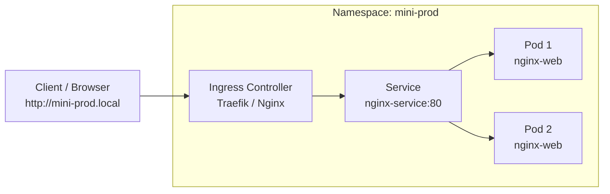

# Modul 05: Lab Hands-on — Deploy Nginx Production-Ready (Tanpa Helm)

> **Target Pembelajaran:** Praktik langsung membuat objek Kubernetes dari nol menggunakan file YAML manifest: **Namespace → Deployment → Service → Ingress**, serta membuktikan fitur Auto-Healing Kubernetes.

---

## 1. Arsitektur Lab

Di dalam lab ini, kita akan membangun alur trafik sebagai berikut:



---

## 2. Langkah Demi Langkah (Step-by-Step)

Pastikan terminal Anda sudah berada di direktori `minggu-01/manifests/`.

```bash
cd minggu-01/manifests
```

---

### Langkah 1: Membuat Namespace

**Namespace** berfungsi sebagai ruang isolasi logis (seperti folder virtual) agar resource tidak bercampur dengan resource lain di cluster.

1. **Jalankan Perintah:**
   ```bash
   kubectl apply -f 01-namespace.yaml
   ```

2. **Verifikasi Hasil:**
   ```bash
   kubectl get namespaces
   ```
   *Pastikan namespace `mini-prod` berada dalam status `Active`.*

---

### Langkah 2: Membuat Deployment (Workload)

**Deployment** bertanggung jawab mengelola Pod (menciptakan, memperbarui, dan menjaga jumlah replika Pod yang diinginkan).

1. **Jalankan Perintah:**
   ```bash
   kubectl apply -f 02-deployment.yaml
   ```

2. **Verifikasi Hasil:**
   ```bash
   kubectl get deployments -n mini-prod
   kubectl get pods -n mini-prod
   ```
   *Anda akan melihat 2 Pod Nginx dengan status `Running`.*

---

### Langkah 3: Membuat Service (Networking Internal)

**Service** memberikan IP virtual yang stabil (*ClusterIP*) dan fungsi *Load Balancer* internal antar Pod Nginx.

1. **Jalankan Perintah:**
   ```bash
   kubectl apply -f 03-service.yaml
   ```

2. **Verifikasi Hasil:**
   ```bash
   kubectl get svc -n mini-prod
   ```
   *Catat IP `CLUSTER-IP` yang diberikan oleh Service.*

3. **Uji Service dari Dalam Cluster:**
   ```bash
   # Jalankan Pod sementara untuk melakukan tes HTTP curl ke Service
   kubectl run test-curl --rm -it --image=alpine -n mini-prod -- sh
   # Di dalam prompt Pod temporary, ketik:
   # wget -O- http://nginx-service
   # exit
   ```

---

### Langkah 4: Membuat Ingress (Routing Eksternal)

**Ingress** mengatur lalu lintas dari luar cluster (HTTP/HTTPS) menuju Service berdasarkan domain name/host header.

1. **Jalankan Perintah:**
   ```bash
   kubectl apply -f 04-ingress.yaml
   ```

2. **Verifikasi Hasil:**
   ```bash
   kubectl get ingress -n mini-prod
   ```

---

## 3. Menguji Akses dari Laptop Lokal

Agar domain `mini-prod.local` dapat diakses dari laptop Anda:

### Opsi A: Menambahkan Mappings ke `/etc/hosts`
1. Buka file `/etc/hosts` di laptop Anda (membutuhkan sudo/admin):
   ```bash
   sudo nano /etc/hosts
   ```
2. Tambahkan baris berikut di paling bawah:
   ```text
   127.0.0.1 mini-prod.local
   ```
3. Uji menggunakan `curl`:
   ```bash
   curl http://mini-prod.local
   ```
   *Output harus menampilkan Halaman Selamat Datang Nginx:*
   ```html
   <h1>Welcome to nginx!</h1>
   ```

### Opsi B: Menggunakan kubectl Port-Forward (Tanpa edit /etc/hosts)
Jika Anda tidak ingin mengubah `/etc/hosts`, gunakan perintah port-forwarding bawaan `kubectl`:

```bash
kubectl port-forward svc/nginx-service 8080:80 -n mini-prod
```
Buka browser atau terminal baru lalu akses:
```bash
curl http://localhost:8080
```

---

## 4. Simulasi Pembuktian Auto-Healing (Incident Test)

Salah satu keajaiban Kubernetes adalah **Auto-Healing** (Kemampuan memperbaiki diri secara otomatis jika terjadi kegagalan). Mari kita uji!

### Langkah Simulasi:
1. **Lihat daftar Pod aktif:**
   ```bash
   kubectl get pods -n mini-prod
   ```
   *Catat nama salah satu Pod, misal: `nginx-web-6799fc88d8-abc12`.*

2. **Paksa hapus Pod tersebut (simulasi Pod crash / mati):**
   ```bash
   kubectl delete pod nginx-web-6799fc88d8-abc12 -n mini-prod
   ```

3. **Segera cek kembali daftar Pod:**
   ```bash
   kubectl get pods -n mini-prod -w
   ```

### Amati Hasilnya:
Kubernetes mendeteksi bahwa jumlah Pod aktif tinggal 1 (padahal spesifikasi di `Deployment` meminta 2 replika). Dalam hitungan detik, **Deployment Controller langsung membuat Pod baru** secara otomatis untuk menggantikan Pod yang mati!

---

## 5. Pembersihan Resource (Clean up)

Jika Anda sudah selesai melakukan pengujian dan ingin menghapus seluruh resource lab Minggu 1:

```bash
kubectl delete namespace mini-prod
```
*(Menghapus Namespace otomatis akan menghapus seluruh Deployment, Service, dan Ingress di dalamnya).*
