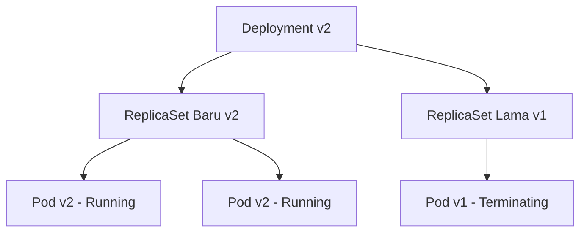

# Modul 01: Jenis-Jenis Workload di Kubernetes

> **Target Pembelajaran:** Memahami perbedaan serta skenario penggunaan berbagai controller workload di Kubernetes: **ReplicaSet, Deployment, StatefulSet, DaemonSet, Job, dan CronJob**.

---

## 1. Pengantar Workload Controller

Tidak semua aplikasi memiliki sifat yang sama. 
- Web API bersifat *stateless* (bisa ditambah/dihapus kapan saja tanpa kehilangan data).
- Database bersifat *stateful* (membutuhkan identitas dan data disk yang tidak boleh tertukar).
- Log Collector harus berjalan di *setiap* server.
- Script migrasi DB hanya perlu berjalan *sekali*.

Kubernetes menyediakan berbagai **Workload Controller** yang disesuaikan dengan karakteristik aplikasi tersebut.

---

## 2. Stateless Workloads

### A. ReplicaSet
- **Fungsi:** Memastikan sejumlah Pod (*replica count*) yang ditentukan selalu berjalan.
- **Catatan:** Pembaca jarang membuat `ReplicaSet` secara langsung. `ReplicaSet` dibuat dan dikelola secara otomatis di belakang layar oleh **Deployment**.

### B. Deployment (Paling Sering Digunakan)
- **Fungsi:** Mengelola aplikasi *stateless* (seperti Go API, Node.js App, Nginx).
- **Fitur Utama:**
  - **Rolling Update:** Memperbarui aplikasi ke versi baru tanpa *downtime* (mengganti Pod lama dengan Pod baru satu per satu).
  - **Rollback:** Kembali ke versi sebelumnya jika versi baru bermasalah (`kubectl rollout undo`).
  - **Scaling:** Menambah/mengurangi jumlah Pod dengan cepat.



---

## 3. Stateful Workloads

### StatefulSet (Untuk Database & Distributed Systems)
- **Fungsi:** Mengelola aplikasi yang membutuhkan identitas unik dan penyimpanan data (*state*) yang persisten (misal: PostgreSQL, MySQL, Redis, Kafka).
- **Karakteristik Utama:**
  1. **Identitas Unik & Stabil:** Pod diberi nama berurutan dari angka `0` (`db-0`, `db-1`, `db-2`), bukan string acak seperti pada Deployment.
  2. **Order Deployment:** Pod dibuat berurutan dari `0` ke `N-1`, dan dihapus dari `N-1` ke `0`.
  3. **Penyimpanan Terpisah:** Setiap Pod secara otomatis terhubung ke Persistent Volume Claim (PVC) tersendiri (`data-db-0`, `data-db-1`).

```
┌────────────────────────────────────────────────────────┐
│ StatefulSet: postgres                                  │
│                                                        │
│  ┌──────────────┐      ┌──────────────┐                │
│  │ Pod: db-0    │      │ Pod: db-1    │                │
│  └──────┬───────┘      └──────┬───────┘                │
│         │                     │                        │
│         ▼                     ▼                        │
│  ┌──────────────┐      ┌──────────────┐                │
│  │ PVC: data-0  │      │ PVC: data-1  │                │
│  └──────────────┘      └──────────────┘                │
└────────────────────────────────────────────────────────┘
```

---

## 4. Node-Bound Workloads

### DaemonSet (1 Pod per Node)
- **Fungsi:** Memastikan **tepat satu Pod** berjalan di setiap (atau beberapa) Worker Node di cluster. Jika ada Node baru yang bergabung ke cluster, DaemonSet akan otomatis memasang Pod di Node tersebut.
- **Contoh Penggunaan Production:**
  - **Log Collectors:** Grafana Alloy, Fluentd, Logstash.
  - **Node Monitoring Agents:** Prometheus Node Exporter.
  - **Cluster Networking:** CNI Plugins (Flannel, Calico).

---

## 5. Batch Workloads

### A. Job (Tugas Sekali Jalan)
- **Fungsi:** Menjalankan Pod untuk menyelesaikan suatu tugas hingga selesai (*exit code 0*), lalu Pod berhenti.
- **Contoh:** Run database migration script (`golang-migrate`), kompresi gambar, atau pemrosesan batch data.

### B. CronJob (Tugas Berjadwal)
- **Fungsi:** Menjalankan `Job` secara berkala berdasarkan format penjadwalan **CRON**.
- **Contoh Sintaks CRON:** `0 2 * * *` (Jalankan setiap jam 02:00 malam).
- **Contoh Penggunaan:** Backup database harian, pembersihan file log temporary, pengiriman laporan mingguan.

---

## 6. Tabel Matriks Perbandingan Workload

| Jenis Workload | Sifat Data | Penamaan Pod | Skenario Penggunaan Utama |
| :--- | :--- | :--- | :--- |
| **Deployment** | Stateless | Acak (`app-6799f-x8z2l`) | Web App, REST API, Microservices |
| **StatefulSet** | Stateful | Berurutan (`db-0`, `db-1`) | Database (Postgres/MySQL), Redis Cluster |
| **DaemonSet** | Mixed | Acak per Node | Monitoring agent, Log shipper, CNI |
| **Job** | Temporary | Acak | Database migration, Data processing |
| **CronJob** | Temporary | Acak (dibuat periodik) | Scheduled backup, Cleanup scripts |

---

## Ringkasan Modul 01

- Gunakan **Deployment** untuk hampir semua aplikasi web/API standar.
- Gunakan **StatefulSet** hanya jika aplikasi membutuhkan storage persisten per-pod atau urutan booting khusus (database).
- Gunakan **DaemonSet** untuk kebutuhan infrastruktur per-node (monitoring/logging).
- Gunakan **Job/CronJob** untuk otomasi tugas batch dan scheduled tasks.
