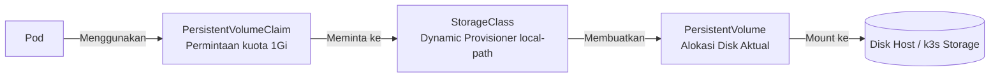

# Modul 02: Manajemen Konfigurasi & Storage Persisten

> **Target Pembelajaran:** Memahami cara memisahkan konfigurasi dari kode aplikasi menggunakan **ConfigMap** & **Secret**, serta mengelola penyimpanan data persisten menggunakan **PersistentVolumeClaim (PVC)** dan **StorageClass**.

---

## 1. Prinsip 12-Factor App: Memisahkan Konfigurasi & Storage

Dalam aplikasi modern (*12-Factor App*), kode aplikasi tidak boleh menyimpan:
1. **Konfigurasi Lingkungan:** URL database, port, log level (Gunakan **ConfigMap**).
2. **Kredensial & Kunci Rahasia:** Password, API Token, Private Key (Gunakan **Secret**).
3. **Data Hasil Runtime:** File upload, file database (Gunakan **PVC**).

```
 ┌────────────────────────────────────────────────────────────────────────┐
 │ Pod                                                                    │
 │                                                                        │
 │  ┌─────────────────────────────────┐                                  │
 │  │ App Container                   │                                  │
 │  │ (Kode aplikasi murni / stateless│                                  │
 │  └──────────────┬──────────────────┘                                  │
 │                 │                                                      │
 └─────────────────┼──────────────────────────────────────────────────────┘
                   │
         ┌─────────┼──────────────────┐
         ▼         ▼                  ▼
   ┌───────────┐ ┌──────────┐ ┌───────────────┐
   │ ConfigMap │ │ Secret   │ │ PVC / Storage │
   └───────────┘ └──────────┘ └───────────────┘
```

---

## 2. ConfigMap (Konfigurasi Non-Sensitif)

**ConfigMap** digunakan untuk menyimpan data konfigurasi sederhana berupa *key-value pair* atau isi file konfigurasi.

### Cara Membaca ConfigMap dari Pod:
1. **Sebagai Environment Variable:** Menginjeksi key-value langsung menjadi `ENV` di container.
2. **Sebagai Mounted Volume:** Menyediakan key-value sebagai file di dalam direktori folder container (misal `/etc/config/app.conf`).

---

## 3. Secret (Data Sensitif)

**Secret** mirip dengan ConfigMap, namun dirancang khusus untuk menyimpan data sensitif seperti password, sertifikat TLS, atau token akses.

### Karakteristik Penting Secret:
- Data di dalam file YAML Secret diubah ke format **Base64**.
- *Perhatian:* Base64 **bukanlah enkripsi**, melainkan encoding! Siapapun yang bisa membaca YAML Secret dapat meng-decode-nya (`echo "c2VjcmV0" | base64 -d`).
- Oleh karena itu, gunakan fitur *RBAC (Role-Based Access Control)* Kubernetes untuk membatasi siapa yang boleh membaca objek Secret.

---

## 4. Storage Architecture: PV, PVC, dan StorageClass

Di dalam container biasa, file yang ditulis ke disk akan hilang saat container di-restart (karena sifat *Read-Write Layer* temporary). Untuk menyimpan data secara permanen, kita butuh **Persistent Storage**.

### Komponen Storage Kubernetes:



1. **PersistentVolumeClaim (PVC):**
   - Diibaratkan sebagai **"Kupon/Tiket Permintaan"** oleh developer.
   - Developer menulis: *"Saya butuh storage sebesar 1 GB dengan akses ReadWriteOnce"*.

2. **StorageClass (SC):**
   - Merupakan **"Mesin Pembuat Storage Otomatis"** (*Dynamic Provisioner*).
   - Di **k3s**, tersedia StorageClass bawaan bernama `local-path` yang secara otomatis mengalokasikan folder di host disk saat PVC dibuat.

3. **PersistentVolume (PV):**
   - Merupakan **"Kapasitas Disk Fisik Real"** yang dibuat oleh StorageClass untuk memenuhi permintaan PVC.

---

## Ringkasan Modul 02

- Gunakan **ConfigMap** untuk setting variabel non-sensitif (PORT, LOG_LEVEL).
- Gunakan **Secret** untuk data rahasia (DB_PASSWORD, API_KEY) dengan encoding Base64.
- **PVC** memudahkan developer meminta storage persisten tanpa perlu tahu detail infrastruktur fisik di belakangnya.
- **StorageClass** `local-path` di k3s menangani penyediaan disk secara otomatis (*dynamic provisioning*).
