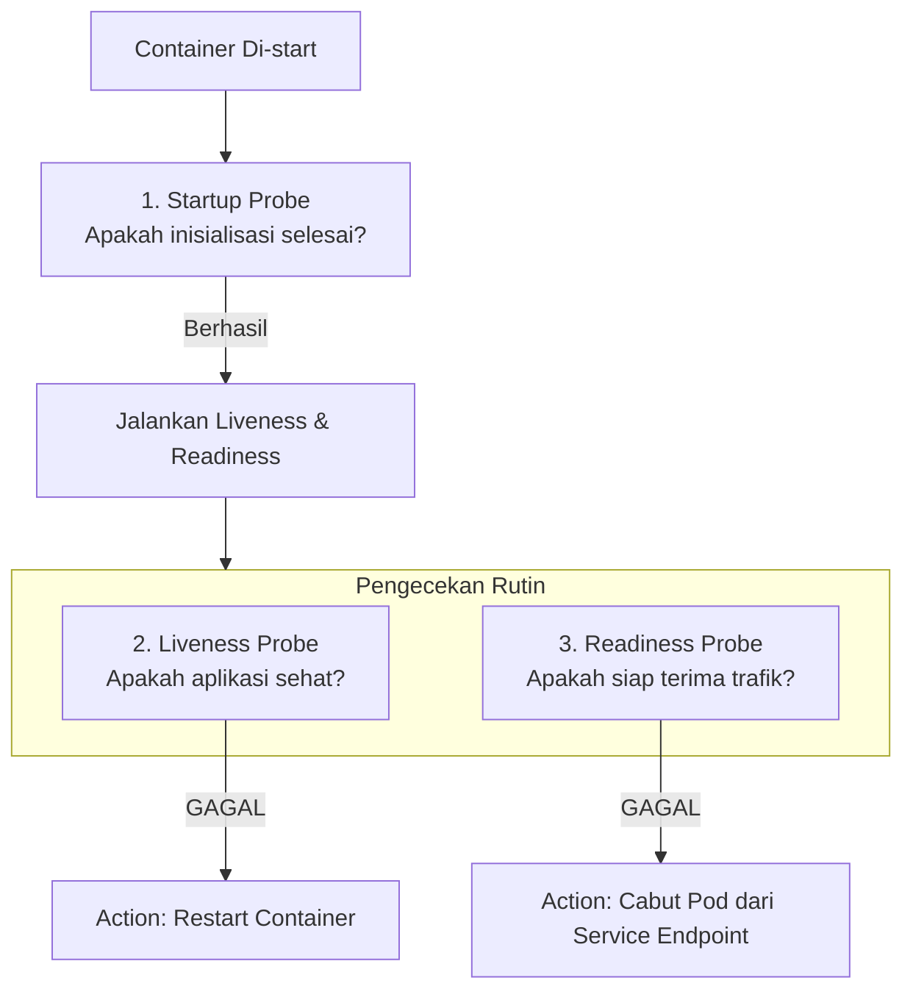

# Modul 03: Kubernetes Health Checks (Probes)

> **Target Pembelajaran:** Memahami 3 jenis Health Check pada Kubernetes (**Startup Probe, Liveness Probe, dan Readiness Probe**), mekanisme kerjanya, serta efek tindakannya terhadap Pod & Service.

---

## 1. Mengapa Butuh Health Check?

Secara bawaan, Kubernetes hanya mengecek apakah **proses aplikasi (PID) berjalan atau mati**.

Namun dalam dunia nyata, bisa terjadi situasi di mana:
- Aplikasi mengalami *deadlock* atau *memory leak* sehingga tidak merespon permintaan, padahal prosesnya masih berjalan.
- Aplikasi sedang memuat cache awal selama 30 detik saat startup, sehingga belum siap menerima trafik.

Tanpa Health Check, Kubernetes akan tetap mengirimkan trafik ke aplikasi bermasalah tersebut, menyebabkan error `502 Bad Gateway` atau `Connection Refused` pada pengguna.

---

## 2. Tiga Jenis Probe Utama

Kubernetes menyediakan 3 jenis probe dengan tanggung jawab yang berbeda:



### A. Startup Probe (Inisialisasi)
- **Fungsi:** Memeriksa apakah aplikasi yang lambat booting (*legacy app*) sudah selesai diinisialisasi.
- **Efek saat Gagal:** Jika `Startup Probe` gagal hingga batas `failureThreshold`, container akan di-restart.
- **Keuntungan:** Mencegah `Liveness Probe` me-restart aplikasi yang memang butuh waktu startup lama.

### B. Liveness Probe (Kesehatan / Auto-Restart)
- **Fungsi:** Memeriksa apakah aplikasi masih hidup dan beroperasi dengan benar.
- **Efek saat Gagal:** Kubernetes akan **me-restart (kill & recreate)** container tersebut secara otomatis.

### C. Readiness Probe (Kesiapan Trafik / Load Balancer)
- **Fungsi:** Memeriksa apakah aplikasi siap menerima trafik koneksi baru dari pengguna.
- **Efek saat Gagal:** Kubernetes akan **mencabut IP Pod dari Service Endpoint**. Trafik pengguna dialihkan ke Pod lain yang sehat. Pod **TIDAK di-restart**.

---

## 3. Cara Pengecekan (Probe Handlers)

Ada 3 cara Kubernetes melakukan pengecekan ke container:

1. **`httpGet` (Paling Populer):** Mengirim request HTTP GET ke endpoint aplikasi (misal `GET /healthz`).
2. **`exec`:** Menjalankan perintah di dalam container (misal `cat /tmp/healthy`). Exit code 0 berarti sukses.
3. **`tcpSocket`:** Memeriksa apakah port TCP tertentu terbuka dan menerima koneksi.

---

## 4. Parameter Konfigurasi Probe

```yaml
readinessProbe:
  httpGet:
    path: /ready
    port: 8080
  initialDelaySeconds: 5   # Tunggu 5 detik setelah container start sebelum probe pertama
  periodSeconds: 10        # Lakukan pengecekan setiap 10 detik
  timeoutSeconds: 2        # Batas waktu respon probe max 2 detik
  failureThreshold: 3      # Gagal 3x berturut-turut -> anggap Unready / Dead
  successThreshold: 1      # Sukses 1x -> anggap Ready kembali
```

---

## 5. Ringkasan Perbedaan 3 Probes

| Fitur | Startup Probe | Liveness Probe | Readiness Probe |
| :--- | :--- | :--- | :--- |
| **Fokus Utama** | Aplikasi selesai booting | Aplikasi tidak hang/deadlock | Aplikasi siap terima trafik |
| **Tindakan jika Gagal** | Restart Container | **Restart Container** | **Cabut dari Service Endpoint** |
| **Dampak ke Trafik** | Memblokir probe lain | Menghentikan Pod sementara | Mengalihkan trafik ke Pod lain |
| **Skenario Penggunaan** | App dengan startup > 30s | Memory leak, deadlock, freeze | DB connection lag, warm-up cache |
