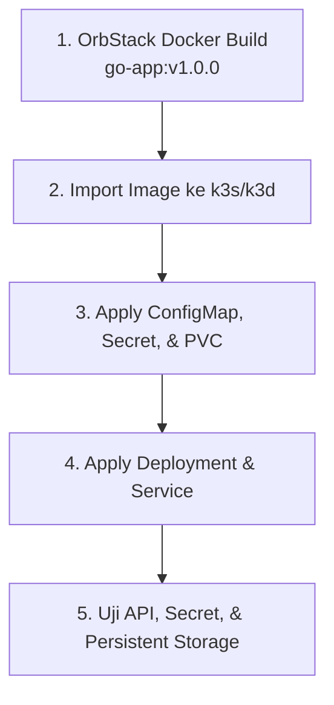

# Modul 04: Lab Hands-on — Deploy Go App Production-Ready

> **Target Pembelajaran:** Membangun OCI Image aplikasi Go buatan sendiri menggunakan Docker CLI dari OrbStack (macOS), memasukkannya ke cluster k3s, dan mengintegrasikan **ConfigMap, Secret, PVC, serta Health Checks (Probes)** secara lengkap tanpa Helm.

---

## 1. Alur Kerja Lab



---

## 2. Langkah Demi Langkah

### Langkah 1: Build Image Aplikasi Go dengan OrbStack

Pada macOS, pastikan OrbStack sedang berjalan dan Docker CLI mengarah ke
context OrbStack (`docker context ls`). Buka terminal dan navigasikan ke root
folder repository:

```bash
# 1. Build OCI image dari Dockerfile di folder minggu-02/app/
docker build -t go-app:v1.0.0 minggu-02/app/

# 2. Verifikasi image di OrbStack melalui Docker-compatible CLI
docker images | grep go-app
```

> Jika menggunakan Linux atau Windows, jalankan command yang sama dengan
> Docker-compatible engine yang tersedia. Yang penting image `go-app:v1.0.0`
> dapat dibaca oleh `k3d` dan mengikuti format OCI.

---

### Langkah 2: Import Image ke Cluster k3s / k3d

Agar k3s dapat menemukan image `go-app:v1.0.0` lokal tanpa perlu mem-push ke Docker Hub:

- **Jika Menggunakan `k3d`:**
  ```bash
  k3d image import go-app:v1.0.0 -c mini-prod
  ```

- **Jika Menggunakan `k3s` Native (Linux):**
  ```bash
  docker save go-app:v1.0.0 -o go-app.tar
  sudo k3s ctr images import go-app.tar
  rm go-app.tar
  ```

---

### Langkah 3: Deploy Konfigurasi & Persistent Storage

Pindah ke folder `minggu-02/manifests/`:

```bash
cd minggu-02/manifests
```

Terapkan ConfigMap, Secret, dan PVC secara bersamaan:

```bash
kubectl apply -f 01-configmap.yaml
kubectl apply -f 02-secret.yaml
kubectl apply -f 03-pvc.yaml
```

**Verifikasi Resource:**
```bash
kubectl get configmap,secret,pvc -n mini-prod
```
*Pastikan PVC berstatus `Bound`.*

---

### Langkah 4: Deploy Go App Workload & Service

Terapkan file Deployment dan Service:

```bash
kubectl apply -f 04-deployment.yaml
kubectl apply -f 05-service.yaml
```

**Verifikasi Pod & Probes:**
```bash
kubectl get pods -n mini-prod -w
```
*Amati kolom `READY`. Pod akan berubah dari `0/1` menjadi `1/1` setelah `Startup Probe` dan `Readiness Probe` dinyatakan sukses.*

---

### Langkah 5: Uji Integrasi Aplikasi

Buka port-forwarding untuk mengakses Go App dari browser/terminal laptop Anda:

```bash
kubectl port-forward svc/go-app-service 8080:8080 -n mini-prod
```

Di terminal lain, jalankan pengujian berikut:

#### 1. Uji Endpoint Utama (ConfigMap & Secret Check)
```bash
curl http://localhost:8080/
```
**Ekspektasi Respon JSON:**
```json
{
  "message": "Hello from Production-Ready Go App on K8s!",
  "hostname": "go-app-deployment-6799fc88d8-x8z2l",
  "environment": "production",
  "db_user": "admin",
  "log_path": "/data/app.log",
  "current_time": "2026-08-10T18:44:11Z"
}
```
*Perhatikan bahwa nilai `environment` diambil dari ConfigMap, dan `db_user` di-decode otomatis dari Secret!*

---

#### 2. Uji Penulisan Data ke Persistent Volume (PVC)
Akses endpoint `/write` beberapa kali:

```bash
curl http://localhost:8080/write
curl http://localhost:8080/write
```

**Periksa isi file log di dalam PVC storage:**
```bash
# Ambil nama salah satu Pod
POD_NAME=$(kubectl get pods -n mini-prod -l app=go-app -o jsonpath='{.items[0].metadata.name}')

# Uji baca file log di dalam storage PVC
kubectl exec -n mini-prod $POD_NAME -- cat /data/app.log
```
**Output:**
```text
[2026-08-10T18:44:15Z] Log entry created by host go-app-deployment-6799fc88d8-x8z2l
[2026-08-10T18:44:17Z] Log entry created by host go-app-deployment-6799fc88d8-x8z2l
```

> **Selamat!** Aplikasi Go Anda telah berjalan di Kubernetes secara production-ready dengan dukungan ConfigMap, Secret, PVC, dan Probes!
