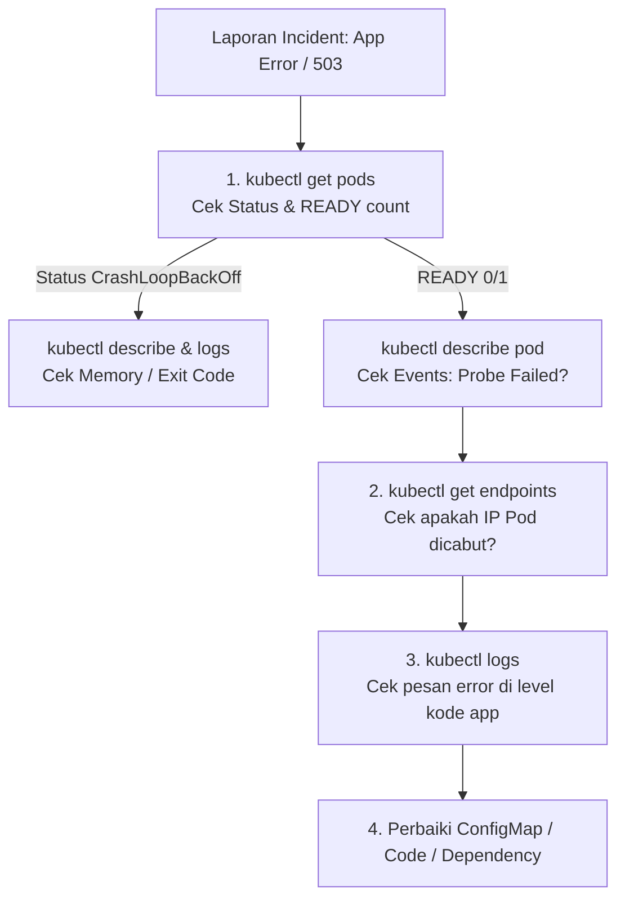

# Modul 05: Lab Simulasi Insiden & Troubleshooting Readiness Probe

> **Target Pembelajaran:** Mensimulasikan insiden kegagalan `Readiness Probe` pada lingkungan production, melakukan investigasi *root cause* menggunakan `kubectl describe` & `kubectl logs`, serta memahami dampaknya pada Service Endpoint.

---

## 1. Skenario Insiden

**Tiket Pengaduan:**
> *"Tim QA melaporkan bahwa API Go App tidak dapat diakses dan mengembalikan error 503 / Connection Refused. Padahal status Pod di Kubernetes terlihat 'Running'."*

Tugas Anda sebagai DevOps/SRE: **Temukan penyebab masalah (*root cause*) dan perbaiki hingga aplikasi normal kembali.**

---

## 2. Langkah 1: Mensimulasikan Insiden (Trigger Failure)

Kita akan memicu kegagalan `Readiness Probe` secara sengaja dengan mengubah konfigurasi ConfigMap.

1. **Buka file `minggu-02/manifests/01-configmap.yaml` dan ubah variabel `FORCE_UNREADY` menjadi `"true"`:**

   ```yaml
   apiVersion: v1
   kind: ConfigMap
   metadata:
     name: go-app-config
     namespace: mini-prod
   data:
     APP_ENV: "production"
     PORT: "8080"
     FORCE_UNREADY: "true"   # <--- Pemicu Insiden
   ```

2. **Terapkan konfigurasi baru & restart deployment:**
   ```bash
   kubectl apply -f minggu-02/manifests/01-configmap.yaml
   kubectl rollout restart deployment go-app-deployment -n mini-prod
   ```

---

## 3. Langkah 2: Observasi Gejala Insiden

Amati perubahan status Pod:

```bash
kubectl get pods -n mini-prod -w
```

**Hasil Observasi:**
```text
NAME                                 READY   STATUS    RESTARTS   AGE
go-app-deployment-78b4958f4d-abcde   0/1     Running   0          45s
go-app-deployment-78b4958f4d-fghij   0/1     Running   0          45s
```
> **Perhatikan:** Status Pod adalah `Running`, tetapi kolom `READY` menunjukkan **`0/1`**! Artinya Pod hidup, tetapi dinyatakan **TIDAK SIAP (UNREADY)**.

---

## 4. Langkah 3: Investigasi Root Cause (Langkah Troubleshooting)

### Perintah 1: Periksa Service Endpoints
```bash
kubectl get endpoints go-app-service -n mini-prod
```
**Output:**
```text
NAME             ENDPOINTS
go-app-service   <none>
```
*Analisis:* Karena Pod `0/1 Unready`, Kubernetes secara otomatis **mencabut IP Pod dari Service Endpoint** (`<none>`). Inilah alasan mengapa user mendapat error koneksi!

---

### Perintah 2: Investigasi Detail Pod via `kubectl describe`
Periksa event log internal Kubernetes:

```bash
kubectl describe pod -l app=go-app -n mini-prod
```

**Cari Bagian `Events:` di Paling Bawah Output:**
```text
Events:
  Type     Reason     Age                 From               Message
  ----     ------     ----                ----               -------
  Warning  Unhealthy  12s (x6 over 42s)   kubelet            Readiness probe failed: HTTP probe failed with statuscode: 503
```
*Analisis:* `kubelet` melaporkan bahwa `Readiness probe failed` karena endpoint HTTP mengembalikan status code `503`.

---

### Perintah 3: Periksa Application Logs via `kubectl logs`
Lihat pesan error spesifik yang dikeluarkan oleh kode aplikasi:

```bash
kubectl logs -l app=go-app -n mini-prod --tail=20
```

**Output Log Aplikasi:**
```text
2026/08/10 18:45:00 Server berjalan di port 8080 ...
2026/08/10 18:45:10 Simulasi: Readiness check GAGAL karena FORCE_UNREADY=true
2026/08/10 18:45:15 Simulasi: Readiness check GAGAL karena FORCE_UNREADY=true
```

> **Root Cause Ditemukan!**
> Konfigurasi `FORCE_UNREADY=true` pada ConfigMap menyebabkan handler `/ready` mengembalikan HTTP 503, sehingga Readiness Probe gagal dan Kubernetes membekukan trafik ke Pod tersebut.

---

## 5. Langkah 4: Penyelesaian Insiden (Remediation & Fix)

1. **Ubah kembali `FORCE_UNREADY` menjadi `"false"` di `01-configmap.yaml`:**
   ```yaml
   FORCE_UNREADY: "false"
   ```

2. **Apply perubahan dan restart rollout:**
   ```bash
   kubectl apply -f minggu-02/manifests/01-configmap.yaml
   kubectl rollout restart deployment go-app-deployment -n mini-prod
   ```

3. **Verifikasi Pemulihan (Recovery Check):**
   ```bash
   kubectl get pods -n mini-prod
   ```
   *Status kembali `1/1 READY`!*

   ```bash
   kubectl get endpoints go-app-service -n mini-prod
   ```
   *IP Pod kembali terdaftar di Endpoints (`10.42.0.15:8080,10.42.0.16:8080`). Insiden selesai!*

---

## 6. Flowchart Standard Operating Procedure (SOP) Troubleshooting


