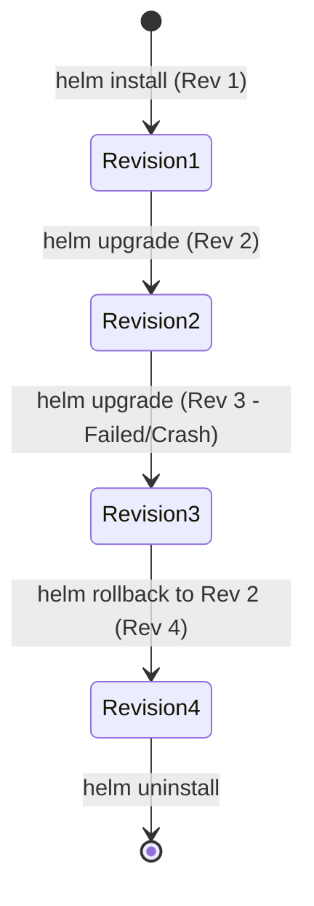

# Modul 03: Manajemen Siklus Hidup Release Helm

> **Target Pembelajaran:** Memahami alur kerja pengoperasian Helm Release: **Install, Upgrade, History, Rollback, dan Dry-Run Validation**.

---

## 1. Lifecycle Helm Release

Setiap kali Anda meng-deploy Helm Chart, Helm mencatat seluruh perubahan dalam bentuk **Revision History**.



---

## 2. Perintah Operasional Release Helm

### A. Memvalidasi Template (`helm template` & `--dry-run`)
Sebelum melakukan deployment ke cluster asli, sangat disarankan untuk memeriksa hasil render sintaks YAML:

```bash
# 1. Rendertemplate lokal ke terminal tanpa menyentuh cluster
helm template my-release ./charts/go-app -f values-dev.yaml

# 2. Uji coba kirim ke API Server tanpa mengeksekusi (Dry Run)
helm install my-release ./charts/go-app -f values-dev.yaml --dry-run
```

---

### B. Menginstal Release (`helm install`)
Perintah untuk membuat instansi aktif pertama kali di cluster:

```bash
helm install go-app-dev ./charts/go-app \
  --namespace mini-prod \
  -f ./charts/go-app/values-dev.yaml
```

---

### C. Memperbarui Release (`helm upgrade`)
Jika ada perubahan pada nilai `values.yaml` atau template Chart, gunakan `helm upgrade`:

```bash
helm upgrade go-app-dev ./charts/go-app \
  --namespace mini-prod \
  -f ./charts/go-app/values-prod.yaml
```

> **Atomic Upgrade (`--atomic`):**
> Tambahkan flag `--atomic` agar jika proses upgrade gagal (misal Pod crash), Helm akan otomatis membatalkan perubahan dan melakukan rollback sendiri!
> ```bash
> helm upgrade go-app-dev ./charts/go-app --atomic --timeout 2m
> ```

---

### D. Melihat Riwayat Revisi (`helm history`)
Setiap kali `helm install` atau `helm upgrade` dijalankan, Helm menambah nomor revisi baru:

```bash
helm history go-app-dev -n mini-prod
```

**Contoh Output `helm history`:**
```text
REVISION  UPDATED                  STATUS      CHART         APP VERSION  DESCRIPTION
1         Mon Aug 10 18:00:00 2026 deployed    go-app-0.1.0  1.0.0        Install complete
2         Mon Aug 10 18:05:00 2026 deployed    go-app-0.1.0  1.0.0        Upgrade values-prod
3         Mon Aug 10 18:10:00 2026 FAILED      go-app-0.1.0  1.0.0        Upgrade failed: Crash
```

---

### E. Membalikkan Revisi (`helm rollback`)
Jika revisi terbaru bermasalah (seperti revisi 3 pada contoh di atas), Anda bisa membalikkan status cluster ke revisi yang sehat (misal revisi 2) **hanya dalam 1 detik**:

```bash
helm rollback go-app-dev 2 -n mini-prod
```

Helm akan membuat **Revisi 4** yang memiliki konfigurasi identik dengan **Revisi 2**.

---

### F. Menghapus Release (`helm uninstall`)
Untuk menghentikan dan menghapus seluruh resource yang dibuat oleh Helm Release:

```bash
helm uninstall go-app-dev -n mini-prod
```

---

## 3. Di Mana Helm Menyimpan State Release?

Berbeda dengan Terraform yang menyimpan state di file `.tfstate` lokal, **Helm menyimpan seluruh riwayat Release di dalam Secret Kubernetes**.

Anda dapat melihat Secret bawaan Helm menggunakan `kubectl`:

```bash
kubectl get secrets -n mini-prod -l owner=helm
```
*Output akan menampilkan Secret dengan nama `sh.helm.release.v1.go-app-dev.v1`, `v2`, dst.*

---

## Ringkasan Modul 03

- Gunakan **`helm template`** untuk mengecek sintaks YAML sebelum deploy.
- Flag **`--atomic`** pada `helm upgrade` mencegah deployment yang setengah rusak.
- **`helm history`** dan **`helm rollback`** memberikan fitur keselamatan instan saat terjadi kegagalan deployment.
