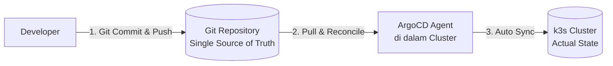
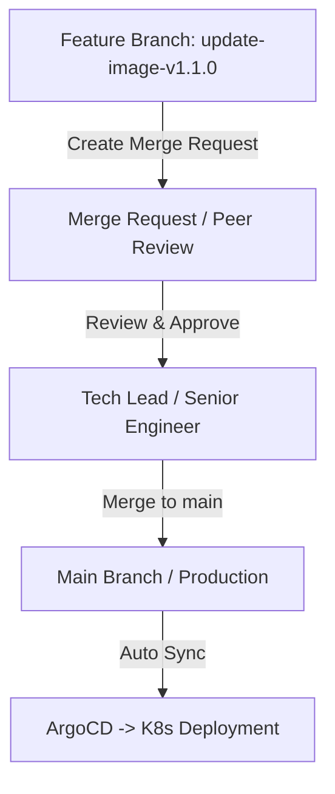

# Modul 01: Konsep Dasar GitOps & Branching Strategy

> **Target Pembelajaran:** Memahami filosofi GitOps ("No More `kubectl apply`"), 4 Prinsip Utama GitOps, perbedaan model Push vs Pull, serta penerapan Branching Strategy dan Merge Request (MR).

---

## 1. Mengapa "Tidak Ada Lagi `kubectl apply`"?

Pada lingkungan produksi tradisional, developer atau DevOps sering menjalankan perintah secara langsung dari terminal lokal mereka:

```bash
# CARA LAMA (MANUAL & BERBAHAYA)
kubectl apply -f deployment.yaml
helm upgrade my-app ./charts
```

### Masalah Utama Cara Manual:
1. **Kurangnya Jejak Audit (No Audit Trail):** Siapa yang menjalankan `kubectl apply` jam 2 pagi? Parameter apa yang diubah?
2. **Konstruksi Ghaib (Configuration Drift):** Jika cluster crash, apakah ada yang tahu pasti file YAML versi mana yang terakhir dijalankan di server?
3. **Resiko Keamanan Kredensial:** Setiap laptop engineer harus menyimpan kredensial `kubeconfig` dengan akses `admin` ke cluster produksi.

---

## 2. Definisi & 4 Prinsip Dasar GitOps

**GitOps** adalah metodologi pengelolaan infrastruktur dan aplikasi di mana **Git Repository bertindak sebagai Single Source of Truth (Satu-satunya Sumber Kebenaran)**.



### 4 Prinsip Utama GitOps (Berdasarkan OpenGitOps Standard):

1. **Declarative (Deklaratif):**
   - Seluruh sistem (workload, networking, storage) harus dijelaskan secara deklaratif melalui berkas manifest (YAML / Helm Chart).
2. **Versioned & Immutable (Tercatat & Tidak Berubah di Server):**
   - Seluruh status sistem disimpan di Git. Setiap perubahan dilakukan melalui `git commit`, sehingga memiliki riwayat versi lengkap (*audit log*).
3. **Pulled Automatically (Ditarik Otomatis):**
   - Agen GitOps yang berada di dalam cluster secara otomatis menarik (*pull*) status terbaru dari Git Repository.
4. **Continuously Reconciled (Rekonsiliasi Berkelanjutan):**
   - Agen GitOps terus memantau perbedaan antara **Desired State** (apa yang tertulis di Git) dan **Actual State** (apa yang sedang berjalan di cluster). Jika ada perbedaan (*drift*), sistem akan otomatis memperbaikinya (*self-healing*).

---

## 3. Model Push (CI/CD Klasik) vs Model Pull (GitOps Modern)

```
Model Push (CI/CD Klasik) - Rawan Kebocoran Akses
┌─────────────┐   git push   ┌───────────────┐   kubectl apply   ┌─────────────┐
│ Developer   │ ───────────> │ GitLab Runner │ ────────────────> │ K8s Cluster │
└─────────────┘              └───────────────┘  (Butuh Kubeconfig)└─────────────┘

Model Pull (GitOps Modern) - Sangat Aman
┌─────────────┐   git push   ┌───────────────┐   Pull & Sync     ┌─────────────┐
│ Developer   │ ───────────> │ Git Repo      │ <───────────────  │ ArgoCD      │
└─────────────┘              └───────────────┘   (Ditolak Akses) │ (di K8s)    │
                                                                 └─────────────┘
```

| Karakteristik | Push-Based (CI/CD Klasik) | Pull-Based (GitOps / ArgoCD) |
| :--- | :--- | :--- |
| **Eksekutor** | CI Runner (GitLab Runner/Jenkins) | GitOps Operator (ArgoCD di Cluster) |
| **Penyimpanan Kubeconfig** | Disimpan di CI Runner (Resiko tinggi) | Tetap di dalam Cluster (Aman) |
| **Arah Komunikasi** | Luar ke Dalam Cluster | Dalam Cluster menarik ke Luar (Git) |
| **Drift Detection** | Tidak Ada (Hanya berjalan saat CI trigger) | **Real-time (24/7 Monitoring)** |

---

## 4. Branching Strategy & Merge Request (MR) Audit Trail

Dalam GitOps, **perubahan ke cluster dilakukan melalui Merge Request (MR)**, bukan melalui eksekusi terminal.



### Keuntungan Flow Merge Request:
- **Code Review:** Rekan tim dapat memeriksa perubahan nilai YAML sebelum masuk ke produksi.
- **Approval Gate:** Hanya engineer yang memiliki otorisasi yang dapat menekan tombol *Merge*.
- **Rollback Mudah:** Jika terjadi masalah, cukup lakukan `git revert` pada commit MR tersebut di GitLab.

---

## Ringkasan Modul 01

- **GitOps** menjadikan Git sebagai satu-satunya sumber kebenaran infrastruktur (*Single Source of Truth*).
- Pendekatan **Pull-Based (ArgoCD)** memprioritaskan keamanan karena tidak ada kredensial cluster yang keluar ke CI Runner.
- Perubahan lingkungan produksi wajib melalui **Merge Request (MR)** agar memiliki jejak audit dan persetujuan yang jelas.
