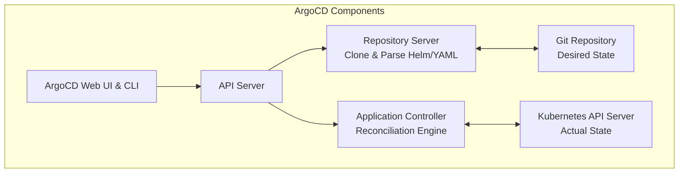

# Modul 03: Arsitektur ArgoCD & Declarative Synchronization

> **Target Pembelajaran:** Memahami arsitektur internal ArgoCD, struktur CRD `Application`, mekanisme *Reconciliation Loop*, serta fitur **Auto-Sync, Prune, dan Self-Healing**.

---

## 1. Arsitektur Komponen ArgoCD

ArgoCD berjalan sepenuhnya di dalam cluster Kubernetes (di namespace `argocd`).



### Komponen Utama:
1. **API Server:** Memproses permintaan dari Web Dashboard UI, CLI, atau sistem CI/CD.
2. **Repository Server:** Mengkloning Git repo dan mengonversi template (Helm/YAML) menjadi manifest Kubernetes murni.
3. **Application Controller (Otak Engine):** Terus-menerus membandingkan manifest hasil generate dari Git (*Desired State*) dengan kondisi di cluster (*Actual State*).

---

## 2. Mengenal CRD ArgoCD `Application`

Untuk memberi tahu ArgoCD tentang apa yang harus di-deploy, kita membuat kustom resource Kubernetes bertipe **`Application`**.

```yaml
apiVersion: argoproj.io/v1alpha1
kind: Application
metadata:
  name: go-app-dev
  namespace: argocd
spec:
  project: default

  # 1. SUMBER MANIFEST (SOURCE GIT)
  source:
    repoURL: 'https://github.com/my-org/gh-devOpsTraining.git'
    targetRevision: HEAD
    path: minggu-03/charts/go-app
    helm:
      valueFiles:
        - ../../clusters/dev/values.yaml

  # 2. TUJUAN DEPLOYMENT (DESTINATION KUBERNETES)
  destination:
    server: 'https://kubernetes.default.svc'
    namespace: mini-prod

  # 3. KEBIJAKAN SINKRONISASI (GITOPS POLICY)
  syncPolicy:
    automated:
      prune: true # Hapus resource K8s jika dihapus dari Git
      selfHeal: true # Otomatis perbaiki jika ada perubahan manual CLI
    syncOptions:
      - CreateNamespace=true
```

---

## 3. Fitur Utama Sync Policy ArgoCD

### A. Auto-Sync (`automated: {}`)
ArgoCD memantau Git repo setiap 3 menit (atau via Webhook instan). Begitu ada commit baru di branch Git, ArgoCD langsung melakukan *apply* perubahan ke cluster tanpa campur tangan manusia.

### B. Auto-Prune (`prune: true`)
Jika Anda menghapus file `service.yaml` dari Git Repository, ArgoCD akan secara otomatis **menghapus Service tersebut dari cluster**. Tanpa `prune: true`, resource lama akan tertinggal (*orphaned*).

### C. Self-Healing (`selfHeal: true`)
Jika seorang engineer secara tidak sengaja mengedit/menghapus Pod/Deployment menggunakan `kubectl delete deployment`, ArgoCD akan mendeteksi perbedaan (*drift*) dalam hitungan detik dan **mengembalikan Deployment tersebut sesuai isi Git**.

---

## 4. Indikator Health & Sync Status ArgoCD

Di Web UI ArgoCD, Anda akan melihat dua indikator utama:

```
┌────────────────────────────────────────────────────────┐
│ Application: go-app-dev                                │
│                                                        │
│  Sync Status:   [ Synced ]      (Git == Cluster)       │
│                 [ OutOfSync ]   (Git != Cluster)       │
│                                                        │
│  Health Status: [ Healthy ]     (Pods 1/1 Running)     │
│                 [ Degraded ]    (Pods Crash / Unready) │
└────────────────────────────────────────────────────────┘
```

---

## Ringkasan Modul 03

- **ArgoCD Application CRD** menghubungkan 1 Git Repository dengan 1 Destination Namespace.
- **`prune: true`** menjamin cluster bersih dari resource terhapus.
- **`selfHeal: true`** melindungi cluster dari modifikasi manual CLI yang tidak terverifikasi.
