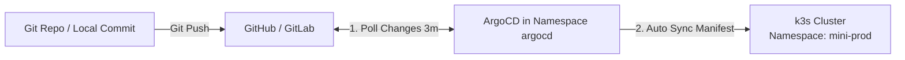

# Modul 04: Lab Hands-on — Setup ArgoCD & GitOps Automation

> **Target Pembelajaran:** Berhasil memasang ArgoCD di cluster k3s lokal, mengakses Dashboard Web UI, mendaftarkan CRD `Application`, serta membuktikan fitur Auto-Sync saat file konfigurasi Git diubah.

---

## 1. Arsitektur Deployment Lab



---

## 2. Langkah Demi Langkah

### Langkah 1: Memasang ArgoCD di Cluster k3s

1. **Buat Namespace khusus `argocd`:**
   ```bash
   kubectl create namespace argocd
   ```

2. **Terapkan Manifest Instalasi Resmi ArgoCD:**
   ```bash
   kubectl apply -n argocd -f https://raw.githubusercontent.com/argoproj/argo-cd/stable/manifests/install.yaml
   ```

3. **Tunggu hingga seluruh Pod ArgoCD aktif (`Running`):**
   ```bash
   kubectl get pods -n argocd -w
   ```

---

### Langkah 2: Akses Dashboard Web UI ArgoCD

1. **Dapatkan Password Admin Bawaan (Initial Admin Password):**
   ```bash
   kubectl -n argocd get secret argocd-initial-admin-secret -o jsonpath="{.data.password}" | base64 -d; echo
   ```
   *(Simpan password string acak yang muncul di terminal).*

2. **Buka Port Forwarding ke ArgoCD Server:**
   ```bash
   kubectl port-forward svc/argocd-server -n argocd 8085:443
   ```

3. **Buka Browser:**
   - URL: `https://localhost:8085`
   - Username: `admin`
   - Password: *(Password dari langkah 1)*

---

### Langkah 3: Meng-apply Application Manifest ArgoCD

Terapkan berkas kustom resource `Application` yang telah kita siapkan di `minggu-04/argocd/application-go-app.yaml`:

```bash
kubectl apply -f minggu-04/argocd/application-go-app.yaml
```

**Verifikasi di Web UI ArgoCD:**
Buka dashboard ArgoCD. Anda akan melihat kartu aplikasi bernama **`go-app-dev`** dengan status:
- **Sync Status:** `Synced`
- **Health Status:** `Healthy`

---

### Langkah 4: Uji Coba Auto-Sync (Melakukan Git Edit)

Mari kita buktikan bahwa perubahan di Git akan berdampak otomatis ke cluster tanpa menyentuh `kubectl`:

1. **Edit file `minggu-04/clusters/dev/values.yaml`:**
   Ubah `replicaCount: 1` menjadi `replicaCount: 2`.

2. **Commit dan Push perubahan tersebut ke Git Repository:**
   ```bash
   git add minggu-04/clusters/dev/values.yaml
   git commit -m "feat(gitops): scale replicaCount to 2"
   git push origin main
   ```

3. **Amati Proses Sync di ArgoCD:**
   - Di Web UI ArgoCD, tombol akan berubah menjadi `Syncing`.
   - Tanpa mengetik perintah `kubectl` apapun di terminal, Pod Nginx/Go kedua akan otomatis dibuat di namespace `mini-prod`!

4. **Verifikasi via CLI:**
   ```bash
   kubectl get pods -n mini-prod
   ```
   *Jumlah Pod sekarang menjadi 2 Pod!*

> **Selamat!** Anda telah berhasil membangun alur otomatisasi **GitOps murni**!
