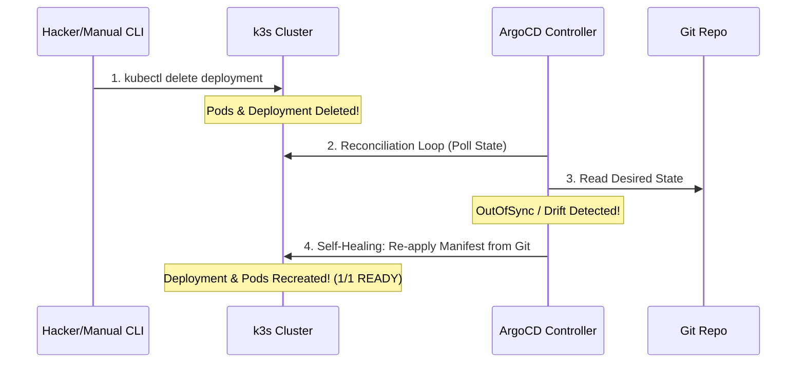

# Modul 05: Lab Simulasi Insiden — Drift Detection & Self-Healing

> **Target Pembelajaran:** Mensimulasikan insiden intervensi manual (seseorang menghapus/mengubah resource dari CLI), melihat deteksi *Configuration Drift*, dan membuktikan keandalan fitur **Self-Healing** milik ArgoCD.

---

## 1. Skenario Insiden

**Tiket Pengaduan:**
> *"Seseorang yang panik saat lembur tidak sengaja menjalankan perintah `kubectl delete deployment --all -n mini-prod` di terminal produksi. Seluruh Pod aplikasi terhapus!"*

Mari kita lihat bagaimana **GitOps & ArgoCD** menangani insiden bencana ini secara otomatis tanpa perlu memanggil DevOps engineer dari tempat tidur mereka.

---

## 2. Langkah 1: Mensimulasikan Perusakan (Manual Interference)

Hapus secara paksa Deployment `go-app-dev` langsung menggunakan `kubectl`:

```bash
kubectl delete deployment -l app.kubernetes.io/name=go-app -n mini-prod
```

**Verifikasi Bahwa Deployment Hilang:**
```bash
kubectl get pods -n mini-prod
```
*Output: `No resources found in mini-prod namespace.` (Aplikasi mati!)*

---

## 3. Langkah 2: Observasi Deteksi Drift & Self-Healing ArgoCD

Buka Web UI ArgoCD atau amati terminal dengan perintah `kubectl get pods -w`.



### Apa yang Terjadi di Belakang Layar?
1. Dalam waktu < 10 detik, **Application Controller ArgoCD** menyadari bahwa Deployment yang tertulis di Git (`Desired State`) mendadak hilang dari cluster (`Actual State`).
2. ArgoCD menandai status sebagai **`OutOfSync`**.
3. Berkat konfigurasi **`selfHeal: true`**, ArgoCD mengabaikan penghapusan manual tersebut dan **langsung meng-apply ulang Deployment dari Git ke cluster**!

---

## 4. Langkah 3: Verifikasi Pemulihan Otomatis

Jalankan kembali perintah pengecekan di terminal:

```bash
kubectl get pods -n mini-prod
```

**Output:**
```text
NAME                           READY   STATUS    RESTARTS   AGE
go-app-dev-6799fc88d8-abcde    1/1     Running   0          8s
go-app-dev-6799fc88d8-fghij    1/1     Running   0          8s
```

> **Luar Biasa!** Aplikasi Anda pulih 100% secara otomatis hanya dalam hitungan detik tanpa campur tangan manusia!

---

## 5. Ringkasan Keunggulan GitOps untuk SRE & DevOps

1. **Zero Configuration Drift:** Tidak ada lagi perubahan "ghaib" di cluster yang tidak tercatat di Git.
2. **Instant Disaster Recovery:** Jika seluruh cluster terbakar/terhapus, Anda cukup menyambungkan ArgoCD ke Git Repository, dan seluruh infrastruktur akan terbangun kembali secara identik dalam hitungan menit!
3. **Security Compliance:** Kredensial `admin` cluster tidak perlu diberikan ke seluruh engineer, cukup berikan akses `Git Commit/Merge Request`.
