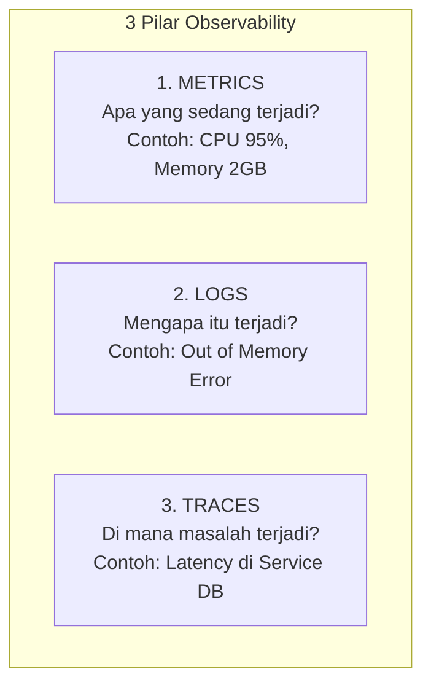
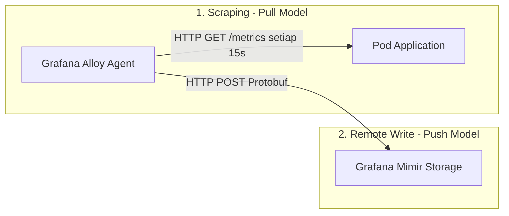

# Modul 01: Konsep Dasar Observability & Prometheus Metrics

> **Target Pembelajaran:** Memahami 3 Pilar Observability, format data metrik Prometheus, 4 tipe metrik utama (Counter, Gauge, Histogram, Summary), serta perbedaan mekanisme **Scraping (Pull)** dan **Remote Write**.

---

## 1. Pengantar: 3 Pilar Observability

Untuk menjaga keandalan (*reliability*) platform produksi, seorang SRE (Site Reliability Engineer) mengandalkan **3 Pilar Observability**:



Di **Minggu 5**, kita fokus penuh menguasai pilar pertama: **METRICS**.

---

## 2. Format Data Metrik Prometheus

Prometheus telah menjadi standar de-facto industri untuk format metrik cloud-native.

### Anatomi Format Prometheus:
```text
http_requests_total{app="go-app", method="GET", status="200"} 1542 1770720000000
│                  └─────────────────┬──────────────────┘ │    └─────┬────┘
└─ Metric Name                       └─ Labels (Key-Value)└─Value  └─ Timestamp
```

1. **Metric Name:** Nama unik indikator (misal `node_cpu_seconds_total`, `http_requests_total`).
2. **Labels (Dimensions):** Pasangan key-value yang memberikan dimensi konteks tambahan pada data.
3. **Value:** Nilai numerik statistik (float64).
4. **Timestamp:** Waktu data dicatat (opsional, milidetik).

---

## 3. Empat Tipe Metrik Utama Prometheus

```
1. COUNTER (Hanya Naik)                 2. GAUGE (Naik & Turun)
   ▲                                       ▲
   │    ┌─┐                                │   ┌─┐
   │  ┌─┘ └─┐                              │ ┌─┘ └─┐ ┌─┐
   │──┘     └────>                         │─┘     └─┘ └────>
   (Contoh: Total HTTP Request)            (Contoh: Penggunaan RAM / CPU)

3. HISTOGRAM (Distribusi Buckets)       4. SUMMARY (Persentil Direct)
   Bucket <= 100ms : 50 req                 p50 (Median) : 45ms
   Bucket <= 500ms : 95 req                 p99 (Slowest): 450ms
```

| Tipe Metrik | Sifat Nilai | Skenario Penggunaan Utama |
| :--- | :--- | :--- |
| **Counter** | Hanya naik (monotonik), reset ke 0 jika app restart. | Total request, total error count, bytes transmitted. |
| **Gauge** | Bisa naik dan turun sesuka hati. | Penggunaan RAM, persentase CPU, jumlah Pod aktif, suhu. |
| **Histogram** | Mengelompokkan data ke dalam *buckets* durasi/rentang. | Latency HTTP request, ukuran payload request. |
| **Summary** | Menghitung persentil langsung di sisi aplikasi client. | Latency persentil presisi tinggi (p90, p95, p99). |

---

## 4. Mekanisme Pengumpulan: Scraping (Pull) vs Remote Write (Push)

Bagaimana sistem pemantauan mengumpulkan data metrik dari ratusan Pod di cluster?



### 1. Scraping (Pull Model)
- Collector Agent (Grafana Alloy) menghubungi HTTP Endpoint `/metrics` yang disediakan oleh aplikasi/exporter setiap selang waktu tertentu (misal per 15 detik).
- **Keunggulan:** Aplikasi tidak perlu tahu siapa pemantaunya; cukup menyediakan endpoint HTTP sederhana.

### 2. Remote Write Protocol (Push Model)
- Setelah Grafana Alloy mengumpulkan data metrik dari Pod lokal, Alloy mengompresi data tersebut menggunakan format *Protobuf* dan mengirinkannya via HTTP POST ke **Grafana Mimir** (Storage Terpusat).
- **Keunggulan:** Transfer data sangat hemat bandwidth dan efisien.

---

## Ringkasan Modul 01

- **Metrics** memberikan statistik real-time kuantitatif mengenai kesehatan cluster dan aplikasi.
- Format **Prometheus** menggunakan kombinasi *Metric Name*, *Labels*, dan *Value*.
- Gunakan **Counter** untuk menghitung jumlah total event, dan **Gauge** untuk mengukur kapasitas resource yang bisa naik/turun.
- **Grafana Alloy** melakukan *scrape* ke target lalu mengirimkannya ke **Mimir** via *Remote Write*.
