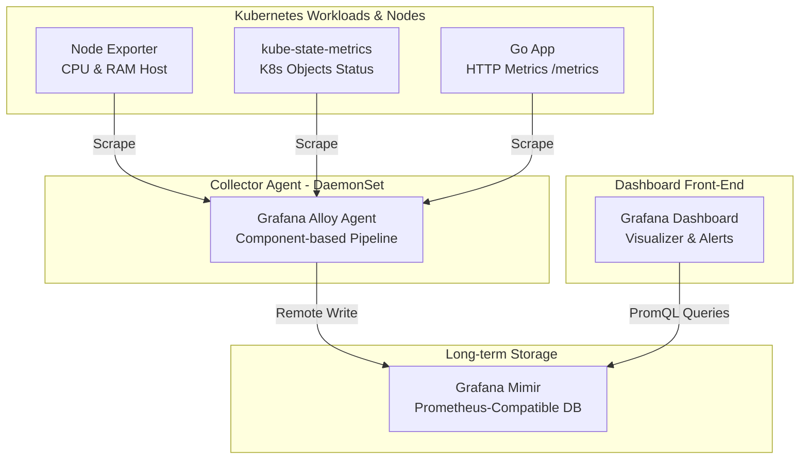

# Modul 02: Arsitektur Modern Grafana Stack (Alloy, Mimir, & Grafana)

> **Target Pembelajaran:** Memahami arsitektur pemantauan modern menggunakan **Grafana Alloy** sebagai Collector, **Grafana Mimir** sebagai Storage, dan **Grafana** sebagai UI Visualisasi.

---

## 1. Arsitektur Komponen

Di platform produksi modern, kita memisahkan tugas antara **Collector**, **Storage**, dan **Visualizer**.



---

## 2. Mengenal Grafana Alloy (Next-Gen Collector Agent)

**Grafana Alloy** adalah agen pengumpul (*collector agent*) serbaguna generasi terbaru dari Grafana. Alloy menggantikan agen-agen terdahulu seperti Promtail, Prometheus Agent, dan OpenTelemetry Collector dalam 1 binary yang sangat cepat.

### Keunggulan Alloy:
- **Konfigurasi Berbasis Komponen (Alloy Syntax):** Menggunakan blok komponen yang saling terhubung (*pipeline graph*).
- **Multi-Telemetry:** Mampu mengumpulkan **Metrics**, **Logs**, dan **Traces** secara bersamaan.

### Contoh Blok Konfigurasi Alloy (`config.alloy`):
```alloy
// 1. Komponen Scraper
prometheus.scrape "go_app_scraper" {
  targets = [{
    __address__ = "go-app-service.mini-prod.svc:8080",
  }]
  forward_to = [prometheus.remote_write.mimir.receiver]
}

// 2. Komponen Remote Write ke Mimir
prometheus.remote_write "mimir" {
  endpoint {
    url = "http://mimir-service.mini-prod.svc:9009/api/v1/push"
  }
}
```

---

## 3. Mengenal Grafana Mimir (Storage Scale-Out)

**Grafana Mimir** adalah database *time-series* terdistribusi yang dirancang untuk menyimpan jutaan metrik Prometheus dalam jangka panjang (*long-term retention*).

### Keunggulan Mimir:
1. **100% Kompatibel dengan PromQL:** Seluruh query sintaks Prometheus dapat dijalankan langsung di Mimir.
2. **Performa Tinggi:** Mendukung pencarian data metrik hingga miliaran deret angka secara instan.

---

## 4. Grafana (Visualisasi Front-End)

**Grafana** adalah platform visualisasi dan dashboard interaktif paling populer di dunia.

- **Datasource Connection:** Grafana dihubungkan ke `http://mimir-service:9009/prometheus` sebagai Prometheus Datasource.
- **Panel Dashboard:** Menampilkan data dalam bentuk grafik garis (*Time series*), status gauge, dan heatmap.

---

## Ringkasan Modul 02

- **Grafana Alloy** bertindak sebagai agen *Scraper & Forwarder* terpusat.
- **Grafana Mimir** bertindak sebagai database penyimpanan metrik skala besar.
- **Grafana** mengambil data dari Mimir menggunakan query **PromQL** untuk ditampilkan dalam bentuk dashboard interaktif.
