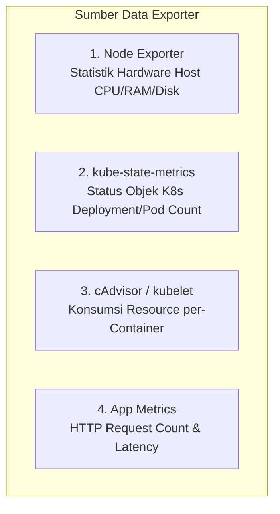

# Modul 03: Metric Exporters & Dasar PromQL Query

> **Target Pembelajaran:** Mengenal 4 sumber exporter utama di Kubernetes (**Node Exporter, kube-state-metrics, cAdvisor, Aplikasi Go**) serta menguasai perintah dasar query **PromQL**.

---

## 1. Empat Sumber Metrik Utama di Kubernetes



### Penjelasan Masing-Masing Exporter:
1. **Node Exporter:** Berjalan sebagai DaemonSet di setiap server untuk mengekstrak metrik fisik OS Kernel (misal `node_memory_Active_bytes`, `node_cpu_seconds_total`).
2. **kube-state-metrics (KSM):** Mendengarkan Kubernetes API Server dan mengonversi status objek Kubernetes menjadi metrik (misal `kube_deployment_status_replicas_available`, `kube_pod_container_status_restarts_total`).
3. **cAdvisor (Container Advisor):** Terintegrasi di dalam `kubelet` untuk mengukur konsumsi RAM/CPU dari tiap-tiap container (`container_cpu_usage_seconds_total`, `container_memory_working_set_bytes`).
4. **Application Custom Metrics:** Metrik kustom yang dibuat di dalam kode aplikasi menggunakan Prometheus Client Library (`/metrics`).

---

## 2. Instrumentasi Prometheus pada Aplikasi Go

Di dalam kode Go App (`minggu-02/app/main.go`), kita dapat menambahkan Prometheus HTTP Handler menggunakan library resmi `prometheus/client_golang`:

```go
package main

import (
	"net/http"
	"github.com/prometheus/client_golang/prometheus/promhttp"
)

func main() {
	// Menambahkan HTTP endpoint /metrics bawaan Prometheus
	http.Handle("/metrics", promhttp.Handler())

	http.ListenAndServe(":8080", nil)
}
```

---

## 3. Dasar Sintaks PromQL (Prometheus Query Language)

PromQL digunakan di Grafana untuk mengolah data mentah dari Mimir menjadi grafik visual.

### A. Instant Vector & Range Vector
- Instant Vector (Nilai saat ini): `http_requests_total`
- Range Vector (Rentang waktu 5 menit terakhir): `http_requests_total[5m]`

### B. Fungsi `rate()` (Menghitung Kecepatan per Detik)
Fungsi `rate()` digunakan pada metrik berjenis **Counter** untuk menghitung rata-rata kenaikan per detik:

```promql
# Menghitung jumlah HTTP request per detik dalam 5 menit terakhir
rate(http_requests_total[5m])
```

### C. Contoh Query PromQL Penting untuk Production:

1. **Penggunaan CPU Server Host (%):**
   ```promql
   100 - (avg by (instance) (rate(node_cpu_seconds_total{mode="idle"}[5m])) * 100)
   ```

2. **Penggunaan Memori RAM Terpakai (Megabytes):**
   ```promql
   (node_memory_MemTotal_bytes - node_memory_MemAvailable_bytes) / 1024 / 1024
   ```

3. **Jumlah Restarts Pod di Namespace `mini-prod`:**
   ```promql
   sum by (pod) (kube_pod_container_status_restarts_total{namespace="mini-prod"})
   ```

---

## Ringkasan Modul 03

- **Node Exporter** mengukur hardware host, **kube-state-metrics** mengukur kesehatan objek Kubernetes, dan **cAdvisor** mengukur container.
- Gunakan fungsi **`rate()`** pada PromQL untuk mengubah angka Counter kumulatif menjadi kecepatan per detik (*rate per second*).
