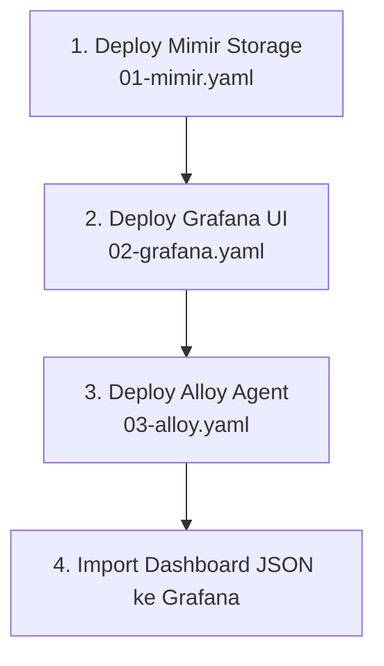

# Modul 04: Lab Hands-on — Deploy Observability Stack & Dashboard

> **Target Pembelajaran:** Memasang **Grafana Mimir, Grafana Dashboard, dan Grafana Alloy** ke cluster k3s, mengonfigurasi pipeline telemetri, serta mengimpor Dashboard JSON visualisasi.

---

## 1. Alur Deploy Observability Stack



---

## 2. Langkah Demi Langkah

Navigasikan terminal Anda ke direktori `minggu-05/manifests/`:

```bash
cd minggu-05/manifests
```

---

### Langkah 1: Deploy Storage Mimir

Terapkan manifest Mimir Storage:

```bash
kubectl apply -f 01-mimir.yaml
```

**Verifikasi Mimir Service:**
```bash
kubectl get pods,svc -n mini-prod -l app=mimir
```
*Pastikan Mimir service berjalan di port 9009.*

---

### Langkah 2: Deploy Grafana Dashboard Front-End

Terapkan manifest Grafana:

```bash
kubectl apply -f 02-grafana.yaml
```

**Verifikasi Grafana:**
```bash
kubectl get pods,svc -n mini-prod -l app=grafana
```
*Grafana otomatis mengonfigurasi Datasource Mimir via `datasources.yaml`.*

---

### Langkah 3: Deploy Grafana Alloy Telemetry Collector

Terapkan DaemonSet Grafana Alloy:

```bash
kubectl apply -f 03-alloy.yaml
```

**Verifikasi Alloy Agent:**
```bash
kubectl get pods -n mini-prod -l app=grafana-alloy
```
*Alloy akan langsung melakukan scrape metrik dari Go App dan mengalirkannya ke Mimir!*

---

### Langkah 4: Login ke Dashboard Grafana

1. **Buka Port Forwarding ke Grafana Server:**
   ```bash
   kubectl port-forward svc/grafana-service 3000:3000 -n mini-prod
   ```

2. **Buka Browser:**
   - URL: `http://localhost:3000`
   - Username: `admin`
   - Password: `admin123`

---

### Langkah 5: Mengimpor Dashboard Visualisasi

1. Di menu sidebar Grafana, klik ikon **Dashboards** → **New** → **Import**.
2. Upload berkas JSON `minggu-05/dashboards/cluster-and-app-dashboard.json` atau copy-paste isinya.
3. Pilih Datasource `Mimir-Prometheus` lalu klik **Import**.

**Hasil Visualisasi:**
Anda akan melihat 3 panel grafik aktif:
- Panel 1: **Go App HTTP Request Rate (req/sec)**
- Panel 2: **Pod Restarts Count**
- Panel 3: **CPU Usage Spike (millicores)**

> **Selamat!** Cluster Kubernetes Anda kini memiliki sistem pemantauan metrik secara lengkap dan terotomasi!
