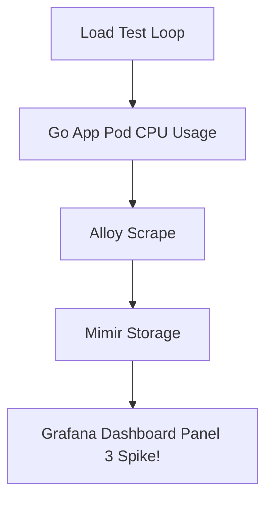

# Modul 05: Lab Simulasi Insiden — CPU Stress Load & Live Monitoring

> **Target Pembelajaran:** Mensimulasikan lonjakan beban CPU (*CPU Stress*) pada Pod aplikasi, mengamati grafik lonjakan metrik secara real-time di Grafana Dashboard, dan menentukan tindakan mitigasi SRE.

---

## 1. Skenario Insiden

**Kronologi Kejadian:**
> *"Tim Marketing mengadakan promo Flash Sale jam 8 malam. Trafik pengguna melonjak 10x lipat dalam 1 menit. Aplikasi melambat dan beberapa request mengalami timeout."*

Sebagai SRE, Anda diminta **mengamati grafik lonjakan metrik secara real-time di Grafana** dan mengidentifikasi apakah CPU atau Memory yang menjadi bottleneck.

---

## 2. Langkah 1: Mensimulasikan Beban Tinggi (Stress Test)

Jalankan skrip pengirim trafik beban tinggi secara terus-menerus ke Go App Pod:

```bash
# 1. Buka Port-Forward ke Go App (di terminal 1)
kubectl port-forward svc/go-app-service 8080:8080 -n mini-prod

# 2. Jalankan loop HTTP request cepat (di terminal 2)
for i in {1..1000}; do curl -s http://localhost:8080/ > /dev/null; done &
for i in {1..1000}; do curl -s http://localhost:8080/ > /dev/null; done &
```

---

## 3. Langkah 2: Observasi Grafik Real-Time di Grafana

Buka Dashboard Grafana yang telah diimpor di `http://localhost:3000`.



### Amati Perubahan Panel Grafik di Grafana:
1. **Panel HTTP Request Rate:** Grafik garis melonjak tajam dari `0 req/sec` menjadi `50+ req/sec`.
2. **Panel CPU Usage Spike:** Penggunaan CPU pada Pod melonjak mendekati batas resource limits (`100m`).

---

## 4. Langkah 3: Analisis SRE & Mitigasi Kebijakan

Berdasarkan grafik di Grafana, Anda melihat bahwa CPU Pod mendekati batas limit (`100m`). 

### Solusi Mitigasi GitOps:
1. **Solusi Jangka Pendek (Scaling):** Naikkan jumlah replika Pod dari 1 menjadi 3 (`replicaCount: 3`) pada `values.yaml` untuk membagi beban.
2. **Solusi Jangka Panjang:** Pasang HPA (*Horizontal Pod Autoscaler*) agar jumlah Pod bertambah secara otomatis saat CPU > 80%.

---

## Ringkasan Modul 05

- Metrics memungkinkan kita mendeteksi masalah **sebelum aplikasi benar-benar crash**.
- Pemantauan grafik real-time di **Grafana** memberikan dasar data yang objektif untuk mengambil keputusan kapasitas (*Capacity Planning*).
