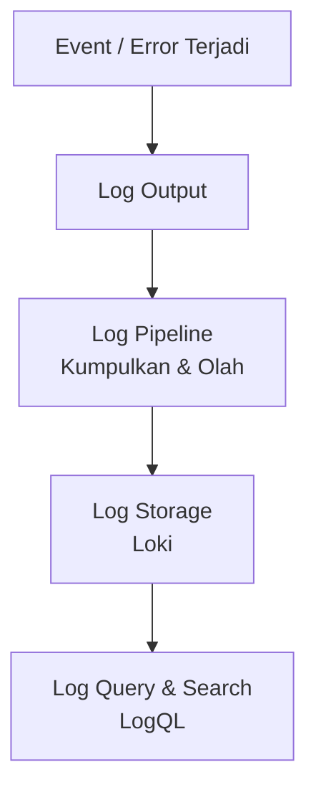

# Modul 01: Konsep Log Pipeline & Structured Logging

> **Target Pembelajaran:** Memahami perbedaan **Log vs Metrics**, alur kerja **Log Pipeline**, konsep **stdout/stderr** container, dan pentingnya **JSON Structured Logging** di lingkungan produksi modern.

---

## 1. Mengapa Logs Sangat Penting?

Pada **Minggu 5** kita membahas Metrics yang memberikan gambaran **kuantitatif** (*apa yang sedang terjadi*). Di minggu ini, kita membahas Logs yang memberikan jawaban **kualitatif** (*mengapa hal itu terjadi*).



### Perbedaan Utama Metrics vs Logs:

| Karakteristik | Metrics | Logs |
| :--- | :--- | :--- |
| **Sifat Data** | Numerik (statistik) | Teks (per kejadian) |
| **Granularitas** | Agregrasi (rata-rata, total) | Per-baris kejadian (`event`) |
| **Cocok Untuk** | Tren, lonjakan, kapasitas | Forensik, urutan kesalahan, *stack trace* |
| **Penyimpanan** | Mimir (Time-series DB) | Loki (Log Aggregator) |

---

## 2. Konsep `stdout` dan `stderr` Container

Pada arsitektur modern (Docker/Kubernetes), setiap container mengalirkan log keluar melalui 2 stream standar:

1. **`stdout` (Standard Output):** Pesan log normal (informational, request berhasil, dsb).
2. **`stderr` (Standard Error):** Pesan peringatan hingga kesalahan fatal (panic, error, panic exception).

Baik `stdout` maupun `stderr` akan **di-capture secara otomatis** oleh *Container Runtime* (misalnya containerd pada node Kubernetes atau OrbStack saat development lokal) pada saat aplikasi berjalan, lalu diteruskan ke kubelet.

---

## 3. Keterbatasan Unstructured Logging (Plain Text)

Pembuatan log konvensional (*plain text*) dengan menempelkan banyak variabel ke dalam string sering kali menyulitkan sistem pencarian.

### Contoh Log Plain Text (SULIT DICARI):
```text
2026-08-10 12:00:00 ERROR: User admin login failed from 192.168.1.10 due to wrong password
```

> **Masalah:** Jika Anda ingin memfilter log berdasarkan **status error** atau **alamat IP tertentu** dari ribuan baris log, Anda sulit mencarinya dengan keyword.

---

## 4. Solusi: JSON Structured Logging (SANGAT DIREKOMENDASIKAN)

**JSON Structured Logging** mengubah setiap baris log menjadi dokumen JSON yang terstruktur (key-value pairs). Hal ini memungkinkan log untuk **di-index, difilter, dan diolah secara otomatis** oleh Grafana Loki.

### Contoh Log Structured JSON (MUDAH DICARI):
```json
{
  "timestamp": "2026-08-10T12:00:00Z",
  "level": "ERROR",
  "msg": "Login failed",
  "user": "admin",
  "client_ip": "192.168.1.10",
  "reason": "wrong_password"
}
```

### Keuntungan JSON Structured Logging:
- **Mudah di-parse:** Setiap field (level, user, ip) dapat langsung diperlakukan sebagai *label* oleh Loki.
- **Mudah difilter:** Cari semua log dengan `level="ERROR"` dan `user="admin"` dalam 1 detik.
- **Standar 12-Factor App:** Aplikasi tidak boleh menulis log ke file di dalam filesystem container, melainkan harus mengalirkannya ke `stdout` agar dapat dikoleksi platform.

---

## Ringkasan Modul 01

- **Logs** menangkap setiap *kejadian* (event) secara tekstual, digunakan untuk forensik dan *root cause analysis*.
- Selalu salurkan log aplikasi ke **stdout/stderr** agar dapat dicapture otomatis oleh Container Runtime.
- Gunakan format **JSON Structured Logging** agar log dapat difilter & diolah secara terprogram.
