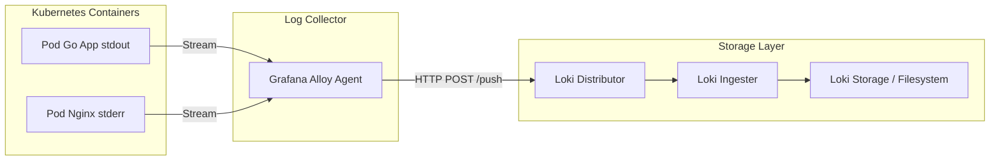

# Modul 02: Arsitektur Grafana Loki, Labels, & LogQL

> **Target Pembelajaran:** Memahami arsitektur komponen **Grafana Loki**, kekuatan **Labels** (indexing), dan dasar-dasar bahasa query **LogQL** untuk mencari log seperti *grep* profesional.

---

## 1. Filosofi Loki: "Prometheus for Logs"

**Grafana Loki** adalah sistem agregasi log yang dikembangkan oleh Grafana Labs dengan filosofi utama: **"Hanya index labels, bukan raw text"**.



### Mengapa tidak index raw text?
- Menghemat **biaya storage hingga 10x lebih murah** dibanding Elasticsearch.
- Cocok jika Anda kebanyakan menggunakan log untuk **mencari berdasarkan label** (misal: dari Pod mana, namespace apa, level berapa) daripada *full-text search* pada teks yang sangat panjang.

---

## 2. Mengenal Labels (Indexing)

Labels adalah **pasangan key-value** yang ditempelkan ke setiap baris log oleh agent Alloy saat log dialirkan.

### Contoh Labels yang Dihasilkan Alloy:
```text
{namespace="mini-prod", pod="go-app-deployment-abcde", container="go-app", level="ERROR"}
```

### Aturan Penting Labeling:
1. **Batasi jumlah label** yang unik (cardinality). Jangan gunakan label `timestamp` atau `user_id` acak, karena akan meledakkan penyimpanan index.
2. **Labels boleh dipakai untuk LogQL query**, sedangkan isi konten log (raw text) hanya tampil saat *expanded* (dibuka).

---

## 3. Mengenal LogQL (Loki Query Language)

**LogQL** adalah bahasa query untuk mencari log. Terdiri dari 2 tipe utama:

### A. Log Stream Selector (Filter Baris Log)
Sintaks dasar menggunakan kurung kurawal:
```logql
{namespace="mini-prod"} |= "ERROR"
```
*Artinya: Cari semua log di namespace `mini-prod` yang teksnya mengandung string `"ERROR"`.*

### B. Pipeline Expressions (Mengolah Log Lebih Lanjut)
```logql
{container="go-app"} | json | level="WARN"
```
*Artinya: Ambil log dari container `go-app`, parse formatnya sebagai JSON, lalu filter hanya yang kolom `level`-nya berisi `"WARN"`.*

### Fungsi Agregasi & Hitung:
```logql
# Menghitung jumlah error per namespace dalam 5 menit terakhir
sum(rate({namespace="mini-prod"} |~ "ERROR" [5m])) by (namespace)
```

---

## Ringkasan Modul 02

- **Loki** adalah sistem log aggregator yang sangat hemat biaya karena hanya meng-index labels.
- Gunakan **Labels** yang kaku untuk menyaring sumber log (namespace, pod, container).
- Gunakan **LogQL** dengan operator `|=` (contains) dan pipeline `| json` untuk mendapatkan data log terstruktur.
