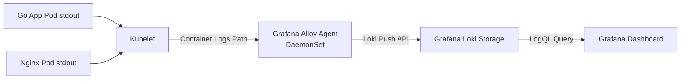

# Modul 04: Lab Hands-on — Deploy Grafana Loki & Dashboard Investigasi

> **Target Pembelajaran:** Memasang **Grafana Loki** sebagai pusat penyimpanan log, mengonfigurasi **Grafana Alloy** untuk membaca log dari semua container Pod, kemudian membuat Dashboard investigasi menggunakan query **LogQL**.

---

## 1. Alur Deploy Log Pipeline



---

## 2. Langkah Demi Langkah

### Langkah 1: Deploy Grafana Loki Storage

Terapkan konfigurasi Loki ke cluster k3s:

```bash
kubectl apply -f minggu-06/manifests/01-loki.yaml
```

**Verifikasi Service:**
```bash
kubectl get pods,svc -n mini-prod -l app=loki
```
*Pastikan Pod Loki berstatus `Running` dan Service-nya aktif di port 3100.*

---

### Langkah 2: Deploy Grafana Alloy Log Collector

Alloy akan membaca log dari kubelet (`/var/log/pods/`) lalu meneruskannya ke Loki:

```bash
kubectl apply -f minggu-06/manifests/02-alloy-loki.yaml
```

**Verifikasi Alloy Agent:**
```bash
kubectl get pods -n mini-prod -l app=grafana-alloy-logs
```
*Alloy akan otomatis men-discover seluruh Pod di namespace `mini-prod` dan mulai membaca log-nya.*

---

### Langkah 3: Update Datasource Grafana

Tambahkan datasource Loki ke Grafana yang sudah dipasang dari Minggu 5:

```bash
kubectl apply -f minggu-06/manifests/03-grafana-loki-datasource.yaml
```

---

### Langkah 4: Akses Dashboard Grafana & Import JSON

1. **Buka Port Forwarding Grafana:**
   ```bash
   kubectl port-forward svc/grafana-service 3000:3000 -n mini-prod
   ```

2. **Buka Browser:** `http://localhost:3000` (Username: `admin`, Password: `admin123`).

3. **Import Dashboard Investigasi:**
   Pada menu sidebar, klik **Dashboards** → **New** → **Import**, lalu upload:
   ```bash
   minggu-06/dashboards/logs-dashboard.json
   ```

4. **Verifikasi Alur:**
   Pada tahap ini, panel log mungkin masih kosong. Itu normal. Kita akan membanjirinya dengan log di langkah Lab Incident.

---

## 3. Menguji LogQL Manual (Explore)

Untuk memastikan log benar-benar sampai ke Loki, kita bisa langsung menjalankan query LogQL dari menu **Explore** di Grafana:

1. Klik **Explore** di sidebar Grafana.
2. Pilih Datasource: **Grafana-Loki**.
3. Ketik query berikut di kolom input:
   ```logql
   {namespace="mini-prod"}
   ```
4. Klik **Run query**. Akan muncul daftar stream log dari pod-pod yang terdaftar.

---

## Ringkasan Modul 04

- **Loki** menerima log dari Alloy dalam format Push API.
- **Alloy** membaca log dari kubelet (`stdout`/`stderr`) lalu menempelkan label otomatis (namespace, pod, container).
- **LogQL** adalah cara kita men-filter dan menampilkan log di Grafana.
