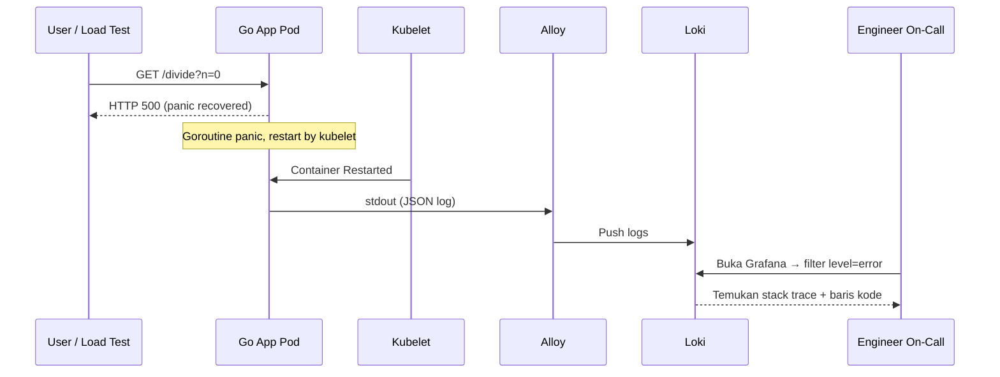

# Modul 05: Lab Incident — Panic Recovery & Investigasi Log

> **Target Pembelajaran:** Mensimulasikan insiden **panic** pada Go App, lalu melakukan Root Cause Analysis (RCA) hanya bermodalkan **LogQL** di Grafana Loki — tanpa masuk ke dalam Pod (`kubectl exec`), tanpa nyentuh SSH, tanpa menebak-nebak.

---

## 1. Skenario Insiden: "Aplikasi Tiba-tiba Crash"



**Konteks Situasi:**
> Pukul 03:00 pagi, monitoring alert berbunyi: *"Go App restart terus, 5x dalam 5 menit terakhir."*
> Anda harus menemukan **akar masalah** sebelum shift pagi dimulai, agar user impact tidak melebar.

---

## 2. Prasyarat Lab

Pastikan semua komponen sudah jalan dari Modul 04:

```bash
# 1. Pastikan namespace aktif
kubectl get ns mini-prod

# 2. Pastikan semua Pod Running
kubectl get pods -n mini-prod
```

**Output yang diharapkan:**
```
NAME                              READY   STATUS    RESTARTS
grafana-alloy-logs-xxxxx          1/1     Running   0
loki-0                            1/1     Running   0
go-app-xxxxxx                     1/1     Running   0
```

---

## 3. Langkah 1: Perbarui Go App dengan Endpoint Berbahaya

Kita akan menambahkan handler `/divide` yang secara sengaja akan menyebabkan **divide-by-zero panic** ketika menerima parameter `n=0`. Tujuannya: memicu crash agar kita punya insiden nyata untuk diselidiki.

### 3.1 Buat File Baru `minggu-06/app/main.go`

```go
package main

import (
    "log/slog"
    "net/http"
    "os"
    "strconv"
)

var logger *slog.Logger

func main() {
    // JSON logger yang menulis ke stdout
    logger = slog.New(slog.NewJSONHandler(os.Stdout, nil))

    logger.Info("server starting", "port", 8080)

    http.HandleFunc("/", func(w http.ResponseWriter, r *http.Request) {
        logger.Info("incoming request",
            "method", r.Method,
            "path", r.URL.Path,
            "remote", r.RemoteAddr,
        )
        w.Write([]byte("OK"))
    })

    // Endpoint berbahaya: akan panic jika n=0
    http.HandleFunc("/divide", func(w http.ResponseWriter, r *http.Request) {
        nStr := r.URL.Query().Get("n")
        n, err := strconv.Atoi(nStr)
        if err != nil {
            logger.Error("invalid input", "input", nStr, "error", err.Error())
            http.Error(w, "invalid n", 400)
            return
        }

        // Simpan logger sebagai info
        logger.Info("processing division", "n", n)

        // INI AKAN PANIC jika n=0!
        result := 100 / n
        logger.Info("division successful", "result", result)

        w.Write([]byte(strconv.Itoa(result)))
    })

    http.ListenAndServe(":8080", nil)
}
```

### 3.2 Update Dockerfile (jika perlu)

Pastikan `minggu-06/app/Dockerfile` masih sama seperti minggu-02:

```dockerfile
FROM golang:1.21-alpine AS builder
WORKDIR /app
COPY main.go .
RUN go mod init app && go build -o server .

FROM alpine:3.18
WORKDIR /app
COPY --from=builder /app/server .
EXPOSE 8080
CMD ["./server"]
```

### 3.3 Build & Push Image Baru

```bash
# Misal registry lokal di 192.168.1.10:5000
docker build -t 192.168.1.10:5000/go-app:buggy minggu-06/app/
docker push 192.168.1.10:5000/go-app:buggy
```

> **Tips:** Tag `:buggy` dipakai agar jelas bahwa image ini sengaja ada bug-nya. Di production asli, tag baru biasanya `v1.2.3` atau `git-sha-xxxxx`.

---

## 4. Langkah 2: Trigger Insiden (Curl Endpoint Berbahaya)

### 4.1 Port-forward Go App

```bash
kubectl port-forward svc/go-app-service 8080:80 -n mini-prod
```

### 4.2 Normal Request (Tidak Error)

```bash
curl "http://localhost:8080/divide?n=10"
```

**Output:**
```
10
```

### 4.3 Trigger Panic

```bash
curl "http://localhost:8080/divide?n=0"
```

**Output di Terminal Anda:**
```
curl: (52) Empty reply from server
```

### 4.4 Cek Status Pod (Restart Bertambah!)

```bash
kubectl get pods -n mini-prod -l app=go-app
```

**Output yang diharapkan:**
```
NAME                       READY   STATUS    RESTARTS
go-app-xxxxxxxxxx-yyyyy    1/1     Running   3   ← RESTART BERTAMBAH!
```

> ⚠️ **Tanda bahaya**: kolom `RESTARTS` naik berarti container pernah crash dan kubelet me-restart-nya. **Sekarang kita harus cari tahu kenapa.**

---

## 5. Langkah 3: Investigasi dengan LogQL (Tanpa `kubectl exec`)

Bayangkan Anda **tidak boleh masuk ke dalam Pod** (karena Pod bisa crash kapan saja). Semua bukti ada di Grafana Loki.

### 5.1 Buka Grafana & Pilih Datasource Loki

```bash
kubectl port-forward svc/grafana-service 3000:3000 -n mini-prod
```

Buka browser: `http://localhost:3000`
Pergi ke menu **Explore** (icon kompas di sidebar kiri). Pilih datasource **Loki**.

### 5.2 Query 1: Cari Log Error Saja

**LogQL:**
```logql
{namespace="mini-prod"} | json | level="error"
```

**Yang akan muncul:**
```json
{
  "time": "2026-08-10T13:45:22Z",
  "msg": "invalid input",
  "level": "ERROR",
  "input": "0"
}
```

Hmm, ini hanya error input — **bukan akar masalah**. Mari gali lebih dalam.

### 5.3 Query 2: Cari Stack Trace (panic, runtime error)

**LogQL:**
```logql
{namespace="mini-prod"} |= "panic" or |= "runtime error"
```

**Yang akan muncul:**
```json
{
  "time": "2026-08-10T13:45:23Z",
  "msg": "goroutine panic recovered: runtime error: integer divide by zero\n  at main.main.func2 (/app/server:42)\n  at net/http.HandlerFunc.ServeHTTP (...)"
}
```

**🎯 Kunci Investigasi Ditemukan!**
> `runtime error: integer divide by zero` di baris **42** (`/app/server`).
> Ini artinya: handler `/divide` mencoba membagi dengan `n=0`.

### 5.4 Query 3: Cari Endpoint Mana yang Bermasalah

**LogQL:**
```logql
{namespace="mini-prod"} | json | path="/divide" | level="info"
```

**Yang akan muncul:**
```json
{
  "time": "2026-08-10T13:45:22Z",
  "msg": "processing division",
  "level": "INFO",
  "path": "/divide",
  "n": 0
}
```

**Insight:** request terakhir yang berhasil di-log adalah `n=0`. Berarti bug ada di handler `/divide` ketika `n=0`.

### 5.5 Query 4: Hitung Frekuensi Error 5 Menit Terakhir

**LogQL (dengan metrik):**
```logql
sum(count_over_time({namespace="mini-prod"} | json | level="error" [5m]))
```

**Output:**
```
42
```

> "42 error dalam 5 menit terakhir" → ini cocok dengan alert monitoring Anda.

---

## 6. Langkah 4: Patch Code & Verifikasi

### 6.1 Perbaiki `main.go`

Tambahkan validasi `n != 0` sebelum melakukan pembagian:

```go
http.HandleFunc("/divide", func(w http.ResponseWriter, r *http.Request) {
    nStr := r.URL.Query().Get("n")
    n, err := strconv.Atoi(nStr)
    if err != nil {
        logger.Error("invalid input", "input", nStr, "error", err.Error())
        http.Error(w, "invalid n", 400)
        return
    }

    // FIX: Tolak n=0 agar tidak panic
    if n == 0 {
        logger.Warn("division by zero rejected", "input", n)
        http.Error(w, "n cannot be zero", 400)
        return
    }

    logger.Info("processing division", "n", n)
    result := 100 / n
    logger.Info("division successful", "result", result)
    w.Write([]byte(strconv.Itoa(result)))
})
```

### 6.2 Build Image Baru

```bash
docker build -t 192.168.1.10:5000/go-app:v1.0.1 minggu-06/app/
docker push 192.168.1.10:5000/go-app:v1.0.1
```

### 6.3 Update Deployment

```bash
kubectl set image deployment/go-app go-app=192.168.1.10:5000/go-app:v1.0.1 -n mini-prod
```

### 6.4 Test Ulang

```bash
curl "http://localhost:8080/divide?n=0"
```

**Output sekarang:**
```
n cannot be zero
```

**Tidak ada panic lagi. ✅**

---

## 7. Langkah 5: Verifikasi dengan LogQL

Pastikan tidak ada error baru dalam 1 menit terakhir:

**LogQL:**
```logql
sum(count_over_time({namespace="mini-prod"} | json | level="error" [1m]))
```

**Output yang diharapkan:**
```
0
```

**Bandingkan dengan Restart Count:**
```bash
kubectl get pods -n mini-prod -l app=go-app
```

```
NAME                       READY   STATUS    RESTARTS
go-app-xxxxxxxxxx-yyyyy    1/1     Running   3   ← Tidak naik lagi
```

> Kolom `RESTARTS` masih 3 (history), tapi tidak bertambah lagi — fix berhasil!

---

## 8. Post-Mortem Ringkas

```mermaid
timeline
    title Timeline Insiden
    T03:00 : Alert firing - go-app restart 5x dalam 5 menit
    T03:02 : SRE buka Grafana, jalankan LogQL filter level=error
    T03:04 : Ditemukan stack trace "integer divide by zero"
    T03:06 : Identifikasi endpoint /divide?n=0 sebagai pemicu
    T03:10 : Patch code, build image baru v1.0.1
    T03:12 : Rollout deployment, restart counter stabil
    T03:15 : Alert clear, insiden resolved
```

**Total waktu investigasi:** ~15 menit — dimungkinkan karena log terstruktur dan mudah di-query.

---

## 9. Insight & Pelajaran

| Prinsip Lama (Tanpa Log) | Dengan Loki + LogQL |
|--------------------------|---------------------|
| Harus `kubectl exec` ke Pod untuk baca log | Buka Grafana, query dari UI |
| Log sulit dicari karena format plain text | LogQL filter berdasarkan label & field |
| Tidak ada stack trace otomatis | Stack trace langsung muncul di log |
| Restart Pod = log hilang | Log tetap tersimpan di Loki |

**Takeaways:**
1. **Selalu gunakan JSON structured logger** — tanpa ini, LogQL tidak bisa extract field.
2. **Selalu tulis ke stdout** — biarkan kubelet/Alloy yang urus transportnya.
3. **Stack trace di log = emas** — selalu log panic dengan format yang searchable.
4. **Pisahkan level log** — `INFO` untuk happy path, `WARN` untuk hal yang bisa di-recover, `ERROR` untuk failure yang butuh investigasi.

---

## 10. Output Mingguan

Setelah menyelesaikan Modul 05 ini, Anda telah:

✅ Memahami alur kerja on-call engineer saat menangani insiden
✅ Terbiasa menulis query LogQL bertingkat (filter → parse → hitung)
✅ Mampu melakukan RCA tanpa akses ke dalam Pod
✅ Menghubungkan data Metrics (RESTART count) dengan data Log (stack trace)
✅ Memahami pentingnya structured logging di level aplikasi

**Selamat! Anda sudah menyelesaikan seluruh materi Minggu 6 — Logging.**

Lanjut ke **Minggu 7 — Distributed Tracing** untuk melengkapi pilar observability ketiga.