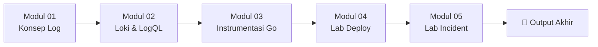

# Minggu 6 — Logging & Log Aggregation (Grafana Loki)

Selamat datang di materi pembelajaran **Minggu 6: Logging & Log Aggregation**.

Di minggu ini, kita membangun pilar observability kedua: **Logs**. Anda akan mempelajari konsep *log pipeline* dan *structured logging*, menginstal **Grafana Loki** sebagai pusat penyimpanan log, mengonfigurasi **Grafana Alloy** untuk membaca log dari setiap container Pod, lalu membuat dashboard investigasi menggunakan bahasa query **LogQL**.

---

## 🗺️ Struktur & Daftar Modul Pembelajaran

Materi Minggu 6 dibagi menjadi 5 modul dokumen dan berkas manifest pendukung:

| No | Dokumen Modul | Deskripsi Topik | Jenis |
| :---: | :--- | :--- | :---: |
| 01 | [Modul 01: Konsep Log Pipeline & Structured Log](./01-konsep-log-pipeline-dan-structured-log.md) | stdout/stderr, JSON format, level log, retention & rotation | 📖 Teori |
| 02 | [Modul 02: Arsitektur Loki, Alloy & LogQL](./02-arsitektur-loki-alloy-dan-logql.md) | Arsitektur Loki (Distributor/Ingester/Querier), Alloy DaemonSet, sintaks LogQL | 📖 Teori |
| 03 | [Modul 03: Instrumentasi JSON Logger pada Go App](./03-instrumentasi-logging-pada-go-app.md) | Library `slog` Go, level INFO/WARN/ERROR, integrasi dengan Loki | 📖 Teori |
| 04 | [Modul 04: Lab Deploy Loki & Dashboard](./04-lab-install-loki-dan-dashboard.md) | Hands-on deploy Loki + Alloy + Datasource + Dashboard JSON | 🧪 Lab |
| 05 | [Modul 05: Lab Incident Panic & Investigasi Log](./05-lab-incident-panic-recovery-log-investigation.md) | Simulasi panic Go App & RCA dengan LogQL tanpa `kubectl exec` | 🧪 Lab |
| 📂 | [Logging Manifests `manifests/`](./manifests/) | Manifest `01-loki.yaml`, `02-alloy-loki.yaml`, `03-grafana-loki-datasource.yaml` | 💻 Code |
| 📂 | [Grafana Dashboards `dashboards/`](./dashboards/) | Berkas JSON dashboard `logs-dashboard.json` (panel ERROR/WARN/panic) | 💻 Code |

---

## 🎯 Target & Checklist Capaian Pembelajaran

- [ ] Memahami konsep **log pipeline**: dari aplikasi → stdout → kubelet → Alloy → Loki → Grafana
- [ ] Memahami pentingnya **JSON structured logging** untuk filter otomatis
- [ ] Mengenal 3 best practice logging: **stdout, level log, JSON format**
- [ ] Memahami arsitektur **Grafana Loki**: Distributor, Ingester, Querier, Store
- [ ] Mengetahui cara kerja **Grafana Alloy** sebagai DaemonSet log collector
- [ ] Terbiasa menulis query **LogQL** dasar (filter, pipe, parser JSON)
- [ ] Menginstrumentasi **Go App** dengan library `log/slog` (JSON handler)
- [ ] Mampu melakukan **investigasi insiden** hanya bermodalkan LogQL (tanpa `kubectl exec`)
- [ ] Menghubungkan data **Metrics** (restart count) dengan **Logs** (stack trace)

---

## 🧩 Peta Hubungan dengan Materi Sebelumnya

| Materi Minggu | Kontribusi ke Minggu 6 |
| :--- | :--- |
| **Minggu 1** | Pod & namespace `mini-prod` menjadi target Alloy untuk membaca log |
| **Minggu 2** | Go App yang dipakai sebagai *application under test* untuk panic simulation |
| **Minggu 5** | Grafana yang sudah terpasang menjadi UI untuk query LogQL & import dashboard |

---

## 📚 Kosakata Penting Minggu Ini

| Istilah | Definisi Singkat |
| :--- | :--- |
| **stdout** | Aliran output standar di mana container biasanya menulis log |
| **structured log** | Log dalam format mesin-baca (JSON) dengan key-value pairs |
| **log level** | Penanda kepentingan log: `DEBUG`, `INFO`, `WARN`, `ERROR`, `FATAL` |
| **Loki** | Sistem penyimpanan log yang di-develop oleh Grafana Labs |
| **Alloy** | Agen collector serbaguna dari Grafana untuk logs, metrics, dan traces |
| **LogQL** | Bahasa query untuk mengekstrak log dari Loki (mirip PromQL untuk metrik) |
| **label** | Pasangan key-value yang melekat pada stream log (mis. `namespace`, `app`) |
| **panic** | Istilah Go untuk error fatal yang belum di-recover → menyebabkan crash |
| **Log Pipeline** | Rangkaian komponen yang memindahkan log dari sumber ke penyimpanan |

---

## 🛠️ Prasyarat Sebelum Memulai

Pastikan minggu-minggu sebelumnya sudah terpasang:

1. **Cluster k3s aktif** (dari Minggu 1)
   ```bash
   kubectl get nodes
   ```
2. **Namespace `mini-prod`** sudah ada (dari Minggu 1)
3. **Go App** sudah ter-deploy (dari Minggu 2)
4. **Grafana** sudah ter-install dan jalan (dari Minggu 5)
   ```bash
   kubectl get pods -n mini-prod -l app=grafana
   ```

---

## 🚀 Urutan Belajar yang Disarankan



1. Baca **Modul 01** untuk paham konsep dasar log pipeline.
2. Lanjut **Modul 02** untuk memahami arsitektur Loki + Alloy.
3. Pelajari **Modul 03** untuk menulis JSON logger di Go.
4. Kerjakan **Modul 04** untuk deploy stack logging secara nyata.
5. Akhiri dengan **Modul 05** untuk simulasi insiden & RCA.

---

## 📦 Output Mingguan

Setelah menyelesaikan Minggu 6, Anda akan memiliki:

- ✅ Cluster k3s dengan **Loki** aktif sebagai pusat log
- ✅ **Grafana Alloy DaemonSet** membaca log dari seluruh Pod
- ✅ **Go App** yang menulis log terstruktur (JSON) ke stdout
- ✅ **Dashboard Grafana** berisi 3 panel: ERROR, WARN, panic
- ✅ Kemampuan investigasi insiden menggunakan **LogQL**

---

## 🔗 Lanjut ke Minggu Berikutnya

Lanjut ke **Minggu 7 — Distributed Tracing** untuk melengkapi pilar observability ketiga (Traces) menggunakan **Grafana Tempo** dan **OpenTelemetry**.