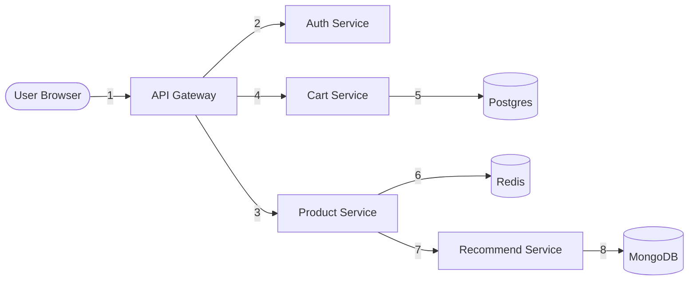
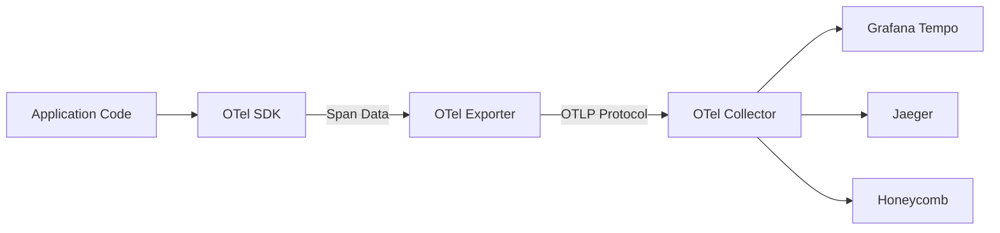
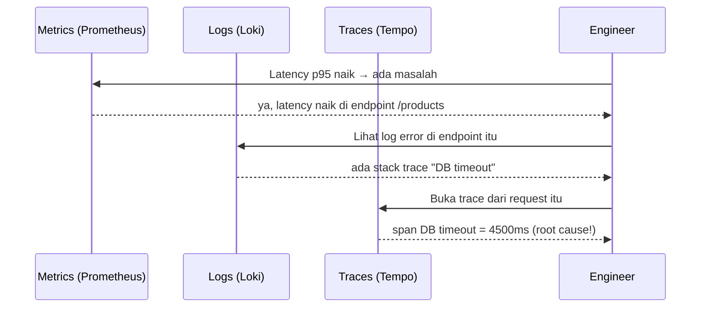

# Modul 01: Konsep Distributed Tracing

> **Target Pembelajaran:** Memahami pilar observability ketiga — **Tracing** — beserta konsep fundamental **Span**, **Trace**, **Context Propagation**, dan standar industri **OpenTelemetry (OTel)**.

---

## 1. Recap: 3 Pilar Observability

Sebelum masuk ke tracing, mari kita lihat kembali posisi tracing di antara 3 pilar observability:

| Pilar | Menjawab Pertanyaan | Contoh Tools |
| :--- | :--- | :--- |
| **Metrics** | *Berapa banyak? Seberapa cepat?* | Prometheus, Mimir, Grafana |
| **Logs** | *Apa yang terjadi secara detail?* | Loki, Alloy, Grafana |
| **Tracing** | *Di mana waktu dihabiskan saat sebuah request mengalir?* | **Tempo**, Jaeger, **OTel** |

> **Tracing adalah satu-satunya pilar yang menunjukkan alur request dari ujung ke ujung** — dari user mengklik tombol, sampai database menjawab query.

---

## 2. Apa itu Distributed Tracing?

**Distributed tracing** adalah teknik untuk merekam **jalur lengkap sebuah request** ketika request tersebut melewati banyak layanan (microservices). Bayangkan seperti **GPS tracker** yang menunjukkan rute mobil dari titik A sampai titik Z, lengkap dengan berhenti di mana saja dan berapa lama.

### Contoh Kasus Nyata

Sebuah user membuka halaman produk di e-commerce. Request mengalir seperti ini:



**Tanpa tracing:** kalau halaman lambat, Anda bingung — apakah Auth lambat? DB? Cache? Anda hanya tahu *"total latency = 3 detik"*.

**Dengan tracing:** Anda bisa lihat dengan presisi bahwa **Recommend Service** butuh 2.5 detik dari total 3 detik. Anda bisa langsung optimasi di sana.

---

## 3. Anatomi: Span, Trace, dan Context

Tracing punya 2 konsep utama yang wajib Anda pahami.

### 3.1 Span

**Span** adalah unit terkecil dalam tracing — mewakili **sebuah operasi tunggal** dalam satu service.

Analogi: Satu span = satu **bukti transaksi di kasir** (berapa lama, siapa kasirnya, berapa itemnya).

Setiap span punya metadata berikut:

| Field | Penjelasan | Contoh |
| :--- | :--- | :--- |
| `name` | Nama operasi | `GET /products/123` |
| `trace_id` | ID unik untuk satu request lengkap | `abc123...` |
| `span_id` | ID unik untuk span ini | `def456...` |
| `parent_span_id` | Span yang menjadi parent (siapa yang memanggil) | `ghi789...` |
| `start_time` | Kapan operasi dimulai | `2026-08-10T10:00:00Z` |
| `duration` | Berapa lama operasi ini | `150ms` |
| `attributes` | Data tambahan (key-value) | `http.status_code=200` |
| `status` | Status akhir: OK / ERROR | `OK` |

### 3.2 Trace

**Trace** adalah **kumpulan span yang saling terkait** untuk satu request lengkap. Trace terbentuk karena setiap span punya `trace_id` yang sama, dan `parent_span_id` yang menunjuk ke span pemanggilnya.

Analogi: Satu trace = **seluruh rute pengiriman paket** dari gudang Jakarta sampai rumah di Surabaya, dengan bukti tanda-terima di setiap titik transit.

### Visualisasi Trace

```mermaid
gantt
    title Distributed Trace Example (total: 800ms)
    dateFormat X
    axisFormat %S
    
    section Frontend
    User Click → Page Render :a1, 0, 800
    
    section Backend
    API Gateway :a2, 0, 750
    Auth Service :a3, 10, 80
    Product Service :a4, 100, 600
    Cart Service :a5, 200, 400
    
    section Datastore
    Postgres Query :a6, 250, 80
    Redis Lookup :a7, 150, 50
```



> 📊 Visualisasi seperti ini (waterfall chart) adalah yang Anda lihat di Grafana Tempo ketika membuka sebuah trace.

### 3.3 Context Propagation

**Context Propagation** adalah mekanisme untuk **meneruskan trace_id dan parent_span_id** dari satu service ke service lain, biasanya via HTTP header.

Standar industri: **[W3C Trace Context](https://www.w3.org/TR/trace-context/)** — menggunakan 2 HTTP header:

```
traceparent: 00-abc123def456-7890ab-01
            │  │              │       │
            │  │              │       └─ flags (sampled?)
            │  │              └─ span_id (16 hex chars)
            │  └─ trace_id (32 hex chars)
            └─ version
```

Analogi: Seperti **nomor resi pengiriman paket**. Saat paket berpindah gudang, nomor resi tetap sama → Anda bisa lacak seluruh perjalanannya.

**Tanpa context propagation**: setiap service membuat trace_id baru → request yang sama terlihat seperti 5 request berbeda di Tempo. Tracing tidak berguna!

---

## 4. Apa itu OpenTelemetry (OTel)?

**OpenTelemetry (OTel)** adalah **standar terbuka** (tidak terikat vendor) untuk instrumentasi tracing, metrics, dan logs. Dikembangkan oleh CNCF (Cloud Native Computing Foundation).

### Mengapa OTel Penting?

| Tanpa OTel (Vendor Lock-in) | Dengan OTel |
| :--- | :--- |
| Pakai Jaeger SDK → hanya bisa kirim ke Jaeger | Pakai OTel SDK → bisa kirim ke Jaeger, Tempo, Honeycomb, dll |
| Ganti vendor = rewrite seluruh instrumentasi | Ganti vendor = ubah URL exporter saja |
| Standar proprietary | Standar industri (CNCF graduated) |

### Komponen OTel



1. **API**: Interface untuk instrumentasi (mis. `tracer.StartSpan()`)
2. **SDK**: Implementasi API, mengelola span lifecycle
3. **Exporter**: Mengirim span ke backend via protokol OTLP
4. **Collector** (opsional): Agregator di tengah (bisa diganti dengan **Grafana Alloy**)

### Protokol OTLP

**OTLP (OpenTelemetry Protocol)** adalah protokol transport standar. Dua varian:
- **`otlp/grpc`** — lebih efisien, default
- **`otlp/http`** — lebih firewall-friendly

---

## 5. Perbandingan: Metrics vs Logs vs Tracing

Mari kita lihat satu request dengan tiga sudut pandang berbeda:

| Sudut Pandang | Apa yang Terekam | Tools |
| :--- | :--- | :--- |
| **Metrics** | `http_requests_total{path="/api/products"}` Counter naik 1 | Prometheus/Mimir |
| **Logs** | `"request processed in 145ms, status=200"` JSON string | Loki |
| **Tracing** | Span tree: Gateway (150ms) → Product (140ms) → DB (50ms) | Tempo/Jaeger |

**Semuanya saling melengkapi** — bukan saling menggantikan. Dalam insiden nyata, ketiga pilar dipakai bersamaan:



---

## 6. Kapan Tracing Sangat Berharga?

| Situasi | Kenapa Tracing Membantu |
| :--- | :--- |
| Request user lambat, tapi semua service "sehat" di metrics | Tracing tunjukkan service mana yang diam-diam lambat |
| Ada dependency tersembunyi yang tidak terdokumentasi | Trace map otomatis visualkan seluruh panggilan |
| Bug hanya muncul di production, tidak di staging | Lihat trace production untuk lihat urutan panggilan asli |
| Ingin tahu "kenapa user tertentu error?" | Cari trace berdasarkan `user_id` attribute |

---

## 7. Istilah Penting Minggu Ini

| Istilah | Definisi |
| :--- | :--- |
| **Span** | Unit kerja terkecil, satu operasi |
| **Trace** | Kumpulan span untuk satu request |
| **Trace ID** | Identifier unik sebuah trace (32 hex chars) |
| **Span ID** | Identifier unik sebuah span (16 hex chars) |
| **Parent Span** | Span yang memanggil span ini |
| **Root Span** | Span pertama dalam trace (tidak punya parent) |
| **Context Propagation** | Mekanisme teruskan trace ID antar service |
| **OTLP** | OpenTelemetry Protocol (transport) |
| **W3C Trace Context** | Standar header HTTP untuk propagasi |
| **Sampling** | Keputusan apakah span dikirim ke backend atau dibuang |
| **Baggage** | Data tambahan yang ikut tersebar bersama context |

---

## 8. Insight Penting

> 🔑 **Tracing bukan pengganti logs — melainkan Navigator-nya.**
> Log adalah "Apa yang terjadi", tracing adalah "Di mana waktu dihabiskan". Keduanya saling melengkapi untuk RCA yang cepat.

> 🔑 **Tanpa context propagation, tracing tidak berfungsi.**
> Pastikan setiap pemanggilan HTTP/gRPC antar-service membawa header `traceparent`. Library OTel biasanya sudah handle otomatis — Anda cukup setup tracer-nya saja.

---

## 9. Rangkuman

Di modul ini Anda sudah memahami:
- ✅ Apa itu distributed tracing dan kapan dibutuhkan
- ✅ Perbedaan **Span**, **Trace**, dan **Context**
- ✅ Cara kerja **Context Propagation** via W3C Trace Context
- ✅ Apa itu **OpenTelemetry** dan mengapa jadi standar industri
- ✅ Bagaimana tracing melengkapi metrics & logs dalam observability

Lanjut ke **Modul 02** untuk memahami arsitektur **Grafana Tempo** sebagai backend trace storage dan **Alloy** sebagai OTel collector.