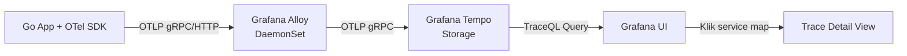
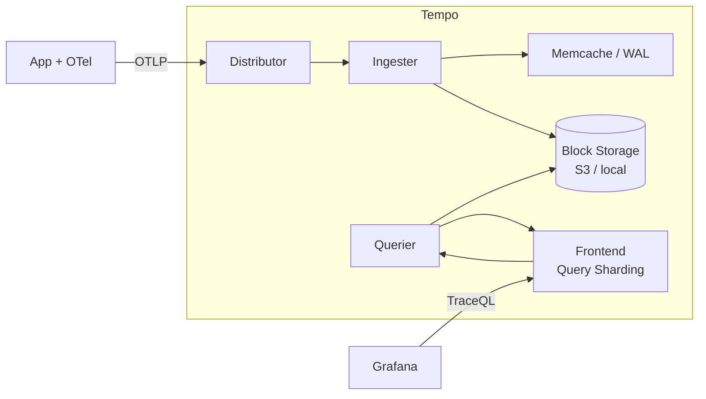
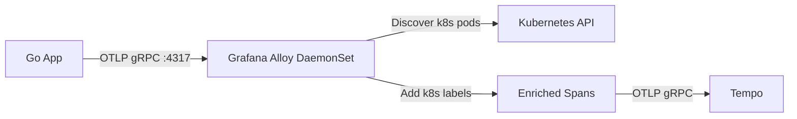
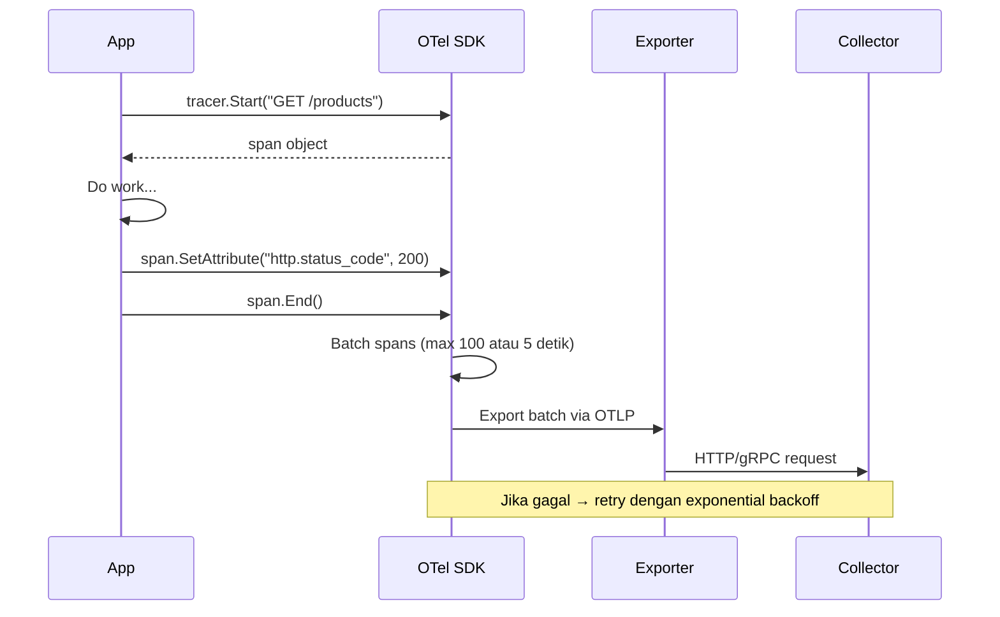
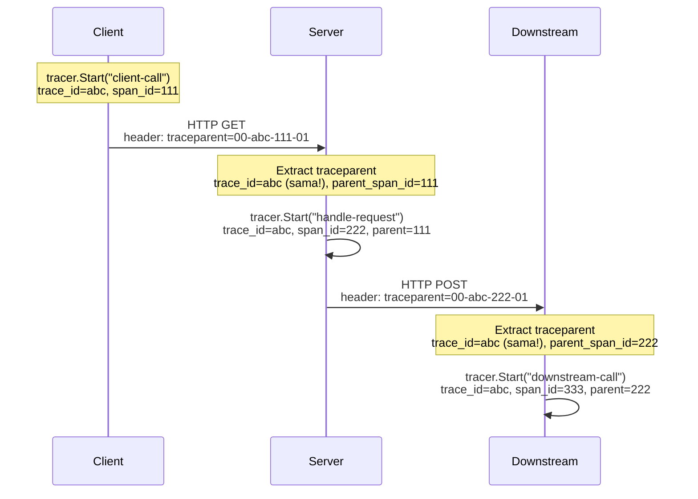
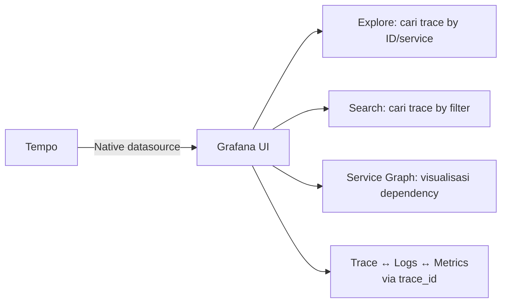

# Modul 02: Arsitektur Grafana Tempo, Alloy & OpenTelemetry Collector

> **Target Pembelajaran:** Memahami arsitektur **Grafana Tempo** sebagai backend distributed trace storage, bagaimana **Grafana Alloy** berfungsi sebagai OpenTelemetry Collector, dan bagaimana protokol OTLP mengirim data trace dari aplikasi ke backend.

---

## 1. Recap: Alur Data Tracing

Sebelum masuk ke komponen, mari lihat alur lengkapnya:



**Penjelasan singkat setiap lompatan:**

| Lompatan | Apa yang Dikirim |
| :--- | :--- |
| App → Alloy | Span batch (protobuf via OTLP gRPC) |
| Alloy → Tempo | Span batch dengan metadata tambahan (label k8s, namespace, dsb) |
| Tempo → Grafana | Hasil query trace berdasarkan TraceQL |

---

## 2. Grafana Tempo: Backend Trace Storage

**Grafana Tempo** adalah proyek open-source dari Grafana Labs untuk menyimpan dan querying distributed traces. Dirancang sebagai backend trace yang **scalable, cost-efficient, dan mudah diintegrasikan** dengan Grafana.

### 2.1 Mengapa Tempo, Bukan Jaeger?

| Aspek | Jaeger | Tempo |
| :--- | :--- | :--- |
| Storage | Elasticsearch / Cassandra | S3 / GCS / Azure Blob / local |
| Query Language | Custom JSON-based | **TraceQL** (PromQL-like) |
| Integrasi Grafana | Plugin terpisah | **Native** (built-in) |
| Cost | Mahal (butuh DB besar) | Murah (object storage) |
| Skala | Medium | Massive (horizontal scaling) |

> Untuk setup laptop/lokal, Tempo cukup jalan sebagai **single binary mode** tanpa S3 — menyimpan trace di filesystem lokal.

### 2.2 Arsitektur Internal Tempo



| Komponen | Fungsi |
| :--- | :--- |
| **Distributor** | Menerima span via OTLP/HTTP, validasi, rate limiting, lalu forward ke Ingester |
| **Ingester** | Mengumpulkan span & batch ke "trace block" (mirip Ingester Loki) |
| **Block Storage** | Penyimpanan trace block yang sudah final (S3, GCS, atau filesystem) |
| **Querier** | Menjawab query TraceQL dengan membaca dari Block Storage |
| **Frontend** | Sharding & caching untuk query besar |

### 2.3 TraceQL: Bahasa Query Tempo

**TraceQL** adalah bahasa query Tempo — mirip PromQL, tapi khusus untuk trace. Sintaks dasarnya:

```
{ resource.service.name = "go-app" && span.http.status_code = 500 }
| count_over_time(5m)
```

**Contoh-contoh berguna:**

| Query | Tujuan |
| :--- | :--- |
| `{ resource.service.name = "go-app" }` | Semua trace dari go-app |
| `{ status = error }` | Semua trace yang punya span error |
| `{ span.http.status_code = 500 } \| count_over_time(5m)` | Hitung trace dengan HTTP 500 per 5 menit |
| `{ duration > 2s }` | Trace yang lebih lambat dari 2 detik |
| `{ name = "GET /api/products" }` | Span dengan nama tertentu |

> 🔑 **TraceQL sangat mirip LogQL & PromQL** — sekali paham satu, yang lain mudah dipelajari.

---

## 3. Grafana Alloy sebagai OpenTelemetry Collector

**Alloy** (yang sudah Anda kenal dari Minggu 5/6) bisa juga berfungsi sebagai **OpenTelemetry Collector** untuk menerima span.

### 3.1 Mode Alloy untuk Traces



**Kenapa pakai Alloy sebagai Collector?**

1. **Resource Detection** — Alloy otomatis menambahkan label Kubernetes (pod_name, namespace, container) ke setiap span
2. **Sampling** — Bisa konfigurasi tail-sampling (hanya trace error/lambat yang disimpan)
3. **Batching & Retry** — Alloy otomatis batch span untuk efisiensi network
4. **Multi-protocol** — Terima OTLP dari berbagai SDK (Go, Java, Python, NodeJS) dalam satu tempat

### 3.2 Alokasi Receiver di Alloy

Alloy listen di port standar OTel:
- **4317** → OTLP gRPC (direkomendasikan, paling efisien)
- **4318** → OTLP HTTP

Konfigurasi minimal di Alloy:

```river
// Terima OTLP dari aplikasi
otelcol.receiver.otlp "default" {
  grpc { endpoint = "0.0.0.0:4317" }
  http { endpoint = "0.0.0.0:4318" }

  output {
    traces = [otelcol.exporter.otlp.tempo.input]
  }
}

// Kirim ke Tempo
otelcol.exporter.otlp "tempo" {
  client {
    endpoint = "tempo.mini-prod.svc.cluster.local:4317"
  }
}
```

---

## 4. OpenTelemetry SDK: Di dalam Aplikasi

Sebelum data sampai ke Alloy, aplikasi Anda harus **mengirim span** menggunakan OTel SDK.

### 4.1 Lifecycle Sebuah Span



### 4.2 Komponen OTel SDK yang Penting

| Komponen | Tugas |
| :--- | :--- |
| **TracerProvider** | Top-level container untuk semua tracer |
| **Tracer** | Objek yang membuat span |
| **Span** | Objek yang merepresentasikan satu operasi |
| **Propagator** | Encode/decode context (W3C Trace Context) |
| **Exporter** | Mengirim batch span ke collector |
| **Resource** | Metadata statis (service name, version, k8s info) |
| **Sampler** | Keputusan trace mana yang disimpan |

### 4.3 Auto vs Manual Instrumentation

| Jenis | Cara Kerja | Kelebihan |
| :--- | :--- | :--- |
| **Auto-instrumentation** | OTel otomatis wrap library populer (HTTP server, DB driver) | Cepat, tidak perlu ubah kode bisnis |
| **Manual instrumentation** | Anda panggil `tracer.Start()` & `span.End()` sendiri | Granular, bisa tambah attribute custom |

> Untuk Go App, biasanya dipakai **kombinasi**: auto-instrumentation untuk HTTP framework + manual untuk business logic penting.

---

## 5. Context Propagation: Bagaimana Span Tersambung?

Kunci tracing yang berfungsi adalah **context propagation** yang benar antar-service.

### 5.1 HTTP Server → HTTP Client



**3 hasil utama:**

1. **Trace ID sama** (`abc`) — semua span milik satu request yang sama
2. **Parent-child relationship** jelas — tahu siapa memanggil siapa
3. **Total latency** bisa dihitung dari root span sampai leaf span

### 5.2 Standard Header

```
traceparent: 00-{32 hex trace_id}-{16 hex span_id}-{2 hex flags}
tracestate: {vendor-specific data, opsional}
```

> Hampir semua HTTP framework modern + library OTel sudah handle propagation otomatis. Anda cukup setup propagator-nya di kode.

---

## 6. Sampling: Tidak Semua Trace Dikirim

Mengirim 100% trace ke backend = mahal dan lambat. **Sampling** memilih trace mana yang dikirim.

| Tipe Sampling | Cara Kerja | Trade-off |
| :--- | :--- | :--- |
| **Always On** | Kirim semua trace | Akurat tapi mahal |
| **Probabilistic** | Kirim N% dari trace (mis. 10%) | Murah tapi bisa miss error |
| **Rate Limiting** | Kirim max N trace per detik | Cocok untuk traffic tinggi |
| **Tail-based** | Kirim hanya jika ada error/lambat | Paling akurat, butuh collector pintar |
| **Parent-based** | Ikut keputusan sampling parent | Konsisten antar-service |

Untuk setup lokal, default OTel SDK adalah **ParentBased(AlwaysOn)** — kirim semua trace. Nanti di lab kita pakai ini.

---

## 7. Integrasi dengan Grafana



**Yang paling powerful di Grafana:**

1. **Trace to Logs** — klik trace → langsung lihat log dari service yang sama
2. **Logs to Trace** — klik log yang punya `trace_id` → langsung buka trace
3. **Metrics to Trace** — klik titik anomali di grafik metrics → langsung buka exemplar trace

> Ini adalah **"single pane of glass"** yang sesungguhnya: 3 pilar observability yang saling terhubung.

---

## 8. Konfigurasi Sampling & Resource yang Baik

Agar trace benar-benar berguna, pastikan hal berikut di OTel SDK Anda:

```go
// 1. Resource detection — agar semua span punya metadata service
resource := resource.NewWithAttributes(
    semconv.SchemaURL,
    semconv.ServiceName("go-app"),
    semconv.ServiceVersion("v1.0.0"),
    semconv.DeploymentEnvironment("dev"),
)

// 2. Sampler — untuk production gunakan ParentBased(TraceIDRatioBased(0.1))
//    artinya 10% trace + semua error
sampler := sdktrace.ParentBased(sdktrace.TraceIDRatioBased(0.1))

// 3. Exporter — pakai OTLP gRPC ke Alloy
exporter, _ := otlptracegrpc.New(ctx,
    otlptracegrpc.WithEndpoint("grafana-alloy-otel.mini-prod.svc.cluster.local:4317"),
    otlptracegrpc.WithInsecure(),
)
```

---

## 9. Checklist Arsitektur

Setelah memahami modul ini, Anda harus bisa menjawab:

- [ ] Apa fungsi **Distributor**, **Ingester**, dan **Querier** di Tempo?
- [ ] Apa beda **OTLP gRPC** vs **OTLP HTTP**?
- [ ] Mengapa **Alloy** ditaruh di antara App dan Tempo?
- [ ] Apa itu **trace_id** dan bagaimana ia tersebar antar-service?
- [ ] Mengapa **sampling** penting dan apa trade-off-nya?
- [ ] Bagaimana cara menghubungkan trace dengan logs & metrics di Grafana?

---

## 10. Rangkuman

Di modul ini Anda sudah memahami:
- ✅ Arsitektur **Grafana Tempo** (Distributor/Ingester/Querier)
- ✅ Bahasa query **TraceQL**
- ✅ Bagaimana **Alloy** menjadi OpenTelemetry Collector
- ✅ Lifecycle span dalam OTel SDK
- ✅ Cara kerja **context propagation** via W3C Trace Context
- ✅ Konsep **sampling** dan trade-off-nya
- ✅ Integrasi native Tempo ↔ Grafana (Explore, Service Graph, trace-to-logs)

Lanjut ke **Modul 03** untuk mulai menulis kode **instrumentasi OTel** di Go App Anda.