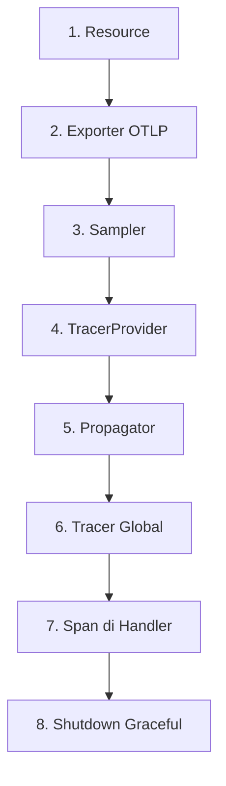

# Modul 03: Instrumentasi OpenTelemetry pada Go App

> **Target Pembelajaran:** Memasang **OpenTelemetry SDK** ke dalam Go App, mengkonfigurasi **Tracer Provider**, **Resource**, **Exporter OTLP gRPC**, dan **W3C Trace Context Propagator** — sehingga setiap request otomatis menghasilkan span tree yang utuh (HTTP → DB → Redis).

---

## 1. Anatomi Kode OTel di Go

Sebelum menulis kode, mari lihat blok-blok penting yang harus ada di sebuah aplikasi Go yang sudah di-instrumentasi OTel:



| # | Blok | Tujuan |
| :---: | :--- | :--- |
| 1 | **Resource** | Metadata service (nama, versi, environment) |
| 2 | **Exporter** | Mengirim batch span via OTLP gRPC ke Alloy |
| 3 | **Sampler** | Memilih trace mana yang dikirim |
| 4 | **TracerProvider** | Top-level container untuk semua tracer |
| 5 | **Propagator** | Encode/decode context antar-service |
| 6 | **Tracer Global** | Dipanggil dari handler untuk buat span |
| 7 | **Span** | Objek yang merepresentasikan satu operasi |
| 8 | **Shutdown** | Flush sisa span sebelum proses mati |

---

## 2. Dependensi yang Diperlukan

Tambahkan ke `go.mod`:

```go
require (
    go.opentelemetry.io/otel                          // API
    go.opentelemetry.io/otel/sdk                      // SDK
    go.opentelemetry.io/otel/exporters/otlp/otlptrace // OTLP trace exporter
    go.opentelemetry.io/otel/exporters/otlp/otlptrace/otlptracegrpc
    go.opentelemetry.io/otel/semconv/v1.24.0          // Semantic conventions
)
```

> Versi di atas adalah OTel v1.22.0 (stabil untuk Go 1.21). Anda bisa lihat dependensi lengkapnya di `minggu-07/app/go.mod`.

---

## 3. Langkah Demi Langkah Instrumentasi

### Langkah 1: Inisialisasi Resource

Resource = metadata statis tentang **siapa** yang mengirim span. Setiap span akan di-tag dengan informasi ini.

```go
res, err := resource.New(ctx,
    resource.WithAttributes(
        semconv.ServiceName("go-app"),            // ← penting! nama service di Tempo
        semconv.ServiceVersion("v1.0.0"),
        semconv.DeploymentEnvironment("dev"),
    ),
)
```

**Konvensi penamaan service:**

| Environment | Service Name | Keterangan |
| :--- | :--- | :--- |
| Dev | `go-app-dev` atau `go-app` | Tergantung tim |
| Prod | `go-app-prod` atau `go-app` | Bisa juga pakai prefix per cluster |
| Multi-cluster | `prod-eu.go-app`, `prod-us.go-app` | Untuk isolasi per region |

### Langkah 2: Buat Exporter OTLP gRPC

Exporter mengirim span batch via **OTLP gRPC** ke Alloy.

```go
otlpEndpoint := os.Getenv("OTEL_EXPORTER_OTLP_ENDPOINT")
if otlpEndpoint == "" {
    otlpEndpoint = "grafana-alloy-otel.mini-prod.svc.cluster.local:4317"
}
exporter, err := otlptracegrpc.New(ctx,
    otlptracegrpc.WithEndpoint(otlpEndpoint),
    otlptracegrpc.WithInsecure(), // tanpa TLS untuk cluster internal
)
```

**Kenapa `WithInsecure()`?**

Di dalam cluster Kubernetes (pod → pod), komunikasi biasanya sudah di-encrypt oleh CNI atau service mesh. Untuk komunikasi eksternal (app → SaaS vendor) baru pakai TLS.

### Langkah 3: Pilih Sampler

Untuk dev/lokal: **kirim semua trace** agar Anda bisa lihat semuanya.

```go
sampler := sdktrace.ParentBased(sdktrace.AlwaysSample())
```

Untuk production dengan traffic tinggi:

```go
// Kirim 10% trace random + SEMUA trace yang punya error
sampler := sdktrace.ParentBased(sdktrace.TraceIDRatioBased(0.1))
```

> Sampler ini dievaluasi di **root span**. Child span ikut keputusan root (via `ParentBased`).

### Langkah 4: Bangun TracerProvider

TracerProvider adalah **top-level container**. Semua konfigurasi di atas disatukan di sini:

```go
tp := sdktrace.NewTracerProvider(
    sdktrace.WithBatcher(exporter,
        sdktrace.WithBatchTimeout(5*time.Second),      // batch span tiap 5 detik
        sdktrace.WithMaxExportBatchSize(100),          // max 100 span per batch
    ),
    sdktrace.WithResource(res),
    sdktrace.WithSampler(sampler),
)
otel.SetTracerProvider(tp) // set sebagai global
```

**Parameter `WithBatcher` yang penting:**

| Parameter | Default | Fungsi |
| :--- | :--- | :--- |
| `WithBatchTimeout` | 5 detik | Maksimal span menunggu sebelum dikirim |
| `WithMaxExportBatchSize` | 512 | Maksimal span per satu panggilan export |
| `WithMaxQueueSize` | 2048 | Kapasitas antrian span di memori |

### Langkah 5: Set Propagator W3C

Tanpa propagator, setiap service buat `trace_id` baru → trace tree terputus.

```go
otel.SetTextMapPropagator(propagation.NewCompositeTextMapPropagator(
    propagation.TraceContext{}, // W3C Trace Context (header traceparent)
    propagation.Baggage{},      // Opsional: data tambahan
))
```

### Langkah 6: Ambil Tracer Global

Setelah propagator & provider di-setup, ambil tracer untuk digunakan di handler:

```go
tracer = otel.Tracer("go-app") // nama instrumentation library
```

> Anda bisa ambil banyak tracer dengan nama berbeda (mis. `tracer = otel.Tracer("go-app/db")`) untuk grouping di Tempo.

### Langkah 7: Buat Span di Handler

Setiap handler yang ingin di-trace, mulai dan akhiri span:

```go
func handleOrder(w http.ResponseWriter, r *http.Request) {
    ctx := r.Context()                                    // ← penting! context asli
    ctx, span := tracer.Start(ctx, "GET /order",         // nama span
        trace.WithAttributes(
            attribute.String("http.method", r.Method),
            attribute.String("http.route", "/order"),
        ),
    )
    defer span.End()                                      // ← penting! WAJIB di-defer

    // ... business logic ...

    // Set attribute saat proses berjalan
    span.SetAttributes(attribute.Int("http.status_code", 200))

    // Catat error jika ada
    if err != nil {
        span.RecordError(err)
        span.SetStatus(codes.Error, err.Error())
    }
}
```

**3 hal yang wajib di setiap span:**
1. ✅ `defer span.End()` — supaya span selalu ditutup, bahkan saat panic
2. ✅ `r.Context()` sebagai parent — propagasi otomatis via HTTP framework OTel
3. ✅ `span.RecordError(err)` saat terjadi error — agar muncul jelas di Tempo

### Langkah 8: Graceful Shutdown

Saat Pod akan dimatikan, flush sisa span yang belum terkirim:

```go
defer func() {
    shutdownCtx, cancel := context.WithTimeout(context.Background(), 5*time.Second)
    defer cancel()
    if err := tp.Shutdown(shutdownCtx); err != nil {
        logger.Error("tracer shutdown failed", "error", err.Error())
    }
}()
```

> Tanpa shutdown, span terakhir bisa hilang saat Pod di-restart.

---

## 4. Manual vs Auto-Instrumentation

Untuk Go, opsi instrumentasi:

| Library | Cara Pakai | Lingkup |
| :--- | :--- | :--- |
| `otelhttp` (HTTP) | Wrap transport: `otelhttp.NewHandler(mux)` | Auto-trace setiap HTTP request |
| `otelsql` (Database) | Wrap driver: `otelsql.Register(...)` | Auto-trace setiap SQL query |
| `otelpq` (Postgres) | Driver wrapper | Auto-trace Postgres |
| `redisotel` (Redis) | Hook Redis client | Auto-trace Redis call |

**Contoh pakai `otelhttp`** (auto-instrumentation HTTP):

```go
import "go.opentelemetry.io/contrib/instrumentation/net/http/otelhttp"

handler := otelhttp.NewHandler(mux, "go-app-server")
http.ListenAndServe(":8080", handler)
```

> Untuk lab ini, kita pakai **manual instrumentation** di handler `/order` agar jelas terlihat span tree (HTTP → DB → Redis).

---

## 5. Apa yang Akan Anda Lihat di Tempo?

Setelah instrumentasi selesai, di Grafana Tempo Anda akan melihat **waterfall view** seperti ini:

```
GET /order                                    120ms
├─ postgres.query   "SELECT products..."       50ms
└─ redis.lookup     "GET cache:default-1"      10ms
```

**Cara baca:**
- Baris = span (semakin ke kanan = lebih lambat)
- Indentasi = parent-child relationship
- Klik span → lihat attribute detail (db.system, cache.key, dll)

---

## 6. Best Practices

### ✅ DO

1. **Selalu pakai `defer span.End()`** — menjamin span tertutup
2. **Set `ServiceName` di Resource** — tanpa ini, semua span jadi `unknown_service`
3. **Gunakan semantic conventions** (`semconv.*`) — konsistensi antar-service
4. **Record error dengan `span.RecordError()`** — agar muncul jelas di UI
5. **Tambahkan business attribute** — mis. `order.product_id`, `user.tier`

### ❌ DON'T

1. **Jangan lupa `defer span.End()`** — span leak & memory bloat
2. **Jangan pakai nama span generik** — `span1`, `handleClick`, dll. Pakai nama yang deskriptif
3. **Jangan lupa propagator** — tanpa ini trace antar-service terputus
4. **Jangan log trace_id manual** — biarkan framework handle, atau pakai logger yang inject `trace_id` otomatis
5. **Jangan sample 100% di production dengan traffic tinggi** — biaya storage membengkak

---

## 7. Kode Lengkap: Go App dengan HTTP → DB → Redis

Kode lengkap tersedia di `minggu-07/app/main.go`. Struktur utamanya:

```go
// 1. Init logger JSON
initLogger()

// 2. Init OTel SDK
shutdown, _ := initTracer(ctx)
defer shutdown(...)

// 3. Register handlers
http.HandleFunc("/order", handleOrder)
http.HandleFunc("/health", handleHealth)

// 4. Run server
http.ListenAndServe(":8080", nil)
```

Di handler `handleOrder`:

```go
// Root span untuk HTTP request
ctx, span := tracer.Start(ctx, "GET /order")
defer span.End()

// Child span untuk DB call
ctx, dbSpan := tracer.Start(ctx, "postgres.query")
db.GetProduct(ctx, id)
dbSpan.End()

// Child span lain untuk Redis call
ctx, cacheSpan := tracer.Start(ctx, "redis.lookup")
cache.Get(ctx, key)
cacheSpan.End()
```

---

## 8. Insight Penting

> 🔑 **Tanpa `defer span.End()`, trace akan rusak.** Span yang tidak ditutup tidak akan pernah dikirim ke backend, dan Anda akan kehilangan visibilitas untuk request itu.

> 🔑 **`r.Context()` adalah parent context.** Saat framework OTel (seperti `otelhttp`) menerima request masuk, ia sudah mengekstrak `trace_id` dari header `traceparent` dan memasukkannya ke context. Anda cukup teruskan context ini ke child operation.

> 🔑 **Span tree di Tempo dimulai dari entry point.** HTTP request → jadi root span. Semua `tracer.Start(ctx, ...)` di bawahnya jadi child. Total latency bisa dilihat dari root span.

---

## 9. Rangkuman

Di modul ini Anda sudah memahami:
- ✅ Anatomi kode OTel: Resource → Exporter → Sampler → Provider → Propagator → Tracer → Span
- ✅ Cara membuat span tree manual untuk HTTP → DB → Redis
- ✅ Pentingnya `defer span.End()` dan `r.Context()`
- ✅ Best practices: semantic conventions, naming, error recording
- ✅ Konfigurasi batch exporter untuk efisiensi

Lanjut ke **Modul 04** untuk deploy **Grafana Tempo**, **Alloy**, dan import Datasource ke Grafana.