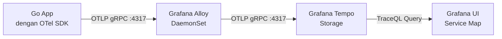

# Modul 04: Lab Hands-on — Deploy Grafana Tempo & OpenTelemetry Pipeline

> **Target Pembelajaran:** Memasang **Grafana Tempo** sebagai backend trace storage, **Grafana Alloy DaemonSet** sebagai OpenTelemetry Collector, lalu menambahkan Datasource Tempo ke Grafana dan mengimpor Dashboard JSON.

---

## 1. Alur Deploy Trace Pipeline



---

## 2. Prasyarat

Pastikan komponen sebelumnya sudah aktif:

```bash
kubectl get pods -n mini-prod
```

**Harus ada:**
- `grafana-*` (dari Minggu 5)
- `go-app-*` (dari Minggu 2, dengan instrumentasi OTel dari Modul 03 minggu ini)
- `loki-*` dan `grafana-alloy-logs-*` (dari Minggu 6 — untuk perbandingan nanti)

---

## 3. Langkah Demi Langkah

### Langkah 1: Deploy Grafana Tempo

```bash
kubectl apply -f minggu-07/manifests/01-tempo.yaml
```

Tunggu Pod Tempo siap:

```bash
kubectl wait --for=condition=ready pod -l app=tempo -n mini-prod --timeout=120s
```

**Verifikasi Service:**
```bash
kubectl get svc -n mini-prod tempo
```

*Service `tempo` listen di port **3200** (HTTP), **4317** (OTLP gRPC), **4318** (OTLP HTTP).*

---

### Langkah 2: Deploy Grafana Alloy OpenTelemetry Collector

Alloy akan jadi "agen pos" yang menerima span dari setiap Pod lalu meneruskannya ke Tempo:

```bash
kubectl apply -f minggu-07/manifests/02-alloy-otel.yaml
```

**Verifikasi:**
```bash
kubectl get pods -n mini-prod -l app=grafana-alloy-otel
```

*Seharusnya muncul 1 Pod Alloy per node cluster Anda. Di k3s single-node, akan ada tepat 1 Pod.*

---

### Langkah 3: Tambahkan Tempo Datasource ke Grafana

Grafana dari Minggu 5 perlu tahu bahwa ada Tempo di cluster. Tambahkan datasource via ConfigMap provisioning:

```bash
kubectl apply -f minggu-07/manifests/03-grafana-tempo-datasource.yaml
```

> **Penting:** Restart Pod Grafana agar ConfigMap baru terbaca:
> ```bash
> kubectl rollout restart deployment/grafana -n mini-prod
> kubectl wait --for=condition=ready pod -l app=grafana -n mini-prod --timeout=60s
> ```

---

### Langkah 4: Buka Grafana & Verifikasi

1. **Port-forward Grafana:**
   ```bash
   kubectl port-forward svc/grafana-service 3000:3000 -n mini-prod
   ```
2. **Buka** `http://localhost:3000`
3. **Pergi ke menu Explore** (icon kompas di sidebar)
4. **Pilih datasource "Tempo"** di dropdown atas

Anda akan melihat kolom query kosong. Coba query TraceQL pertama:

```
{ resource.service.name = "go-app" }
```

**Jika belum ada trace, hasil kosong dulu — itu normal.** Kita perlu trigger request supaya ada trace baru.

---

### Langkah 5: Build & Deploy Go App dengan OTel

Sekarang deploy Go App yang sudah di-instrumentasi OTel (Modul 03).

**a. Build image:**
```bash
docker build -t 192.168.1.10:5000/go-app:v1.1.0 minggu-07/app/
docker push 192.168.1.10:5000/go-app:v1.1.0
```

**b. Patch deployment agar pakai image baru + endpoint Alloy:**

Edit `minggu-02/manifests/04-deployment.yaml`, lalu set:

```yaml
spec:
  template:
    spec:
      containers:
      - name: go-app
        image: 192.168.1.10:5000/go-app:v1.1.0
        env:
        - name: OTEL_EXPORTER_OTLP_ENDPOINT
          value: "grafana-alloy-otel.mini-prod.svc.cluster.local:4317"
        - name: OTEL_SERVICE_NAME
          value: "go-app"
```

Atau jika Anda pakai Helm (Minggu 3), edit `values.yaml`:

```yaml
image:
  repository: 192.168.1.10:5000/go-app
  tag: v1.1.0

env:
  OTEL_EXPORTER_OTLP_ENDPOINT: "grafana-alloy-otel.mini-prod.svc.cluster.local:4317"
  OTEL_SERVICE_NAME: "go-app"
```

**c. Apply & tunggu rollout selesai:**
```bash
kubectl apply -f minggu-02/manifests/04-deployment.yaml
# atau: helm upgrade go-app ./charts/go-app
kubectl rollout status deployment/go-app -n mini-prod
```

---

### Langkah 6: Generate Traffic & Trace Pertama

**a. Port-forward Go App:**
```bash
kubectl port-forward svc/go-app-service 8080:80 -n mini-prod
```

**b. Trigger beberapa request:**
```bash
# Request normal
curl "http://localhost:8080/order?product=123"

# Beberapa request bervariasi (untuk service map lebih kaya)
for i in 1 2 3 4 5; do
  curl "http://localhost:8080/order?product=$i"
  sleep 0.5
done
```

**c. Cek log Go App — harus ada `trace_id`:**

```bash
kubectl logs -l app=go-app -n mini-prod --tail=5 | grep trace_id
```

**Output yang diharapkan:**
```json
{"time":"...","level":"INFO","msg":"order handled successfully","product":"Product-1","trace_id":"a1b2c3d4e5f6..."}
```

> 🎉 **`trace_id` ada di log!** Artinya SDK OTel sudah jalan dan context sudah aktif.

---

### Langkah 7: Lihat Trace di Grafana Explore

1. Buka Grafana → **Explore** → pilih datasource **Tempo**
2. Query:
   ```
   { resource.service.name = "go-app" }
   ```
3. Klik **Run query**

Anda akan melihat daftar trace. Klik salah satu untuk membuka **waterfall view**:

```
GET /order                                    75ms
├─ postgres.query   "SELECT products..."       50ms
└─ redis.lookup     "GET cache:1"              10ms
```

---

### Langkah 8: Lihat Service Graph

Service Graph adalah fitur unik Tempo yang **otomatis memetakan dependency** antar-service dari trace yang masuk.

1. Di Grafana Explore, cari query:
   ```
   { resource.service.name != "" }
   ```
2. Klik tab **Service Graph** di kanan

Anda akan melihat node-node (services) dan edge (calls). Untuk setup lokal single-service, minimal ada 1 node `go-app`. Setelah nanti Anda tambah service lain (worker, dll.) — graph otomatis berkembang.

---

## 4. Langkah 9: Import Dashboard JSON

1. Di Grafana, menu **Dashboards** → **New** → **Import**
2. Upload `minggu-07/dashboards/tracing-dashboard.json`
3. Pilih datasource **Tempo** ketika diminta
4. Klik **Import**

Dashboard `Week 7 — Distributed Tracing` akan muncul dengan 5 panel:

| Panel | Fungsi |
| :--- | :--- |
| Trace Count by Service | Timeseries jumlah trace per service |
| Slowest Traces | Tabel trace paling lambat 15 menit terakhir |
| Error Traces | List trace yang punya span error |
| Latency p95 by Service | Quantile p95 latency |
| Service Map | Visualisasi dependency graph |

---

## 5. Verifikasi Akhir

```bash
# 1. Semua Pod Running
kubectl get pods -n mini-prod

# 2. Trace sudah masuk ke Tempo
kubectl logs -n mini-prod -l app=tempo --tail=20 | grep -i trace

# 3. Dashboard JSON valid (tidak ada error import)
# Buka Grafana → Dashboards → Week 7 - Distributed Tracing
```

**Checklist Capaian:**

- [ ] Tempo Pod `Running`
- [ ] Alloy DaemonSet `Running` (1 per node)
- [ ] Datasource Tempo muncul di Grafana
- [ ] Trace pertama muncul di Grafana Explore
- [ ] Dashboard `Week 7 - Distributed Tracing` ter-import & menampilkan data
- [ ] Service Map menampilkan node `go-app`

---

## 6. Troubleshooting Cepat

| Gejala | Penyebab | Solusi |
| :--- | :--- | :--- |
| Trace tidak muncul di Grafana | Go App env `OTEL_EXPORTER_OTLP_ENDPOINT` salah | `kubectl describe deploy/go-app -n mini-prod \| grep OTEL` |
| Alloy crash-loop | ConfigMap format River salah | `kubectl logs -n mini-prod -l app=grafana-alloy-otel` |
| Tempo OOM | Trace terlalu besar | Naikkan memory limit di `01-tempo.yaml` |
| Dashboard panel kosong | Datasource UID tidak cocok | Edit panel, ganti `tempo-uid` dengan UID sebenarnya (lihat Settings → Data Sources) |

---

## 7. Rangkuman

Di modul ini Anda sudah:
- ✅ Deploy Grafana Tempo sebagai backend trace storage
- ✅ Deploy Grafana Alloy sebagai OpenTelemetry Collector
- ✅ Menambahkan Tempo datasource ke Grafana
- ✅ Build & deploy Go App dengan image OTel-instrumented
- ✅ Generate trace pertama dan melihatnya di Grafana Explore
- ✅ Import dashboard JSON dengan 5 panel observability

Lanjut ke **Modul 05** untuk simulasi insiden **bottleneck latency 5 detik** dan lakukan investigasi via Tempo!
