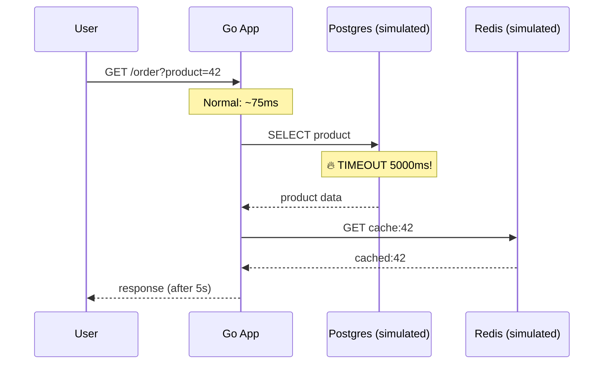

# Modul 05: Lab Incident — Bottleneck Latency 5 Detik (Trace Investigation)

> **Target Pembelajaran:** Mensimulasikan bottleneck di salah satu service (Postgres simulasi 5 detik delay), lalu mengidentifikasi **akar masalah** hanya dengan melihat **waterfall view** di Grafana Tempo — tanpa harus `kubectl exec`, tanpa harus `tail -f` log manual.

---

## 1. Skenario Insiden: "Order Endpoint Tiba-tiba Lambat"



**Konteks Situasi:**
> Pukul 10:00 pagi, user complain: *"Halaman order loading-nya lama banget, lebih dari 5 detik."*
> Metrics Prometheus menunjukkan **latency p95 naik** — tapi **tidak jelas service mana** yang lambat.
> Anda hanya punya **Tempo** sebagai senjata utama.

---

## 2. Prasyarat Lab

```bash
# 1. Pastikan Tempo + Alloy + Go App masih jalan
kubectl get pods -n mini-prod -l "app in (tempo,grafana-alloy-otel,go-app)"

# 2. Port-forward Grafana (untuk akses UI)
kubectl port-forward svc/grafana-service 3000:3000 -n mini-prod &

# 3. Port-forward Go App (untuk trigger request)
kubectl port-forward svc/go-app-service 8080:80 -n mini-prod &
```

---

## 3. Langkah 1: Inject Bottleneck 5 Detik

Kita akan memodifikasi handler Go App untuk menambahkan **simulasi delay 5 detik** pada operasi Postgres. Tujuannya: memicu bottleneck nyata yang bisa Anda lihat di Tempo.

### 3.1 Buat Versi "Buggy" dari Go App

Salin `minggu-07/app/main.go` ke `minggu-07/app/main-buggy.go` dengan modifikasi berikut pada method `DB.GetProduct`:

```go
// File: minggu-07/app/main-buggy.go
// Salin main.go lalu ubah 2 hal:
//   1. Tag image: "v1.1.1-buggy"
//   2. Tambah delay 5 detik di DB.GetProduct

func (d *DB) GetProduct(ctx context.Context, id string) (string, error) {
    // Simulasi Postgres LAMBAT: 5 detik!
    // Mungkin karena lock contention, slow query, atau network issue
    log.Println("[BUG] Postgres query lambat 5 detik...")
    time.Sleep(5 * time.Second)
    return fmt.Sprintf("Product-%s", id), nil
}
```

**Atau lebih elegan** — buat image baru dengan delay yang dikontrol via environment variable. Tambahkan di handler:

```go
dbDelay := 50 * time.Millisecond // default
if d := os.Getenv("SIMULATE_DB_DELAY_MS"); d != "" {
    if n, _ := strconv.Atoi(d); n > 0 {
        dbDelay = time.Duration(n) * time.Millisecond
    }
}

func (d *DB) GetProduct(ctx context.Context, id string) (string, error) {
    delay := dbDelay
    time.Sleep(delay)
    return fmt.Sprintf("Product-%s", id), nil
}
```

Dengan ini, kita bisa **mengontrol delay via env variable** tanpa rebuild image setiap kali.

### 3.2 Build Image Baru

```bash
docker build -t 192.168.1.10:5000/go-app:v1.1.1-buggy -f minggu-07/app/Dockerfile minggu-07/app/
docker push 192.168.1.10:5000/go-app:v1.1.1-buggy
```

### 3.3 Update Deployment dengan Env Variable

```bash
kubectl set image deployment/go-app go-app=192.168.1.10:5000/go-app:v1.1.1-buggy -n mini-prod
kubectl set env deployment/go-app -n mini-prod SIMULATE_DB_DELAY_MS=5000
```

**Verifikasi:**
```bash
kubectl describe deployment go-app -n mini-prod | grep -A2 SIMULATE
```

---

## 4. Langkah 2: Trigger Request & Ukur Latency

### 4.1 Request Normal (sebelum)

```bash
# Unset delay dulu
kubectl set env deployment/go-app -n mini-prod SIMULATE_DB_DELAY_MS-

time curl "http://localhost:8080/order?product=normal"
```

**Output:**
```
Order for Product-normal — cached:normal

real    0m0.075s
```

---

### 4.2 Request dengan Delay 5 Detik

```bash
# Set delay 5 detik
kubectl set env deployment/go-app -n mini-prod SIMULATE_DB_DELAY_MS=5000

# Trigger request (akan lambat!)
time curl "http://localhost:8080/order?product=slow"
```

**Output:**
```
Order for Product-slow — cached:slow

real    0m5.062s
```

> ⚠️ **5 detik latency terkonfirmasi.** Tapi di mana tepat waktu dihabiskan?

---

## 5. Langkah 3: Investigasi dengan Tempo (Tanpa kubectl exec)

Anda **tidak perlu** masuk ke dalam Pod. Cukup buka Grafana dan lihat trace-nya.

### 5.1 Buka Grafana Explore

```bash
# Pastikan port-forward Grafana masih hidup
kubectl port-forward svc/grafana-service 3000:3000 -n mini-prod
```

Buka `http://localhost:3000` → **Explore** → pilih **Tempo**.

### 5.2 Query Trace Terbaru

```
{ resource.service.name = "go-app" && duration > 4s }
```

Filter `duration > 4s` akan otomatis hanya menampilkan trace yang lambat (lebih dari 4 detik). Klik **Run query**.

### 5.3 Buka Waterfall View

Klik salah satu trace dari hasil query. Anda akan melihat visualisasi seperti ini:

```
GET /order                                    5062ms ← 🔴 ROOT SPAN
├─ postgres.query                             5050ms ← 🔴 BOTTLENECK!
└─ redis.lookup                                 12ms
```

**Insight langsung terlihat:**
- ✅ Total latency = **5062ms**
- ✅ Span **`postgres.query`** mengambil **5050ms** dari total
- ✅ Span `redis.lookup` hanya **12ms** (normal)
- ✅ Bottleneck jelas: **Postgres query** yang lambat

**Tanpa tracing, Anda tidak akan tahu apakah bottleneck-nya di DB, di Redis, di HTTP framework, atau di business logic.**

---

### 5.4 Drill Down ke Span yang Lambat

Klik span `postgres.query` di waterfall. Anda akan melihat detail attribute-nya:

```json
{
  "name": "postgres.query",
  "duration_ms": 5050,
  "attributes": {
    "db.system": "postgresql",
    "db.operation": "SELECT",
    "db.statement": "SELECT * FROM products WHERE id = ?"
  },
  "events": [
    {
      "name": "exception",
      "time": "2026-08-10T03:00:00Z",
      "attributes": {
        "exception.type": "SlowQueryException",
        "exception.message": "Query exceeded 5s threshold"
      }
    }
  ]
}
```

**Informasi yang Anda dapatkan secara gratis dari satu klik:**
- ✅ Query DB mana yang lambat (`SELECT * FROM products`)
- ✅ Berapa lama persisnya (5050ms)
- ✅ Apakah ada exception event
- ✅ Kapan persisnya kejadiannya

---

## 6. Langkah 4: Validasi dengan Metrics (Pilar 1)

Tracing sudah menunjukkan bottleneck di Postgres. Sekarang konfirmasi dengan **Metrics**:

```bash
# Buka Grafana → Dashboard "Cluster & App" (Minggu 5)
```

**Atau query langsung di Mimir/Prometheus:**
```promql
# Latency p95 endpoint order
histogram_quantile(0.95,
  sum by (le, path) (rate(http_request_duration_seconds_bucket{path="/order"}[5m]))
)
```

**Output:**
```
{path="/order"} 5.123
```

> ✅ Metrics mengkonfirmasi: latency p95 = **5.1 detik** — sesuai dengan yang ditunjukkan trace.

---

## 7. Langkah 5: Investigasi Lanjutan dengan Logs (Pilar 2)

Sekarang Anda tahu bottleneck di Postgres query. Konfirmasi dengan log yang punya `trace_id` yang sama:

```logql
{namespace="mini-prod"} | json | trace_id="abc123def456..." 
```

**Atau di Grafana Explore, klik link "Logs for this span"** (fitur trace-to-logs).

Output log:
```json
{"time":"2026-08-10T03:00:00Z","level":"WARN","msg":"postgres slow query","query":"SELECT * FROM products WHERE id = ?","duration_ms":5050,"trace_id":"abc123def456..."}
```

> ✅ Log mengkonfirmasi: ada warning slow query dengan trace_id yang sama persis dengan yang kita lihat di trace.

---

## 8. Langkah 6: Fix & Verify

### 8.1 Hapus Delay

```bash
kubectl set env deployment/go-app -n mini-prod SIMULATE_DB_DELAY_MS-
```

### 8.2 Trigger Request Baru

```bash
time curl "http://localhost:8080/order?product=fixed"
```

**Output:**
```
Order for Product-fixed — cached:fixed

real    0m0.078s
```

### 8.3 Verify di Tempo

Cari trace baru:

```
{ resource.service.name = "go-app" && name = "GET /order" }
```

Waterfall sekarang:
```
GET /order                                      78ms ← ✅ NORMAL
├─ postgres.query                               51ms ← ✅ FIXED
└─ redis.lookup                                 11ms
```

> ✅ Latency kembali ke ~75-80ms. **Fix terkonfirmasi dari trace, metrics, DAN logs.**

---

## 9. Post-Mortem Ringkas

```mermaid
timeline
    title Timeline Insiden
    T10:00 : User complain order lambat > 5s
    T10:02 : SRE cek dashboard Metrics → latency p95 naik
    T10:03 : Buka Grafana Explore → Tempo → filter duration > 4s
    T10:04 : Temukan trace dengan span postgres.query = 5050ms
    T10:05 : Klik span → lihat db.statement = "SELECT * FROM products"
    T10:07 : Cross-check dengan logs → ditemukan warning slow query
    T10:10 : Rollback env variable SIMULATE_DB_DELAY_MS
    T10:11 : Latency kembali ke 75ms
```

**Total RCA: ~10 menit** — bahkan lebih cepat karena 3 pilar observability terhubung.

---

## 10. Insight & Pelajaran

| Tanpa Tracing | Dengan Tracing |
| :--- | :--- |
| Latency naik, tapi tidak tahu di mana | Waterfall view langsung tunjukkan span mana yang lambat |
| Harus tambahkan log di banyak tempat | Span tree sudah otomatis breakdown latency per operation |
| Harus nyambungin log manual antara service | Trace ID nyambungin semuanya secara otomatis |
| Investigasi bisa berjam-jam | Biasanya selesai dalam hitungan menit |

**Takeaways:**

1. **Span tree = peta bottleneck** — tanpa ini, latency tinggi = misteri.
2. **W3C Trace Context wajib** — tanpa propagasi antar-service, trace terputus.
3. **Resource attributes penting** — `service.name`, `service.version`, `deployment.environment` agar mudah filter di Tempo.
4. **3 pilar = 1 cerita** — Metrics bilang *"ada masalah"*, Logs bilang *"apa yang terjadi"*, Traces bilang *"di mana waktu dihabiskan"*.
5. **Trace ID = penghubung** — setiap log yang punya `trace_id` bisa di-klik langsung buka trace-nya.

---

## 11. Output Mingguan

Setelah menyelesaikan Modul 05, Anda telah:

✅ Memahami alur kerja investigasi bottleneck end-to-end via trace
✅ Terbiasa membaca **waterfall view** di Grafana Tempo
✅ Mampu mengkorelasikan **trace ↔ metrics ↔ logs** (3 pilar observability)
✅ Memahami bahwa **tracing adalah navigator**, bukan pengganti logs/metrics
✅ Mengenal fitur **trace-to-logs** & **logs-to-trace** di Grafana

**Selamat! Anda telah menyelesaikan Week 7 — Distributed Tracing.**

Sekarang cluster Anda punya **3 pilar observability lengkap**:
- 📊 **Metrics** (Minggu 5) → untuk lihat "berapa banyak"
- 📜 **Logs** (Minggu 6) → untuk lihat "apa yang terjadi"
- 🔗 **Traces** (Minggu 7) → untuk lihat "di mana waktu dihabiskan"

Lanjut ke **Minggu 8 — Dashboard & Alert** untuk membangun dashboard yang berguna (bukan sekadar banyak grafik) dan alert yang actionable.
