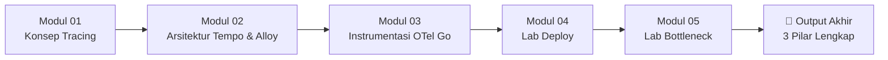
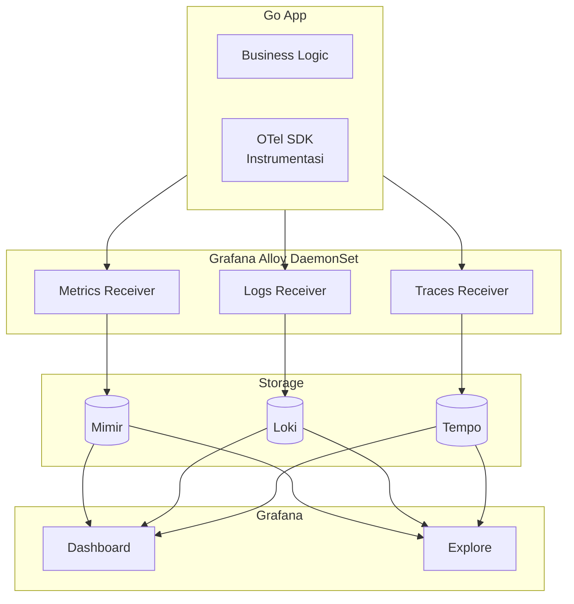

# Minggu 7 — Distributed Tracing (Grafana Tempo & OpenTelemetry)

Selamat datang di materi pembelajaran **Minggu 7: Distributed Tracing**.

Di minggu ini, kita membangun pilar observability **ketiga dan terakhir**: **Tracing**. Anda akan mempelajari konsep Span, Trace, dan Context Propagation, menginstal **Grafana Tempo** sebagai backend trace storage, mengonfigurasi **Grafana Alloy** sebagai OpenTelemetry Collector, serta menginstrumentasi **Go App** dengan **OpenTelemetry SDK**.

---

## 🗺️ Struktur & Daftar Modul Pembelajaran

Materi Minggu 7 dibagi menjadi 5 modul dokumen dan berkas pendukung:

| No | Dokumen Modul | Deskripsi Topik | Jenis |
| :---: | :--- | :--- | :---: |
| 01 | [Modul 01: Konsep Distributed Tracing](./minggu-07/01-konsep-distributed-tracing.md) | Span, Trace, Context Propagation, OpenTelemetry, W3C Trace Context | 📖 Teori |
| 02 | [Modul 02: Arsitektur Tempo, Alloy & OTel](./minggu-07/02-arsitektur-tempo-alloy-dan-otel.md) | Tempo (Distributor/Ingester/Querier), Alloy sebagai Collector, TraceQL | 📖 Teori |
| 03 | [Modul 03: Instrumentasi OTel pada Go App](./minggu-07/03-instrumentasi-opentelemetry-pada-go-app.md) | OTel SDK Go, tracer, span, exporter OTLP, propagator W3C | 📖 Teori |
| 04 | [Modul 04: Lab Deploy Tempo & Alloy](./minggu-07/04-lab-deploy-tempo-alloy-dan-otel.md) | Hands-on: deploy Tempo + Alloy + Datasource + trace pertama | 🧪 Lab |
| 05 | [Modul 05: Lab Incident Bottleneck](./minggu-07/05-lab-incident-bottleneck-trace-investigation.md) | Simulasi delay 5 detik & identifikasi via waterfall view | 🧪 Lab |
| 📂 | [Go App Source `app/`](./minggu-07/app/) | `main.go` + `Dockerfile` + `go.mod` (HTTP → DB → Redis + OTel) | 💻 Code |
| 📂 | [Tracing Manifests `manifests/`](./minggu-07/manifests/) | `01-tempo.yaml`, `02-alloy-otel.yaml`, `03-grafana-tempo-datasource.yaml` | 💻 Code |
| 📂 | [Grafana Dashboards `dashboards/`](./minggu-07/dashboards/) | Berkas JSON `tracing-dashboard.json` (5 panel observability) | 💻 Code |

---

## 🎯 Target & Checklist Capaian Pembelajaran

- [ ] Memahami konsep **Span**, **Trace**, dan **Context Propagation**
- [ ] Mengenal standar industri **OpenTelemetry (OTel)** dan **W3C Trace Context**
- [ ] Memahami arsitektur **Grafana Tempo** (Distributor, Ingester, Querier)
- [ ] Memahami bahasa query **TraceQL**
- [ ] Mengetahui cara kerja **Grafana Alloy** sebagai OpenTelemetry Collector
- [ ] Terbiasa menulis kode instrumentasi OTel di Go (TracerProvider, Resource, Exporter, Propagator)
- [ ] Mampu mengkonfigurasi **sampler** yang tepat untuk dev vs production
- [ ] Mampu membaca **waterfall view** dan mengidentifikasi bottleneck
- [ ] Menghubungkan data **trace ↔ logs ↔ metrics** via `trace_id`
- [ ] Memahami konsep **sampling** dan trade-off-nya (AlwaysOn, TraceIDRatio, Tail-based)

---

## 🧩 Peta Hubungan dengan Materi Sebelumnya

| Materi Minggu | Kontribusi ke Minggu 7 |
| :--- | :--- |
| **Minggu 2** | Go App yang sama dipakai sebagai *application under test* dengan tambahan OTel SDK |
| **Minggu 5** | Grafana & Mimir sudah terpasang, menjadi UI untuk query TraceQL |
| **Minggu 6** | Loki menyimpan log dengan field `trace_id` — bisa di-klik langsung buka trace di Tempo |

---

## 📚 Kosakata Penting Minggu Ini

| Istilah | Definisi Singkat |
| :--- | :--- |
| **Span** | Unit kerja terkecil — satu operasi dalam satu service |
| **Trace** | Kumpulan span yang terhubung via `trace_id` untuk satu request |
| **Trace ID** | Identifier unik sebuah trace (32 hex chars) |
| **Span ID** | Identifier unik sebuah span (16 hex chars) |
| **Parent Span** | Span yang memanggil span ini |
| **Context Propagation** | Mekanisme teruskan trace_id antar-service via HTTP header |
| **OTLP** | OpenTelemetry Protocol — transport standar untuk kirim span |
| **W3C Trace Context** | Standar header HTTP: `traceparent` & `tracestate` |
| **OpenTelemetry (OTel)** | Standar terbuka CNCF untuk instrumentasi traces/metrics/logs |
| **TracerProvider** | Top-level container OTel SDK |
| **Sampler** | Keputusan trace mana yang disimpan (AlwaysOn, Probabilistic, dll) |
| **TraceQL** | Bahasa query Tempo (mirip PromQL & LogQL) |
| **Waterfall View** | Visualisasi span tree dalam Tempo yang menunjukkan timeline |

---

## 🛠️ Prasyarat Sebelum Memulai

Pastikan minggu-minggu sebelumnya sudah terpasang:

1. **Cluster k3s aktif** (Minggu 1)
   ```bash
   kubectl get nodes
   ```
2. **Namespace `mini-prod`** ada
3. **Go App** sudah ter-deploy dan punya endpoint HTTP (Minggu 2)
4. **Grafana** sudah jalan (Minggu 5) di port 3000
5. **Mimir & Alloy metrics** aktif (Minggu 5)
6. **Loki & Alloy logs** aktif (Minggu 6) — untuk korelasi trace ↔ log

---

## 🚀 Urutan Belajar yang Disarankan



1. Baca **Modul 01** untuk paham konsep Span/Trace/Context.
2. Pelajari **Modul 02** untuk arsitektur Tempo + Alloy + TraceQL.
3. Pelajari **Modul 03** untuk instrumentasi OTel SDK di Go.
4. Kerjakan **Modul 04** untuk deploy stack tracing.
5. Akhiri dengan **Modul 05** untuk simulasi bottleneck & RCA.

---

## 📦 Output Mingguan

Setelah menyelesaikan Minggu 7, Anda akan memiliki:

- ✅ **Grafana Tempo** aktif sebagai backend trace storage
- ✅ **Grafana Alloy DaemonSet** menerima OTLP dari aplikasi (gRPC :4317, HTTP :4318)
- ✅ **Datasource Tempo** di Grafana
- ✅ **Go App** ter-instrumentasi OTel dengan span tree lengkap (HTTP → DB → Redis)
- ✅ **Dashboard JSON** dengan 5 panel observability tracing
- ✅ **Trace pertama** terlihat di Grafana Explore
- ✅ **Service Map** menampilkan dependency graph
- ✅ Kemampuan **investigasi bottleneck via waterfall view**
- ✅ Korelasi **trace ↔ logs ↔ metrics** lengkap (3 pilar observability)

---

## 🔗 Tampilan 3 Pilar Observability Setelah Minggu 7



> 🎉 **Sekarang Anda punya single pane of glass** — semua data observability saling terhubung via `trace_id`.

---

## 🔗 Lanjut ke Minggu Berikutnya

Lanjut ke **Minggu 8 — Dashboard & Alert** untuk:
- Membangun dashboard yang **berguna** (bukan sekadar banyak grafik) dengan **Golden Signals** & **RED/USE Method**
- Menulis alert yang **actionable** dengan **Alert Fatigue** prevention
- Alert untuk: Pod Restart, CPU, Memory, Disk
