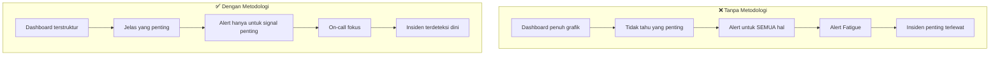
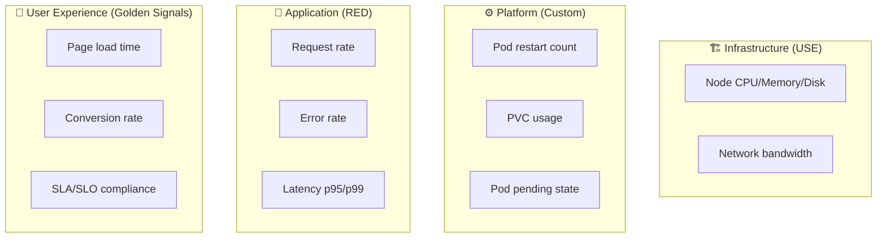
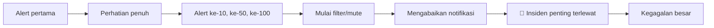

# Modul 01: Metodologi Observability — Golden Signals, RED, USE & Alert Fatigue

> **Target Pembelajaran:** Memahami metodologi standar untuk merancang **dashboard yang berguna** dan **alert yang actionable** — bukan sekadar "banyak grafik" atau "alert untuk semuanya". Anda akan diperkenalkan pada **Golden Signals** (Google SRE), **RED Method** (Tom Wilkie/Weaveworks), dan **USE Method** (Brendan Gregg) beserta perbedaannya.

---

## 1. Mengapa Metodologi Itu Penting?

Tanpa metodologi yang jelas, dashboard dan alert Anda akan jatuh ke dalam perangkap umum:



> 🔑 **"You can't improve what you can't measure, but you can't scale what you can't prioritize."**

---

## 2. Golden Signals (Google SRE)

**Golden Signals** diperkenalkan oleh Google's SRE team dalam buku *[Site Reliability Engineering](https://sre.google/sre-book/monitoring-distributed-systems/)*. Ada **4 sinyal utama** yang harus selalu dimonitor untuk **setiap layanan user-facing**:

| Signal | Definisi | Contoh Query PromQL |
| :--- | :--- | :--- |
| **Latency** | Berapa lama waktu untuk melayani request | `histogram_quantile(0.95, sum(rate(http_request_duration_seconds_bucket[5m])) by (le, path))` |
| **Traffic** | Berapa banyak request yang diterima sistem | `sum(rate(http_requests_total[5m])) by (path)` |
| **Errors** | Berapa banyak request yang gagal | `sum(rate(http_requests_total{status=~"5.."}[5m])) by (path)` |
| **Saturation** | Seberapa "penuh" layanan (mendekati limit) | `1 - (node_memory_MemAvailable_bytes / node_memory_MemTotal_bytes)` |

### Penjelasan Tiap Signal

**1. Latency** — bukan sekadar rata-rata, tapi **distribusi**:
- `p50` (median) — pengalaman user tipikal
- `p95` — 95% user merasa ini cepat/lambat
- `p99` — worst-case tapi bukan outlier
- `p99.9` — tail latency, sering luput dari rata-rata

> ⚠️ **Rata-rata (avg) berbahaya!** Rata-rata bisa terlihat "normal" padahal ada 1% request yang timeout 30 detik.

**2. Traffic** — tergantung jenis sistem:
- HTTP server: requests/detik
- DB: queries/detik
- Queue: messages/detik
- Cache: hits/detik

**3. Errors** — pisahkan 3 jenis:
- **Explicit errors** (HTTP 5xx, exception)
- **Implicit errors** (HTTP 200 tapi response body salah)
- **Semantic errors** (sukses tapi lambat = effectively failure untuk user)

**4. Saturation** — "seberapa penuh" sistem Anda:
- CPU usage di atas 80%
- Memory usage di atas 90%
- Disk penuh
- Connection pool exhausted

---

## 3. RED Method (Weaveworks / Tom Wilkie)

**RED Method** adalah subset dari Golden Signals yang fokus pada **layanan dari sudut pandang user/request**:

| Metrik | Definisi | Tipe |
| :--- | :--- | :--- |
| **Rate** | Jumlah request per detik | Counter |
| **Errors** | Jumlah request yang error per detik | Counter |
| **Duration** | Latency per request (distribution) | Histogram |

### Kapan Pakai RED?

✅ Cocok untuk: **services** (HTTP API, gRPC service, microservices)
❌ Tidak cocok untuk: **infrastructure** (CPU, memory, disk)

### RED vs Golden Signals

| | RED Method | Golden Signals |
| :--- | :--- | :--- |
| **Cakupan** | Services only | Everything user-facing |
| **Komponen** | 3 (R, E, D) | 4 (Latency, Traffic, Errors, Saturation) |
| **Saturation** | ❌ Tidak ada | ✅ Ada |
| **Paling cocok untuk** | Microservices | Sistem lengkap |

---

## 4. USE Method (Brendan Gregg)

**USE Method** fokus pada **resource** (CPU, memory, disk, network) untuk **setiap komponen** sistem:

| Metrik | Definisi |
| :--- | :--- |
| **Utilization** | Persentase waktu resource sibuk (mis. CPU usage %) |
| **Saturation** | Seberapa banyak antrian work tambahan (mis. run queue length) |
| **Errors** | Jumlah error events dari resource |

### Kapan Pakai USE?

✅ Cocok untuk: **host/infrastructure** (CPU, memory, disk, network interface)
❌ Tidak cocok untuk: **business metrics** atau **user experience**

### USE vs RED

```
USE Method = "Apakah server saya sehat secara hardware?"
RED Method = "Apakah user saya dilayani dengan benar?"
```

Gunakan **keduanya** — USE untuk host, RED untuk service. Itu sebabnya dashboard production biasanya punya **keduanya** dalam satu pane.

---

## 5. Perbandingan Ketiga Metodologi

| Aspek | Golden Signals | RED Method | USE Method |
| :--- | :--- | :--- | :--- |
| **Sumber** | Google SRE Book | Weaveworks | Brendan Gregg |
| **Target** | Sistem lengkap | Services | Infrastructure |
| **Jumlah metrik** | 4 | 3 | 3 |
| **Contoh** | Latency, Traffic, Errors, Saturation | Rate, Errors, Duration | Utilization, Saturation, Errors |
| **Cocok untuk** | User-facing systems | Microservices | Host/VM monitoring |

### Peta Penggunaan dalam Cluster Kubernetes



---

## 6. Alert Fatigue: Musuh Terbesar On-Call

**Alert fatigue** adalah kondisi di mana engineer on-call menerima **terlalu banyak alert tidak penting** sehingga mereka mulai **mengabaikan SEMUA alert** — termasuk yang krusial.

### Tahapan Alert Fatigue



### Penyebab Umum Alert Fatigue

| Penyebab | Contoh |
| :--- | :--- |
| **Alert untuk setiap metrik** | "CPU > 10%" trigger alert → ratusan alert/hari |
| **Threshold tidak realistis** | Alert saat 100% padahal normal sudah 90% |
| **Noisy alerts** | Alert yang berkedip-kedip (firing & resolving bolak-balik) |
| **No actionable runbook** | Alert tanpa info cara handle → cuma ganggu |
| **Alert untuk kondisi normal** | Restart harian = alert (padahal deployment normal) |

### Cara Mencegah Alert Fatigue

1. **Alert hanya untuk hal yang butuh aksi manusia**
   - ❌ "CPU 80%" — CPU bisa tinggi tanpa masalah
   - ✅ "CPU > 95% selama 5 menit DAN latency naik" — kombinasi sinyal
2. **Tetap terkait dengan SLO** (Service Level Objective)
3. **Berikan runbook link di setiap alert**
4. **Pisahkan severity** (critical vs warning)
5. **Routing berbeda** per severity (critical → PagerDuty, warning → Slack)

---

## 7. Actionable Alert Checklist

Sebelum membuat alert, tanyakan 5 pertanyaan ini:

| # | Pertanyaan | Jika "Tidak" → |
| :---: | :--- | :--- |
| 1 | Apakah engineer on-call akan melakukan sesuatu jika alert ini firing? | **Jangan buat alert** — pakai dashboard saja |
| 2 | Apakah ada runbook untuk handle alert ini? | Tulis runbook dulu sebelum bikin alert |
| 3 | Apakah alert ini terkait SLO customer? | Pertimbangkan apakah perlu di-alert |
| 4 | Apakah threshold realistic & tidak noisy? | Tune threshold berdasarkan data historis |
| 5 | Apakah sudah ada alert yang overlap? | Konsolidasi — jangan duplikasi |

> 🔑 **Aturan emas:** Lebih baik 10 alert penting daripada 100 alert noisy. **Tidak ada alert > noisy alert.**

---

## 8. Severity Levels & Routing

| Severity | Kapan | Routing | Contoh |
| :--- | :--- | :--- | :--- |
| **Critical (P1)** | User-facing down | PagerDuty + telepon | API return 500 untuk 100% traffic |
| **Warning (P2)** | Degradation, belum down | Slack channel | Latency p95 > 1s selama 5 menit |
| **Info (P3)** | Potensial masalah | Email / dashboard | Disk akan penuh dalam 24 jam |

---

## 9. Dari Metodologi ke Implementasi

Berikut peta penerapan metodologi ke komponen cluster Anda:

| Layer | Metodologi | Metrik Spesifik |
| :--- | :--- | :--- |
| **Cluster level** | USE | CPU/Mem/Disk per node, network |
| **Namespace level** | USE + RED | Resource quota vs usage, request rate per ns |
| **Pod level** | USE + RED | Restart count, OOMKilled, request rate, latency |
| **Go App level** | RED + Golden Signals | RPS, error rate, latency p95, saturation (goroutine count) |

---

## 10. Insight Penting

> 🔑 **Dashboard & alert bukan tentang "apa yang bisa diukur"**, tapi **"apa yang harus ditindaklanjuti"**. Metodologi membantu Anda fokus pada yang kedua.

> 🔑 **Gunakan USE untuk infrastructure, RED untuk services.** Ini bukan salah satu vs yang lain — tapi **keduanya**.

> 🔑 **Alert = Pager. Dashboard = Informasi.** Jangan pakai alert untuk hal yang informatif. Jangan pakai dashboard untuk hal yang butuh respons.

---

## 11. Rangkuman

Di modul ini Anda sudah memahami:
- ✅ **Golden Signals**: Latency, Traffic, Errors, Saturation
- ✅ **RED Method**: Rate, Errors, Duration (untuk services)
- ✅ **USE Method**: Utilization, Saturation, Errors (untuk infrastructure)
- ✅ **Alert Fatigue**: penyebab, dampak, cara mencegah
- ✅ Checklist actionable alert & severity routing
- ✅ Peta penerapan metodologi ke layer cluster Anda

Lanjut ke **Modul 02** untuk belajar prinsip desain dashboard yang **berguna** (bukan sekadar banyak grafik).