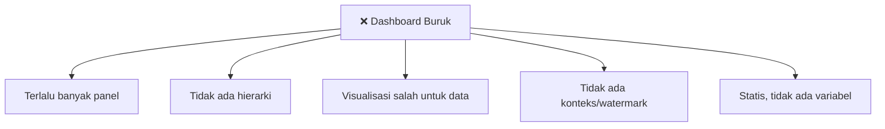
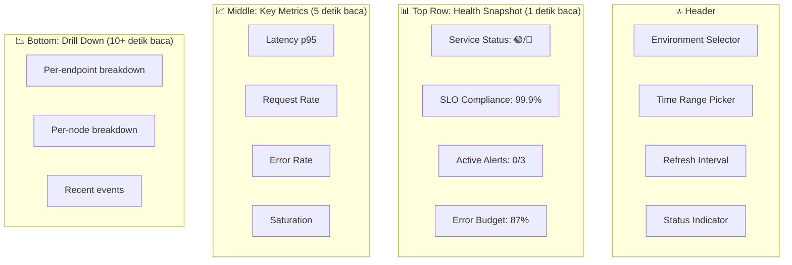

# Modul 02: Prinsip Desain Dashboard yang Bermanfaat

> **Target Pembelajaran:** Memahami prinsip-prinsip desain dashboard sehingga output Anda **membantu on-call engineer membuat keputusan cepat** — bukan sekadar pajangan grafik yang memusingkan.

---

## 1. Filosofi: Dashboard Adalah Bahasa

Dashboard adalah **cara Anda "berbicara" dengan on-call engineer**. Sama seperti komunikasi yang baik, dashboard yang baik:

- ✅ Singkat, jelas, tidak bertele-tele
- ✅ Punya hierarki (yang penting di atas)
- ✅ Konteksual (tahu apa yang harus dilakukan)
- ❌ Bukan sekadar "lihat semua metrik"

> Bayangkan dashboard sebagai **1 halaman ringkasan eksekutif** untuk sistem Anda. Anda harus bisa pahami kondisi sistem dalam **10 detik pertama melihat dashboard**.

---

## 2. Anti-Pattern: Dashboard "Sampah"

Berikut pola dashboard yang **harus dihindari**:



### Contoh Anti-Pattern

| ❌ Jangan | ✅ Sebaiknya |
| :--- | :--- |
| 30+ panel dalam 1 dashboard | 5-10 panel, dikelompokkan per topik |
| Campur cluster + app + business metrics | Pisah jadi beberapa dashboard, gunakan variabel |
| Panel CPU pakai histogram | Pakai gauge atau timeseries |
| Tidak ada threshold line | Tambahkan garis threshold (mis. 80% CPU) |
| Tidak ada link ke runbook | Tambahkan annotation "How to respond" |
| Panel tanpa judul jelas | Judul + unit + deskripsi 1 baris |

---

## 3. Anatomi Dashboard yang Baik



**Prinsip penting:**

1. **Top = "Apakah ada masalah sekarang?"** — 1 detik untuk tahu
2. **Middle = "Seberapa parah?"** — 5 detik untuk paham
3. **Bottom = "Di mana detailnya?"** — 10+ detik untuk drill down

---

## 4. Layout Patterns

### Pattern 1: Pyramid (Hierarki)

```
┌─────────────────────────────────────┐
│  Status: 🟢 OK | 99.9% SLO | 0 alerts│  ← Overview
├─────────────────────────────────────┤
│  Latency p95      │  Request Rate   │  ← Key signals
│  [timeseries]     │  [timeseries]   │
├─────────────────────────────────────┤
│  Error Rate       │  Saturation     │  ← Secondary
│  [timeseries]     │  [gauge]        │
├─────────────────────────────────────┤
│  Per-pod breakdown / drill down     │  ← Detail
└─────────────────────────────────────┘
```

### Pattern 2: Grid (Stat Cards)

Cocok untuk banyak **single-value metrics** (saat ini):

```
┌─────────┬─────────┬─────────┬─────────┐
│ Pods    │ Restarts│ CPU avg │ RPS     │
│ 12/12   │ 0       │ 23%     │ 145     │
├─────────┴─────────┼─────────┴─────────┤
│  Latency p95      │  Error Rate       │
│  87ms             │  0.02%            │
└───────────────────┴───────────────────┘
```

### Pattern 3: Tabs / Multi-page

Untuk sistem besar, **pisah dashboard per concern**:

| Dashboard | Isi | Audience |
| :--- | :--- | :--- |
| **Cluster Overview** | Health semua node & namespace | Semua |
| **Node Detail** | CPU, mem, disk, network per node | Sysadmin |
| **Namespace Detail** | Resource usage & request rate per ns | Dev |
| **Pod Detail** | Status, restart, log akses cepat | Dev |
| **Go App Detail** | RED metrics + SLO + recent deploys | Dev |

Gunakan **drilldown link** di overview dashboard → klik namespace → masuk ke namespace detail dashboard.

---

## 5. Visualisasi yang Tepat untuk Data yang Tepat

| Tipe Data | Visualisasi | Contoh |
| :--- | :--- | :--- |
| **Single value** (saat ini) | Stat / Big Number / Gauge | Total request, current SLO |
| **Trend over time** | Timeseries line | Latency p95, CPU usage |
| **Perbandingan** | Bar chart / pie chart | Top 10 endpoints by traffic |
| **Distribusi** | Heatmap | Latency distribution per endpoint |
| **Log events** | Logs panel | Recent error logs |
| **Status per item** | Table / state timeline | Pod status, restart count |

### Contoh Salah Kaprah

| ❌ Salah | ✅ Benar | Alasan |
| :--- | :--- | :--- |
| CPU pakai bar chart statis | CPU pakai timeseries | Ingin lihat tren, bukan snapshot |
| Request count pakai gauge | Request count pakai timeseries | Gauge menyesatkan untuk data fluktuatif |
| Top error messages pakai pie chart | Pakai logs panel | Pie chart sulit baca untuk teks panjang |

---

## 6. Template Dashboard untuk Cluster Kubernetes

Berikut template yang akan Anda bangun di Lab (Modul 04):

### Dashboard 1: Cluster Overview

**Tujuan:** "Apakah cluster saya sehat secara keseluruhan?"

| Panel | Tipe | Metrik |
| :--- | :--- | :--- |
| Total Nodes (ready) | Stat | `kube_node_status_condition{condition="Ready",status="true"}` |
| Total Pods | Stat | `kube_pod_info` |
| Total Namespaces | Stat | `count(kube_namespace_info)` |
| Cluster CPU Usage | Gauge | `1 - avg(rate(node_cpu_seconds_total{mode="idle"}[5m]))` |
| Cluster Memory Usage | Gauge | `1 - (sum(node_memory_MemAvailable_bytes) / sum(node_memory_MemTotal_bytes))` |
| Pods by Namespace | Bar Chart | `count by (namespace) (kube_pod_info)` |
| Recent Restarts | Table | `kube_pod_container_status_restarts_total` |
| Disk Usage per Node | Bar Chart | `1 - (node_filesystem_avail_bytes / node_filesystem_size_bytes)` |

### Dashboard 2: Node Detail

**Tujuan:** "Node mana yang bermasalah?"

| Panel | Tipe | Metrik |
| :--- | :--- | :--- |
| CPU Usage per Node | Timeseries | `rate(node_cpu_seconds_total[5m])` |
| Memory Usage per Node | Timeseries | `node_memory_MemAvailable_bytes / node_memory_MemTotal_bytes` |
| Disk I/O per Node | Timeseries | `rate(node_disk_read_bytes_total[5m])` |
| Network I/O per Node | Timeseries | `rate(node_network_receive_bytes_total[5m])` |
| Load Average | Timeseries | `node_load5` |

### Dashboard 3: Namespace Detail

**Tujuan:** "Namespace mana yang boros resource?"

| Panel | Tipe | Metrik |
| :--- | :--- | :--- |
| CPU Usage by Namespace | Bar Chart | `sum by (namespace) (rate(container_cpu_usage_seconds_total[5m]))` |
| Memory Usage by Namespace | Bar Chart | `sum by (namespace) (container_memory_working_set_bytes)` |
| Pod Count by Namespace | Stat | `count by (namespace) (kube_pod_info)` |
| Request Rate by Namespace | Timeseries | `sum by (namespace) (rate(http_requests_total[5m]))` |

### Dashboard 4: Pod Detail

**Tujuan:** "Pod mana yang tidak sehat?"

| Panel | Tipe | Metrik |
| :--- | :--- | :--- |
| Pod Status | State Timeline | `kube_pod_status_phase` |
| Restart Count per Container | Table | `kube_pod_container_status_restarts_total` |
| CPU Usage per Pod | Timeseries | `rate(container_cpu_usage_seconds_total[5m])` |
| Memory Usage per Pod | Timeseries | `container_memory_working_set_bytes` |
| OOMKilled Events | Logs | event reason OOMKilled |

### Dashboard 5: Go App (RED Method)

**Tujuan:** "Apakah service saya sehat dari sudut user?"

| Panel | Tipe | Metrik |
| :--- | :--- | :--- |
| Request Rate | Stat + Timeseries | `sum(rate(http_requests_total{service="go-app"}[5m]))` |
| Error Rate | Stat + Timeseries | `sum(rate(http_requests_total{service="go-app",status=~"5.."}[5m])) / sum(rate(http_requests_total{service="go-app"}[5m]))` |
| Latency p95 | Stat + Timeseries | `histogram_quantile(0.95, sum by (le) (rate(http_request_duration_seconds_bucket{service="go-app"}[5m])))` |
| Saturation (Goroutines) | Timeseries | `go_goroutines` |

---

## 7. Variabel Dashboard

Pakai **dashboard variables** agar 1 dashboard bisa dipakai untuk multi-target:

```yaml
Variables:
  - $namespace: dropdown berisi semua namespace
  - $pod: dropdown berisi pod di namespace yang dipilih
  - $instance: dropdown berisi node atau Pod IP
```

**Contoh** — query untuk filter:
```promql
sum by (pod) (rate(container_cpu_usage_seconds_total{namespace="$namespace"}[5m]))
```

Saat user ganti `$namespace` dari dropdown → panel otomatis filter ulang. Hemat tempat & fleksibel.

---

## 8. Tanda-Tanda Dashboard Berkualitas

**Scorecard ini bisa Anda gunakan untuk audit dashboard Anda:**

| Aspek | ✅ Baik | ❌ Buruk |
| :--- | :--- | :--- |
| **Jumlah panel** | 5-12 per dashboard | > 20 panel tanpa grouping |
| **Hierarki** | Status → Tren → Detail semua jelas | Semua panel sejajar tanpa konteks |
| **Judul panel** | Deskriptif + unit | Generic ("Graph 1", "Chart A") |
| **Threshold line** | Ada untuk metrik kritikal | Tidak ada sama sekali |
| **Variabel** | Pakai filter namespace/pod | Statis |
| **Dokumentasi** | Ada deskripsi panel / runbook link | Tidak ada |
| **Warna** | Konsisten (hijau = ok, merah = danger) | Random / rainbow |

---

## 9. Insight Penting

> 🔑 **Dashboard adalah bahasa, bukan daftar.** Anda tidak sedang "memamerkan" semua metrik — Anda sedang **berkomunikasi** dengan engineer lain.

> 🔑 **Stat > Gauge > Chart dalam hal readability.** Jika bisa pakai "big number" stat, jangan pakai chart.

> 🔑 **Variabel = reusability.** 1 dashboard dengan filter variabel lebih berguna daripada 10 dashboard statis.

> 🔑 **Dashboard bukan alert.** Yang informatif → dashboard. Yang butuh aksi → alert.

---

## 10. Rangkuman

Di modul ini Anda sudah memahami:
- ✅ Filosofi dashboard sebagai **bahasa komunikasi** dengan on-call
- ✅ Anatomi dashboard: **Status → Tren → Detail** (hierarki piramida)
- ✅ Anti-pattern yang harus dihindari
- ✅ Layout patterns: pyramid, grid, multi-page
- ✅ Template 5 dashboard: Cluster, Node, Namespace, Pod, Go App
- ✅ Penggunaan **variabel** untuk dashboard yang reusable

Lanjut ke **Modul 03** untuk belajar **alerting best practices** dan cara mencegah **alert fatigue**.