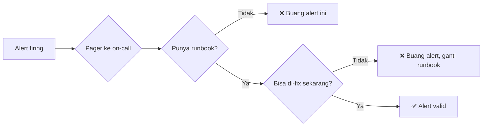
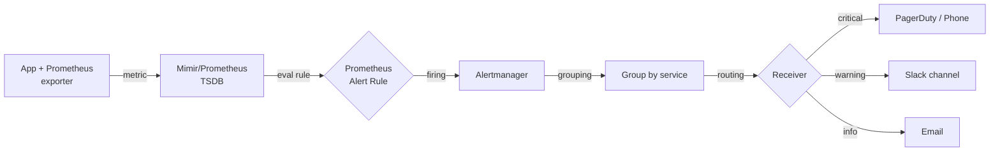
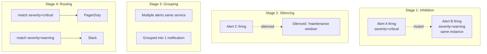

# Modul 03: Alerting Best Practices — Membangun Alert yang Actionable

> **Target Pembelajaran:** Memahami kapan harus alert, bagaimana menulis rule Prometheus yang benar, cara mengkonfigurasi **Alertmanager** untuk routing yang tepat, dan best practices mencegah **alert fatigue**.

---

## 1. Filosofi: Alert = Pager

Bayangkan setiap alert yang Anda buat akan **membangunkan engineer on-call di tengah malam**. Maka:



**3 pertanyaan saringan sebelum bikin alert:**

| # | Pertanyaan | Jika "Tidak" |
| :---: | :--- | :--- |
| 1 | Apakah ini **butuh respons manusia**? | Pakai dashboard, jangan alert |
| 2 | Apakah ada **runbook** untuk handle? | Tulis runbook dulu |
| 3 | Apakah alert ini **rare** (tidak firing tiap jam)? | Tune threshold-nya |

> 🔑 **Prinsip pager-friendly alert**: setiap alert yang firing harus dapat ditangani dalam 15 menit oleh 1 orang engineer.

---

## 2. Anatomi Alert Pipeline



**Komponen:**

1. **Prometheus Rule** — evaluasi query setiap `evaluation_interval` (default 15s)
2. **Alert State** — `inactive` → `pending` → `firing` (transisi `pending → firing` butuh `for` duration)
3. **Alertmanager** — deduplication, grouping, routing, silencing
4. **Receiver** — endpoint notifikasi (Slack, PagerDuty, email, webhook)

---

## 3. Anatomi Prometheus Alert Rule

```yaml
groups:
  - name: example.rules
    rules:
      - alert: HighErrorRate
        expr: |
          sum(rate(http_requests_total{status=~"5.."}[5m]))
          /
          sum(rate(http_requests_total[5m]))
          > 0.05
        for: 5m                              # ← Wajib pakai `for`
        labels:
          severity: critical                  # ← Untuk routing
          team: backend
          service: go-app
        annotations:
          summary: "High error rate on {{ $labels.service }}"
          description: "Error rate is {{ $value | humanizePercentage }} for the last 5 minutes"
          runbook_url: "https://wiki.example.com/runbooks/high-error-rate"
```

### Field-field Penting

| Field | Wajib | Fungsi |
| :--- | :---: | :--- |
| `alert` | ✅ | Nama alert (harus unik) |
| `expr` | ✅ | Query PromQL yang mendefinisikan kondisi alert |
| `for` | ✅ | Berapa lama kondisi harus bertahan sebelum firing (anti-flapping) |
| `labels` | ✅ | Metadata untuk grouping & routing |
| `annotations` | ✅ | Teks yang muncul di notifikasi |

### `for` Duration — Anti Flapping

```yaml
# ❌ BURUK: tanpa `for` → bisa langsung firing & resolving bolak-balik
expr: node_cpu_usage > 80
# (Alert berkedip setiap kali CPU turun naik)

# ✅ BAIK: dengan `for: 5m` → harus bertahan 5 menit
expr: node_cpu_usage > 80
for: 5m
```

---

## 4. Alert yang Akan Anda Bangun di Lab

Berikut 6 alert sesuai syllabus minggu ini:

### 4.1 Pod Restart Alert

```yaml
- alert: PodRestartingFrequently
  expr: |
    increase(kube_pod_container_status_restarts_total[1h]) > 5
  for: 10m
  labels:
    severity: warning
  annotations:
    summary: "Pod {{ $labels.pod }} restart >5x dalam 1 jam"
    runbook_url: "https://wiki/runbooks/pod-restart"
```

### 4.2 CPU Usage Alert

```yaml
- alert: HighCPUUsage
  expr: |
    100 - (avg by(instance) (rate(node_cpu_seconds_total{mode="idle"}[5m])) * 100) > 85
  for: 10m
  labels:
    severity: warning
  annotations:
    summary: "CPU {{ $labels.instance }} > 85%"
```

### 4.3 Memory Usage Alert

```yaml
- alert: HighMemoryUsage
  expr: |
    (1 - (node_memory_MemAvailable_bytes / node_memory_MemTotal_bytes)) * 100 > 90
  for: 10m
  labels:
    severity: warning
  annotations:
    summary: "Memory {{ $labels.instance }} > 90%"
```

### 4.4 Disk Usage Alert

```yaml
- alert: DiskSpaceLow
  expr: |
    (1 - (node_filesystem_avail_bytes{fstype!="tmpfs"} / node_filesystem_size_bytes)) * 100 > 85
  for: 15m
  labels:
    severity: critical
  annotations:
    summary: "Disk {{ $labels.instance }}:{{ $labels.mountpoint }} > 85%"
```

### 4.5 High Latency Alert

```yaml
- alert: HighRequestLatency
  expr: |
    histogram_quantile(0.95,
      sum by (le, service) (rate(http_request_duration_seconds_bucket{service="go-app"}[5m]))
    ) > 1
  for: 5m
  labels:
    severity: critical
  annotations:
    summary: "Latency p95 service {{ $labels.service }} > 1s"
```

### 4.6 Error Rate Alert

```yaml
- alert: HighErrorRate
  expr: |
    sum by (service) (rate(http_requests_total{service="go-app",status=~"5.."}[5m]))
    /
    sum by (service) (rate(http_requests_total{service="go-app"}[5m]))
    > 0.05
  for: 5m
  labels:
    severity: critical
  annotations:
    summary: "Error rate service {{ $labels.service }} > 5%"
```

---

## 5. Alertmanager Architecture



**Tahap-tahap Alertmanager:**

1. **Inhibition** — jika alert A firing, suppress alert B yang terkait
   - Contoh: `NodeDown` inhibit semua alert dari pod di node itu
2. **Silencing** — temporary mute alert tertentu (maintenance window, dsb)
3. **Grouping** — gabung alert serupa jadi 1 notifikasi
4. **Routing** — kirim ke receiver sesuai label

---

## 6. Konfigurasi Alertmanager

File `alertmanager.yaml`:

```yaml
global:
  resolve_timeout: 5m

route:
  receiver: 'default-receiver'
  group_by: ['alertname', 'service']
  group_wait: 30s       # tunggu 30s sebelum kirim (gabungkan alert baru)
  group_interval: 5m    # kalau ada alert tambahan, tunggu 5m
  repeat_interval: 4h   # kirim ulang tiap 4 jam jika belum resolve
  routes:
    - match:
        severity: critical
      receiver: 'pagerduty'
      continue: false    # stop di sini, jangan ikut parent
    - match:
        severity: warning
      receiver: 'slack-warnings'

receivers:
  - name: 'default-receiver'
    slack_configs:
      - api_url: 'https://hooks.slack.com/services/XXX/YYY/ZZZ'
        channel: '#alerts-default'
        send_resolved: true

  - name: 'pagerduty'
    pagerduty_configs:
      - service_key: '<integration-key>'
        description: '{{ .GroupLabels.alertname }} - {{ .CommonAnnotations.summary }}'
        details:
          severity: '{{ .GroupLabels.severity }}'

  - name: 'slack-warnings'
    slack_configs:
      - api_url: 'https://hooks.slack.com/services/AAA/BBB/CCC'
        channel: '#alerts-warning'

inhibit_rules:
  - source_match:
      severity: 'critical'
    target_match:
      severity: 'warning'
    equal: ['alertname']
```

**Strategi routing untuk Week 8:**

```
critical →  PagerDuty (page on-call)
warning  →  Slack #alerts (informational)
info     →  dashboard saja (tidak kirim notifikasi)
```

---

## 7. Preventing Alert Fatigue: 7 Aturan Emas

### Aturan 1: Setiap Alert Harus Actionable

```yaml
# ❌ BURUK: "ada CPU tinggi" — apa yang harus dilakukan?
- alert: HighCPU
  expr: node_cpu_usage > 50

# ✅ BAIK: "CPU > 85% selama 10 menit DAN latency naik"
- alert: CPUWithImpact
  expr: |
    (node_cpu_usage > 85) and
    (sum(rate(http_requests_total{status="500"}[5m])) > 1)
```

### Aturan 2: Pakai `for` Duration Realistis

```yaml
# ❌ 30 detik (terlalu cepat, flapping)
for: 30s

# ✅ 5-15 menit (anti flapping)
for: 10m
```

### Aturan 3: Threshold Berdasarkan Data Historis

Sebelum set threshold, **lihat data historis** minimal 7 hari. Pakai nilai p95 + margin kecil.

### Aturan 4: Alert Hanya untuk SLO-relevant

| SLO | Alert? |
| :--- | :--- |
| Latency user-facing > 1s | ✅ Alert (critical) |
| Latency internal job > 5s | ⚠️ Dashboard saja |
| CPU 70% | ❌ Tidak alert |
| Disk akan penuh dalam 1 jam | ✅ Alert (critical) |

### Aturan 5: Jangan Duplikasi Alert

```yaml
# ❌ 3 alert untuk hal yang sama:
- alert: PodRestart       # restart 1x
- alert: PodRestartHigh   # restart 5x
- alert: PodRestartVeryHigh # restart 10x

# ✅ 1 alert dengan threshold jelas:
- alert: PodRestartHigh
  expr: increase(kube_pod_container_status_restarts_total[1h]) > 5
```

### Aturan 6: Setiap Alert Harus Punya Runbook URL

```yaml
annotations:
  runbook_url: "https://wiki.example.com/runbooks/pod-restart"
```

Runbook berisi:
- ✅ Penjelasan alert ini tentang apa
- ✅ Cara verifikasi (cek dashboard X, log Y)
- ✅ Langkah mitigasi
- ✅ Kapan harus escalate

### Aturan 7: Review Alert Setiap Quarter

Tanyakan ke on-call:
- Alert mana yang **tidak pernah firing**? → Hapus
- Alert mana yang **firing tapi tidak actionable**? → Tune atau hapus
- Alert mana yang **firing terus**? → Investigasi root cause (mungkin ada masalah nyata)

---

## 8. SLO-Based Alerting (Bonus — Best Practice Industri)

Pendekatan modern: **Alert berdasarkan SLO burn rate**, bukan threshold statis.

**Konsep SLO:**
- SLO = target yang dijanjikan ke user (mis. availability 99.9%)
- Error Budget = "berapa banyak kita boleh gagal" (untuk 30 hari: 0.1% × 30 hari = 43 menit downtime)
- **Burn Rate** = seberapa cepat error budget terpakai

**Contoh sederhana:**

```
Alert jika burn rate > 14.4x selama 1 jam
(artinya: dalam 1 jam, kita sudah "bakar" error budget 1 hari)
```

Ini lebih akurat daripada threshold statis karena memperhitungkan konteks traffic.

> Untuk setup lokal, kita cukup pakai threshold-based alert. SLO-based lebih cocok untuk sistem production dengan traffic nyata.

---

## 9. Checklist Alert Baru

Sebelum deploy alert baru, jalankan checklist ini:

```yaml
✅ Apakah alert ini butuh aksi manusia dalam 15 menit?
   └─ Tidak? → JANGAN BUAT ALERT

✅ Apakah ada runbook untuk alert ini?
   └─ Tidak? → TULIS RUNBOOK DULU

✅ Apakah threshold berdasarkan data historis?
   └─ Tidak? → LIHAT DATA TERLEBIH DAHULU

✅ Apakah pakai `for` duration yang realistis?
   └─ Tidak? → TAMBAHKAN `for`

✅ Apakah ada label severity & service?
   └─ Tidak? → TAMBAHKAN

✅ Apakah ada runbook_url di annotations?
   └─ Tidak? → TAMBAHKAN

✅ Apakah alert ini overlap dengan alert lain?
   └─ Ya? → KONSOLIDASI
```

---

## 10. Insight Penting

> 🔑 **Alert firing = pager.** Jika tidak akan di-page on-call, jangan buat alert.

> 🔑 **Tuning threshold = iterasi.** Anda tidak akan bisa set threshold sempurna di awal. Audit mingguan/bulanan untuk tune berdasarkan data.

> 🔑 **Silence itu sementara.** Pakai silence saat maintenance, bukan untuk "bunyi yang mengganggu".

> 🔑 **Konsistensi > kesempurnaan.** Lebih baik punya 6 alert yang konsisten & well-documented, daripada 30 alert setengah jadi.

---

## 11. Rangkuman

Di modul ini Anda sudah memahami:
- ✅ Filosofi **alert = pager**, bukan pajangan
- ✅ Anatomi **Prometheus alert rule** (`expr`, `for`, `labels`, `annotations`)
- ✅ 6 alert sesuai syllabus: Restart, CPU, Memory, Disk, Latency, Error Rate
- ✅ Arsitektur **Alertmanager**: inhibition, silencing, grouping, routing
- ✅ **7 aturan emas** mencegah alert fatigue
- ✅ Checklist wajib sebelum deploy alert baru
- ✅ Konsep **SLO-based alerting** (best practice industri)

Lanjut ke **Modul 04** untuk hands-on: bangun **5 dashboard** + **6 alert rules** + deploy **Alertmanager**.