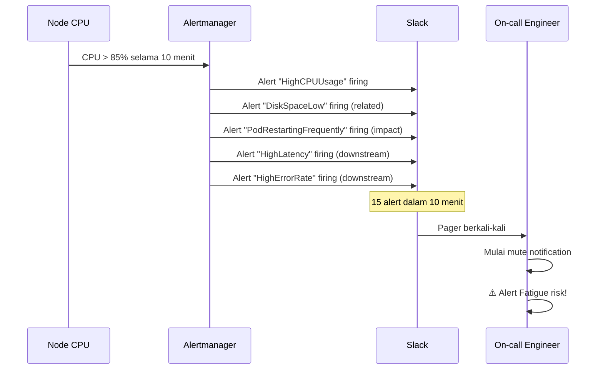

# Modul 05: Lab Incident — Alert Storm & Threshold Tuning

> **Target Pembelajaran:** Mensimulasikan skenario di mana **alert firing bertubi-tubi** (alert storm), lalu belajar cara **mendiagnosa noise** dan **menyetel threshold** agar alert kembali relevan.

---

## 1. Skenario Insiden: "Slack #alerts Penuh!"



**Konteks Situasi:**
> Pukul 14:00, salah satu node tiba-tiba CPU-nya melonjak karena ada Pod yang crash-loop.
> Akibatnya: 5 alert berbeda firing hampir bersamaan (CPU, Memory, Restart, Latency, Error Rate).
> On-call engineer bingung — *"mana yang harus di-fix duluan?"*

---

## 2. Prasyarat Lab

```bash
# 1. Alertmanager + PrometheusRule + Go App sudah jalan
kubectl get pods -n mini-prod -l "app in (alertmanager,go-app)"
kubectl get prometheusrules -n mini-prod

# 2. Dashboard sudah di-import
# (lihat Modul 04)

# 3. Port-forward Alertmanager
kubectl port-forward svc/alertmanager 9093:9093 -n mini-prod &
```

---

## 3. Langkah 1: Trigger Alert Storm

Kita akan membuat CPU tinggi secara simultan di node yang juga menjalankan Go App yang error.

### 3.1 Deploy Pod "Pengganggu"

```bash
cat <<EOF | kubectl apply -f -
apiVersion: apps/v1
kind: Deployment
metadata:
  name: stress-pod
  namespace: mini-prod
spec:
  replicas: 1
  selector:
    matchLabels:
      app: stress-pod
  template:
    metadata:
      labels:
        app: stress-pod
    spec:
      containers:
      - name: stress
        image: alpine:3.18
        command:
        - sh
        - -c
        - |
          apk add --no-cache stress-ng
          # Burn CPU 4 cores
          stress-ng --cpu 4 --timeout 1h
        resources:
          requests:
            cpu: 100m
            memory: 64Mi
EOF
```

### 3.2 Trigger Error di Go App

```bash
kubectl set env deployment/go-app -n mini-prod SIMULATE_DB_DELAY_MS=8000
```

### 3.3 Tunggu 15 Menit

Karena kita set `for: 5m` atau `for: 10m` di tiap rule, tunggu sampai alert firing:

```bash
# Cek alert yang firing
kubectl exec -n mini-prod deploy/alertmanager -- amtool alert query
```

Atau buka Alertmanager UI: `http://localhost:9093/alerts`.

**Akan muncul banyak alert:**
- `HighCPUUsage` (critical)
- `HighRequestLatency` (critical)
- `HighErrorRate` (critical)
- `PodRestartingFrequently` (warning) — jika Go App restart
- Mungkin juga `HighMemoryUsage`

---

## 4. Langkah 2: Identifikasi Alert Mana yang Noisy

### 4.1 Buka Alertmanager UI

1. Buka `http://localhost:9093`
2. Klik tab **Alerts**
3. Lihat daftar alert firing

### 4.2 Tanyakan 5 Pertanyaan

| Alert | Apakah actionable? | Apakah root cause? |
| :--- | :--- | :--- |
| `HighCPUUsage` | Ya, tapi ini efek | ❌ Bukan root cause |
| `PodRestartingFrequently` | Ya | ⚠️ Mungkin symptom |
| `HighRequestLatency` | Ya | ⚠️ Symptom dari CPU tinggi |
| `HighErrorRate` | Ya | ⚠️ Symptom |

**Insight:** 1 root cause (CPU spike) → 4 alert. **On-call harus tahu mana yang harus diinvestigasi duluan.**

### 4.3 Tentukan Root Cause dengan Correlated Metrics

Buka dashboard `01-cluster-overview.json`:

```promql
# Lihat CPU usage
100 - (avg(rate(node_cpu_seconds_total{mode="idle"}[5m])) * 100)
```

Lihat lonjakan CPU. Apakah related dengan Pod tertentu?

```promql
# CPU per pod
sum by(pod) (rate(container_cpu_usage_seconds_total[5m]))
```

**Akar masalah:** Pod `stress-pod` membakar CPU → node sibuk → Go App lambat → latency naik → ada request timeout → error rate naik → restart (jika ada CrashLoop).

---

## 5. Langkah 3: Mitigasi Darurat

### 5.1 Hentikan Stress Pod

```bash
kubectl delete deployment stress-pod -n mini-prod
```

### 5.2 Reset Go App ke kondisi normal

```bash
kubectl set env deployment/go-app -n mini-prod SIMULATE_DB_DELAY_MS-
```

### 5.3 Tunggu Alert Resolve

Karena `resolve_timeout: 5m` di Alertmanager, alert akan resolve dalam ~5 menit setelah kondisi kembali normal.

Cek di UI Alertmanager — alert akan bertransisi: `firing` → `resolved`.

---

## 6. Langkah 4: Post-Mortem & Tuning

Setelah insiden selesai, **perbaiki rule** agar alert storm tidak terjadi lagi.

### 6.1 Identifikasi Alert yang Overlap

Tanyakan:
- Apakah `HighErrorRate` selalu firing saat `HighCPUUsage`?
- Apakah `HighRequestLatency` redundan dengan `PodRestartingFrequently`?

### 6.2 Tuning dengan Inhibition

Tambahkan ke `alertmanager.yaml`:

```yaml
inhibit_rules:
  # Jika ada CPU tinggi dari stress pod, jangan kirim alert downstream
  - source_match:
      alertname: 'HighCPUUsage'
    target_match:
      alertname: 'HighRequestLatency'
    equal: ['instance']

  # Jika service down, inhibit alert dari service yang sama
  - source_match:
      alertname: 'GoAppDown'
    target_match_re:
      alertname: 'High(ErrorRate|RequestLatency)'
    equal: ['service']
```

**Efek:** Saat CPU tinggi, alert latency di-inhibit (karena sudah jelas penyebabnya). On-call fokus ke 1 hal: fix CPU.

### 6.3 Tuning Threshold

Jika alert `HighCPUUsage` terlalu sensitif (firing di 85% padahal normal load kadang 80%), naikkan threshold:

```yaml
# Sebelum
expr: 100 - (avg by(instance) (rate(node_cpu_seconds_total{mode="idle"}[5m])) * 100) > 85
for: 10m

# Sesudah (lebih tinggi & lebih lama)
expr: 100 - (avg by(instance) (rate(node_cpu_seconds_total{mode="idle"}[5m])) * 100) > 90
for: 15m
```

### 6.4 Gabungkan Alert yang Saling Terkait

Gunakan **alert group** di Alertmanager:

```yaml
route:
  group_by: ['alertname', 'service', 'instance']  # group per service+instance
  group_wait: 30s
```

**Efek:** 5 alert dari instance yang sama jadi 1 notifikasi "5 issues on node X" — bukan 5 notifikasi terpisah.

---

## 7. Langkah 5: Buat Alert Rule yang Lebih Baik

**Versi lama** (5 alert untuk 1 insiden):

```yaml
- alert: HighCPUUsage
  expr: cpu_usage > 85
- alert: HighMemoryUsage
  expr: memory_usage > 90
- alert: HighLatency
  expr: latency_p95 > 1
- alert: HighErrorRate
  expr: error_rate > 0.05
- alert: PodRestart
  expr: pod_restarts > 5
```

**Versi baru** (alert kontekstual + inhibition):

```yaml
# 1. Alert utama (root cause indicators)
- alert: HighCPUUsage
  expr: cpu_usage > 85
  for: 10m
  labels: { severity: warning }

- alert: DiskSpaceLow
  expr: disk_used_percent > 85
  for: 15m
  labels: { severity: critical }

# 2. Alert dampak (hanya firing jika user-facing affected)
- alert: SLOBurnRate
  expr: |
    (
      sum(rate(http_requests_total{status="5.."}[5m]))
      /
      sum(rate(http_requests_total[5m]))
    ) > 0.05
    and
    (
      sum(rate(http_requests_total[status="5.."}[5m])) > 1
    )
  for: 5m
  labels: { severity: critical }
```

```yaml
# 3. Inhibition rules
inhibit_rules:
  - source_match: { alertname: 'HighCPUUsage' }
    target_match: { alertname: 'SLOBurnRate' }
    equal: ['service']
```

**Efek:** Saat CPU tinggi dari stress pod → `HighCPUUsage` firing tapi `SLOBurnRate` di-inhibit karena bukan error rate yang tinggi, cuma CPU high.

---

## 8. Langkah 6: Verifikasi Hasil Tuning

### 8.1 Test Ulang dengan Stress Pod

```bash
# Re-deploy stress pod
kubectl apply -f minggu-08/manifests/03-dashboard-import-job.yaml  # atau re-stress manual

# Cek jumlah alert firing dalam 15 menit
kubectl exec -n mini-prod deploy/alertmanager -- amtool alert query | grep -c "firing"
```

**Sebelum tuning:** mungkin 5+ alert firing.
**Setelah tuning:** cukup 1-2 alert (CPU + inhibit others).

### 8.2 Audit Mingguan

Tambahkan ke post-mortem checklist:

```markdown
## Alert Audit (per minggu)

- [ ] Ada alert yang firing > 10x tanpa ada orang yang tangani? → Tune/hapus
- [ ] Ada alert yang firing tapi tidak ada runbook? → Tulis runbook dulu
- [ ] Ada alert yang duplikat? → Konsolidasi
- [ ] Ada alert yang sudah > 30 hari tidak pernah firing? → Hapus atau ganti jadi dashboard
```

---

## 9. Alert Tuning Cheat Sheet

| Situasi | Tuning yang Tepat |
| :--- | :--- |
| Alert firing terus tiap hari | Naikkan threshold atau perpanjang `for` |
| Alert firing di jam deploy | Tambah label `exclude_during_deploy: "true"` dan silence saat deploy |
| Alert firing tapi tidak ada yang respon | Cek apakah alert benar-benar butuh respon — kalau tidak, hapus |
| Alert firing dari semua Pod mirip | Pakai `for` lebih lama + pakai `avg by(label)` bukan per-instance |
| Alert firing dari node yang di-cordon | Tambah filter `node_role != "maintenance"` |

---

## 10. Alertmanager Inhibit Patterns (Bonus)

Berikut pattern umum yang berguna:

### Pattern 1: Node Down → Inhibit Pod Alerts

```yaml
inhibit_rules:
  - source_match:
      alertname: 'NodeDown'
    target_match_re:
      alertname: '(Pod|CPU|Memory|Disk).*'
    equal: ['instance']
```

### Pattern 2: Critical → Inhibit Warning

```yaml
inhibit_rules:
  - source_match:
      severity: 'critical'
    target_match:
      severity: 'warning'
    equal: ['alertname', 'service']
```

### Pattern 3: Service Down → Inhibit Application Alerts

```yaml
inhibit_rules:
  - source_match:
      alertname: 'GoAppDown'
    target_match:
      category: 'application'
    equal: ['service']
```

---

## 11. Post-Mortem Ringkas

```mermaid
timeline
    title Timeline Insiden & Recovery
    T14:00 : Stress pod bikin CPU 95% di node
    T14:05 : Alert HighCPUUsage firing
    T14:08 : Alert HighLatency firing (downstream)
    T14:10 : Alert HighErrorRate firing (downstream)
    T14:11 : 5+ alert masuk Slack hampir bersamaan
    T14:12 : On-call bingung → mulai investigate
    T14:15 : Identifikasi root cause: stress pod
    T14:16 : Hapus stress pod
    T14:18 : Go App latency kembali normal
    T14:23 : Alert resolve
    T14:30 : Tuning inhibition rules agar alert storm tidak terulang
```

**Lessons Learned:**

1. **1 root cause bisa picu banyak alert** — tanpa inhibition, on-call overwhelmed
2. **Group alert per service/instance** agar 1 notifikasi untuk 1 masalah
3. **Audit alert mingguan** — apa yang firing terus tanpa respon biasanya salah threshold
4. **Inhibit > delete** — alert yang di-inhibit tetap bisa dilihat di dashboard, tidak hilang

---

## 12. Insight & Pelajaran

> 🔑 **Alert storm adalah tanda alert rules belum di-tune.** Setiap alert yang firing harus punya tujuan. Jika tidak, hapus atau turunkan prioritas.

> 🔑 **Inhibition > Throttling.** Lebih elegant untuk inhibit alert terkait daripada mute semuanya.

> 🔑 **Audit mingguan/bulanan.** Alert yang baik perlu evolusi seiring trafik & arsitektur berubah.

> 🔑 **Tie alert dengan SLO.** Alert yang tidak terkait SLO customer biasanya bukan alert yang penting.

---

## 13. Output Mingguan

Setelah menyelesaikan Modul 05, Anda telah:

✅ Memahami apa itu **alert storm** dan kenapa berbahaya
✅ Mampu **mengidentifikasi root cause** dari serangkaian alert
✅ Memahami **Alertmanager inhibition rules** untuk mengeliminasi noise
✅ Terbiasa **tuning threshold** berdasarkan data historis
✅ Memahami **alert lifecycle** dari firing sampai resolved
✅ Punya **alert audit checklist** untuk maintenance rutin

**Selamat! Anda telah menyelesaikan Minggu 8 — Dashboard & Alert.**

Cluster Anda sekarang punya:
- 📊 **5 dashboard** yang terstruktur (Cluster → Node → Namespace → Pod → Go App)
- 🚨 **6+ alert rules** sesuai syllabus + bonus
- 🔧 **Alertmanager** dengan routing critical/warning
- 🧹 **Inhibition rules** mencegah alert storm

Lanjut ke **Minggu 9 — Incident Simulation I** untuk praktik troubleshooting CrashLoopBackOff, OOMKilled, Pending Pod, ImagePullBackOff, dan FailedMount.