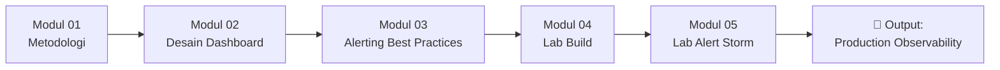
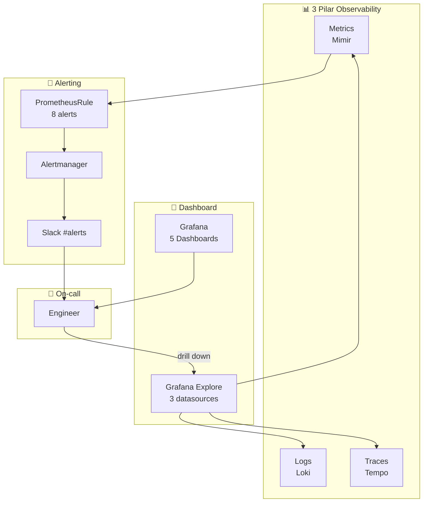

# Minggu 8 — Dashboard & Alert

Selamat datang di materi pembelajaran **Minggu 8: Dashboard & Alert**.

Di minggu ini, kita fokus pada **mengubah data observability menjadi aksi yang berguna**. Anda akan membangun **5 dashboard terstruktur** (Cluster, Node, Namespace, Pod, Go App) dan **6+ alert rules** sesuai syllabus, dikonfigurasi dengan **Alertmanager** untuk routing & inhibition yang tepat.

---

## 🗺️ Struktur & Daftar Modul Pembelajaran

| No | Dokumen Modul | Deskripsi Topik | Jenis |
| :---: | :--- | :--- | :---: |
| 01 | [Modul 01: Metodologi Observability](./01-konsep-observability-methodology.md) | Golden Signals, RED Method, USE Method, Alert Fatigue | 📖 Teori |
| 02 | [Modul 02: Prinsip Desain Dashboard](./02-desain-dashboard-yang-berguna.md) | Layout patterns, hierarki Status→Tren→Detail, anti-patterns | 📖 Teori |
| 03 | [Modul 03: Alerting Best Practices](./03-alerting-best-practices.md) | Prometheus rules, Alertmanager, inhibition, runbook | 📖 Teori |
| 04 | [Modul 04: Lab Build 5 Dashboard & Alert Rules](./04-lab-bangun-5-dashboard-dan-alert-rules.md) | Hands-on: Cluster/Node/Namespace/Pod/Go App dashboard + 6+ alerts | 🧪 Lab |
| 05 | [Modul 05: Lab Incident Alert Storm](./05-lab-incident-alert-storm-investigation.md) | Simulasi alert bertubi-tubi & tuning threshold + inhibition | 🧪 Lab |
| 📂 | [Manifests `manifests/`](./manifests/) | `01-prometheus-rules.yaml`, `02-alertmanager-config.yaml`, `03-dashboard-import-job.yaml` | 💻 Code |

---

## 🎯 Target & Checklist Capaian Pembelajaran

- [ ] Memahami **Golden Signals** (Latency, Traffic, Errors, Saturation)
- [ ] Mengerti perbedaan **RED Method** (services) vs **USE Method** (infrastructure)
- [ ] Memahami **alert fatigue** dan cara mencegahnya
- [ ] Mampu merancang **dashboard** yang actionable (bukan pajangan)
- [ ] Membangun **5 dashboard** sesuai template: Cluster, Node, Namespace, Pod, Go App
- [ ] Menulis **Prometheus alert rules** yang benar (dengan `for`, labels, annotations, runbook_url)
- [ ] Mengkonfigurasi **Alertmanager** dengan routing critical/warning
- [ ] Memahami **inhibition rules** untuk mencegah alert storm
- [ ] Mampu melakukan **alert tuning** berdasarkan data historis
- [ ] Mampu melakukan **alert audit** mingguan

---

## 🧩 Peta Hubungan dengan Materi Sebelumnya

| Materi Minggu | Kontribusi ke Minggu 8 |
| :--- | :--- |
| **Minggu 5** | Mimir/Prometheus + Grafana menjadi backend dashboard & alert |
| **Minggu 6** | Log Loki digunakan untuk cross-reference saat alert firing |
| **Minggu 7** | Trace Tempo membantu drill down ke bottleneck yang ditunjukkan alert |

---

## 📚 Kosakata Penting Minggu Ini

| Istilah | Definisi Singkat |
| :--- | :--- |
| **Golden Signals** | 4 sinyal utama (Latency, Traffic, Errors, Saturation) dari Google SRE |
| **RED Method** | Rate, Errors, Duration — untuk monitoring services |
| **USE Method** | Utilization, Saturation, Errors — untuk monitoring infrastructure |
| **SLO** | Service Level Objective — target yang dijanjikan ke user |
| **Error Budget** | "Berapa banyak kita boleh gagal" (1 - SLO) |
| **Alert Fatigue** | Kondisi di mana on-call mengabaikan alert karena terlalu banyak |
| **Alertmanager** | Komponen yang handle deduplication, grouping, routing alert |
| **Inhibition** | Mekanisme suppress alert tertentu saat alert lain firing |
| **Runbook** | Dokumen langkah-langkah untuk handle alert tertentu |
| **PrometheusRule** | CRD kustom untuk deklarasi alert rules |
| **Severity** | Level kepentingan alert: critical / warning / info |
| **`for` duration** | Waktu minimum kondisi harus bertahan sebelum alert firing |

---

## 🛠️ Prasyarat Sebelum Memulai

```bash
# 1. Cluster k3s aktif
kubectl get nodes

# 2. Stack observability (Minggu 5/6/7) jalan
kubectl get pods -n mini-prod -l "app in (mimir,grafana,alloy,loki,tempo)"

# 3. Go App dengan metrics sudah jalan (Minggu 7)
curl http://localhost:8080/metrics
```

---

## 🚀 Urutan Belajar yang Disarankan



1. Baca **Modul 01** untuk paham metodologi (Golden/RED/USE).
2. Pelajari **Modul 02** untuk prinsip desain dashboard.
3. Pelajari **Modul 03** untuk alert best practices.
4. Kerjakan **Modul 04** untuk build 5 dashboard + 6+ alert.
5. Akhiri dengan **Modul 05** untuk simulasi alert storm & tuning.

---

## 📦 Output Mingguan

Setelah Minggu 8, cluster `mini-prod` Anda akan memiliki:

### 📊 Dashboard (5 sesuai syllabus)

| Dashboard | Audience | Pertanyaan yang Dijawab |
| :--- | :--- | :--- |
| **Cluster Overview** | Semua | "Apakah cluster sehat?" |
| **Node Detail** | Sysadmin | "Node mana yang bermasalah?" |
| **Namespace Detail** | Dev | "Namespace mana yang boros resource?" |
| **Pod Detail** | Dev | "Pod mana yang tidak sehat?" |
| **Go App (RED)** | Dev | "Apakah service saya sehat dari sudut user?" |

### 🚨 Alert Rules (6 sesuai syllabus + 2 bonus)

| Alert | Severity | Tipe | Treshold |
| :--- | :--- | :--- | :--- |
| PodRestartingFrequently | warning | infra | restart > 5x/jam |
| HighCPUUsage | warning | infra | CPU > 85% (10m) |
| HighMemoryUsage | warning | infra | Mem > 90% (10m) |
| DiskSpaceLow | critical | infra | Disk > 85% (15m) |
| HighRequestLatency | critical | app | p95 > 1s (5m) |
| HighErrorRate | critical | app | error > 5% (5m) |
| GoAppDown *(bonus)* | critical | avail | up == 0 (2m) |
| PodPendingTooLong *(bonus)* | warning | avail | phase=Pending (15m) |

### 🔧 Alertmanager Configuration

- ✅ Routing critical → PagerDuty/Slack urgent
- ✅ Routing warning → Slack informational
- ✅ Inhibition rules untuk mencegah alert storm
- ✅ Runbook URL di setiap alert
- ✅ `send_resolved: true` agar tahu alert sudah clear

---

## 🔗 Observability Stack Setelah Minggu 8



> 🎉 **Sekarang observability Anda lengkap dan actionable**: data → dashboard → alert → action.

---

## 🔗 Lanjut ke Minggu Berikutnya

Lanjut ke **Minggu 9 — Incident Simulation I** untuk praktik troubleshooting:
- `CrashLoopBackOff` — container crash terus
- `OOMKilled` — kehabisan memory
- `Pending Pod` — tidak bisa di-schedule
- `ImagePullBackOff` — image tidak bisa di-pull
- `FailedMount` — volume/PVC gagal mount

Untuk tiap insiden, Anda akan diminta mengikuti alur:
```
Symptoms → Investigation → Root Cause → Mitigation → Prevention
```