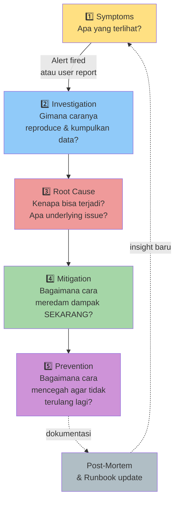
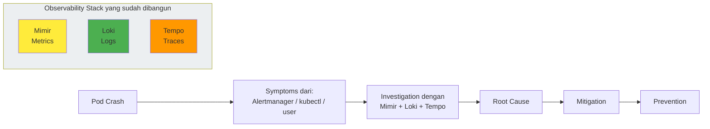

# Minggu 9 — Modul 01: Metodologi Troubleshooting Kubernetes

> **Filosofi satu kalimat:** Ketika production down, **berpikir sistematis lebih penting daripada cepat**.

Bayangkan kamu seorang detektif di TKP (Tempat Kejadian Perkara). Pod Kubernetes yang crash adalah "korban"-nya, dan kamu harus mencari "pelakunya". Tanpa metode, kamu akan panik, loncat-loncat antar perintah, dan sering salah diagnosis.

Modul ini mengajarkan **kerangka kerja** yang dipakai SRE professional saat incident terjadi — dari mulai deteksi sampai belajar dari kejadian agar tidak terulang.

---

## 🎯 Tujuan Modul

Setelah mempelajari modul ini, kamu akan mampu:

1. Menjelaskan 5 fase incident response: **Symptoms → Investigation → Root Cause → Mitigation → Prevention**
2. Memahami perbedaan **symptom** (apa yang terlihat) vs **root cause** (kenapa bisa terjadi)
3. Mengenal **toolkit troubleshooting** Kubernetes (`kubectl describe`, `kubectl logs`, `kubectl get events`, `kubectl debug`)
4. Memahami **peran observability stack** (Mimir + Loki + Tempo) yang sudah kamu bangun di minggu 5–7
5. Menerapkan pola pikir **"drill-down"**: dari gejala umum → spesifik, dari cluster → namespace → pod → container

---

## 🧠 Filosofi: Symptom vs Root Cause

Kesalahan paling umum junior engineer adalah **mengobati symptom, bukan root cause**.

### Contoh nyata

```
Symptom:  User komplain "website lambat"
Root Cause: Database connection pool exhausted karena ada N+1 query
           di code release terbaru.

🟥 SALAH:  Naikkan CPU limit pod 4x → selesai? Tidak, besok akan
           lambat lagi karena root cause (N+1 query) masih ada.

🟩 BENAR:  Tambahkan index di kolom yang dipakai WHERE clause
           + fix code N+1 → selesai permanen.
```

### Analogi dokter

| Peran | Analogi |
|---|---|
| Pasien (banyak orang) datang dengan **demam** | Banyak pod dengan status **CrashLoopBackOff** |
| Dokter tidak langsung kasih antibiotik | Engineer tidak langsung restart pod |
| Dokter cek suhu, tanya riwayat, periksa laboratorium | Engineer cek `kubectl describe`, baca logs, cek metrics |
| Dokter cari **penyebab** demam (infeksi bakteri? virus?) | Engineer cari **root cause** (bug code? config salah? resource kurang?) |
| Dokter kasih obat yang sesuai + edukasi pencegahan | Engineer patch code/config + tambah monitoring/alerts |

> **Rules of thumb:** Jika kamu baru 1× restart pod dan langsung solved → kamu **belum menemukan root cause**, hanya menghilangkan symptom. Insiden serupa akan terjadi lagi.

---

## 🛠️ Lima Fase Incident Response

Setiap incident di minggu ini akan mengikuti 5 fase yang sama. Hafalkan kerangka ini — dipakai di SRE culture Google, AWS, Netflix, dan tim SRE profesional mana pun.



### Fase 1 — Symptoms (Gejala)

**Pertanyaan:** *Apa yang user/alert/system lihat?*

**Jangan asumsi.** Kumpulkan fakta dari banyak sumber:

| Sumber | Cara Cek | Contoh Symptom |
|---|---|---|
| Alertmanager | Cek di Slack channel `#alerts` | `PodCrashLoop` firing untuk `go-app` |
| User report | Buka tiket / DM | "Aplikasi login error 500" |
| Dashboard | Buka Grafana → dashboard Go App | Error rate spike 50% |
| `kubectl get pods` | Dari terminal | `go-app-xyz` status `CrashLoopBackOff` |
| HTTP probe | `curl` ke service | `503 Service Unavailable` |

> **Tips:** Catat **timestamp** kapan symptom pertama terlihat. Akan sangat berguna saat investigasi (cek metric "apa yang berubah di jam itu").

### Fase 2 — Investigation (Penyelidikan)

**Pertanyaan:** *Bagaimana cara menggali lebih dalam?*

Ini fase **paling lama** — bisa 5 menit sampai 5 jam. Gunakan tool dengan urutan **dari atas ke bawah**:

```
Cluster  →  Namespace  →  Deployment/StatefulSet  →  ReplicaSet  →  Pod  →  Container
   ↑                                                                     ↓
   ←←←←←←←←←←←←←  kalau perlu trace balik ke atas ←←←←←←←←←←←←←←←←←←
```

**Toolkit penting:**

```bash
# 1. Lihat "layar besar" — apa yang broken?
kubectl get pods -A
# Output: daftar pod dengan STATUS abnormal (CrashLoopBackOff, ImagePullBackOff, Pending)

# 2. Drill down ke satu pod — KENAPA broken?
kubectl describe pod <pod-name> -n <namespace>
# Output: Events section → di sinilah clue root cause tersimpan!
#         "FailedScheduling", "FailedMount", "BackOff", "Pulling" dll

# 3. Baca log container — APA yang aplikasi bilang?
kubectl logs <pod-name> -n <namespace> --previous
# Flag --previous = log dari container SEBELUM crash terakhir
# Ini sering berisi stack trace atau panic message

# 4. Lihat event cluster — APA yang baru saja terjadi?
kubectl get events -n <namespace> --sort-by=.lastTimestamp
# Menampilkan semua event K8s: scaling, scheduling, image pulling, dll

# 5. Cek resource usage — apakah pod kekurangan/melebihi limit?
kubectl top pod <pod-name> -n <namespace>
# (perlu metrics-server terinstall)

# 6. Cross-check dengan observability stack
# Buka Grafana → Mimir/Loki/Tempo untuk melihat konteks historis
```

### Fase 3 — Root Cause (Akar Masalah)

**Pertanyaan:** *Apa sebenarnya yang menyebabkan masalah?*

Di sinilah **kritis thinking** berperan. Hindari:

- ❌ "Ah, pasti cuma perlu di-restart" → belum tentu
- ❌ "Pasti code developer yang salah" → bisa config / infra
- ❌ "Random, kadang jalan kadang nggak" → hampir pasti BUKAN random

**Teknik menggali root cause** — **5 Whys** (Toyota Production System):

```
Problem: Pod CrashLoopBackOff
  Why? → Container exit code 1
    Why? → Liveness probe gagal terus
      Why? → App lambat respon (>3 detik)
        Why? → DB query lambat (lihat di Tempo trace)
          Why? → Index di kolom WHERE hilang
                  → ROOT CAUSE: missing DB index!
```

**Tanda kamu sudah menemukan root cause yang benar:**
- ✅ Jika kamu **mencegah faktor root cause**, masalah tidak akan terulang
- ✅ Bisa dijelaskan secara logis: "A menyebabkan B menyebabkan C"
- ✅ Bisa diverifikasi/diuji ulang

### Fase 4 — Mitigation (Peredaman Dampak)

**Pertanyaan:** *Bagaimana cara meredam dampak user SEKARANG?*

Mitigation ≠ fix root cause. Mitigation adalah **band-aid cepat** agar user tidak terganggu sambil kita fix root cause secara proper.

Contoh untuk `CrashLoopBackOff`:

| Jenis | Contoh | Trade-off |
|---|---|---|
| Restart manual | `kubectl rollout restart deploy/go-app` | ✅ Cepat ❌ Tidak permanen |
| Rollback versi | `kubectl rollout undo deploy/go-app` | ✅ Cepat ❌ Fitur baru tertunda |
| Tambah resource | Naikkan memory limit | ✅ Cepat ❌ Mungkin tidak menyelesaikan |
| Disable fitur | Matikan problematic job via feature flag | ✅ Cepat ❌ Fitur hilang |

> **Prinsip:** Lakukan mitigation dulu, baru akar root cause. Tapi **jangan lupa akar**!

### Fase 5 — Prevention (Pencegahan)

**Pertanyaan:** *Bagaimana agar incident ini tidak terulang?*

Bisa berupa:

| Kategori | Contoh |
|---|---|
| **Code/Config fix** | Tambah missing DB index, fix bug di code |
| **Resource tuning** | Set memory limit sesuai real usage + buffer |
| **Probe tuning** | Tambahkan `startupProbe` agar pod punya waktu startup |
| **Monitoring/Alert** | Tambah alert untuk symptom spesifik |
| **CI/CD check** | Tambah test yang memastikan image ada sebelum deploy |
| **Runbook** | Tulis runbook di repo supaya orang lain bisa troubleshoot |

> **Paling sering dilupakan!** Banyak engineer berhenti di mitigation. Tapi prevention adalah fase yang memberikan **nilai jangka panjang**.

---

## 🔧 Anatomi Output `kubectl describe pod`

Perintah ini adalah **senjata utama** di fase investigation. Hafalkan setiap bagian output-nya:

```bash
$ kubectl describe pod go-app-7f9c-xjp2q -n produksi
```

```
Name:           go-app-7f9c-xjp2q
Namespace:      produksi
Priority:       0
Node:           laptop-k3s/192.168.1.10
Start Time:     Mon, 10 Aug 2026 09:15:23 +0700
Labels:         app=go-app
                pod-template-hash=7f9c
Annotations:    <none>
Status:         Running
IP:             10.42.0.15
IPs:
  IP:           10.42.0.15
Controlled By:  ReplicaSet/go-app-7f9c
Containers:
  go-app:
    Container ID:   containerd://abc123...
    Image:          ghcr.io/perusahaan/go-app:v1.2.3
    Image ID:       <-- DI SINI KAMU LIHAT IMAGE TAG
    Port:           8080/TCP
    Host Port:      0/TCP
    State:          Waiting      ← STATUS CONTAINER
      Reason:       CrashLoopBackOff   ← ALASAN
    Last State:     Terminated    ← STATE SEBELUMNYA
      Reason:       Error         ← EXIT REASON
      Exit Code:    1             ← EXIT CODE
      Started:      Mon, 10 Aug 2026 09:18:11 +0700
      Finished:     Mon, 10 Aug 2026 09:18:14 +0700  ← 3 DETIK!
    Ready:          False
    Restart Count:  5             ← SUDAH RESTART 5X
    Limits:
      cpu:          500m
      memory:       256Mi
    Requests:
      cpu:          100m
      memory:       128Mi

Conditions:
  Type              Status
  Initialized       True
  Ready             False       ← BELUM READY
  ContainersReady   False
  PodScheduled      True

Volumes:
  data:
    Type:       PersistentVolumeClaim (a PVC referenced in the pod)
    ClaimName:  postgres-data    ← DI SINI KAMU LIHAT PVC
    ReadOnly:   false

Events:               ← ★ PALING PENTING ★
  Type     Reason          Age                 From                     Message
  ----     ------          ----                ----                     -------
  Normal   Scheduled       12m                 default-scheduler        Successfully assigned ...
  Normal   Pulling         12m                 kubelet                   Pulling image "ghcr.io/..."
  Normal   Pulled          12m                 kubelet                   Successfully pulled image
  Normal   Created         11m                 kubelet                   Created container go-app
  Normal   Started         11m                 kubelet                   Started container go-app
  Warning  BackOff         3m (x6 over 7m)     kubelet                   Back-off restarting failed container
  Warning  Unhealthy       5m (x10 over 10m)   kubelet                   Liveness probe failed: ...
```

**Yang harus kamu lihat pertama kali:**

1. **`Status`** (Running / Pending / CrashLoopBackOff)
2. **`Last State: Exit Code`** (0 = normal exit, 1 = error aplikasi, 137 = OOMKilled, 143 = SIGTERM)
3. **`Restart Count`** (kalau tinggi → chronic problem)
4. **`Events`** paling bawah — biasanya berisi **WHY** container failure

### Tabel Exit Code Umum

| Exit Code | Arti | Penyebab Umum |
|---|---|---|
| **0** | Normal exit | App shutdown dengan baik |
| **1** | Generic error | Bug code, panic, config invalid |
| **137** | SIGKILL (OOMKilled) | Container pakai memory > limit |
| **139** | Segmentation fault | Bug native code, biasanya bahasa C/C++ |
| **143** | SIGTERM | Graceful shutdown, biasanya karena `kubectl delete` |
| **126** | Permission denied | Binary tidak executable (umum di image Alpine) |
| **127** | Command not found | Entrypoint salah ketik |

---

## 📚 Observability Stack sebagai "Teman" Troubleshooting

Jangan cuma andalkan `kubectl`. Gunakan **3 pilar observability** yang sudah kamu bangun:



### Kapan Pakai Yang Mana?

| Situasi | Tool Utama | Contoh Query |
|---|---|---|
| "Kapan CPU mulai tinggi?" | **Mimir** | `rate(container_cpu_usage_seconds_total[5m])` |
| "Error message apa di app?" | **Loki** | `{namespace="produksi"} \|~ "error\|panic"` |
| "Request mana yang lambat?" | **Tempo** | Filter trace by service, lihat span terlama |
| "Pod status apa sekarang?" | **kubectl** | `kubectl get pods -n produksi` |
| "Kenapa pod ini di node X?" | **kubectl** | `kubectl describe pod <name>` |

---

## 🚦 Cara Membaca Status Pod

Ketika kamu menjalankan `kubectl get pods`, kolom `STATUS` punya banyak variasi. Hafalkan:

```
STATUS                Arti
───────────           ────────────────────────────────────────────
Running               ✅ Sedang jalan, sehat
Pending               ⏳ Menunggu scheduling / image pull
ContainerCreating     ⏳ Sedang dibuat
CrashLoopBackOff      ❌ Crash terus-menerus, restart dengan delay
ImagePullBackOff      ❌ Gagal download image
Error                 ❌ Container exit dengan error
Completed             ✅ Job selesai dengan sukses (untuk Job/CronJob)
Evicted               ⚠️  Diusir node karena resource / pressure
Terminating           ⏳ Sedang dimatikan
Init:Error            ❌ Init container gagal
Init:CrashLoopBackOff ❌ Init container crash
```

**Berapa lama restart delay?** K8s exponential backoff: 10s, 20s, 40s, 80s, 160s, 300s (cap 5 menit). Jadi kalau lihat `CrashLoopBackOff`, pod sebenarnya sudah mencoba **6× dalam 10 menit**.

---

## 🧪 Hands-On: Latihan Deteksi Status Pod

Sebelum masuk ke incident spesifik, pastikan kamu familiar dengan perintah dasar.

### Latihan 1 — Identifikasi pod tidak sehat

```bash
# 1. Lihat semua pod di semua namespace
kubectl get pods -A

# 2. Filter pod yang TIDAK Running
kubectl get pods -A --no-headers | awk '{print $4}' | sort -u
# Akan muncul daftar unik STATUS, lihat yang bukan Running

# 3. Format custom untuk lihat kolom relevan
kubectl get pods -A -o custom-columns=\
  NAMESPACE:.metadata.namespace,\
  NAME:.metadata.name,\
  STATUS:.status.phase,\
  RESTARTS:.status.containerStatuses[0].restartCount,\
  AGE:.metadata.creationTimestamp
```

### Latihan 2 — Baca events namespace

```bash
# Lihat event 1 jam terakhir, diurutkan waktu
kubectl get events -A --sort-by=.lastTimestamp | tail -20

# Filter hanya Warning (bukan Normal)
kubectl get events -A --field-selector type=Warning
```

### Latihan 3 — Akses log pod yang sudah crash

```bash
# Lihat log container yang SEDANG jalan
kubectl logs <pod-name> -n <namespace>

# Lihat log container SEBELUM crash terakhir (PALING BERGUNA)
kubectl logs <pod-name> -n <namespace> --previous

# Stream log实时 (like tail -f)
kubectl logs -f <pod-name> -n <namespace>

# Log semua container dalam pod (jika multi-container)
kubectl logs <pod-name> -n <namespace> --all-containers
```

---

## ✅ Checklist Sebelum Incident Response

Cetak ini dan tempel di meja kamu. Saat incident datang, **ikuti urutan**:

```
□ 1. Jangan panik. Tarik napas.
□ 2. Catat waktu mulai incident (timestamp).
□ 3. Cek dashboard Grafana — apa yang merah?
□ 4. Cek alert Slack — alert mana yang firing duluan?
□ 5. kubectl get pods -A — pod mana yang tidak Running?
□ 6. kubectl describe pod <target> — baca Events.
□ 7. kubectl logs <target> --previous — apa error-nya?
□ 8. Cross-check Loki/Tempo untuk konteks historis.
□ 9. FORMULASI HYPOTHESIS: "Mungkin X karena Y".
□ 10. Uji hypothesis: tambah/ubah config, lihat hasilnya.
□ 11. VERIFY root cause: "kalau saya hapus faktor X, masalah hilang?"
□ 12. MITIGATE: redam dampak (rollback, scale, dll).
□ 13. ROOT CAUSE FIX: patch code/config/provisioning.
□ 14. PREVENT: tambah test/alert/runbook.
□ 15. DOKUMENTASIKAN: tulis post-mortem (format di bawah).
```

---

## 📝 Template Post-Mortem Mini

Setiap incident harus didokumentasikan (idealnya **dalam 24 jam setelah selesai**):

```markdown
# Post-Mortem: [Nama Incident]

**Tanggal:** 2026-08-10
**Severity:** SEV-2 (user impact sedang)
**Durasi:** 14 menit (09:15 - 09:29 WIB)

## Ringkasan
[1 paragraf: apa yang terjadi dan dampaknya]

## Timeline
- 09:15 — Alert `PodCrashLoop` firing untuk `go-app`
- 09:17 — Investigasi mulai, pod `go-app-7f9c-xjp2q` CrashLoopBackOff
- 09:21 — Root cause identified: missing DB index pada tabel orders
- 09:25 — Mitigation: rollback ke release sebelumnya
- 09:27 — Root cause fix: tambah index + redeploy
- 09:29 — Alert resolved

## Root Cause
Query `SELECT * FROM orders WHERE user_id = ?` tanpa index di kolom
`user_id` menyebabkan full table scan. Saat trafik naik 10× lipat
(launch promo), query timeout > 3 detik → liveness probe gagal →
pod di-restart → masuk CrashLoopBackOff loop.

## What Went Well
- Alert firing otomatis dalam 1 menit
- Runbook lama membantu investigasi cepat
- Rollback GitOps (ArgoCD) berhasil dalam 2 menit

## What Went Wrong
- DB schema migration tidak include index → harusnya ada di CI check
- Alert latency 1 menit — bisa lebih cepat dengan metric-based detection

## Action Items
- [ ] Tambah migration test di GitLab CI (owner: @andi, due: 2026-08-15)
- [ ] Buat alert query latency per-endpoint (owner: @budi, due: 2026-08-12)
- [ ] Update runbook dengan lesson learned (owner: @citra, due: 2026-08-11)
```

> **Budaya blameless:** Post-mortem bukan untuk menyalahkan seseorang. Fokus pada **sistem** yang gagal, bukan **orang** yang salah.

---

## 🔗 Kaitan dengan Materi Sebelumnya

Modul ini menghubungkan semua yang sudah kamu pelajari:

```
Minggu 1 — Container & K8s fundamental
   ↓ (perintah kubectl)
Minggu 2 — Workload (Deployment, StatefulSet, Probe)
   ↓ (kapan probe gagal → restart)
Minggu 3 — Helm (cara deploy app)
   ↓ (chart values salah → incident)
Minggu 4 — GitOps (rollback cepat saat incident)
   ↓ (ArgoCD auto-sync bisa roll back)
Minggu 5-7 — Metrics + Logs + Traces
   ↓ (alat investigasi)
Minggu 8 — Dashboard & Alert
   ↓ (deteksi dini)
★ Minggu 9 — Incident Response ★ ← KAMU DI SINI
   ↓ (latih troubleshooting)
Minggu 10-11 — Latihan lebih kompleks & SRE culture
   ↓
Minggu 12 — Production Simulation (ujian akhir)
```

---

## 📖 Rangkuman

| Konsep | Ingat Ini |
|---|---|
| 5 fase incident | Symptoms → Investigation → Root Cause → Mitigation → Prevention |
| Symptom vs Root Cause | Symptom = yang terlihat. Root Cause = kenapa bisa begitu. |
| Tool utama | `kubectl get pods`, `kubectl describe`, `kubectl logs --previous`, `kubectl get events` |
| Exit code penting | 0=normal, 1=error app, 137=OOMKilled, 143=SIGTERM |
| Observability | Mimir (kapan), Loki (apa error-nya), Tempo (di mana bottleneck) |
| Post-mortem | Dokumentasi untuk belajar, bukan untuk menyalahkan |

---

## ➡️ Modul Selanjutnya

Di **modul 02–06**, kita akan masuk ke **5 incident spesifik**:

1. **CrashLoopBackOff** — container restart terus-menerus
2. **OOMKilled** — kehabisan memory
3. **Pending Pod** — tidak bisa dijadwalkan
4. **ImagePullBackOff** — gagal download image
5. **FailedMount** — gagal mount volume/PVC

Setiap modul akan punya:
- ✅ Simulasi YAML untuk reproduce incident
- ✅ Symptoms yang muncul
- ✅ Step-by-step investigation dengan output `kubectl`
- ✅ Root cause analysis
- ✅ Mitigation commands
- ✅ Prevention strategies

Siap? Yuk mulai! 🚀
