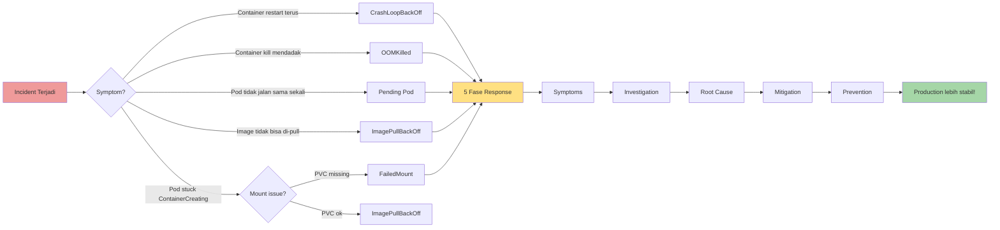

# Minggu 9 — Incident Simulation I

> **Misi minggu ini:** Belajar troubleshooting dengan 5 incident paling umum di Kubernetes, mengikuti kerangka kerja **Symptoms → Investigation → Root Cause → Mitigation → Prevention**.

```
minggu-09/
├── 01-metodologi-troubleshooting-kubernetes.md
├── 02-incident-crashloopbackoff.md
├── 03-incident-oomkilled.md
├── 04-incident-pending-pod.md
├── 05-incident-imagepullbackoff.md
├── 06-incident-failedmount.md
├── README.md                              ← kamu di sini
└── manifests/
    ├── 01-crashloop-bad-config.yaml
    ├── 02-oomkilled-stress.yaml
    ├── 03-pending-overcommit.yaml
    ├── 03b-pending-node-selector.yaml
    ├── 04-imagepull-bad-tag.yaml
    ├── 04b-imagepull-private-no-secret.yaml
    └── 05-failedmount-missing-pvc.yaml
```

---

## 🎯 Tujuan Minggu Ini

Setelah menyelesaikan Week 9, kamu akan mampu:

1. **Mengikuti kerangka 5 fase** incident response (Symptoms → Investigation → Root Cause → Mitigation → Prevention)
2. **Membaca output `kubectl describe pod`** untuk identifikasi cepat root cause
3. **Membedakan 5 jenis incident** K8s klasik: CrashLoopBackOff, OOMKilled, Pending, ImagePullBackOff, FailedMount
4. **Menggunakan observability stack** (Mimir + Loki + Tempo) untuk cross-check
5. **Mendesain prevention** yang tepat untuk tiap kategori incident

---

## 📚 Peta Modul

### 🧠 Teori (1 modul)

| Modul | Topik | Bacaan |
|---|---|---|
| 01 | **Metodologi Troubleshooting K8s** — 5 fase, toolkit kubectl, exit code | [01-metodologi-troubleshooting-kubernetes.md](01-metodologi-troubleshooting-kubernetes.md) |

### 🔥 Incident Labs (5 modul)

Setiap modul mengikuti format yang sama: **Symptoms → Investigation → Root Cause → Mitigation → Prevention** + simulasi YAML.

| # | Incident | Status Code | Root Cause Umum | Modul |
|---|---|---|---|---|
| 02 | **CrashLoopBackOff** | Exit 1 | Bug code, missing env var, probe fail | [02-incident-crashloopbackoff.md](02-incident-crashloopbackoff.md) |
| 03 | **OOMKilled** | Exit 137 | Memory limit terlalu rendah / leak | [03-incident-oomkilled.md](03-incident-oomkilled.md) |
| 04 | **Pending Pod** | Pending | Resource insufficient / selector mismatch | [04-incident-pending-pod.md](04-incident-pending-pod.md) |
| 05 | **ImagePullBackOff** | ImagePullBackOff | Tag typo / no credentials | [05-incident-imagepullbackoff.md](05-incident-imagepullbackoff.md) |
| 06 | **FailedMount** | ContainerCreating | PVC missing / wrong StorageClass | [06-incident-failedmount.md](06-incident-failedmount.md) |

---

## 🗺️ Visualisasi Hubungan Minggu 9



---

## 🛠️ Cheat Sheet: Diagnosis Cepat

Saat incident datang, jalankan 4 perintah ini **berurutan** (dalam 30 detik kamu sudah tahu root cause 80% kasus):

```bash
# 1. Lihat layar besar
kubectl get pods -A

# 2. Filter yang tidak Running
kubectl get pods -A --field-selector=status.phase!=Running

# 3. Drill down ke pod target
kubectl describe pod <pod-name> -n <namespace>
#       ↑ BACA BAGIAN EVENTS! Itu kunci root cause

# 4. Baca log container (kalau sempat jalan)
kubectl logs <pod-name> -n <namespace> --previous
```

**Tabel Diagnosis Cepat Berdasarkan Status Pod:**

| Status | First Command | Second Command | Likely Cause |
|---|---|---|---|
| `CrashLoopBackOff` | `kubectl logs ... --previous` | `kubectl describe pod` | Bug code / missing env / probe fail |
| `OOMKilled` | `kubectl describe pod` (Exit 137) | `kubectl top pod` | Limit too low / memory leak |
| `Pending` | `kubectl describe pod` (Events) | `kubectl describe nodes` | Insufficient resource / selector |
| `ImagePullBackOff` | `kubectl describe pod` (Events) | `docker pull <image>` | Tag typo / no credentials |
| `ContainerCreating` (lama) | `kubectl describe pod` (Events) | `kubectl get pvc -A` | PVC missing / wrong SC |

---

## 🔗 Keterkaitan dengan Materi Sebelumnya

Minggu 9 adalah **ujian** untuk semua yang sudah kamu bangun minggu 5–8:

```
Minggu 1-2: Kubernetes fundamental + workload
    ↓
Minggu 3-4: Deploy app via Helm + GitOps
    ↓
Minggu 5-7: Observability stack (Metrics/Logs/Traces)
    ↓
Minggu 8: Alert & Dashboard otomatis
    ↓
★ Minggu 9: Incident Response ★ ← KAMU DI SINI
    "Sekarang pakai semua itu untuk troubleshoot"
    ↓
Minggu 10: Insiden lebih kompleks (multi-cause)
    ↓
Minggu 11-12: Reliability Engineering & Production Simulation
```

---

## 📦 Deliverables Week 9

### Modul Markdown (6 file)

- ✅ Modul 01 — Metodologi (1 file, 20 KB)
- ✅ Modul 02–06 — 5 incident labs (5 file, ~13–15 KB masing-masing)

### Simulasi YAML (7 file)

- ✅ `01-crashloop-bad-config.yaml` — crash karena missing env var
- ✅ `02-oomkilled-stress.yaml` — alokasi 200MB di limit 128Mi
- ✅ `03-pending-overcommit.yaml` — minta 16 CPU di cluster 8 CPU
- ✅ `03b-pending-node-selector.yaml` — nodeSelector tanpa node match
- ✅ `04-imagepull-bad-tag.yaml` — tag typo
- ✅ `04b-imagepull-private-no-secret.yaml` — private registry tanpa Secret
- ✅ `05-failedmount-missing-pvc.yaml` — referensi PVC tidak ada

---

## ✅ Checklist Penyelesaian Week 9

Untuk setiap incident lab, pastikan kamu sudah:

```
□ Membaca modul teori (01)
□ Deploy YAML simulasi
□ Mengamati symptom (kubectl get pods)
□ Membaca Events di describe pod
□ Membaca log dengan --previous
□ Cross-check dengan Loki / Mimir
□ Identifikasi root cause (5 Whys)
□ Melakukan mitigation
□ Memahami prevention strategy
□ Membersihkan resources (kubectl delete)
```

**Bonus challenge:** Jalankan **post-mortem template** (lihat Modul 01) untuk satu incident pilihanmu.

---

## 🧠 Vocab Week 9

| Istilah | Arti |
|---|---|
| **CrashLoopBackOff** | Container exit terus-menerus, K8s restart dengan exponential backoff |
| **OOMKilled** | Container di-kill kernel karena pakai memory > limit (exit 137) |
| **Pending** | Pod menunggu scheduling — bisa karena resource / selector |
| **ImagePullBackOff** | K8s gagal download image dari registry |
| **FailedMount** | Kubelet gagal mount volume ke container |
| **Exit Code 137** | 128 + 9 = SIGKILL (biasanya OOMKilled) |
| **Exit Code 1** | Generic error (bug code, panic, validation fail) |
| **Exponential Backoff** | Pola restart delay: 10s → 20s → 40s → 80s → 160s → 300s |
| **QoS Class** | Klasifikasi pod: Guaranteed / Burstable / BestEffort |
| **5 Whys** | Teknik Toyota untuk menggali root cause |
| **Blameless Post-Mortem** | Dokumentasi incident tanpa menyalahkan individu |
| **imagePullSecrets** | Secret untuk akses private registry |
| **ResourceQuota** | Limit aggregate resource per namespace |
| **LimitRange** | Default constraint per container di namespace |

---

## 🚀 Quick Start

Untuk langsung praktik:

```bash
# 1. Pastikan cluster kamu hidup
kubectl get nodes

# 2. Pilih satu incident lab (misal CrashLoopBackOff)
cat manifests/01-crashloop-bad-config.yaml

# 3. Deploy dan observe
kubectl apply -f manifests/01-crashloop-bad-config.yaml
kubectl get pods -n insiden-lab -w

# 4. Investigasi
kubectl describe pod -n insiden-lab -l app=crashloop-app
kubectl logs -n insiden-lab -l app=crashloop-app --previous

# 5. Cleanup
kubectl delete -f manifests/01-crashloop-bad-config.yaml
```

---

## ➡️ Minggu 10 Preview

Setelah menguasai 5 incident dasar ini, kamu siap untuk **insiden yang lebih kompleks**:

- **CPU Spike** — bisa karena GC, attack, atau legitimate traffic?
- **Memory Leak** — butuh heap dump & pprof analysis
- **Disk Full** — log files tak terbatas, image cache membengkak
- **DNS Error** — CoreDNS overload, misconfigured upstream
- **PVC Full** — database disk penuh, tidak bisa write
- **Network Timeout** — service mesh issue, connection pool exhausted
- **Latency** — slow database, N+1 query, lock contention
- **Slow Database** — missing index, table scan
- **Deadlock** — transaction loop

Insiden minggu 10 **tidak bisa di-detect dari `kubectl describe pod` saja** — butuh korelasi Metrics + Logs + Traces (Minggu 5–7) + dashboard (Minggu 8) untuk cari root cause.

👉 Lanjut ke `minggu-10/README.md`
