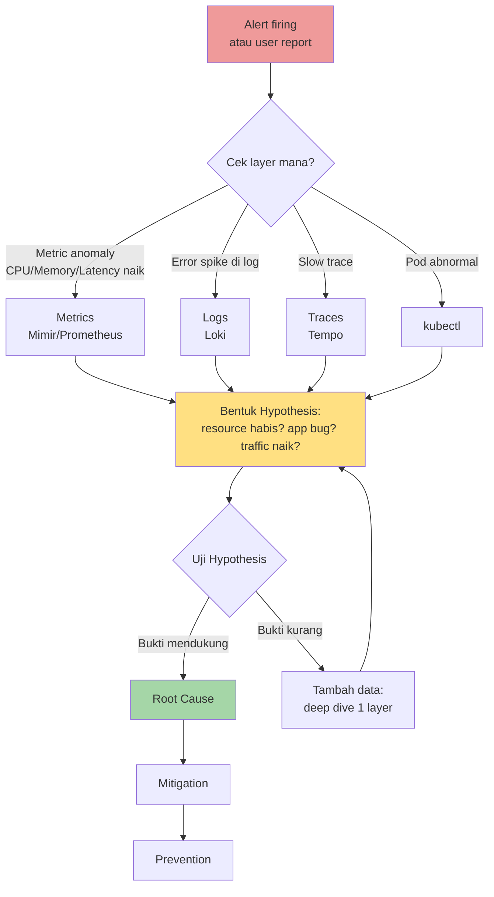

# Minggu 10 — Modul 01: Metodologi Incident Kompleks

> **Bedanya dengan Minggu 9:** Insiden minggu lalu bisa di-detect dari SATU perintah (`kubectl describe pod`). Insiden minggu ini BUTUH korelasi data dari banyak sumber.

Kalau di Minggu 9 kamu adalah detektif yang langsung menemukan sidik jari di TKP, di Minggu 10 kamu adalah detektif yang harus **menginterogasi 5 saksi** (Metrics, Logs, Traces, Alertmanager, kubectl) sebelum bisa menarik kesimpulan.

---

## 🎯 Tujuan Modul

1. Memahami bahwa incident kompleks **tidak bisa dilihat dari satu sudut pandang**
2. Mengetahui **skenario korelasi** yang umum: "Metrics naik → cek Logs → cross-check Traces → konfirmasi kubectl"
3. Mampu **membentuk hypothesis** berdasarkan korelasi data
4. Memahami **layer troubleshooting** dari application → runtime → OS → kernel → infra

---

## 🧩 Tabel Perbandingan: Incident Sederhana vs Kompleks

| Aspek | Minggu 9 (Sederhana) | Minggu 10 (Kompleks) |
|---|---|---|
| **Symptom** | Pod status abnormal (CrashLoop, Pending) | Pod Running, tapi aplikasi lambat/error |
| **Deteksi utama** | `kubectl get pods` | Dashboard Grafana / alert latency / error rate |
| **Sumber diagnosis** | 1 tool (kubectl describe) | 4+ tools (Mimir, Loki, Tempo, kubectl, OS tools) |
| **Root cause** | Jelas di Events / log | Perlu korelasi data + hypothesis |
| **Durasi incident** | Detik sampai menit | Jam sampai hari |
| **Contoh** | ImagePullBackOff (1 menit solved) | Memory leak (mungkin butuh patch code) |

---

## 🔄 Alur Kerja: Cross-Source Correlation



---

## 🛠️ Empat Sumber Data & Kapan Pakainya

### 1️⃣ Metrics (Mimir / Prometheus) — "KAPAN & BERAPA BANYAK"

**Menjawab pertanyaan:** *Kapan? Berapa banyak? Naik/turun?*

```promql
# CPU usage pod (%)
rate(container_cpu_usage_seconds_total{namespace="produksi"}[5m]) * 100

# Memory usage pod (bytes)
container_memory_working_set_bytes{namespace="produksi"}

# Request latency (p95)
histogram_quantile(0.95, 
  sum by (le) (rate(http_request_duration_seconds_bucket[5m]))
)

# Error rate (%)
sum(rate(http_requests_total{status=~"5.."}[5m])) /
sum(rate(http_requests_total[5m])) * 100

# Network IO
rate(container_network_receive_bytes_total[5m])
```

**Kapan mulai dari sini:**
- Alert latency tinggi firing
- Dashboard menunjukkan CPU/Memory spike
- User komplain "lambat" tanpa error message

### 2️⃣ Logs (Loki) — "APA YANG TERJADI"

**Menjawab pertanyaan:** *Apa pesan error-nya? Kapan mulai error? Berapa sering?*

```logql
# Error dari app tertentu
{app="go-app"} |= "error" |= "panic"

# Stack trace (untuk bug code)
{namespace="produksi"} |= "goroutine" |= "runtime error"

# Slow query log dari Postgres
{app="postgres"} |= "duration:" |= "ms"

# Kapan error pertama muncul
{app="go-app"} |= "ERROR" | line_format "{{.timestamp}} {{.message}}"
```

**Kapan mulai dari sini:**
- Alert error rate firing
- Ada error message spesifik di dashboard
- User dapat HTTP 500 dengan body tertentu

### 3️⃣ Traces (Tempo) — "DI MANA BOTTLENECK"

**Menawab pertanyaan:** *Span mana yang paling lama? Service mana yang lambat?*

```traceql
# Service tertentu dengan error
{ resource.service.name = "go-app" && status = error }

# Span terlama per service
{ resource.service.name = "go-app" } | select(span.duration)

# DB query lambat
{ name = "postgres.query" && span.http.status_code = 200 } 
  | select(span.duration) 
  | topk(10, by(span.duration))
```

**Kapan mulai dari sini:**
- Alert latency firing tapi tidak tahu service mana
- Ada bottleneck yang tidak terlihat di log
- Distributed system dengan banyak microservice

### 4️⃣ kubectl — "STATE SAAT INI"

**Menawab pertanyaan:** *Pod sekarang gimana? Event terbaru apa? Resource cukup?*

```bash
# Real-time pod status
kubectl get pods -n produksi -w

# Resource usage real-time
kubectl top pods -n produksi

# Events terbaru
kubectl get events -n produksi --sort-by=.lastTimestamp

# Network connectivity test
kubectl run -n produksi netshoot --rm -it --image=nicolaka/netshoot -- bash
# Dari dalam netshoot:
#   nslookup kubernetes.default
#   curl -v http://go-app:8080
#   tcpdump -i any port 5432
```

**Kapan mulai dari sini:**
- Metrics menunjukkan resource usage tinggi → cek pod mana
- Service tidak reachable → cek pod, svc, endpoint
- Ada perubahan config → cek apa yang berubah

---

## 🎯 Tabel Keputusan: "Mulai Dari Mana?"

| Symptom | Mulai dari | Tools |
|---|---|---|
| Latency naik tapi error rate sama | **Tempo** | Lihat span mana yang lambat |
| Error rate naik | **Loki** | Cari error message spesifik |
| CPU spike | **Mimir** → **kubectl top** → **pprof** | Cek pod mana, lalu profile |
| Memory naik terus | **Mimir** → **heap dump** | Lihat trend, lalu dump |
| Disk penuh | **kubectl exec du** | Cek filesystem |
| DNS resolve gagal | **kubectl exec nslookup** | Test dari dalam pod |
| Pod restart tapi CPU/Memory normal | **Loki** | Cari panic/restart reason |
| Traffic naik (legitimate) | **Mimir** (request rate) | Cek apakah autoscale perlu dinaikkan |

---

## 🧪 Latihan: Multi-Source Correlation

**Skenario:** Alert `GoAppHighLatency` firing. Apa yang kamu lakukan?

### Step 1 — Buka dashboard Go App RED (Minggu 8)

Lihat panel:
- Request rate: **naik 3× dalam 5 menit terakhir**
- Error rate: **stabil di 0.5%**
- Latency p95: **naik dari 200ms ke 2.5s**

**Observasi:** Bukan error, murni latency. Request naik tapi latency naik lebih tajam → bukan proporsional.

### Step 2 — Buka Mimir Explore

Query:
```promql
# Per-service latency p95 (punya OTel instrumentation dari Minggu 7)
histogram_quantile(0.95, 
  sum by (le, service) (rate(http_request_duration_seconds_bucket[5m]))
)
```

**Hasil:**
```
service           p95_latency
go-app            2.5s
postgres          2.4s   ← hamper sama dengan go-app!
redis             5ms    ← cepat
```

**Insight:** Bottleneck di postgres, bukan redis. go-app menunggu postgres.

### Step 3 — Buka Tempo

Filter: `{ resource.service.name = "postgres" && span.http.status_code = 200 }`

**Hasil:** Lihat span tree. 1 request ke `/orders` menghasilkan **47 span postgres.query**!

```
GET /orders
  └─ postgres.query: SELECT * FROM orders WHERE user_id = ?  (15ms)
       └─ postgres.query: SELECT * FROM order_items WHERE order_id = ?  (5ms × 46)
```

**Root cause hypothesis:** **N+1 query** — untuk 1 request `/orders`, app melakukan 1 + 46 query ke DB.

### Step 4 — Konfirmasi dengan Loki

```logql
{app="postgres"} |= "duration:" |= "ms" |= "order_items"
```

**Hasil:** Log menunjukkan **46 query identik** dalam 1 request HTTP.

### Step 5 — Drill down ke application code

```bash
kubectl logs -n produksi -l app=go-app --since=10m | grep -A 5 "GET /orders"
# Output: query plan yang menunjukkan loop di code
```

### Root Cause
Code di endpoint `/orders` melakukan:
```go
for _, order := range orders {
  items := db.Query("SELECT * FROM order_items WHERE order_id = ?", order.ID)
  // ...
}
```

Seharusnya pakai JOIN atau eager loading.

### Mitigation
1. **Quick fix:** Tambah DB index (mungkin sudah ada, tapi N+1 tetap lambat)
2. **Real fix:** Refactor code pakai JOIN:
```go
db.Query(`
  SELECT orders.*, order_items.*
  FROM orders
  LEFT JOIN order_items ON order_items.order_id = orders.id
  WHERE orders.user_id = ?
`, userID)
```

### Prevention
- **DB query budget alert:** Alert jika 1 HTTP request melakukan > 10 query
- **Load testing:** Tambah integration test dengan jumlah data realistic
- **Code review checklist:** Cek setiap loop yang ada DB query di dalamnya

---

## 🧠 Pola Pikir "Drill Down"

Setiap incident punya **layer**. Kamu harus tahu cara "turun" dari layer atas ke bawah:

```
┌─────────────────────────────────────────────────────────┐
│ Layer 1: User Experience                                │
│   "Website lambat / error / tidak bisa diakses"         │
└────────────────────────┬────────────────────────────────┘
                         ↓
┌─────────────────────────────────────────────────────────┐
│ Layer 2: Application (Go/Python/Node)                   │
│   Error? Latency? Resource usage?                       │
│   Tools: App logs, profiler, metrics                    │
└────────────────────────┬────────────────────────────────┘
                         ↓
┌─────────────────────────────────────────────────────────┐
│ Layer 3: Runtime / Library                              │
│   GC, connection pool, ORM                              │
│   Tools: pprof, runtime metrics                         │
└────────────────────────┬────────────────────────────────┘
                         ↓
┌─────────────────────────────────────────────────────────┐
│ Layer 4: OS / Container                                 │
│   CPU throttling, memory cgroup, disk I/O               │
│   Tools: kubectl debug, sysctl, perf                    │
└────────────────────────┬────────────────────────────────┘
                         ↓
┌─────────────────────────────────────────────────────────┐
│ Layer 5: Kernel / Network                               │
│   TCP buffer, DNS, network policy                      │
│   Tools: tcpdump, ss, conntrack                         │
└────────────────────────┬────────────────────────────────┘
                         ↓
┌─────────────────────────────────────────────────────────┐
│ Layer 6: Infra / Kubernetes                             │
│   Node health, scheduling, storage                      │
│   Tools: kubectl, kubectl logs, kube-state-metrics      │
└────────────────────────┬────────────────────────────────┘
                         ↓
┌─────────────────────────────────────────────────────────┐
│ Layer 7: External Dependency                            │
│   DB, cache, queue, 3rd party API                       │
│   Tools: Tempo traces, external monitoring              │
└─────────────────────────────────────────────────────────┘
```

**Prinsip:** Mulai dari atas (user-facing symptom), turun ke bawah sampai ketemu root cause. **Jangan loncat layer** — kalau kamu langsung cek kernel tanpa cek app log dulu, kamu akan bingung.

---

## 🔁 Lima Fase Incident — Versi Kompleks

### Fase 1: Symptoms Detection

**Tools:** Alertmanager + Grafana dashboard + user report

**Tujuan:** Kumpulkan **beberapa** symptom, jangan terpaku satu.

Contoh: latency naik + error rate naik + CPU spike. **3 symptom ini bisa 1 root cause atau 3 root cause berbeda.** Kamu harus terbuka.

### Fase 2: Investigation — Multi-Source

**Tools:** Mimir + Loki + Tempo + kubectl

**Tujuan:** Bentuk **timeline** dan **peta korelasi**:

```
Timeline:
  10:00:00  Traffic mulai naik (Mimir)
  10:02:30  Latency mulai naik (Tempo)
  10:03:00  Error mulai muncul (Loki)
  10:05:00  Alert firing (Alertmanager)

Korelasi: Traffic naik → DB slow → timeout → error
```

### Fase 3: Root Cause — Hypothesis-Driven

**Tools:** Drill down tools (pprof, strace, tcpdump, dll)

**Teknik:** Formulasi **multiple hypothesis**, lalu kumpulkan bukti untuk/untuk-tiap:

```
H1: DB kena lock contention
  Bukti+: pg_stat_activity menunjukkan waiting locks
  Bukti-: traffic normal
  
H2: Memory leak di app
  Bukti+: memory usage chart naik terus
  Bukti-: latency stabil di awal

H3: External API lambat
  Bukti+: Tempo menunjukkan external API span lama
  Bukti-: tidak relevan dengan masalah sekarang
```

Pilih hypothesis dengan **bukti paling kuat**.

### Fase 4: Mitigation

**Prinsip sama dengan Minggu 9:** redam dampak dulu.

Untuk insiden kompleks, mitigation bisa berupa:
- Scale up (tambah resource)
- Rollback (kembali ke versi sebelumnya)
- Kill pod (reset state)
- Disable fitur (feature flag off)
- Failover (ke region/cluster lain)

### Fase 5: Prevention

Untuk insiden kompleks, prevention biasanya **berlapis**:

1. **Immediate fix:** Patch code/config
2. **Monitoring:** Tambah metric/alert yang akan firing LEBIH AWAL
3. **Testing:** Tambah test case yang cover skenario ini
4. **Documentation:** Update runbook
5. **Process:** Code review checklist, mandatory load test

---

## 📊 Cheat Sheet: Kombinasi Tool untuk Setiap Incident

| Incident | Mimir | Loki | Tempo | kubectl | OS Tools |
|---|---|---|---|---|---|
| CPU Spike | ✅ | ✅ | ⚪️ | ✅ | pprof |
| Memory Leak | ✅ | ⚪️ | ⚪️ | ✅ | pprof/jmap |
| Disk Full | ⚪️ | ✅ | ⚪️ | ✅ | du, df |
| DNS Error | ⚪️ | ⚪️ | ⚪️ | ✅ | dig, nslookup |
| PVC Full | ✅ | ⚪️ | ⚪️ | ✅ | df -h |
| Network Timeout | ⚪️ | ✅ | ✅ | ✅ | tcpdump, ss |
| Latency N+1 | ✅ | ⚪️ | ✅✅ | ⚪️ | explain |
| Slow DB | ⚪️ | ✅ | ✅ | ✅ | explain analyze |
| Deadlock | ⚪️ | ✅ | ✅ | ⚪️ | pg_stat_activity |

(✅ = sangat berguna, ⚪️ = opsional/tidak langsung)

---

## ✅ Checklist Incident Kompleks

Saat alert firing untuk incident kompleks:

```
□ 1. Identifikasi layer (user/app/runtime/OS/kernel/infra/ext)
□ 2. Cek Mimir untuk metric anomaly di layer tersebut
□ 3. Cek Loki untuk error spesifik di layer tersebut
□ 4. Cek Tempo untuk bottleneck distribusi
□ 5. Cek kubectl untuk pod/node state
□ 6. Bentuk minimal 2 hypothesis
□ 7. Kumpulkan bukti untuk tiap hypothesis
□ 8. Pilih root cause dengan bukti terkuat
□ 9. Mitigate (redam dampak)
□ 10. Fix root cause
□ 11. Prevent (tambah monitoring + test)
□ 12. Dokumentasi post-mortem
```

---

## 📖 Rangkuman

| Konsep | Ingat Ini |
|---|---|
| Incident kompleks | Butuh korelasi Metrics + Logs + Traces + kubectl |
| Mulai dari mana | Dari symptom paling user-facing (alert/dashboard) |
| Hypothesis | Bentuk minimal 2, pilih dengan bukti terkuat |
| Drill down | Dari layer atas (UX) ke bawah (infra) |
| Cheat sheet | Tabel kombinasi tool di atas |

---

## ➡️ Modul 02–10

Sekarang kita masuk ke **9 incident spesifik** yang semuanya butuh multi-source correlation:

1. **CPU Spike** — 3 kemungkinan: traffic naik / GC / infinite loop
2. **Memory Leak** — bukan OOM burst, tapi slow naik selama berjam-jam
3. **Disk Full** — node disk penuh, pod di-evict
4. **DNS Error** — CoreDNS down atau upstream broken
5. **PVC Full** — database penuh, tidak bisa write
6. **Network Timeout** — service tidak reachable
7. **Latency (N+1 query)** — slow karena pattern query salah
8. **Slow Database** — missing index, table scan
9. **Deadlock** — transaction saling tunggu

Setiap modul akan menunjukkan:
- ✅ Symptom di Mimir/Loki/Tempo
- ✅ Cross-source correlation step-by-step
- ✅ Drill down ke layer yang tepat
- ✅ Mitigation & prevention

Siap? Yuk!
