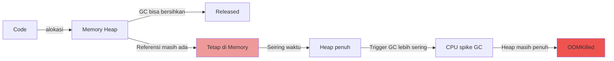

# Minggu 10 — Modul 03: Incident Memory Leak

> **"Memory usage naik terus seperti tangga, restart pod naik lagi ke titik tinggi. Beberapa jam kemudian OOMKilled."**

Memory leak bukan seperti OOMKilled burst (Minggu 9) — memory naik **perlahan**, bukan langsung crash. Bedanya:

```
OOMKilled (minggu 9):    ████░░░░░░░░░░░░░░░░░░░░░░░░░░░░░  (naik cepat ke limit, lalu crash)

Memory Leak (minggu 10): ░░░░▓▓▓▓▓▓▓▓▓▓▓▓▓▓▓▓▓▓▓▓▓▓▓▓▓▓  (naik pelan tapi pasti, 24 jam kemudian baru crash)
```

**Mengapa leak terjadi?** Kode yang **lupa melepaskan referensi** ke objek. Di bahasa dengan GC (Go, Java, Python), GC tidak bisa bersihkan kalau masih ada referensi. Di bahasa tanpa GC (C, Rust manual), programmer harus `free()` manual — kalau lupa, leak.

---

## 🎯 Tujuan Modul

1. Membedakan **memory leak** (naik terus) dari **OOMKilled burst** (langsung penuh)
2. Menggunakan **heap dump** untuk identifikasi objek apa yang menahan memory
3. Membaca **GC metrics** di Mimir untuk Go (`go_memstats_*`) atau JVM
4. Menerapkan **memory regression test** di CI sebagai prevention

---

## 🧠 Anatomi Memory Leak



**Contoh kode Go yang leak:**

```go
var cache = map[string][]byte{}

func handler(w http.ResponseWriter, r *http.Request) {
  key := r.URL.Query().Get("key")
  data := fetchFromDB(key)              // Ambil data besar
  
  cache[key] = data                     // ← MASUKKAN KE MAP
  // Tidak pernah dihapus! Cache akan penuh terus
}

func fetchFromDB(key string) []byte {
  // 1 MB data per request
  // Setelah 1000 request = 1 GB
  return make([]byte, 1024*1024)
}
```

**Akibat:** Setiap request tambah 1 MB ke cache. Setelah 1000 request, 1 GB. Setelah 65,535 request (kalau pakai uint16 sebagai key), akan return error out of memory.

---

## 🔍 Symptoms

### Symptom 1 — Memory Naik Terus (Mimir)

Buka dashboard **"Pod Resource Usage"**:
- Panel "Memory Working Set by Pod" → **grafik naik tangga**, tidak pernah turun
- Pattern: setelah restart, mulai dari rendah, naik lagi

### Symptom 2 — Restart Counter Naik, Tapi Memory Selalu Tinggi Setelah Restart

```
Time   | Memory After Restart | Steady State After 1h
-------|----------------------|----------------------
10:00  | 100 MB               | 350 MB
11:00  | 100 MB               | 380 MB (restart)
11:30  | 100 MB               | 400 MB
12:30  | 100 MB               | 420 MB (restart)
...
```

### Symptom 3 — Alert Firing

(Beberapa alert yang relevan dari Minggu 8):

```
[FIRING] ContainerMemoryHigh
  pod    = go-app-xxx
  memory = 480Mi / 512Mi (94% of limit)
  trend  = naik 5 MB/menit sejak restart
  severity = warning

[FIRING] PodOOMKilled     ← muncul setelah limit terlewati
```

### Symptom 4 — GC Pressure di Mimir (Go-specific)

```promql
# Go GC duration (sum)
rate(go_gc_duration_seconds_sum[5m])

# Heap allocation rate (bytes/s)
rate(go_memstats_alloc_bytes_total[5m])

# Number of GC cycles
rate(go_gc_duration_seconds_count[5m])
```

**Kalau GC naik** = heap penuh → GC harus kerja keras → CPU spike sekunder.

---

## 🕵️ Investigation — Multi-Source Correlation

### Step 1 — Konfirmasi Leak dengan Grafik Memory

```promql
# Memory over time per pod
container_memory_working_set_bytes{
  namespace="produksi",
  pod=~"go-app-.*"
}
```

**Pattern leak:** Grafik **linier naik** tanpa plateau.
**Pattern burst (bukan leak):** Spike lalu turun.
**Pattern GC delay:** Naik landai, plateau, lalu turun.

### Step 2 — Cek Restart History

```bash
kubectl get pods -n produksi -l app=go-app   -o custom-columns=NAME:.metadata.name,RESTARTS:.status.containerStatuses[0].restartCount
```

Kalau restart count > 10 tapi pod uptime pendek = leak yang solved sementara dengan restart.

### Step 3 — Cek Alokasi vs Heap (Go-specific)

```promql
# Heap allocated (current live objects)
go_memstats_alloc_bytes{namespace="produksi"}

# Heap in-use (OS-reported)
container_memory_working_set_bytes{namespace="produksi", pod="go-app-xxx"}

# Ratio: alloc_bytes / working_set
# Kalau ratio tinggi tapi working_set juga tinggi → heap banyak object hidup
```

### Step 4 — Heap Dump dengan pprof (Go)

```bash
# 1. Port-forward ke pprof endpoint
kubectl port-forward -n produksi <pod-name> 6060:6060 &

# 2. Capture heap profile
curl -o heap.prof http://localhost:6060/debug/pprof/heap

# 3. Analisis — TOP fungsi yang alokasi memory
go tool pprof -top -cum heap.prof

# Output contoh:
#       flat  flat%   sum%        cum   cum%
#    500.5MB 45.00% 45.00%   800.5MB 72.00%  github.com/user/app/cache.set
#         0     0% 45.00%   500.5MB 45.00%  github.com/user/app/handler.GetOrders
#         0     0% 45.00%   300.0MB 27.00%  runtime.allocM
```

**Insight:** 72% memory ada di `cache.set` → jelas ada leak di cache!

### Step 5 — Heap Dump dengan jmap (Java)

```bash
# 1. Exec ke dalam pod
kubectl exec -n produksi <pod-name> -- jmap -dump:live,format=b,file=/tmp/heap.bin 1

# 2. Copy ke lokal
kubectl cp insiden-lab/<pod-name>:/tmp/heap.bin ./heap.bin

# 3. Analisis dengan Eclipse MAT atau VisualVM
# Download di: https://www.eclipse.org/mat/
```

### Step 6 — Leak Canary dengan Alloc Objects (Go)

```bash
# Capture jumlah objek yang dialokasi, tapi tidak dilepas
curl http://localhost:6060/debug/pprof/heap > heap1.prof
sleep 60  # tunggu 1 menit
curl http://localhost:6060/debug/pprof/heap > heap2.prof

# Diff: objek mana yang tumbuh dalam 1 menit
go tool pprof -base=heap1.prof heap2.prof
# Output: fungsi mana yang membuat objek baru tanpa melepas
```

### Step 7 — Loki untuk Cross-Check

```logql
{namespace="produksi", app="go-app"} |= "memory" |= "alloc"
# Lihat apakah app log ada warning tentang memory

{namespace="produksi", app="go-app"} |= "GC" |= "pause"
# GC pause duration
```

---

## 🎯 Root Cause Analysis

### Tabel Diagnosis Memory Leak

| Gejala | Root Cause | Contoh |
|---|---|---|
| Heap naik linier, banyak `map[string]X` di heap dump | **Unbounded cache** | Global map tanpa eviction |
| Heap naik, banyak `goroutine` references | **Goroutine leak** | Channel never closed, goroutine stuck |
| Heap naik, banyak `*http.Request` | **Connection pool tidak ditutup** | defer resp.Body.Close() hilang |
| Heap naik, banyak `[]byte` di heap dump | **Buffer accumulation** | Stream tidak di-flush |
| Heap naik, tapi working_set stabil | **False alarm** | cgroup accounting vs heap beda |

### Contoh Nyata: Cache yang Tidak Pernah Di-evict

```go
// ❌ BAD: map tanpa batas
var userCache = map[int]User{}

func getUser(id int) User {
  if u, ok := userCache[id]; ok {
    return u
  }
  u := db.LoadUser(id)
  userCache[id] = u    // ← setiap user unik tambah entry
  return u
}
```

```go
// ✅ GOOD: pakai LRU cache dengan batas
import "github.com/hashicorp/golang-lru/v2"

var userCache *lru.Cache[int, User]

func init() {
  var err error
  userCache, err = lru.New[int, User](10_000) // max 10.000 entry
  if err != nil {
    panic(err)
  }
}

func getUser(id int) User {
  if u, ok := userCache.Get(id); ok {
    return u
  }
  u := db.LoadUser(id)
  userCache.Add(id, u)    // otomatis evict entry terlama kalau penuh
  return u
}
```

---

## 🛠️ Mitigation

### Opsi A — Restart Sekarang (Hot Fix)

```bash
# Rolling restart semua pod
kubectl rollout restart deployment/go-app -n produksi

# Tunggu selesai
kubectl rollout status deployment/go-app -n produksi
```

**WARNING:** Ini hanya redam dampak, bukan fix. Memory akan naik lagi.

### Opsi B — Patch Code (Real Fix)

Deploy versi baru yang fix leak:

```bash
# Patch image ke versi yang sudah fix
kubectl set image deployment/go-app -n produksi   go-app=registry.internal/go-app:v1.2.4-with-leakfix
```

### Opsi C — Temporary Mitigation: Restart Schedule

Sambil menunggu patch code, schedule restart berkala:

```bash
# CronJob restart setiap 6 jam
kubectl apply -f - <<EOF
apiVersion: batch/v1
kind: CronJob
metadata:
  name: restart-go-app
  namespace: produksi
spec:
  schedule: "0 */6 * * *"
  jobTemplate:
    spec:
      template:
        spec:
          serviceAccountName: deployment-restarter
          containers:
          - name: restart
            image: bitnami/kubectl:latest
            command:
            - /bin/sh
            - -c
            - kubectl rollout restart deployment/go-app -n produksi
          restartPolicy: Never
EOF
```

### Opsi D — Increase Limit Sambil Cari Fix

```bash
# Naikkan limit 2x untuk memperpanjang runway
kubectl set resources deployment/go-app -n produksi   --limits=memory=2Gi
```

### Opsi E — Enable Heap Dump on Restart

Pastikan app dump heap sebelum exit:

```go
// main.go (Go)
import "runtime/pprof"

func handleSIGTERM() {
  sig := <-signalCh
  if sig == syscall.SIGTERM {
    // Dump heap sebelum exit
    pprof.WriteHeapProfile(os.Stderr)
    os.Exit(0)
  }
}
```

---

## 🛡️ Prevention

### Prevention 1 — Memory Regression Test di CI

```yaml
# .gitlab-ci.yml
memory-regression:
  stage: test
  script:
  - |
    # Jalankan app dengan load
    docker-compose up -d app
    sleep 10
    
    # Capture heap baseline
    curl -s http://localhost:6060/debug/pprof/heap > /tmp/heap-initial.prof
    
    # Run load test 1000 request
    hey -n 1000 -c 10 http://localhost:8080/api/test
    
    # Capture heap after load
    curl -s http://localhost:6060/debug/pprof/heap > /tmp/heap-after.prof
    
    # Bandingkan: alokasi harusnya BOUNDED, tidak tumbuh linier
    go tool pprof -top -base=/tmp/heap-initial.prof /tmp/heap-after.prof > /tmp/mem-diff.txt
    
    # Threshold: heap growth < 50 MB setelah 1000 request
    GROWTH=$(grep -oE "[0-9]+\.[0-9]+MB" /tmp/mem-diff.txt | head -1 | sed 's/MB//')
    if (( $(echo "$GROWTH > 50" | bc -l) )); then
      echo "❌ Memory grew ${GROWTH}MB after 1000 requests — possible leak"
      exit 1
    fi
  allow_failure: false
```

### Prevention 2 — LRU Cache dengan Batas

**Aturan:** Jangan pernah pakai `map` global tanpa batas. Selalu gunakan:
- **LRU cache** dengan max size (Go: `hashicorp/golang-lru`)
- **TTL cache** (Redis, in-memory dengan expiration)
- **Weak reference** (kalau bahasa mendukung)

```go
// Quick reference: LRU cache libraries
// Go: github.com/hashicorp/golang-lru/v2
// Python: cachetools.LRUCache
// Node: lru-cache
// Java: com.google.common.cache.CacheBuilder
```

### Prevention 3 — Connection Pool dengan Batas

```go
// Go database/sql
db.SetMaxOpenConns(25)
db.SetMaxIdleConns(5)
db.SetConnMaxLifetime(5 * time.Minute)
db.SetConnMaxIdleTime(3 * time.Minute)
```

### Prevention 4 — Goroutine Pool (untuk Go)

```go
// Jangan pernah pakai go func() tanpa batas
// ❌ BAD
for _, job := range jobs {
  go processJob(job)  // 1000 jobs = 1000 goroutines!
}

// ✅ GOOD: pakai worker pool
const workerCount = 10
jobs := make(chan Job, 100)
var wg sync.WaitGroup
for w := 0; w < workerCount; w++ {
  wg.Add(1)
  go func() {
    defer wg.Done()
    for job := range jobs {
      processJob(job)
    }
  }()
}
for _, job := range jobs {
  jobs <- job
}
close(jobs)
wg.Wait()
```

### Prevention 5 — JVM Heap Tuning + Heap Dump on OOM

```yaml
env:
- name: JAVA_OPTS
  value: >-
    -XX:+HeapDumpOnOutOfMemoryError
    -XX:HeapDumpPath=/tmp/heapdump.hprof
    -XX:MaxRAMPercentage=75.0
    -XX:+UseG1GC
    -XX:+PrintGCDetails
```

### Prevention 6 — Alert Memory Trend (lebih awal dari OOM)

```yaml
- alert: MemoryTrendUp
  expr: |
    deriv(container_memory_working_set_bytes{pod=~"go-app-.*"}[30m]) > 50000
  for: 10m
  labels:
    severity: warning
  annotations:
    summary: "Pod {{ $labels.pod }} memory growing > 50 KB/s for 10 minutes (possible leak)"
```

**Logic:** Turunan (derivative) dari memory usage. Kalau memory naik > 50 KB/s selama 10 menit terus-menerus, kemungkinan leak. Alert ini firing **jauh sebelum** OOMKilled.

---

## 🧪 Verifikasi Recovery

```bash
# 1. Heap stabil setelah patch
curl http://localhost:6060/debug/pprof/heap > heap1.prof
sleep 600  # tunggu 10 menit
curl http://localhost:6060/debug/pprof/heap > heap2.prof
go tool pprof -base=heap1.prof heap2.prof

# Heap harusnya TUMBUH MINIMAL (bounded)
```

```bash
# 2. Cek Grafana — grafik memory plateau, tidak naik terus
# 3. Restart count stabil (tidak naik)
# 4. Alert [RESOLVED]
```

---

## 📖 Rangkuman

| Aspek | Catatan |
|---|---|
| **Symptom utama** | Memory naik tangga, restart tidak menyelesaikan |
| **Cara diagnosis** | pprof heap dump, GC metrics, jmap (Java) |
| **Root cause umum** | Unbounded cache, goroutine leak, connection tidak ditutup |
| **Mitigation** | Restart, patch code, scheduled restart, naikkan limit |
| **Prevention terbaik** | LRU cache + connection pool + memory regression test di CI |
| **Alert firing** | `ContainerMemoryHigh`, `MemoryTrendUp` (Minggu 8 + bonus) ✅ |

---

## ➡️ Modul 04: Disk Full

Memory leak = resource software (RAM) naik terus. Sekarang kita masuk **resource hardware**: disk. Node disk penuh = **semua pod di-evict** dari node itu.

👉 Lanjut ke `04-incident-disk-full.md`
