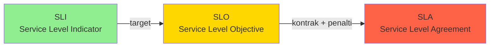

# Modul 01 — SLI, SLO, dan SLA: Bahasa Reliability SRE

> **Satu kalimat:** **SLI** adalah apa yang Anda ukur, **SLO** adalah target yang Anda janjikan ke tim internal, dan **SLA** adalah kontrak hukum yang Anda janjikan ke customer — bedanya tipis, tapi konsekuensinya sangat berbeda.

Modul ini adalah pondasi utama dari keseluruhan **Minggu 11: Reliability Engineering**. Sebelum Anda membuat dashboard, alert, atau on-call rotation, Anda HARUS paham tiga akronim ini. Salah satu kesalahan umum SRE pemula adalah menggunakan "availability 99.99%" di proposal tanpa tahu bahwa setiap tambahan **9** (disebut *"nine"*) itu harganya sangat mahal.

---

## 🎯 Learning Outcomes

1. Mendefinisikan **SLI** (Service Level Indicator) yang terukur dan bermakna.
2. Merancang **SLO** (Service Level Objective) yang realistis dengan ketersediaan & latency tertentu.
3. Memahami **SLA** (Service Level Agreement) sebagai kontrak bisnis/legal.
4. Menghitung **Error Budget** dari SLO.
5. Mengimplementasikan SLI/SLO di Mimir PromQL & Grafana Dashboard.

---

## 1. 🧠 Konsep Dasar: Tiga Akronim, Satu Tujuan

Bayangkan Anda punya **toko roti online**:

```
┌──────────────────────────────────────────────────────────────────┐
│                    Definisi Formal & Analogi Toko Roti            │
├──────────────────────────────────────────────────────────────────┤
│                                                                  │
│  SLI  =  Ukuran/alat ukur                                         │
│         "Berapa lama kasir memproses pesanan?"                    │
│         → Latency (ms), Error Rate (%), Throughput (req/s)         │
│         (Apa yang Anda UKUR)                                      │
│                                                                  │
│  SLO  =  Target dari SLI                                          │
│         "95% pesanan harus diproses < 200ms."                     │
│         → Persentase + Threshold + Jendela waktu                   │
│         (Apa yang Anda JANJIKAN ke tim internal)                  │
│                                                                  │
│  SLA  =  Kontrak & konsekuensi hukum                               │
│         "Jika pesanan gagal > 0.1% per bulan, customer            │
│          dapat refund 10%."                                       │
│         → SLO + Denda/Kompensasi                                  │
│         (Apa yang Anda JANJIKAN ke customer + bayar penalti)      │
│                                                                  │
└──────────────────────────────────────────────────────────────────┘
```

### Visualisasi Relasi Ketiganya



> **Aturan praktis:** `SLI (pengukuran) → SLO (target internal) → SLA (kontrak customer)`. SLA selalu **lebih longgar** dari SLO. Anda TIDAK BOHONG tentang SLO ke customer — Anda MENJUAL ruang aman.

---

## 2. 📏 SLI: Service Level Indicator (Apa yang Anda Ukur)

SLI adalah **rasio atau metrik** yang merepresentasikan kualitas servis dari sudut pandang user. Ada **4 kategori utama** SLI:

### 2.1 Empat Kategori SLI

| Kategori SLI | Definisi | Contoh Kueri di Mimir |
|---|---|---|
| **Availability** | Seberapa sering servis merespons sukses | `% request non-5xx` |
| **Latency** | Seberapa cepat servis merespons | `p95 response time < 200ms` |
| **Throughput** | Berapa banyak request yang bisa dilayani | `RPS capacity` |
| **Correctness** | Seberapa akurat hasilnya | `% data corruption`, `% duplicate order` |

### 2.2 Cara Mendefinisikan SLI yang Baik (SLI Specification)

Formula umum SLI adalah **perbandingan event "baik" vs total event**:

```text
SLI = (jumlah event "baik") / (jumlah event total) × 100%
```

**Contoh spesifikasi SLI untuk endpoint `/api/checkout`:**

```yaml
slis:
  - name: checkout_availability
    description: "Persentase request checkout yang berhasil (status 2xx)"
    spec: |
      sum(rate(http_requests_total{job="checkout-service",code=~"2xx"}[5m]))
      /
      sum(rate(http_requests_total{job="checkout-service"}[5m]))

  - name: checkout_latency_p95
    description: "Latency 95th percentile endpoint checkout"
    spec: |
      histogram_quantile(0.95,
        sum(rate(http_request_duration_seconds_bucket{job="checkout-service"}[5m])) by (le)
      )
```

> **Pelajaran Penting:** SLI yang baik harus **merepresentasikan user experience**, bukan metrik internal (CPU/Memory). User tidak peduli CPU Pod 80% — user peduli **"checkout berhasil dalam 200ms"**.

---

## 3. 🎯 SLO: Service Level Objective (Target Internal)

SLO adalah **target kuantitatif** dari SLI yang ingin Anda capai dalam periode waktu tertentu. Bentuk SLO selalu: **`SLI ≤ threshold` selama `X% window time`**.

### 3.1 Contoh SLO yang Realistis

```text
SLO 1: Availability
  "99.9% request checkout akan sukses dalam periode 30 hari"
  Artinya: maksimal 43 menit 49 detik downtime per bulan.

SLO 2: Latency
  "95% request checkout akan selesai dalam < 200ms (5 min window)"
  Artinya: hanya 5% request boleh lambat.

SLO 3: Durability (untuk data)
  "99.999% data transaksi tidak akan hilang dalam periode 1 tahun"
  Artinya: 5 menit downtime data corruption per tahun.
```

### 3.2 Tabel Standar Tier Availability

| Tier | Availability | Max Downtime / Bulan | Max Downtime / Tahun | Contoh |
|---|---|---|---|---|
| **1-nine** | 90% | 72 jam | 36.5 hari | Portfolio pribadi |
| **2-nine** | 99% | 7 jam 18 menit | 3.65 hari | Landing page marketing |
| **3-nine** | 99.9% | 43 menit 49 detik | 8 jam 45 menit | **Standard SaaS** |
| **4-nine** | 99.99% | 4 menit 23 detik | 52 menit 33 detik | Stripe, Google APIs |
| **5-nine** | 99.999% | 26.3 detik | 5 menit 15 detik | Bank core system, telco |
| **6-nine** | 99.9999% | 2.6 detik | 31.5 detik | Mars Rover, NASA mission |

> **Rumus Cepat:**
> ```
> Downtime per bulan = (1 - SLO) × 30 hari × 24 jam × 60 menit
> Contoh: 99.9% = 0.001 × 30 × 24 × 60 = 43.2 menit / bulan
> ```

### 3.3 Cara Menentukan SLO yang Realistis

**Langkah 1: Kumpulkan data historis**
Lihat 30 hari terakhir dari SLI aktual. Jangan tebak.

```promql
# Hitung availability aktual bulan lalu
sum(rate(http_requests_total{job="checkout-service",code=~"2xx"}[30d]))
/
sum(rate(http_requests_total{job="checkout-service"}[30d]))
# Hasil: 99.78% (baseline)
```

**Langkah 2: Pilih angka SLO yang LEBIH KETAT dari baseline**
Tambahkan **headroom 0.1-0.5%** di bawah baseline agar tim punya ruang untuk improvement.

```text
Baseline aktual: 99.78%
SLO yang dipilih: 99.5%  ← Headroom 0.28% (banyak ruang untuk error)
```

**Langkah 3: Tentukan window time**
- **Window pendek (1 jam - 1 hari):** Cocok untuk alert real-time.
- **Window panjang (30 hari):** Cocok untuk evaluasi mingguan/bulanan & business reporting.

---

## 4. 📜 SLA: Service Level Agreement (Kontrak Customer)

SLA adalah **kontrak legal** antara Anda dan customer. SLA **harus lebih longgar** dari SLO internal. Idealnya:

```
SLA = SLO - Safety Margin (biasanya 0.1-0.3%)
```

### 4.1 Anatomi SLA

```text
┌────────────────────────────────────────────────────────────────────┐
│  Service Level Agreement (SLA) Toko Online "SehatBersama"         │
│                                                                    │
│  1. JANJI KINERJA:                                                 │
│     a) Availability ≥ 99.5% per bulan kalender.                   │
│     b) API Latency p95 < 500ms (diukur mingguan).                  │
│                                                                    │
│  2. KOMPENSASI KEGAGALAN:                                          │
│     - Downtime > 4 jam/bulan: refund 10% biaya langganan.          │
│     - Downtime > 8 jam/bulan: refund 25% biaya langganan.          │
│     - Downtime > 24 jam/bulan: terminasi kontrak + refund 100%.   │
│                                                                    │
│  3. PENGECUALIAN:                                                  │
│     - Gangguan akibat force majeure, maintenance terjadwal         │
│       (≥72 jam notifikasi), atau kesalahan user.                  │
│                                                                    │
│  4. PROSES KLAIM:                                                  │
│     Customer mengajukan klaim dalam 14 hari setelah insiden.       │
└────────────────────────────────────────────────────────────────────┘
```

### 4.2 Studi Kasus: Kenapa SLO ≠ SLA

> **Skenario:** Anda punya SLO 99.95%. Anda promise SLA 99.9% ke customer.
>
> - **SLO breach** = 99.92% (turun dari 99.95%) → internal alarm, tim on-call di-blast.
> - **SLA breach** = 99.85% (turun dari 99.9%) → customer berhak refund 10%.
>
> SLO breach **TIDAK BERARTI** SLA breach. Anda punya **buffer 0.05%** untuk selamatkan customer relationship.

---

## 5. 🧮 Menghitung Error Budget (Anggaran Kesalahan)

Error Budget adalah **"izin"** untuk gagal. Filosofinya: **100% reliability itu TIDAK REALISTIS dan TIDAK EFISIEN**. Google SRE mengajarkan:

> *"If your service's reliability is a function of the cost of redundancy, 100% reliability is essentially impossible — and pursuit of it will distract you from improving the product."* — Google SRE Workbook

### 5.1 Rumus Error Budget

```text
Error Budget = 1 - SLO
```

**Contoh untuk SLO 99.9% per bulan:**
```text
Error Budget = 1 - 0.999 = 0.001 = 0.1% per bulan
              = 43.2 menit downtime per bulan
              = 21,600 request gagal (jika rata-rata 50 RPS)
```

### 5.2 Tracking Error Budget di Mimir

```yaml
# PrometheusRule untuk Error Budget Tracking
apiVersion: monitoring.coreos.com/v1
kind: PrometheusRule
metadata:
  name: error-budget-sli
  namespace: monitoring
spec:
  groups:
  - name: error_budget_alerts
    interval: 30s
    rules:
    # Recording rule: error budget remaining dalam menit per bulan
    - record: slo:checkout_availability:ratio_30d
      expr: |
        sum(rate(http_requests_total{job="checkout-service",code=~"2xx"}[30d]))
        /
        sum(rate(http_requests_total{job="checkout-service"}[30d]))

    - record: slo:checkout_error_budget:remaining_minutes_30d
      expr: |
        (1 - slo:checkout_availability:ratio_30d) * 30 * 24 * 60
        # Minutes of downtime allowed in remaining budget

    - record: slo:checkout_error_budget:burn_rate_5m
      expr: |
        1 - (
          sum(rate(http_requests_total{job="checkout-service",code=~"2xx"}[5m]))
          /
          sum(rate(http_requests_total{job="checkout-service"}[5m]))
        )
        # Bagaimana cepat budget terbakar dalam 5 menit terakhir
```

### 5.3 Burn Rate Alert (Alert Kebocoran Budget)

Konsep penting dari Google SRE Workbook: **Multi-Window Multi-Burn-Rate Alert**.

```yaml
    # Alert 1: Burn rate tinggi dalam window pendek (insiden besar)
    - alert: SLO_HighBurnRate_Fast
      expr: |
        (
          1 - (
            sum(rate(http_requests_total{job="checkout-service",code=~"2xx"}[5m]))
            /
            sum(rate(http_requests_total{job="checkout-service"}[5m]))
          )
        ) > (14.4 * 0.001)  # 14.4x lipat dari target burn rate
      for: 2m
      labels:
        severity: critical
        slo: checkout
      annotations:
        summary: "Error budget terbakar 14x lebih cepat! Insiden serius!"

    # Alert 2: Burn rate medium dalam window panjang
    - alert: SLO_ModerateBurnRate_Slow
      expr: |
        (
          1 - (
            sum(rate(http_requests_total{job="checkout-service",code=~"2xx"}[1h]))
            /
            sum(rate(http_requests_total{job="checkout-service"}[1h]))
          )
        ) > (1 * 0.001)
      for: 5m
      labels:
        severity: warning
        slo: checkout
      annotations:
        summary: "Error budget bocor perlahan - perlu investigasi"
```

---

## 6. 🛠️ Praktik: Mendefinisikan SLO untuk Mini Production Platform

### Skenario: Toko Online "SehatBersama"

Anda punya arsitektur dari Week 1-10:
- **Go API** (checkout-service)
- **Postgres** (database)
- **Redis** (cache session)
- **Prometheus, Loki, Tempo** (observability)

### 6.1 Definisikan SLI

```yaml
# File: minggu-11/manifests/01-slo-spec.yaml
apiVersion: v1
kind: ConfigMap
metadata:
  name: slo-specification
  namespace: monitoring
data:
  sli.yaml: |
    service: checkout-service
    slis:
      - name: availability
        description: "Persentase HTTP 2xx dari total request"
        good_events: code=~"2xx"
        total_events: code=~".+"
        objective: 99.9
      
      - name: latency_p95
        description: "95% request selesai < 200ms"
        threshold: 0.2  # 200ms dalam detik
        percentile: 95
        objective: 95.0  # 95% request harus < 200ms
```

### 6.2 Buat SLO Recording Rules

```yaml
apiVersion: monitoring.coreos.com/v1
kind: PrometheusRule
metadata:
  name: checkout-slo-recording
  namespace: monitoring
spec:
  groups:
  - name: checkout_slo
    interval: 30s
    rules:
    # Availability SLI 5 menit (untuk short-window alert)
    - record: sli:checkout:availability:ratio_5m
      expr: |
        sum(rate(http_requests_total{job="checkout-service",code=~"2xx"}[5m]))
        /
        sum(rate(http_requests_total{job="checkout-service"}[5m]))

    # Availability SLI 30 hari (untuk monthly reporting)
    - record: sli:checkout:availability:ratio_30d
      expr: |
        sum(rate(http_requests_total{job="checkout-service",code=~"2xx"}[30d]))
        /
        sum(rate(http_requests_total{job="checkout-service"}[30d]))

    # Latency p95 SLI 5 menit
    - record: sli:checkout:latency_p95:seconds_5m
      expr: |
        histogram_quantile(0.95,
          sum(rate(http_request_duration_seconds_bucket{job="checkout-service"}[5m])) by (le)
        )
```

### 6.3 Buat Dashboard Error Budget di Grafana

Tambahkan panel-panel berikut di dashboard SRE:

| Panel | Query Mimir |
|---|---|
| **Availability Current** | `sli:checkout:availability:ratio_5m * 100` |
| **SLO Target Line** | `99.9` (konstanta) |
| **Error Budget Remaining (menit)** | `slo:checkout_error_budget:remaining_minutes_30d` |
| **Burn Rate (1h)** | `slo:checkout_error_budget:burn_rate_5m * 3600` |
| **Days to Exhaustion** | `slo:checkout_error_budget:remaining_minutes_30d / 60 / 24` (jika burn rate stabil) |

---

## 7. ✅ Prinsip "Good SLO"

Berikut checklist SLO yang baik menurut Google SRE:

- [x] **User-focused:** Mengukur apa yang user alami, bukan internal metric.
- [x] **Achievable:** Angka 99.9% lebih baik dari 99.99% yang tidak realistis.
- [x] **Simple:** Hanya 3-5 SLO per servis, jangan over-engineer.
- [x] **Time-bounded:** Ada periode jelas (1 hari, 30 hari, 1 tahun).
- [x] **Actionable:** Breach → ada tim yang responsible dan proses perbaikan.
- [x] **Reviewed berkala:** Evaluasi tiap quarter, adjust sesuai kemampuan tim.

### Anti-pattern SLO yang Harus Dihindari

| Anti-pattern | Contoh Salah | Yang Benar |
|---|---|---|
| **SLO tanpa consequence** | "Target 99.9%" tapi tidak ada action saat breach | Breach → pause deployment / fix root cause |
| **SLO berdasarkan CPU/Memory** | "Pod CPU < 80%" | "User request latency < 200ms" |
| **Terlalu banyak SLO** | 20 SLI per service | Pilih 2-3 yang paling critical |
| **SLO lebih ketat dari SLA** | SLO 99.95%, SLA 99.99% | SLA selalu lebih longgar dari SLO |
| **Tidak ada window time** | "99.9% selamanya" | "99.9% dalam 30 hari rolling" |

---

## 8. 📋 Cheat Sheet: SLI vs SLO vs SLA

```text
ASPEK           | SLI                       | SLO                              | SLA
----------------|---------------------------|----------------------------------|---------------------------------
Audience        | Internal (tim dev)        | Internal (product + tim SRE)     | External (customer + legal)
Bentuk          | Rasio (%) atau metrik     | Target kuantitatif               | Kontrak + kompensasi
Contoh          | "p95 latency = 145ms"     | "p95 < 200ms untuk 95% req"      | "jika latency > 500ms refund 5%"
Konsekuensi     | Observasi                 | Pause deploy / postmortem        | Refund / penalty / churn
Window          | Real-time (5m)            | Bulanan / kuartalan              | Bulanan / tahunan
Jumlah          | 5-10 per service          | 2-3 per service                  | 1-2 per service
Tools           | Prometheus / Mimir        | Recording rules + alerting       | CRM + legal team
```

---

## 9. ✏️ Latihan Mandiri

1. **Tentukan 3 SLO** untuk servis `payment-processor` Anda (availability, latency, error rate). Tulis dalam format SMART.
2. **Hitung error budget** untuk SLO 99.5% availability selama 1 bulan. Berapa menit downtime yang diizinkan?
3. **Buat recording rule** untuk latency p99 di Mimir.
4. **Evaluasi SLO lama:** Apakah SLO "99.99%" yang dijanjikan ke customer Anda realistic untuk tim 2-engineer? Kapan harus turun ke 99.9%?

---

**Lanjut ke Modul 02:** [02-error-budget.md](./02-error-budget.md) — bagaimana menggunakan Error Budget sebagai kompas keputusan trade-off reliability vs feature velocity.
