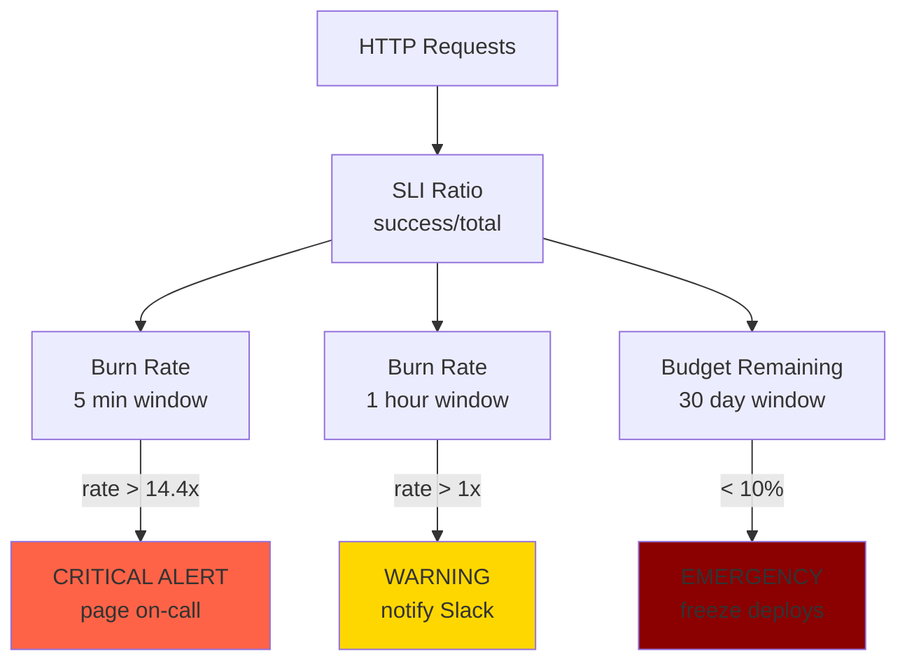

# Modul 02 — Error Budget: Kompas Keputusan Reliability vs Velocity

> **Satu kalimat:** **Error Budget** adalah jumlah kegagalan yang **diizinkan** oleh bisnis — Anda "membelanjakan" budget setiap kali ada insiden, dan ketika budget habis, Anda **berhenti deploy fitur baru** dan fokus 100% ke reliability sampai budget terisi ulang.

Bayangkan rekening bank Anda. Anda bisa belanja sampai saldo nol, tapi TIDAK boleh over-draft. Error budget adalah saldo reliability Anda: deposit di awal periode (1 - SLO), dan setiap insiden mengurangi saldo. Habis? Freeze semua perubahan fitur.

Modul ini adalah implementasi filosofi **"You build it, you run it"** ala Google SRE.

---

## 🎯 Learning Outcomes

1. Memahami filosofi Error Budget sebagai **trade-off tool** antara reliability & feature velocity.
2. Menghitung **error budget consumption** harian, mingguan, dan bulanan.
3. Mengimplementasikan **Multi-Window Multi-Burn-Rate Alert** ala Google SRE Workbook.
4. Membuat kebijakan organisasi: **apa yang terjadi saat budget habis**?
5. Mendesain dashboard Error Budget real-time di Grafana.

---

## 1. 🧠 Filosofi: Kenapa 100% Reliability Itu MUSUH Produk

Ada sebuah paradoks yang sering tidak disadari pendiri startup:

```
┌──────────────────────────────────────────────────────────────────┐
│       Paradoks Reliability vs Feature Velocity                  │
│                                                                  │
│   Reliability 100%                                              │
│        ▲                                                         │
│  100%  │                                                         │
│        │  ●← Target ideal tapi TIDAK REALISTIS                    │
│   99%  │                                                         │
│        │                                                         │
│   95%  │                                                         │
│        │                                                         │
│   90%  │       ●  Sweet spot kebanyakan SaaS                     │
│        │                                                         │
│   80%  │                                                         │
│        │  ●  TIDAK profitable (customer churn)                   │
│        └──────────────────────────────────────────────►           │
│              Feature Velocity (fitur per quarter)                │
└──────────────────────────────────────────────────────────────────┘
```

> **Kutipan Google SRE:**
> *"100% is the wrong target for basically everything. If you achieve 100%, you've overbuilt. The cost of that last 0.001% is astronomical."*

### Cost of Last 9's (Berapa Harga Setiap Tambahan "Nine")

| Tier | Downtime/Year | Engineering Cost | Contoh Real |
|---|---|---|---|
| 99% (2-nine) | 3.65 hari | 1-2 SRE | Landing page |
| 99.9% (3-nine) | 8.7 jam | 3-5 SRE | Standard SaaS |
| 99.99% (4-nine) | 52 menit | 15-25 SRE | Stripe, Twilio |
| 99.999% (5-nine) | 5 menit | 50-100 SRE | Bank core |
| 99.9999% (6-nine) | 31 detik | 500+ SRE | NASA mission control |

**Untuk tim 2-engineer di laptop**, **3-nine (99.9%)** sudah lebih dari cukup.

---

## 2. 💰 Anatomi Error Budget

### 2.1 Formula

```text
Error Budget = (1 - SLO) × Window Time
```

**Contoh untuk SLO 99.9% per bulan (30 hari):**
```text
Error Budget = (1 - 0.999) × 30 hari × 24 jam × 60 menit
             = 0.001 × 43,200 menit
             = 43.2 menit downtime per bulan
```

### 2.2 Jenis Budget yang Bisa Di-track

| Tipe | Apa yang Dihitung | Tools |
|---|---|---|
| **Availability Budget** | Downtime insiden (5xx, pod crash) | Prometheus + Alertmanager |
| **Latency Budget** | Request yang melebihi threshold latency | Histogram + recording rules |
| **Durability Budget** | Data loss / corruption events | Custom metric dari backup tool |
| **Correctness Budget** | Bug yang sampai ke production | Sentry / error tracker |

---

## 3. 📉 Visualisasi: Burn Rate & Days to Exhaustion

### 3.1 Burn Rate = Seberapa Cepat Budget Terbakar

```text
Burn Rate = (Current Error Rate) / (Target Error Rate)
```

**Contoh untuk SLO 99.9%:**
```text
Target Error Rate per detik = 0.001 / 30 hari = 3.86e-7 error/detik
                              = 1 error per ~30 hari

Burn Rate 1x   = membakar budget pas sesuai jadwal (sustainable)
Burn Rate 2x   = budget habis 2x lebih cepat
Burn Rate 14.4x = budget habis dalam 2 hari (insiden serius)
```

### 3.2 Days to Exhaustion

```text
Days to Exhaustion = Error Budget Remaining / (Current Burn Rate per Day)
```

**Contoh:** Budget tersisa 30 menit, current burn 5 menit/hari → 6 hari ke depan budget habis.

---

## 4. 🛡️ Multi-Window Multi-Burn-Rate Alert (Google SRE Workbook)

Alert sederhana `"error rate > 1%"` memiliki **dua kelemahan fatal**:
- **False positive:** Spike 2 menit langsung bunyi → pager fatigue.
- **False negative:** Insiden lambat 0.5% per jam tidak ter-detect sampai 12 jam.

Solusi Google SRE: **gabungkan 2 window pendek + 2 window panjang**. Alarm hanya berbunyi jika **keduanya** trigger:

```yaml
apiVersion: monitoring.coreos.com/v1
kind: PrometheusRule
metadata:
  name: error-budget-multiwindow
  namespace: monitoring
spec:
  groups:
  - name: multiwindow_burnrate
    interval: 30s
    rules:
    # === WINDOW PENDEK: Deteksi cepat insiden akut ===
    - alert: SLO_HighBurn_FastBurn
      # Error rate dalam 5 menit > 14.4x target burn rate
      expr: |
        (
          1 - (
            sum(rate(http_requests_total{job="checkout-service",code=~"2xx"}[5m]))
            /
            sum(rate(http_requests_total{job="checkout-service"}[5m]))
          )
        ) > (14.4 * 0.001)
      for: 2m
      labels:
        severity: critical
        team: sre-oncall
        page: pagerduty
      annotations:
        summary: "INSIDEN KRITIS: Error budget terbakar 14x lebih cepat dari target"

    # === WINDOW PANJANG: Deteksi kebocoran lambat ===
    - alert: SLO_ModerateBurn_SlowBurn
      # Error rate dalam 1 jam > 1x target burn rate
      expr: |
        (
          1 - (
            sum(rate(http_requests_total{job="checkout-service",code=~"2xx"}[1h]))
            /
            sum(rate(http_requests_total{job="checkout-service"}[1h]))
          )
        ) > (1 * 0.001)
      for: 5m
      labels:
        severity: warning
        team: sre-oncall
      annotations:
        summary: "Budget bocor perlahan: window 1 jam menunjukkan degradasi"

    # === BUDGET HABIS (emergency) ===
    - alert: SLO_BudgetExhausted
      # Error budget < 10% dari total budget
      expr: |
        (slo:checkout_error_budget:remaining_minutes_30d / 43.2) < 0.1
      for: 1m
      labels:
        severity: critical
        freeze: feature-deploy
      annotations:
        summary: "ERROR BUDUCT HABIS 90%! Feature deployment HARUS di-pause!"
```

### Visualisasi Multi-Window Alert



---

## 5. 📊 Dashboard Error Budget Real-Time

File: `minggu-11/manifests/02-error-budget-dashboard.json` (Grafana Dashboard JSON)

```json
{
  "title": "Checkout Service — Error Budget Dashboard",
  "uid": "err-budget-checkout",
  "panels": [
    {
      "title": "Current Availability (5m)",
      "type": "stat",
      "targets": [{
        "expr": "sli:checkout:availability:ratio_5m * 100",
        "legendFormat": "Current"
      }],
      "fieldConfig": {
        "defaults": {
          "unit": "percent",
          "thresholds": {
            "steps": [
              {"value": 99.95, "color": "green"},
              {"value": 99.5, "color": "yellow"},
              {"value": 99.0, "color": "red"}
            ]
          }
        }
      }
    },
    {
      "title": "Error Budget Remaining (Minutes per 30d)",
      "type": "gauge",
      "targets": [{
        "expr": "slo:checkout_error_budget:remaining_minutes_30d"
      }],
      "fieldConfig": {
        "defaults": {
          "max": 43.2,
          "min": 0,
          "unit": "short",
          "thresholds": {
            "steps": [
              {"value": 21.6, "color": "green"},
              {"value": 8.64, "color": "yellow"},
              {"value": 0, "color": "red"}
            ]
          }
        }
      }
    },
    {
      "title": "Days to Budget Exhaustion",
      "type": "stat",
      "targets": [{
        "expr": "slo:checkout_error_budget:remaining_minutes_30d / 60 / 24"
      }],
      "fieldConfig": {
        "defaults": {
          "unit": "short",
          "thresholds": {
            "steps": [
              {"value": 7, "color": "green"},
              {"value": 3, "color": "yellow"},
              {"value": 1, "color": "red"}
            ]
          }
        }
      }
    },
    {
      "title": "Burn Rate (1h, 6h, 24h)",
      "type": "timeseries",
      "targets": [
        {
          "expr": "slo:checkout_error_budget:burn_rate_5m * 3600",
          "legendFormat": "1h burn"
        },
        {
          "expr": "slo:checkout_error_budget:burn_rate_5m * 6 * 3600",
          "legendFormat": "6h burn (extrapolated)"
        }
      ]
    },
    {
      "title": "Budget History (30 Days)",
      "type": "timeseries",
      "targets": [{
        "expr": "slo:checkout_error_budget:remaining_minutes_30d"
      }],
      "fieldConfig": {
        "defaults": {
          "unit": "short"
        }
      }
    }
  ]
}
```

---

## 6. 🎯 Kebijakan Organisasi: Apa yang Terjadi saat Budget Habis?

### 6.1 Tier-Based Response Policy

| Budget Remaining | Status | Tindakan Wajib |
|---|---|---|
| **> 50%** | 🟢 Hijau | Business as usual. Deploy fitur, eksperimen. |
| **25-50%** | 🟡 Kuning | **Hold** risky deploy (schema migration besar). Prioritaskan bug fix reliability. |
| **10-25%** | 🟠 Oranye | **Freeze** semua fitur baru. 100% bandwidth ke reliability. |
| **< 10%** | 🔴 Merah | **Code freeze total.** Hanya incident response. Weekly postmortem sampai pulih. |

### 6.2 Contoh SOP saat Budget Habis

```text
┌────────────────────────────────────────────────────────────────┐
│  SOP: Error Budget Yellow Alert (25% remaining)                │
├────────────────────────────────────────────────────────────────┤
│                                                                │
│  1. SRE on-call membuat incident channel #inc-budget-yellow.   │
│  2. PM/Tech Lead meeting 30 menit untuk root cause budget bocor.│
│  3. Engineering Manager:                                       │
│     - Pause semua PR yang belum merged.                        │
│     - Cancel sprint backlog yang terkait fitur baru.           │
│  4. Engineering team:                                          │
│     - Fokus ke backlog reliability items.                      │
│     - Boleh merge hotfix, tapi harus di-review 2 engineer.     │
│  5. Marketing: hold release notes untuk minggu depan.          │
│                                                                │
│  RESET trigger: budget > 50% (biasanya awal bulan / quarter). │
└────────────────────────────────────────────────────────────────┘
```

---

## 7. 🛠️ Hands-On Lab: Implementasi Error Budget Tracking

### 7.1 Deploy Recording Rules + Alerts

File: `minggu-11/manifests/02-error-budget-rules.yaml`

```yaml
apiVersion: monitoring.coreos.com/v1
kind: PrometheusRule
metadata:
  name: error-budget-full-implementation
  namespace: monitoring
  labels:
    app: checkout-service
    slo: enabled
spec:
  groups:
  - name: sli_recording
    interval: 30s
    rules:
    - record: sli:checkout:availability:ratio_5m
      expr: |
        sum(rate(http_requests_total{job="checkout-service",code=~"2xx"}[5m]))
        /
        sum(rate(http_requests_total{job="checkout-service"}[5m]))
    - record: sli:checkout:availability:ratio_30d
      expr: |
        sum(rate(http_requests_total{job="checkout-service",code=~"2xx"}[30d]))
        /
        sum(rate(http_requests_total{job="checkout-service"}[30d]))

  - name: error_budget_recording
    interval: 30s
    rules:
    - record: slo:checkout_error_budget:remaining_minutes_30d
      expr: |
        (1 - sli:checkout:availability:ratio_30d) * 30 * 24 * 60
    - record: slo:checkout_error_budget:burn_rate_5m
      expr: |
        1 - sli:checkout:availability:ratio_5m
    - record: slo:checkout_error_budget:days_to_exhaustion
      expr: |
        slo:checkout_error_budget:remaining_minutes_30d / 60 / 24
        /
        (slo:checkout_error_budget:burn_rate_5m * 86400)
        # Jika burn rate stabil 0, fallback ke nilai besar
        or vector(30)

  - name: error_budget_alerts
    rules:
    - alert: SLO_BudgetBelow25Percent
      expr: slo:checkout_error_budget:remaining_minutes_30d < 10.8
      for: 5m
      labels:
        severity: warning
        team: sre
      annotations:
        summary: "Error budget checkout < 25% (tersisa {{ $value | printf \"%.1f\" }} menit)"

    - alert: SLO_BudgetBelow10Percent
      expr: slo:checkout_error_budget:remaining_minutes_30d < 4.32
      for: 5m
      labels:
        severity: critical
        team: sre
        freeze: feature-deploy
      annotations:
        summary: "ERROR BUDGET < 10%! Feature deployment harus di-pause!"
        action: "Tarik semua PR fitur baru, fokus ke reliability backlog."
```

### 7.2 Apply & Verifikasi

```bash
$ kubectl apply -f manifests/02-error-budget-rules.yaml
prometheusrule.monitoring.coreos.com/error-budget-full-implementation created

# Tunggu 5 menit untuk window 30d terakumulasi, lalu cek di Grafana:
# Explore → query: slo:checkout_error_budget:remaining_minutes_30d
```

### 7.3 Simulasi Budget Terbakar (Chaos Test)

Jalankan stress test untuk melihat burn rate naik:

```bash
# 1. Inject 50% error rate selama 5 menit
$ kubectl exec -it deployment/checkout-service -- sh -c '
  while true; do
    # Force error response
    curl -s http://localhost:8080/__chaos?error=true
    sleep 0.1
  done
'

# 2. Observe burn rate di Grafana
# Burn rate harus naik dari 0 ke 0.5 (50% error rate)
# Setelah 5 menit, alert SLO_HighBurn_FastBurn akan firing

# 3. Stop chaos
$ pkill -f curl
```

### 7.4 Observasi Alert

```bash
# Cek alert status
$ kubectl exec -n monitoring deployment/prometheus -- \
  promtool query instant 'ALERTS{slo="checkout",alertstate="firing"}'
ALERTS{alertname="SLO_HighBurn_FastBurn",...}  1
ALERTS{alertname="SLO_BudgetBelow10Percent",...}  0  # belum trigger (window 30d)
```

---

## 8. 🔗 Integrasi dengan Slack / PagerDuty

File: `minggu-11/manifests/02-alertmanager-config.yaml`

```yaml
apiVersion: v1
kind: ConfigMap
metadata:
  name: alertmanager-config
  namespace: monitoring
data:
  alertmanager.yaml: |
    route:
      receiver: 'sre-default'
      routes:
      - matchers:
        - slo = "checkout"
        - severity = "critical"
        receiver: 'pagerduty-oncall'
        continue: true
      - matchers:
        - slo = "checkout"
        - severity = "warning"
        receiver: 'slack-sre'
      - matchers:
        - freeze = "feature-deploy"
        receiver: 'slack-eng-leads'
    
    receivers:
    - name: 'sre-default'
      slack_configs:
      - channel: '#sre-alerts'
        title: 'SRE Alert: {{ .GroupLabels.alertname }}'
    
    - name: 'pagerduty-oncall'
      pagerduty_configs:
      - service_key: 'PD_INTEGRATION_KEY_HERE'
        description: 'CRITICAL: {{ .CommonAnnotations.summary }}'
    
    - name: 'slack-sre'
      slack_configs:
      - channel: '#sre-monitoring'
    
    - name: 'slack-eng-leads'
      slack_configs:
      - channel: '#eng-leadership'
        title: 'FEATURE FREEZE: {{ .CommonAnnotations.summary }}'
```

---

## 9. 📋 Cheat Sheet: Error Budget Decision Matrix

```text
BUDGET STATUS  | BURN RATE | TINDAKAN
---------------|-----------|--------------------------------------------------
> 50%          | < 1x      | Deploy fitur seperti biasa. Enjoy!
> 50%          | > 1x      | Investigasi kebocoran. Hold deploy fitur.
25-50%         | < 1x      | Riset penyebab budget bocor. Hold risky deploy.
25-50%         | > 1x      | Pause deploy, fix root cause.
10-25%         | Any       | Freeze fitur. Fokus ke reliability backlog.
< 10%          | Any       | Total code freeze. Pager on incident only.
0% / negative  | -         | EMERGENCY. All-hands. Customer notification.
```

---

## 10. ✏️ Latihan Mandiri

1. **Hitung error budget** untuk SLO 99.5% availability selama 7 hari. Berapa menit downtime diizinkan?
2. **Buat recording rule** untuk latency budget (p95 < 200ms, target 95% request).
3. **Simulasikan burn rate 2x** selama 3 hari di Grafana. Kapan budget habis?
4. **Tulis SOP** untuk tim Anda: "Apa yang harus dilakukan saat alert `SLO_BudgetBelow10Percent` firing?"

---

**Lanjut ke Modul 03:** [03-capacity-planning.md](./03-capacity-planning.md) — bagaimana merencanakan kapasitas infrastruktur agar SLO tercapai dengan biaya optimal.
