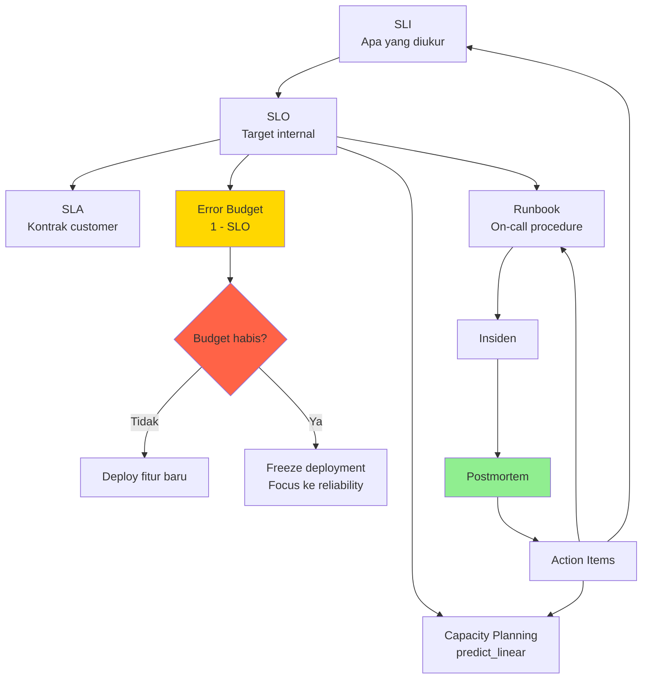

# Minggu 11 — Reliability Engineering (SLI/SLO/SLA & Error Budget)

Selamat datang di **Minggu 11: Reliability Engineering**. Setelah 10 minggu membangun infrastruktur, sekarang saatnya Anda **berpikir seperti SRE (Site Reliability Engineer)** — orang yang bertanggung jawab memastikan platform tetap andal **sekaligus** produktif mengembangkan fitur baru.

Filosofi inti minggu ini: **100% reliability itu MUSUH produk.** Yang penting adalah **menyeimbangkan** reliability dengan feature velocity menggunakan **Error Budget** sebagai kompas.

---

## 📚 Daftar Modul Pembelajaran

| Modul | Judul | Deskripsi Ringkas |
|---|---|---|
| **[01](./01-sli-slo-sla.md)** | **SLI, SLO, dan SLA** | Bahasa reliability: apa yang Anda ukur, apa yang Anda janjikan, dan apa yang Anda kontrak-kan. |
| **[02](./02-error-budget.md)** | **Error Budget** | Anggaran kegagalan: kapan harus freeze deploy, kapan boleh release fitur baru. |
| **[03](./03-capacity-planning.md)** | **Capacity Planning** | Prediksi kebutuhan resource dengan `predict_linear()`, VPA right-sizing, growth modeling. |
| **[04](./04-runbook.md)** | **Runbook untuk On-Call** | Prosedur eksekusi untuk engineer pukul 3 pagi: 5 runbook wajib + integrasi Alertmanager. |
| **[05](./05-postmortem.md)** | **Blameless Postmortem** | Belajar dari kegagalan: timeline analysis, 5-Whys, action items SMART, Google SRE template. |

---

## 🎯 Capaian Minggu 11 (Learning Outcomes)

Setelah menyelesaikan minggu ini, Anda mampu:

1. **Mendefinisikan SLO** yang realistis untuk setiap service (availability, latency, error rate).
2. **Menghitung Error Budget** dan mengimplementasikan Multi-Window Multi-Burn-Rate Alert.
3. **Merancang capacity model** dengan `predict_linear()` PromQL dan VPA recommender.
4. **Menulis runbook** yang executable untuk 5+ skenario insiden Kubernetes umum.
5. **Menulis postmortem** blameless dengan timeline akurat dan action items SMART.
6. **Memimpin postmortem meeting** tanpa menyalahkan individu.

---

## 🗺️ Peta Konsep: Reliabilitas sebagai Sistem



---

## 📊 Cheat Sheet SRE Final

### Tabel SLO Standar untuk SaaS

| Tipe Service | Availability SLO | Latency p95 | Error Rate |
|---|---|---|---|
| **API Public** | 99.9% | < 200ms | < 0.1% |
| **API Internal** | 99.5% | < 500ms | < 1% |
| **Database Primary** | 99.95% | < 50ms (query) | < 0.05% |
| **Background Job** | 99% | n/a | < 1% |
| **CDN / Static** | 99.99% | < 100ms | < 0.01% |

### Template SLO Statement

```text
Untuk servis [NAMA]:
- Availability: [99.X%] request akan mengembalikan status 2xx dalam [window time]
- Latency: [X%] request akan selesai dalam < [Y]ms
- Error Budget: [Z] menit downtime per [bulan/quarter]
- Action saat breach: [pause deploy / postmortem wajib / dst]
```

### Formula Penting

```text
Error Budget = (1 - SLO) × Window Time
Burn Rate   = Current Error Rate / Target Error Rate
Days to Exhaustion = Budget Remaining / (Burn Rate × 24 × 60)
Headroom    = (Capacity - Used) / Capacity × 100%
```

---

## 🛠️ Folder Manifests SRE

Seluruh YAML manifest untuk lab SRE minggu ini:

```text
minggu-11/manifests/
├── 01-slo-spec.yaml              # SLO specification ConfigMap
├── 02-error-budget-rules.yaml    # Recording rules + burn rate alerts
├── 02-alertmanager-config.yaml   # Alertmanager dengan runbook URL
├── 02-error-budget-dashboard.json # Grafana dashboard
├── 03-vpa-checkout.yaml          # VPA untuk right-sizing
└── 03-traffic-sim.yaml           # Traffic simulator untuk capacity test
```

---

## 📋 10 Prinsip Reliability Engineering (Google SRE)

1. **Embrace risk** — 100% reliability itu mustahil dan tidak diinginkan.
2. **Service Level Objectives** — definisikan target kuantitatif.
3. **Eliminate toil** — automate repetitive work.
4. **Monitoring distributed systems** — white-box vs black-box monitoring.
5. **Release engineering** — standardisasi deployment.
6. **Simplicity** — kurangi kompleksitas sistem.
7. **Postmortem culture** — blameless, learn from failure.
8. **Reliable infrastructure** — design for failure.
9. **On-call rotations** — share the load.
10. **Efficiency** — performance = cost optimization.

---

## 🧪 Mini Project: SRE untuk Mini Production Platform

### Task 1: SLO Definition (30 menit)

Definisikan SLO untuk 3 service utama Anda:

```yaml
# File: minggu-11/my-slos.yaml
slos:
  - service: checkout-service
    availability: 99.9
    latency_p95_ms: 200
    window_days: 30
    
  - service: payment-service
    availability: 99.95
    latency_p95_ms: 500
    window_days: 30
    
  - service: postgres
    availability: 99.99
    latency_p95_ms: 50
    window_days: 30
```

### Task 2: Error Budget Implementation (45 menit)

Buat Prometheus rules + dashboard dari manifest 02. Verify di Grafana.

### Task 3: Capacity Forecast (20 menit)

Buat alert `predict_linear` untuk memory. Tunggu 1 minggu, lalu evaluate.

### Task 4: Write 3 Runbooks (60 menit)

Tulis runbook untuk 3 insiden paling sering Anda alami.

### Task 5: Postmortem Latihan (45 menit)

Ambil insiden dari Week 10, tulis postmortem lengkap. Review dengan peer.

---

## 📚 Referensi Wajib

| Resource | URL |
|---|---|
| Google SRE Book | https://sre.google/sre-book/ |
| SRE Workbook | https://sre.google/workbook/ |
| Google SRE Blog | https://sre.google/blog/ |
| PagerDuty Incident Response | https://response.pagerduty.com/ |
| Atlassian Incident Handbook | https://www.atlassian.com/incident-management/handbook |
| The Morning Paper — SRE | https://blog.acolyer.org/tag/sre/ |

---

## 🎯 Self-Assessment Checklist

Sebelum lanjut ke **Minggu 12: Production Simulation**, pastikan Anda bisa:

- [x] Menjelaskan perbedaan SLI, SLO, dan SLA tanpa melihat catatan.
- [x] Menghitung error budget untuk SLO 99.9% dalam 30 hari.
- [x] Membuat Multi-Window Multi-Burn-Rate alert.
- [x] Menulis PromQL `predict_linear` untuk capacity forecasting.
- [x] Deploy VPA untuk right-sizing.
- [x] Menulis runbook dengan command + expected output.
- [x] Memimpin postmortem meeting secara blameless.
- [x] Menulis action items SMART dengan owner dan due date.

---

## 🔜 Lanjut ke Minggu 12

**Minggu 12: Production Simulation** — final project yang menggabungkan SEMUA ilmu dari Week 1-11. Anda akan:
- Setup stack lengkap (GitLab → ArgoCD → k3s → Go API → Redis → Postgres → Grafana Stack)
- Deployment baru via GitOps
- Load test dengan K6
- Trigger alert & incident
- Recovery & postmortem

**Selamat! Anda sudah 91% menjadi SRE.** 🎉
