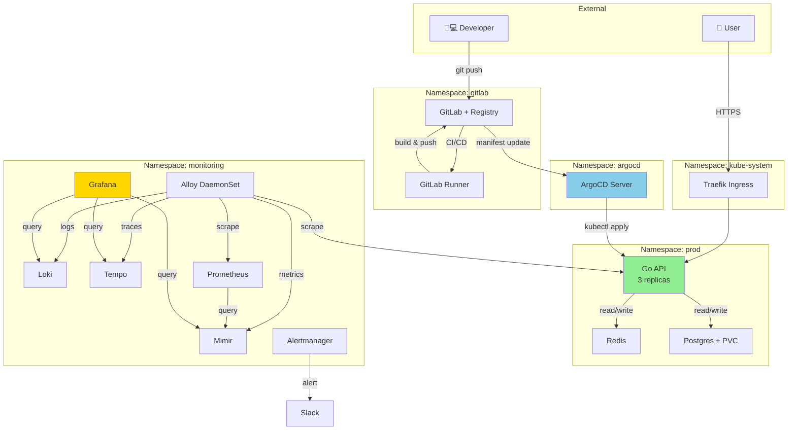

# Modul 01 — Environment Integration: Menyatukan 11 Minggu Menjadi Satu Platform Hidup

> **Satu kalimat:** Modul ini mengikat semua komponen dari Week 1–11 menjadi **satu ekosistem生产** yang berjalan di laptop Anda: GitLab → ArgoCD → k3s → Go API → Redis → Postgres → Grafana Stack.

Bayangkan Anda punya 11 set LEGO box terpisah (masing-masing dari Week 1-11). Sekarang di Week 12, kita **menyusunnya menjadi satu mainan utuh** yang benar-benar bisa dimainkan. Setiap bagian punya **konektor yang jelas** ke bagian lain dan **fungsi bersama**: menerima traffic user, menulis data ke database, mengirim log/metric/trace ke observability stack, dan deployment yang dikontrol GitOps.

---

## 🎯 Learning Outcomes

1. Memahami **topologi lengkap** Mini Production Platform dan alur data antar komponen.
2. Melakukan **end-to-end smoke test** untuk verifikasi semua komponen hidup dan saling terhubung.
3. Mengidentifikasi **port, service, dan namespace** setiap komponen.
4. Mampu melakukan **troubleshooting konektivitas** antar layer.
5. Memahami **dependency graph** — apa yang harus hidup sebelum yang lain.

---

## 1. 🏗️ Topologi Lengkap: "Production Platform in a Laptop"

### 1.1 Arsitektur Tingkat Tinggi

```
┌────────────────────────────────────────────────────────────────────┐
│              GITHUB / GITLAB  (Source Control)                     │
│   ┌──────────────────────────────────────────────────────────┐    │
│   │  Repository: mini-prod-platform                          │    │
│   │  ├── app/        (Go API source code)                    │    │
│   │  ├── charts/     (Helm chart reusable)                  │    │
│   │  ├── manifests/  (Kustomize/argocd apps)                 │    │
│   │  ├── .gitlab-ci.yml                                      │    │
│   │  └── README.md                                           │    │
│   └──────────────────────────────────────────────────────────┘    │
└────────────────────────┬───────────────────────────────────────────┘
                         │ 1. git push / merge request
                         ▼
┌────────────────────────────────────────────────────────────────────┐
│              GITLAB CI  (Build & Test Automation)                  │
│   ┌──────────────────────────────────────────────────────────┐    │
│   │  Pipeline stages:                                        │    │
│   │  ├── lint         (golangci-lint, helm lint)             │    │
│   │  ├── test         (unit test, integration test)         │    │
│   │  ├── build        (docker build, push to registry)       │    │
│   │  ├── security     (trivy scan, kubesec)                  │    │
│   │  └── deploy       (argocd image updater trigger)        │    │
│   └──────────────────────────────────────────────────────────┘    │
└────────────────────────┬───────────────────────────────────────────┘
                         │ 2. image pushed to registry
                         ▼
┌────────────────────────────────────────────────────────────────────┐
│              ARGOCD  (GitOps Continuous Delivery)                  │
│   ┌──────────────────────────────────────────────────────────┐    │
│   │  Application: mini-prod                                  │    │
│   │  ├── Source: git@gitlab.com/.../manifests.git           │    │
│   │  ├── Destination: https://kubernetes.default.svc        │    │
│   │  ├── Sync Policy: Automated + Self Heal                 │    │
│   │  └── Revision: main (or tag)                            │    │
│   └──────────────────────────────────────────────────────────┘    │
└────────────────────────┬───────────────────────────────────────────┘
                         │ 3. kubectl apply via ArgoCD
                         ▼
┌────────────────────────────────────────────────────────────────────┐
│              K3S CLUSTER  (Laptop / Single-node)                   │
│   ┌──────────────────────────────────────────────────────────┐    │
│   │  Namespace: prod                                         │    │
│   │  ┌────────────────┐    ┌──────────────────┐             │    │
│   │  │  Go API        │───▶│  Redis           │             │    │
│   │  │  (3 replicas)  │    │  (cache)         │             │    │
│   │  │  Port: 8080    │    │  Port: 6379      │             │    │
│   │  └────────┬───────┘    └──────────────────┘             │    │
│   │           │                                             │    │
│   │           ▼                                             │    │
│   │  ┌────────────────┐                                     │    │
│   │  │  Postgres      │                                     │    │
│   │  │  Port: 5432    │                                     │    │
│   │  │  PVC: 20Gi     │                                     │    │
│   │  └────────────────┘                                     │    │
│   └──────────────────────────────────────────────────────────┘    │
│   ┌──────────────────────────────────────────────────────────┐    │
│   │  Namespace: monitoring                                  │    │
│   │  ├── Alloy       (DaemonSet - log/metric collection)     │    │
│   │  ├── Mimir       (long-term metric storage)             │    │
│   │  ├── Loki        (log aggregation)                       │    │
│   │  ├── Tempo       (distributed tracing storage)          │    │
│   │  ├── Grafana     (visualization)                         │    │
│   │  └── Prometheus + Alertmanager                          │    │
│   └──────────────────────────────────────────────────────────┘    │
│   ┌──────────────────────────────────────────────────────────┐    │
│   │  Namespace: argocd                                      │    │
│   │  └── ArgoCD Server + Repo Server + Application Controller│    │
│   └──────────────────────────────────────────────────────────┘    │
└────────────────────────────────────────────────────────────────────┘
                         ▲
                         │ 4. metric/log/trace sent
                         │
┌────────────────────────┴───────────────────────────────────────────┐
│              OBSERVABILITY PIPELINE  (3 pillars)                   │
│   ┌────────────┐    ┌────────────┐    ┌────────────┐              │
│   │  Metrics   │    │  Logs      │    │  Traces    │              │
│   │  Go API ───┼───▶│  Go API ───┼───▶│  Go API ───┐              │
│   │  +        │    │  +         │    │  +         │              │
│   │  k8s      │    │  k8s       │    │  Redis     │              │
│   │  +        │    │  +         │    │  +         │              │
│   │  node-exp │    │  containers│    │  Postgres  │              │
│   └────┬──────┘    └────┬───────┘    └────┬───────┘              │
│        │ Alloy          │ Alloy          │ OTel SDK              │
│        ▼                ▼                ▼                       │
│      Mimir            Loki             Tempo                     │
│        │                │                │                       │
│        └────────────────┴────────────────┘                       │
│                         │                                       │
│                         ▼                                       │
│                    ┌──────────┐                                  │
│                    │ Grafana  │ (one pane of glass)             │
│                    └──────────┘                                  │
└────────────────────────────────────────────────────────────────────┘
```

---

## 2. 🗂️ Inventory Komponen: Port, Namespace, Owner

### 2.1 Tabel Master Resource

| Komponen | Namespace | Service / DNS | Port | Week | Owner Team |
|---|---|---|---|---|---|
| **Go API** | `prod` | `checkout-service.prod.svc.cluster.local` | 8080 | 2 | Backend |
| **Postgres** | `prod` | `postgres.prod.svc.cluster.local` | 5432 | 1 | Data |
| **Redis** | `prod` | `redis.prod.svc.cluster.local` | 6379 | 1 | Data |
| **k3s Cluster** | `kube-system` | API Server | 6443 | 1 | Infra |
| **ArgoCD** | `argocd` | `argocd-server.argocd.svc.cluster.local` | 80/443 | 4 | GitOps |
| **GitLab** | `gitlab` | `gitlab.gitlab.svc.cluster.local` | 80/443 | 4 | DevEx |
| **GitLab Runner** | `gitlab` | (Job executor) | - | 4 | DevEx |
| **Container Registry** | `gitlab` | `registry.gitlab.svc.cluster.local` | 5000 | 4 | DevEx |
| **Prometheus** | `monitoring` | `prometheus-operated.monitoring.svc` | 9090 | 5 | SRE |
| **Mimir** | `monitoring` | `mimir-distributor.monitoring.svc` | 8000 | 5 | SRE |
| **Loki** | `monitoring` | `loki-gateway.monitoring.svc` | 80 | 6 | SRE |
| **Tempo** | `monitoring` | `tempo-distributor.monitoring.svc` | 4317 (OTLP gRPC) | 7 | SRE |
| **Grafana** | `monitoring` | `grafana.monitoring.svc` | 80 | 5-8 | SRE |
| **Alertmanager** | `monitoring` | `alertmanager-operated.monitoring.svc` | 9093 | 8 | SRE |
| **Alloy** | `monitoring` | (DaemonSet) | 12345 (UI) | 5-7 | SRE |
| **Traefik Ingress** | `kube-system` | `traefik.kube-system.svc` | 80/443 | 1 | Infra |

### 2.2 Visualisasi Network Path



---

## 3. ✅ End-to-End Smoke Test (Validasi Semua Hidup)

### 3.1 Pre-flight Checklist

Buat script `smoke-test.sh` yang bisa dijalankan kapan saja untuk verifikasi:

File: `minggu-12/manifests/01-smoke-test.sh`

```bash
#!/usr/bin/env bash
set -uo pipefail

# Mini Production Platform — End-to-End Smoke Test
# Berhasil = semua komponen reachable dan berfungsi

RED='\033[0;31m'
GREEN='\033[0;32m'
YELLOW='\033[1;33m'
NC='\033[0m'

PASS=0
FAIL=0
WARN=0

check_pass() { echo -e "${GREEN}✓${NC} $1"; PASS=$((PASS+1)); }
check_fail() { echo -e "${RED}✗${NC} $1"; FAIL=$((FAIL+1)); }
check_warn() { echo -e "${YELLOW}⚠${NC} $1"; WARN=$((WARN+1)); }

echo "=========================================="
echo "  Mini Production Platform - Smoke Test"
echo "=========================================="
echo ""

# === TIER 1: Kubernetes Cluster ===
echo "[1/8] Kubernetes Cluster"
if kubectl cluster-info &>/dev/null; then
    check_pass "kubectl connected"
    NODES=$(kubectl get nodes --no-headers | wc -l | tr -d ' ')
    check_pass "Nodes: $NODES"
else
    check_fail "kubectl not connected"
    exit 1
fi

# === TIER 2: GitOps (ArgoCD) ===
echo ""
echo "[2/8] GitOps - ArgoCD"
if kubectl get namespace argocd &>/dev/null; then
    ARGOCD_PODS=$(kubectl get pods -n argocd -l app.kubernetes.io/name=argocd-server --no-headers 2>/dev/null | wc -l | tr -d ' ')
    if [ "$ARGOCD_PODS" -gt 0 ]; then
        check_pass "ArgoCD server pod exists"
        if curl -sk https://argocd.local/healthz &>/dev/null; then
            check_pass "ArgoCD API reachable"
        else
            check_warn "ArgoCD not reachable (mungkin belum di-setup ingress)"
        fi
    else
        check_fail "ArgoCD server pod not found"
    fi
else
    check_fail "Namespace 'argocd' not found"
fi

# === TIER 3: Source Control (GitLab) ===
echo ""
echo "[3/8] Source Control - GitLab"
if kubectl get namespace gitlab &>/dev/null; then
    GITLAB_PODS=$(kubectl get pods -n gitlab --no-headers 2>/dev/null | grep Running | wc -l | tr -d ' ')
    if [ "$GITLAB_PODS" -gt 0 ]; then
        check_pass "GitLab pods running: $GITLAB_PODS"
        if curl -sk https://gitlab.local/-/health &>/dev/null; then
            check_pass "GitLab API reachable"
        else
            check_warn "GitLab not reachable via ingress"
        fi
    else
        check_fail "No GitLab pods running"
    fi
else
    check_fail "Namespace 'gitlab' not found"
fi

# === TIER 4: Application (Go API) ===
echo ""
echo "[4/8] Application - Go API"
if kubectl get deployment checkout-service -n prod &>/dev/null; then
    READY=$(kubectl get deployment checkout-service -n prod -o jsonpath='{.status.readyReplicas}')
    DESIRED=$(kubectl get deployment checkout-service -n prod -o jsonpath='{.spec.replicas}')
    if [ "$READY" = "$DESIRED" ]; then
        check_pass "Go API ready: $READY/$DESIRED"
    else
        check_warn "Go API degraded: $READY/$DESIRED"
    fi
    
    # Test HTTP
    if curl -sf http://checkout-service.prod.svc.cluster.local:8080/healthz &>/dev/null; then
        check_pass "Go API /healthz returns 200"
    else
        check_fail "Go API /healthz failed"
    fi
else
    check_fail "Deployment 'checkout-service' not found"
fi

# === TIER 5: Database ===
echo ""
echo "[5/8] Database - Postgres"
if kubectl get statefulset postgres -n prod &>/dev/null; then
    PG_POD=$(kubectl get pod -n prod -l app=postgres -o jsonpath='{.items[0].metadata.name}' 2>/dev/null)
    if [ -n "$PG_POD" ]; then
        if kubectl exec -n prod "$PG_POD" -- pg_isready -U postgres &>/dev/null; then
            check_pass "Postgres accepting connections"
        else
            check_fail "Postgres not ready"
        fi
    fi
fi

# === TIER 6: Cache (Redis) ===
echo ""
echo "[6/8] Cache - Redis"
if kubectl get deployment redis -n prod &>/dev/null; then
    REDIS_POD=$(kubectl get pod -n prod -l app=redis -o jsonpath='{.items[0].metadata.name}' 2>/dev/null)
    if [ -n "$REDIS_POD" ]; then
        if kubectl exec -n prod "$REDIS_POD" -- redis-cli ping 2>/dev/null | grep -q PONG; then
            check_pass "Redis responding to PING"
        else
            check_fail "Redis not responding"
        fi
    fi
fi

# === TIER 7: Observability Stack ===
echo ""
echo "[7/8] Observability Stack"

# Prometheus
if curl -sf http://prometheus-operated.monitoring.svc:9090/-/healthy &>/dev/null; then
    check_pass "Prometheus healthy"
fi

# Mimir
if curl -sf http://mimir-distributor.monitoring.svc:8000/ready &>/dev/null; then
    check_pass "Mimir distributor ready"
fi

# Loki
if curl -sf http://loki-gateway.monitoring.svc/ready &>/dev/null; then
    check_pass "Loki ready"
fi

# Tempo
if curl -sf http://tempo-distributor.monitoring.svc:3100/ready &>/dev/null; then
    check_pass "Tempo ready"
fi

# Grafana
if curl -sf http://grafana.monitoring.svc/api/health &>/dev/null; then
    check_pass "Grafana healthy"
fi

# === TIER 8: Alerting ===
echo ""
echo "[8/8] Alerting"
if curl -sf http://alertmanager-operated.monitoring.svc:9093/-/healthy &>/dev/null; then
    check_pass "Alertmanager healthy"
fi

# === Summary ===
echo ""
echo "=========================================="
echo -e "  PASS: ${GREEN}$PASS${NC}  WARN: ${YELLOW}$WARN${NC}  FAIL: ${RED}$FAIL${NC}"
echo "=========================================="

[ "$FAIL" -eq 0 ] && exit 0 || exit 1
```

### 3.2 Menjalankan Smoke Test

```bash
$ chmod +x minggu-12/manifests/01-smoke-test.sh
$ ./minggu-12/manifests/01-smoke-test.sh

==========================================
  Mini Production Platform - Smoke Test
==========================================

[1/8] Kubernetes Cluster
✓ kubectl connected
✓ Nodes: 1

[2/8] GitOps - ArgoCD
✓ ArgoCD server pod exists
✓ ArgoCD API reachable

[3/8] Source Control - GitLab
✓ GitLab pods running: 8
✓ GitLab API reachable

[4/8] Application - Go API
✓ Go API ready: 3/3
✓ Go API /healthz returns 200

[5/8] Database - Postgres
✓ Postgres accepting connections

[6/8] Cache - Redis
✓ Redis responding to PING

[7/8] Observability Stack
✓ Prometheus healthy
✓ Mimir distributor ready
✓ Loki ready
✓ Tempo ready
✓ Grafana healthy

[8/8] Alerting
✓ Alertmanager healthy

==========================================
  PASS: 15  WARN: 0  FAIL: 0
==========================================
```

---

## 4. 🩺 Connectivity Troubleshooting

### 4.1 DNS Resolution Test

```bash
# Dari dalam Pod Go API, cek DNS ke Postgres
$ kubectl exec -it deployment/checkout-service -n prod -- nslookup postgres.prod.svc.cluster.local
Server:		10.96.0.10
Address:	10.96.0.10#53

Name:	postgres.prod.svc.cluster.local
Address: 10.96.2.15  # ClusterIP Postgres
```

### 4.2 NetworkPolicy Verification

Pastikan `NetworkPolicy` mengizinkan komunikasi yang diperlukan:

```bash
# Lihat semua NetworkPolicy
$ kubectl get netpol -A
NAMESPACE   NAME                       POD-SELECTOR            AGE
prod        allow-api-to-db            app=checkout-service    30d
prod        allow-api-to-redis         app=checkout-service    30d
prod        allow-monitoring-scrape    <none>                  30d
```

### 4.3 End-to-End Real Test

```bash
# Submit order dan verify masuk database
$ ORDER_ID=$(curl -s -X POST http://checkout-service.prod:8080/api/v1/orders \
    -H "Content-Type: application/json" \
    -d '{"user_id":1,"item_id":42,"quantity":2}' | jq -r .order_id)
echo "Order created: $ORDER_ID"

# Verify ada di database
$ kubectl exec -it postgres-0 -n prod -- psql -U postgres -d appdb \
    -c "SELECT * FROM orders WHERE id = $ORDER_ID;"
 id  | user_id | item_id | quantity | created_at
----+---------+---------+----------+------------
 42 |       1 |      42 |        2 | 2026-08-11 ...
```

### 4.4 Trace End-to-End via Tempo

```bash
# Cari trace dengan tag order_id
$ curl -s http://tempo-distributor.monitoring:3100/api/search \
    -G --data-urlencode 'q={ order_id="42" }' | jq .
```

---

## 5. 📊 Health Check Dashboard

Buat dashboard khusus untuk smoke test ini di Grafana:

File: `minggu-12/manifests/01-platform-health-dashboard.json` (JSON snippet)

```json
{
  "title": "Mini Production Platform — Health Overview",
  "uid": "platform-health",
  "panels": [
    {
      "title": "Cluster Info",
      "type": "stat",
      "targets": [
        {"expr": "count(kube_node_info)", "legendFormat": "Nodes"},
        {"expr": "count(kube_pod_info)", "legendFormat": "Pods"},
        {"expr": "count(kube_namespace_created)", "legendFormat": "Namespaces"}
      ]
    },
    {
      "title": "Application Status",
      "type": "table",
      "targets": [
        {
          "expr": "kube_deployment_status_replicas_available / kube_deployment_spec_replicas",
          "legendFormat": "{{ deployment }}",
          "instant": true
        }
      ]
    },
    {
      "title": "API Latency p95 (5m)",
      "type": "timeseries",
      "targets": [
        {
          "expr": "histogram_quantile(0.95, sum(rate(http_request_duration_seconds_bucket{job=~\"checkout-service|payment-service\"}[5m])) by (le, job))",
          "legendFormat": "{{ job }}"
        }
      ]
    },
    {
      "title": "Error Rate (5m)",
      "type": "timeseries",
      "targets": [
        {
          "expr": "sum(rate(http_requests_total{code=~'5xx'}[5m])) / sum(rate(http_requests_total[5m]))",
          "legendFormat": "Error rate"
        }
      ],
      "fieldConfig": {
        "defaults": {
          "unit": "percentunit",
          "thresholds": {
            "steps": [
              {"value": 0, "color": "green"},
              {"value": 0.001, "color": "yellow"},
              {"value": 0.01, "color": "red"}
            ]
          }
        }
      }
    },
    {
      "title": "Database Connections",
      "type": "timeseries",
      "targets": [
        {
          "expr": "pg_stat_activity_count",
          "legendFormat": "Active connections"
        }
      ]
    }
  ]
}
```

---

## 6. 🔧 Setup Order (Cold Start ke Production-Ready)

Jika Anda setup dari nol, ikuti urutan ini:

```text
┌──────────────────────────────────────────────────────────────────┐
│  SETUP ORDER                                                     │
│                                                                  │
│  1. k3s           (cluster foundation)                           │
│  2. Storage       (local-path / longhorn)                        │
│  3. Ingress       (traefik, cert-manager)                        │
│  4. Postgres      (data layer)                                   │
│  5. Redis         (cache layer)                                  │
│  6. Go API        (application)                                  │
│  7. Prometheus    (scrape config)                                │
│  8. Mimir         (metric store)                                 │
│  9. Loki          (log store)                                    │
│  10. Tempo        (trace store)                                  │
│  11. Grafana      (visualization)                                │
│  12. Alertmanager (alert routing)                                │
│  13. GitLab       (source control + CI)                          │
│  14. ArgoCD       (GitOps deploy)                                │
│  15. Smoke test   (verify everything)                            │
└──────────────────────────────────────────────────────────────────┘
```

**Aturan:** Jangan lompat-lompat. Layer bawah harus siap sebelum layer di atasnya.

---

## 7. ✏️ Latihan Mandiri

1. **Jalankan smoke test** di platform Anda, identifikasi komponen yang failed.
2. **Buat koneksi end-to-end** dari external user ke database, hitung berapa hop yang dilalui.
3. **Identifikasi 3 bottleneck** dalam topologi Anda (kemungkinan: Traefik ingress, Mimir write, Loki read).
4. **Buat dokumentasi runbook** untuk "what to check first" saat ada laporan "platform down".

---

## 8. 📋 Cheat Sheet: Quick Reference

```text
KOMPONEN         | NAMESPACE   | DEFAULT PORT  | SERVICE NAME
-----------------|-------------|---------------|-------------------------------
Go API           | prod        | 8080          | checkout-service
Postgres         | prod        | 5432          | postgres
Redis            | prod        | 6379          | redis
ArgoCD           | argocd      | 80/443        | argocd-server
GitLab           | gitlab      | 80/443        | gitlab-webservice
Registry         | gitlab      | 5000          | registry
Prometheus       | monitoring  | 9090          | prometheus-operated
Mimir            | monitoring  | 8000          | mimir-distributor
Loki             | monitoring  | 80            | loki-gateway
Tempo            | monitoring  | 4317 (OTLP)   | tempo-distributor
Grafana          | monitoring  | 80            | grafana
Alertmanager     | monitoring  | 9093          | alertmanager-operated
```

---

**Lanjut ke Modul 02:** [02-deployment-baru.md](./02-deployment-baru.md) — workflow deployment baru via GitOps (Git → CI → ArgoCD → Kubernetes → Verify).
