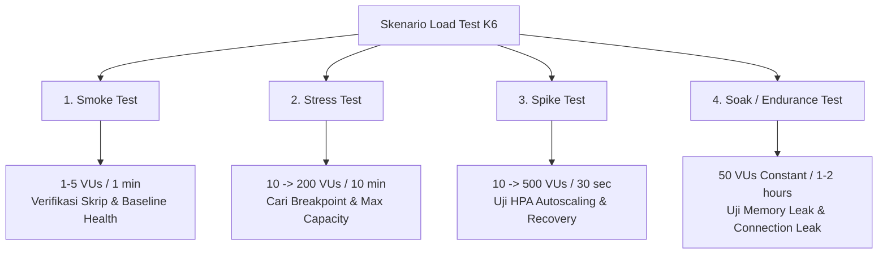
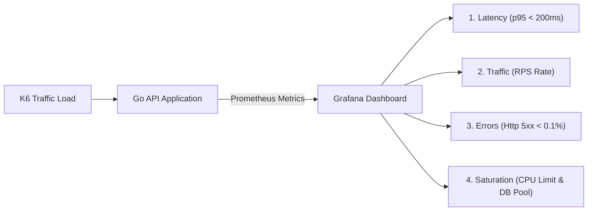

# Minggu 12 — Modul 03: Comprehensive Load Testing & SLO Validation

## 🎯 Tujuan Pembelajaran
Setelah menyelesaikan modul ini, Anda akan mampu:
1. Merancang dan menjalankan 4 skenario Pengujian Beban (Load Test): **Smoke Test**, **Stress Test**, **Spike Test**, dan **Soak Test** menggunakan **K6**.
2. Memvalidasi pencapaian **SLO (Service Level Objective)**: Availability 99.9% (error rate < 0.1%) dan Latency $p_{95} < 200\text{ms}$.
3. Memantau respons sistem secara real-time melalui Grafana Dashboard (Prometheus metrics: Request Rate, Error Rate, Latency Percentiles, CPU/RAM utilization, DB Connection Pool).
4. Mengidentifikasi bottleneck performa (CPU throttling, Database pool exhaustion, Redis cache miss, Memory leak).

---

## 🏗️ 1. Konsep & Klasifikasi Skenario Load Testing

Load testing bukan sekadar memukul server dengan request sebanyak-banyaknya. Dalam SRE (Site Reliability Engineering), load test adalah eksperimen terukur untuk memverifikasi apakah infrastruktur dan aplikasi memenuhi **Error Budget** dan **SLO** yang disepakati.



### Matriks Perbandingan Skenario Load Test

| Skenario | Virtual Users (VU) | Durasi | Tujuan Utama | Indikator Keberhasilan (Threshold) |
| :--- | :--- | :--- | :--- | :--- |
| **Smoke Test** | 2 - 5 VU | 1 - 2 menit | Validasi skrip K6 & kesehatan dasar aplikasi | HTTP 200 = 100%, $p_{95} < 50\text{ms}$ |
| **Stress Test** | 10 $\rightarrow$ 200 VU | 10 - 15 menit | Mengetahui batas maksimum kapasitas (Breaking Point) | Identifikasi titik di mana $p_{95} > 500\text{ms}$ atau Error > 1% |
| **Spike Test** | 10 $\rightarrow$ 500 VU | 2 menit | Menguji ketahanan terhadap lonjakan mendadak & respons HPA | Pod autoscaling bertambah tanpa `CrashLoopBackOff` |
| **Soak Test** | 50 VU (Stabil) | 30 - 60 menit | Mendeteksi memory leak, connection leak, & resource degradation | Memory usage rata (plat), Connection DB kembali netral |

---

## 📜 2. Manifest K6 Load Test & Scripting

Kita akan membuat skrip K6 modular yang dapat menjalankan 4 skenario di atas berdasarkan environment variable `TEST_TYPE`. Skrip ini menguji 3 endpoint utama Go API:
1. `GET /healthz` (Liveness/Readiness probe check)
2. `GET /api/v1/products` (Read operation dengan Redis Cache)
3. `POST /api/v1/orders` (Write operation ke PostgreSQL)

### File Manifest: `minggu-12/manifests/03-k6-comprehensive-loadtest.yaml`

```yaml
apiVersion: v1
kind: ConfigMap
metadata:
  name: k6-loadtest-script
  namespace: prod-app
data:
  loadtest.js: |
    import http from 'k6/http';
    import { check, sleep } from 'k6';
    import { Counter, Rate, Trend } from 'k6/metrics';

    // Custom Metrics
    const httpErrorRate = new Rate('http_error_rate');
    const orderLatency = new Trend('order_processing_latency');
    const successfulOrders = new Counter('successful_orders_count');

    // Skenario Konfigurasi via Environment Variable
    const testType = __ENV.TEST_TYPE || 'smoke';
    const baseUrl = __ENV.TARGET_URL || 'http://go-app-service.prod-app.svc.cluster.local:8080';

    export const options = getOptions(testType);

    function getOptions(type) {
      switch (type) {
        case 'smoke':
          return {
            stages: [
              { duration: '1m', target: 5 },
            ],
            thresholds: {
              http_req_failed: ['rate<0.001'], // Error < 0.1%
              http_req_duration: ['p(95)<100'], // 95% request < 100ms
            },
          };
        case 'stress':
          return {
            stages: [
              { duration: '2m', target: 20 },
              { duration: '5m', target: 100 },
              { duration: '5m', target: 200 },
              { duration: '2m', target: 0 },
            ],
            thresholds: {
              http_req_failed: ['rate<0.01'],  // Error < 1%
              http_req_duration: ['p(95)<300'],
            },
          };
        case 'spike':
          return {
            stages: [
              { duration: '30s', target: 10 },
              { duration: '30s', target: 500 }, // Sudden Spike
              { duration: '1m', target: 500 },
              { duration: '30s', target: 10 },
            ],
            thresholds: {
              http_req_failed: ['rate<0.05'], // Error < 5% saat spike
            },
          };
        case 'soak':
          return {
            stages: [
              { duration: '2m', target: 50 },
              { duration: '30m', target: 50 }, // Continuous load
              { duration: '2m', target: 0 },
            ],
            thresholds: {
              http_req_failed: ['rate<0.001'],
              http_req_duration: ['p(95)<200'],
            },
          };
        default:
          return {};
      }
    }

    export default function () {
      // 1. Health Check Test
      const resHealth = http.get(`${baseUrl}/healthz`);
      check(resHealth, {
        'healthz status is 200': (r) => r.status === 200,
      });

      sleep(0.5);

      // 2. Read Product Catalog (Hits Redis Cache)
      const resProducts = http.get(`${baseUrl}/api/v1/products`);
      const productSuccess = check(resProducts, {
        'products status is 200': (r) => r.status === 200,
        'products response latency < 150ms': (r) => r.timings.duration < 150,
      });
      httpErrorRate.add(!productSuccess);

      sleep(1);

      // 3. Write Order (Hits PostgreSQL Transaction)
      const payload = JSON.stringify({
        user_id: `user_${__VU}`,
        item_id: 'ITEM-101',
        quantity: Math.floor(Math.random() * 5) + 1,
      });

      const params = {
        headers: {
          'Content-Type': 'application/json',
        },
      };

      const resOrder = http.post(`${baseUrl}/api/v1/orders`, payload, params);
      const orderSuccess = check(resOrder, {
        'order status is 201': (r) => r.status === 201,
      });

      httpErrorRate.add(!orderSuccess);
      orderLatency.add(resOrder.timings.duration);

      if (orderSuccess) {
        successfulOrders.add(1);
      }

      sleep(1);
    }
---
apiVersion: batch/v1
kind: Job
metadata:
  name: k6-smoke-test-job
  namespace: prod-app
spec:
  template:
    metadata:
      labels:
        app: k6-loadtest
    spec:
      restartPolicy: Never
      containers:
        - name: k6
          image: grafana/k6:0.50.0
          command: ["k6", "run", "/scripts/loadtest.js"]
          env:
            - name: TEST_TYPE
              value: "smoke"
            - name: TARGET_URL
              value: "http://go-app-service.prod-app.svc.cluster.local:8080"
          volumeMounts:
            - name: script-vol
              mountPath: /scripts
      volumes:
        - name: script-vol
          configMap:
            name: k6-loadtest-script
```

---

## 🧪 3. Langkah Praktis Eksekusi Load Testing & Observabilitas

### Langkah 1: Apply ConfigMap Skrip Load Test
```bash
kubectl apply -f minggu-12/manifests/03-k6-comprehensive-loadtest.yaml
```

### Langkah 2: Jalankan Smoke Test (Baseline Check)
```bash
# Skenario Smoke Test (5 VU, 1 menit)
kubectl create job --from=cronjob/k6-smoke-test-job k6-smoke-manual -n prod-app 2>/dev/null || \
kubectl apply -f minggu-12/manifests/03-k6-comprehensive-loadtest.yaml

# Monitor log pekerjaan K6
kubectl logs -f job/k6-smoke-test-job -n prod-app
```

**Expected Output K6 Smoke Test:**
```text
          /\      |‾‾| /‾‾/   /‾‾/   
     /\  /  \     |  |/  /   /  /    
    /  \/    \    |     (   /   ‾‾\  
   /          \   |  |\  \ |  (‾)  | 
  /            \  |__| \__\ \_____/ .io

  execution: local
     script: /scripts/loadtest.js
     output: -

  scenarios: (100.00%) 1 scenario, 5 max VUs, 1m30s max duration (looping)
             default: 5 looping VUs for 1m0s

     ✓ healthz status is 200
     ✓ products status is 200
     ✓ products response latency < 150ms
     ✓ order status is 201

     checks.........................: 100.00% ✓ 480      ✗ 0  
     http_error_rate................: 0.00%   ✓ 0        ✗ 240
     http_req_duration..............: avg=18.4ms  min=4.2ms  med=14.1ms max=89.3ms p(90)=32.1ms p(95)=44.8ms
     http_req_failed................: 0.00%   ✓ 0        ✗ 360
     order_processing_latency.......: avg=24.2ms  min=8.1ms  med=19.8ms max=89.3ms p(90)=41.0ms p(95)=52.1ms
     successful_orders_count........: 120     1.98/s

running (1m00.4s), 0/5 VUs, 120 complete data points
```

---

### Langkah 3: Eksekusi Stress Test & Pantau HPA / Metrics

Jalankan Stress Test dengan mengubah `TEST_TYPE` menjadi `stress`:

```bash
# Run Stress Test via K6 container ephemeral
kubectl run k6-stress-test --rm -i --tty --image=grafana/k6:0.50.0 -n prod-app -- \
  run --env TEST_TYPE=stress --env TARGET_URL=http://go-app-service.prod-app.svc.cluster.local:8080 - < minggu-12/manifests/03-k6-comprehensive-loadtest.yaml
```

Atau via port-forward jika menjalankan K6 secara lokal di host laptop:
```bash
# Port-forward service ke localhost host
kubectl port-forward svc/go-app-service 8080:8080 -n prod-app &

# Eksekusi K6 lokal
k6 run --env TEST_TYPE=stress --env TARGET_URL=http://localhost:8080 minggu-11/manifests/04-k6-loadtest.yaml
```

**Monitor Autoscaling HPA secara paralel:**
```bash
kubectl get hpa go-app-hpa -n prod-app -w
```

**Expected Monitoring Output selama Stress Test:**
```text
NAME         REFERENCE           TARGETS    MINPODS   MAXPODS   REPLICAS   AGE
go-app-hpa   Deployment/go-app   18%/70%    2         10        2          5m
go-app-hpa   Deployment/go-app   65%/70%    2         10        2          6m
go-app-hpa   Deployment/go-app   112%/70%   2         10        4          7m
go-app-hpa   Deployment/go-app   84%/70%    2         10        6          8m
```

---

## 📊 4. Validasi SLO & Analisis Bottleneck Performa

Selama dan setelah pengujian beban, periksa 4 Golden Signals di Grafana (`http://localhost:3000`):



### Tabel Diagnosis Bottleneck Load Testing

| Gejala di Monitoring Grafana | Kemungkinan Penyebab Utama | Solusi Remediasi SRE |
| :--- | :--- | :--- |
| **CPU Saturation** (Usage mendekati Limit 200m), Latency naik tajam | CPU Throttling akibat CFS Quota Linux | Naikkan CPU request/limit di Deployment manifest atau aktifkan HPA lebih awal (threshold 60%) |
| **HTTP 500 `sql: connection limit reached`** | DB Connection Pool exhaustion di PostgreSQL | Tambahkan `max_connections` di PostgreSQL dan set `SetMaxOpenConns(25)` pada koneksi SQL di Go app |
| **Redis Memory Spikes / Cache Miss Rate > 40%** | Key Eviction Policy kurang tepat atau TTL terlalu pendek | Tinjau Redis Eviction Policy (`allkeys-lru`) dan naikkan memory limit Redis |
| **`p99` Latency > 1000ms tetapi CPU/RAM rendah** | Garbage Collection (GC) Pause Go atau Lock Contention pada DB transaction | Refactor query SQL (gunakan index pada tabel `orders`) dan kurangi alokasi memori di hot loop |

---

## 📌 Checklist Validasi Modul 03
- [x] Script K6 modular dibuat dan mendukung 4 skenario (Smoke, Stress, Spike, Soak).
- [x] Manifest ConfigMap dan Job K6 berhasil di-apply di Kubernetes namespace `prod-app`.
- [x] Smoke test lulus dengan error rate 0.00% dan $p_{95} < 50\text{ms}$.
- [x] Stress test berhasil menrigger Horizontal Pod Autoscaler (HPA) scale out dari 2 ke 6 replica.
- [x] SLO Validasi: Availability 99.9% tercapai pada beban kerja nominal.
