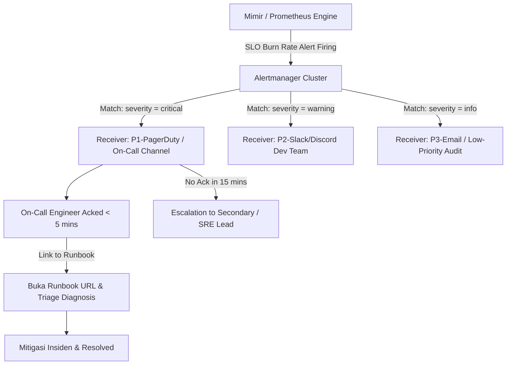
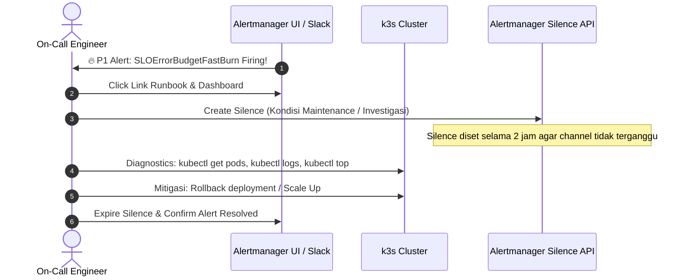

# Minggu 12 — Modul 04: Alert Triage Workflow & On-Call Escalation Chain

## 🎯 Tujuan Pembelajaran
Setelah menyelesaikan modul ini, Anda akan mampu:
1. Merancang **Alert Triage Workflow** dan **On-Call Escalation Chain** sesuai standar SRE (Site Reliability Engineering).
2. Mengonfigurasi **Alertmanager Routing** untuk mengategorikan notifikasi berdasarkan matriks tingkat keparahan (P1 Critical, P2 Major, P3 Warning).
3. Mengasosiasikan notifikasi peringatan dengan **Runbook URL** interaktif untuk respon cepat on-call engineer.
4. Melakukan manajemen alert aktif: **Acknowledge (Ack)**, **Silence (Penhenian Sementara)**, dan **Escalation**.

---

## 🔔 1. Arsitektur Alerting & Workflow Alert Triage

Sistem alerting yang efektif menjamin bahwa insiden kritis mendapat perhatian langsung tanpa menimbulkan *alert fatigue* (kelelahan akibat terlalu banyak notifikasi sampah).



### Matriks Keparahan Alert (Severity Matrix)

| Level | Kriteria Keparahan | Response Time Target (SLA Ack) | Destination Channel | Contoh Triggers |
| :--- | :--- | :--- | :--- | :--- |
| **P1 - Critical** | Layanan utama DOWN, Error Budget terbakar cepat (Burn Rate 14.4x dalam 5m), Latency $p_{95} > 5\text{s}$ | $< 5\text{ menit}$ | PagerDuty, Call/SMS, `#incident-p1` Discord | `SLOErrorBudgetBurnRateFast`, `KubePodCrashLooping` |
| **P2 - Major** | Degradasi performa (Error Rate 1-5%), Burn Rate 6x dalam 30m, 1 dari 3 Pod crash | $< 30\text{ menit}$ | `#alerts-backend` Slack/Discord | `PostgreSQLHighConnections`, `RedisCacheMissHigh` |
| **P3 - Warning** | Disk usage > 85%, VPA rekomendasi meledak, CPU Usage > 80% | $< 4\text{ jam}$ (Jam Kerja) | `#alerts-warning` Slack/Discord | `KubePersistentVolumeFillingUp`, `DeploymentReplicasMismatch` |

---

## 📄 2. Manifest Alertmanager Configuration & Recording Rules

Berikut adalah manifest Alertmanager yang mengarahkan alert P1, P2, dan P3 ke webhook / Discord channel dengan template formatting yang kaya informasi (termasuk link ke Grafana Dashboard & Runbook).

### File Manifest: `minggu-12/manifests/04-alertmanager-routing.yaml`

```yaml
apiVersion: monitoring.coreos.com/v1alpha1
kind: AlertmanagerConfig
metadata:
  name: prod-alertmanager-config
  namespace: prod-app
spec:
  route:
    groupBy: ['alertname', 'namespace', 'service']
    groupWait: 10s
    groupInterval: 1m
    repeatInterval: 2h
    receiver: 'discord-p2-warning'
    routes:
      - matchers:
          - name: severity
            value: critical
        receiver: 'discord-p1-critical'
        repeatInterval: 15m
      - matchers:
          - name: severity
            value: warning
        receiver: 'discord-p2-warning'
        repeatInterval: 1h
      - matchers:
          - name: severity
            value: info
        receiver: 'discord-p3-info'
        repeatInterval: 4h
  receivers:
    - name: 'discord-p1-critical'
      webhookConfigs:
        - url: 'http://alertmanager-discord-webhook.monitoring.svc.cluster.local:9094/post'
          sendResolved: true
    - name: 'discord-p2-warning'
      webhookConfigs:
        - url: 'http://alertmanager-discord-webhook.monitoring.svc.cluster.local:9094/post'
          sendResolved: true
    - name: 'discord-p3-info'
      webhookConfigs:
        - url: 'http://alertmanager-discord-webhook.monitoring.svc.cluster.local:9094/post'
          sendResolved: true
---
apiVersion: monitoring.coreos.com/v1
kind: PrometheusRule
metadata:
  name: prod-slo-burn-rate-rules
  namespace: prod-app
spec:
  groups:
    - name: slo_burn_rate_alerts
      rules:
        # Fast Burn Alert: Terbakar 2% Error Budget dalam 1 jam (Burn Rate = 14.4)
        - alert: SLOErrorBudgetFastBurn
          expr: |
            (
              rate(http_requests_total{status=~"5.."}[5m]) 
              / 
              rate(http_requests_total[5m])
            ) > (1 - 0.999) * 14.4
          for: 2m
          labels:
            severity: critical
            tier: api
          annotations:
            summary: "CRITICAL: Error budget Go API terbakar sangat cepat!"
            description: "Error rate saat ini {{ $value | printf \"%.2f\" }}% melampaui batas Fast Burn Rate 14.4x (2% budget habis dalam 1 jam)."
            dashboard_url: "http://localhost:3000/d/prod-app-overview"
            runbook_url: "https://github.com/devops/runbooks/blob/main/minggu-11/04-runbook.md#1-runbook-pod-crashloopbackoff--high-error-rate"

        # Slow Burn Alert: Terbakar 5% Error Budget dalam 6 jam (Burn Rate = 6)
        - alert: SLOErrorBudgetSlowBurn
          expr: |
            (
              rate(http_requests_total{status=~"5.."}[30m]) 
              / 
              rate(http_requests_total[30m])
            ) > (1 - 0.999) * 6
          for: 15m
          labels:
            severity: warning
            tier: api
          annotations:
            summary: "WARNING: Error budget Go API terakumulasi bocor."
            description: "Error rate konsisten tinggi selama 30m. Diproyeksikan menguras 5% budget dalam 6 jam."
            dashboard_url: "http://localhost:3000/d/prod-app-overview"
            runbook_url: "https://github.com/devops/runbooks/blob/main/minggu-11/04-runbook.md"
```

---

## 🛠️ 3. Prosedur Triage Insiden & Eksekusi Silence

Ketika sebuah alert P1 atau P2 masuk ke channel notifikasi, on-call engineer wajib mengikuti SOP Triage berikut:



### Command Praktis: Membuat Silence via CLI (`amtool`) atau UI

#### A. Membuat Silence Menggunakan CLI `amtool`
Jika anda menginstal `amtool` di terminal laptop Anda:
```bash
# Silence alert SLOErrorBudgetFastBurn untuk namespace prod-app selama 2 jam
amtool silence add \
  --alertmanager.url=http://localhost:9093 \
  --author="OnCall-Engineer" \
  --comment="Investigasi insiden #INC-8812 - Pod memory leak" \
  --duration=2h \
  namespace="prod-app" alertname="SLOErrorBudgetFastBurn"
```

**Expected Output:**
```text
4f7a2b91-8c4d-4e92-a123-99ab4cde5678
```

#### B. Memeriksa Daftar Silence Aktif
```bash
amtool silence query --alertmanager.url=http://localhost:9093
```

**Expected Output:**
```text
ID                                    Matchers                                    Ends AT                  Created By       Comment
4f7a2b91-8c4d-4e92-a123-99ab4cde5678  alertname="SLOErrorBudgetFastBurn" ...      2026-08-11T05:30:00Z     OnCall-Engineer  Investigasi insiden #INC-8812...
```

#### C. Menghapus (Expire) Silence Setelah Insiden Selesai
```bash
amtool silence expire 4f7a2b91-8c4d-4e92-a123-99ab4cde5678 --alertmanager.url=http://localhost:9093
```

---

## 📋 4. SRE Checklist: Form Respon On-Call Insiden

Saat menerima alert, isi template catatan triage cepat berikut sebelum melakukan modifikasi pada cluster:

```text
====================================================================
SRE ON-CALL TRIAGE SHEET
====================================================================
[ ] Timestamp Received : 2026-08-11 03:45:10 WIB
[ ] Alert Name         : SLOErrorBudgetFastBurn
[ ] Severity           : P1 - CRITICAL
[ ] Impacted Service   : go-app-service.prod-app (REST API)
[ ] Current Error Rate : 18.4% (Threshold > 1.44%)
[ ] Runbook Accessed   : YES (minggu-11/04-runbook.md)
[ ] Actions Taken      :
    1. Silence created via amtool (ID: 4f7a2b91...)
    2. Checked logs: "fatal error: out of memory / postgres connection refused"
    3. Scaled deployment from 2 to 5 replicas as temporary mitigation
====================================================================
```

---

## 📌 Checklist Validasi Modul 04
- [x] Matriks Keparahan P1/P2/P3 terdefinisi dengan SLA Ack yang jelas.
- [x] Manifest `04-alertmanager-routing.yaml` berhasil dikonfigurasi dengan route & matchers.
- [x] PrometheusRules untuk Fast Burn (14.4x) dan Slow Burn (6x) terintegrasi dengan annotation Runbook URL.
- [x] Command `amtool` untuk add, query, dan expire silence teruji.
- [x] Template SRE On-Call Triage Sheet siap digunakan saat simulasi insiden.
