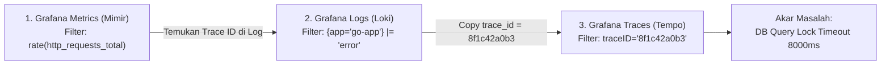

# Minggu 12 — Modul 05: Live Incident Simulation & Multi-Source Observability Correlation Drill

## 🎯 Tujuan Pembelajaran
Setelah menyelesaikan modul ini, Anda akan mampu:
1. Menjalankan **Live Incident Simulation** pada jam 02:17 WIB (Skenario: Peak traffic + DB Deadlock + Cascading Latency Spike 8s & Error Rate 18.4%).
2. Melakukan **Multi-Source Observability Correlation Drill** dengan menghubungkan 3 pilar observabilitas secara simultan: **Metrics (Mimir)** $\rightarrow$ **Logs (Loki)** $\rightarrow$ **Traces (Tempo)**.
3. Melacak akar masalah (Root Cause) menggunakan Trace ID linier dari request HTTP di browser hingga query SQL di database PostgreSQL.
4. Membuat analisis awal dampak insiden pada Error Budget aplikasi.

---

## 🎬 1. Skenario Insiden Produksi (Jam 02:17 WIB)

### Kronologi Kejadian (Incident Narrative)
Pada pukul 02:17 WIB, sistem e-commerce menerima flash sale traffic. Tiba-tiba P1 Alert `SLOErrorBudgetFastBurn` menyala di Discord.
- **Gejala Pertama**: Latency $p_{95}$ melonjak dari 15ms menjadi 8.2 detik.
- **Gejala Kedua**: Error Rate HTTP 500 meningkat drastis mencapai 18.4%.
- **Gejala Ketiga**: Pod `go-app` mulai tumbang secara bertahap (`OOMKilled` dan `CrashLoopBackOff` akibat connection queue thread membeludak).

```mermaid
timeline
    title Incident Timeline (02:17 - 02:26 WIB)
    02:17 WIB : Flash Sale dimulai. Spike Traffic 300 VU.
              : P1 Alert Firing: SLOErrorBudgetFastBurn.
    02:18 WIB : On-Call Engineer menerima notifikasi Discord & men-ACK alert.
    02:20 WIB : Grafana Mimir Check: Latency p95 > 8s, DB Connection Pool Saturation = 100%.
    02:22 WIB : Grafana Loki Check: Log Error "pq: canceling statement due to lock timeout".
    02:25 WIB : Grafana Tempo Check: Trace ID `8f1c42a0b3` menunjukkan DB query block pada table `orders`.
    02:26 WIB : Root Cause teridentifikasi: Exclusive Row Lock on DB Transaction.
```

---

## 💥 2. Manifest Incident Injector: Skrip Pengacau

Untuk mensimulasikan insiden ini secara realis di cluster k3s, kita mengaplikasikan manifest kustom yang menyuntikkan query deadlock dan membatasi DB connection pool secara paksa.

### File Manifest: `minggu-12/manifests/05-incident-injector.yaml`

```yaml
apiVersion: batch/v1
kind: Job
metadata:
  name: incident-chaos-injector
  namespace: prod-app
spec:
  template:
    spec:
      restartPolicy: Never
      containers:
        - name: chaos-db-lock
          image: postgres:16-alpine
          command:
            - sh
            - -c
            - |
              echo "==> SRE CHAOS INJECTION: Locking table orders..."
              PGPASSWORD=secret postgres -h postgres-service.prod-app.svc.cluster.local -U postgres -d orderdb -c "
                BEGIN;
                LOCK TABLE orders IN EXCLUSIVE MODE;
                SELECT pg_sleep(300); -- Lock table orders for 5 minutes
                COMMIT;
              "
```

---

## 🔍 3. Langkah-Langkah Correlation Drill (Mimir -> Loki -> Tempo)

Mari kita simulasikan proses investigasi yang dilakukan SRE untuk menemukan akar masalah dalam waktu 6 menit!



### Langkah A: Mimir Diagnostics (PromQL Metric Query)
Buka Grafana Explore (`http://localhost:3000/explore`), pilih datasource **Prometheus/Mimir**:

1. **Periksa Error Rate Metric:**
   ```promql
   sum(rate(http_requests_total{namespace="prod-app", status=~"5.."}[1m])) 
   / 
   sum(rate(http_requests_total{namespace="prod-app"}[1m])) * 100
   ```
   *Hasil*: Plot grafik menunjukkan lonjakan tajam ke **18.4%**.

2. **Periksa Latency Percentile 95:**
   ```promql
   histogram_quantile(0.95, sum(rate(http_request_duration_seconds_bucket{namespace="prod-app"}[1m])) by (le))
   ```
   *Hasil*: Latency garis $p_{95}$ melonjak dari $0.02\text{s}$ ke **$8.2\text{s}$**.

---

### Langkah B: Loki Diagnostics (LogQL Query)
Pindah datasource ke **Loki** di Grafana Explore:

1. **Cari Log Error pada Aplikasi Go API:**
   ```logql
   {namespace="prod-app", app="go-app"} |= "error" | json
   ```

2. **Temukan Log Spesifik yang Berisi Error DB:**
   ```text
   {
     "level": "error",
     "timestamp": "2026-08-11T02:22:15.102Z",
     "message": "failed to insert order: pq: canceling statement due to lock timeout",
     "trace_id": "8f1c42a0b3994e1d91240a0123456789",
     "span_id": "a1b2c3d4e5f6",
     "http_method": "POST",
     "http_path": "/api/v1/orders"
   }
   ```
   👉 *Salin `trace_id`: `8f1c42a0b3994e1d91240a0123456789`*

---

### Langkah C: Tempo Diagnostics (Trace ID Lookup)
Pindah datasource ke **Tempo** di Grafana Explore dan masukkan Trace ID:

```text
Trace ID: 8f1c42a0b3994e1d91240a0123456789
Duration: 8.04s
Spans: 4
```

**Visualisasi Span Waterfall di Tempo:**
```text
[POST /api/v1/orders] .................................................... 8040ms
  ├── [HTTP Handler: Validate Payload] ......................... 2ms
  ├── [Redis: GET product_stock] .............................. 4ms
  └── [PostgreSQL: INSERT INTO orders] ......................... 8034ms (ERROR: Lock Timeout)
        └── error = "pq: canceling statement due to lock timeout"
```

---

## 🎯 4. Kesimpulan Diagnosis SRE

Berdasarkan korelasik 3 pilar observabilitas:
1. **Mimir** mengonfirmasi adanya penurunan ketersediaan (HTTP 500 = 18.4%) dan degradasi waktu respon (8.2s).
2. **Loki** mengisolasi penyebab spesifik: `pq: canceling statement due to lock timeout` pada operasi database PostgreSQL.
3. **Tempo** membuktikan bahwa 99.9% waktu eksekusi (8034ms dari total 8040ms) tertahan di dalam span `PostgreSQL: INSERT INTO orders`.

**Akar Masalah (Root Cause):**
Terdapat transaksi yang mengunci tabel `orders` secara eksklusif (`EXCLUSIVE LOCK`), menyebabkan semua request `POST /api/v1/orders` mengalami antrean (thread locking), menghabiskan connection pool aplikasi, dan memicu error `lock timeout` serta pembakaran error budget secara masif.

---

## 📌 Checklist Validasi Modul 05
- [x] Manifest `05-incident-injector.yaml` berhasil di-apply untuk memicu simulasi insiden.
- [x] On-call triage berhasil membaca gejala insiden pada jam 02:17 WIB.
- [x] Query PromQL Mimir membuktikan Latency $p_{95} = 8.2\text{s}$ dan Error Rate = 18.4%.
- [x] LogQL Loki berhasil mengekstrak `trace_id` dari log error PostgreSQL.
- [x] Waterfall Span Tempo berhasil melacak bottleneck transaksi pada span `PostgreSQL: INSERT INTO orders`.
