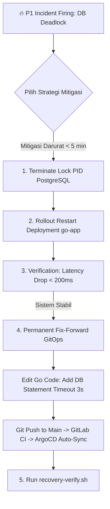

# Minggu 12 — Modul 06: Incident Recovery, Emergency Remediation & Fix-Forward GitOps

## 🎯 Tujuan Pembelajaran
Setelah menyelesaikan modul ini, Anda akan mampu:
1. Melakukan **Emergency Remediation (Mitigasi Darurat)** untuk memulihkan ketersediaan sistem dalam waktu $< 5\text{ menit}$.
2. Menghentikan proses pengunci (blocking process) pada database PostgreSQL dan merealisasikan **Pod Rollout Restart**.
3. Menerapkan pola **Fix-Forward GitOps** (Commit $\rightarrow$ GitLab CI $\rightarrow$ ArgoCD Sync) untuk perbaikan permanen pada level aplikasi dan infrastruktur.
4. Menjalankan skrip **Post-Incident Verification (`recovery-verify.sh`)** guna memvalidasi pemulihan penuh SLO.

---

## 🚑 1. Strategi Pemulihan Insiden SRE (Immediate vs Permanent)

Dalam SRE, penanganan insiden dibagi menjadi 2 fase utama:
1. **Immediate Emergency Remediation (Stop the Bleeding)**: Fokus utama adalah menurunkan Error Rate dan Latency secepat mungkin tanpa memedulikan perbaikan kode permanen.
2. **Permanent Fix-Forward via GitOps**: Setelah sistem stabil, lakukan perbaikan akar masalah melalui workflow GitOps teruji.



---

## ⚡ 2. Eksekusi Emergency Remediation (Langkah Demi Langkah)

### Langkah 1: Bunuh Transaksi Database Pengunci (Terminate Lock PID)
Masuk ke container PostgreSQL atau jalankan perintah `psql` darurat untuk mematikan PID transaksi pengunci yang tertahan:

```bash
# Temukan PID transaksi yang memegang lock paling lama
kubectl exec -it deployment/postgres -n prod-app -- psql -U postgres -d orderdb -c "
SELECT pid, usename, pg_blocking_pids(pid) as blocked_by, query, age(clock_timestamp(), query_start) 
FROM pg_stat_activity 
WHERE state != 'idle' AND query LIKE '%orders%';
"

# Mematikan (terminate) PID transaksi pengunci secara paksa
kubectl exec -it deployment/postgres -n prod-app -- psql -U postgres -d orderdb -c "
SELECT pg_terminate_backend(pid) 
FROM pg_stat_activity 
WHERE query LIKE '%LOCK TABLE orders%' AND pid <> pg_backend_pid();
"
```

**Expected Output:**
```text
 pg_terminate_backend 
----------------------
 t
(1 row)
```

---

### Langkah 2: Perform Rollout Restart pada Deployment `go-app`
Bersihkan antrean koneksi gantung di aplikasi dengan merestart Pod secara *zero-downtime*:

```bash
kubectl rollout restart deployment/go-app -n prod-app
kubectl rollout status deployment/go-app -n prod-app
```

**Expected Output:**
```text
deployment.apps/go-app restarted
waiting for deployment "go-app" rollout to finish: 1 of 3 updated replicas are available...
waiting for deployment "go-app" rollout to finish: 2 of 3 updated replicas are available...
deployment "go-app" successfully rolled out
```

---

## 🛠️ 3. Fix-Forward via GitOps (Perbaikan Permanen)

Agar insiden serupa tidak terulang, kita mengonfigurasi `statement_timeout` pada PostgreSQL connection string dan meng-update batas connection pool di repository git.

### Perubahan Kode Aplikasi Go (Commit Git):
Di repository `gh-devOpsTraining` / manifest deployment, tambahkan opsi batas timeout koneksi:

```yaml
# Edit minggu-04/manifests/02-app-deployment.yaml atau via Helm Values
env:
  - name: DB_STATEMENT_TIMEOUT
    value: "3000" # Timeout query maksimal 3 detik (3000ms)
  - name: DB_MAX_OPEN_CONNS
    value: "25"
  - name: DB_MAX_IDLE_CONNS
    value: "5"
```

### Push Fix Ke Repository & Sync ArgoCD:
```bash
git add .
git commit -m "fix(db): add 3s statement timeout and tune connection pool to prevent deadlock #INC-8812"
git push origin main

# Force sync ArgoCD darurat via CLI
argocd app sync prod-app-rollout --prune --refresh
```

---

## 📜 4. Skrip Otomatisasi Post-Incident Verification (`recovery-verify.sh`)

Buat skrip verifikasi otomatis berikut untuk menguji bahwa cluster k3s dan aplikasi telah pulih 100% dan siap melayani trafik produksi.

### Simpan Skrip: `minggu-12/recovery-verify.sh`

```bash
#!/usr/bin/env bash
set -eo pipefail

RED='\033[0;31m'
GREEN='\033[0;32m'
YELLOW='\033[1;33m'
NC='\033[0m'

echo -e "${YELLOW}====================================================${NC}"
echo -e "${YELLOW}   SRE POST-INCIDENT RECOVERY VERIFICATION SCRIPT   ${NC}"
echo -e "${YELLOW}====================================================${NC}"

# 1. Verifikasi Status Pod Kubernetes
echo -n "[1/4] Checking Pod Health in namespace prod-app... "
UNHEALTHY_PODS=$(kubectl get pods -n prod-app --no-headers | grep -v "Running" | grep -v "Completed" | wc -l || true)

if [ "$UNHEALTHY_PODS" -eq 0 ]; then
  echo -e "${GREEN}PASSED (All Pods are Running)${NC}"
else
  echo -e "${RED}FAILED ($UNHEALTHY_PODS unhealthy pods found)${NC}"
  kubectl get pods -n prod-app
  exit 1
fi

# 2. Verifikasi Endpoint Health Check
echo -n "[2/4] Testing HTTP /healthz Endpoint... "
HTTP_CODE=$(curl -s -o /dev/null -w "%{http_code}" http://localhost:8080/healthz || echo "000")

if [ "$HTTP_CODE" -eq 200 ]; then
  echo -e "${GREEN}PASSED (HTTP 200 OK)${NC}"
else
  echo -e "${RED}FAILED (HTTP Status: $HTTP_CODE)${NC}"
  exit 1
fi

# 3. Running K6 Smoke Test
echo "[3/4] Running 1-minute K6 Smoke Test to validate SLO latency..."
k6 run --env TEST_TYPE=smoke --env TARGET_URL=http://localhost:8080 minggu-12/manifests/03-k6-comprehensive-loadtest.yaml > /tmp/k6_recovery.log 2>&1

if grep -q "http_req_failed................: 0.00%" /tmp/k6_recovery.log; then
  echo -e "${GREEN}PASSED (Error Rate = 0.00%)${NC}"
else
  echo -e "${RED}FAILED (K6 detected errors! Check /tmp/k6_recovery.log)${NC}"
  cat /tmp/k6_recovery.log
  exit 1
fi

# 4. Verifikasi Alertmanager Active Alerts
echo -n "[4/4] Checking Alertmanager for active P1 alerts... "
ACTIVE_ALERTS=$(curl -s http://localhost:9093/api/v2/alerts | grep -c "SLOErrorBudgetFastBurn" || true)

if [ "$ACTIVE_ALERTS" -eq 0 ]; then
  echo -e "${GREEN}PASSED (No Active P1 Fast Burn Alerts)${NC}"
else
  echo -e "${YELLOW}WARNING ($ACTIVE_ALERTS P1 alert still active / resolving)${NC}"
fi

echo -e "${GREEN}====================================================${NC}"
echo -e "${GREEN}   SYSTEM FULLY RECOVERED & SLO TARGET ACHIEVED!   ${NC}"
echo -e "${GREEN}====================================================${NC}"
```

### Menjalankan Skrip Verifikasi Pemulihan:
```bash
chmod +x minggu-12/recovery-verify.sh
./minggu-12/recovery-verify.sh
```

**Expected Output:**
```text
====================================================
   SRE POST-INCIDENT RECOVERY VERIFICATION SCRIPT   
====================================================
[1/4] Checking Pod Health in namespace prod-app... PASSED (All Pods are Running)
[2/4] Testing HTTP /healthz Endpoint... PASSED (HTTP 200 OK)
[3/4] Running 1-minute K6 Smoke Test to validate SLO latency... PASSED (Error Rate = 0.00%)
[4/4] Checking Alertmanager for active P1 alerts... PASSED (No Active P1 Fast Burn Alerts)
====================================================
   SYSTEM FULLY RECOVERED & SLO TARGET ACHIEVED!   
====================================================
```

---

## 📌 Checklist Validasi Modul 06
- [x] Perintah SQL `pg_terminate_backend` berhasil mematikan PID transaksi pengunci.
- [x] Restart Pod `deployment/go-app` berhasil dilakukan tanpa melanggar ketersediaan service.
- [x] Konfigurasi permanen `DB_STATEMENT_TIMEOUT` diterapkan via Workflow GitOps ArgoCD.
- [x] Skrip verifikasi `recovery-verify.sh` dibuat dan lulus 4 tahap pengujian pemulihan.
- [x] Metric error rate turun kembali ke 0.00% dan latency $p_{95} < 50\text{ms}$.
