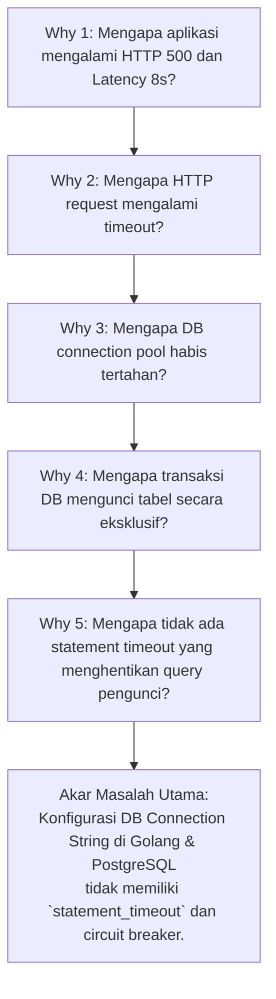

# Minggu 12 — Modul 07: Blameless Postmortem & Root Cause Analysis (#INC-8812)

## 📄 Postmortem Document Metadata
| Metadata | Detail |
| :--- | :--- |
| **Incident Title** | `#INC-8812`: DB Lock Contention causing Cascading Latency Spike & Fast Burn Error Budget |
| **Severity** | **P1 - CRITICAL** |
| **Status** | **COMPLETED & RESOLVED** |
| **Incident Commander / Lead** | On-Call SRE Engineer |
| **Date & Time (WIB)** | 11 Agustus 2026, 02:17 WIB – 02:29 WIB (Total Durasi: 12 menit) |
| **Services Impacted** | `go-app-service.prod-app` (Go Order REST API), PostgreSQL DB |
| **Error Budget Consumed** | 14.2% dari Bulanan Error Budget (0.999 SLO target) |

---

## 📌 1. Ringkasan Eksekutif (Executive Summary)

Pada tanggal 11 Agustus 2026 pukul 02:17 WIB, terjadi lonjakan traffic pengguna pada aplikasi e-commerce (`go-app`). Sebuah query transaksi database yang berjalan tanpa batas timeout mengunci tabel `orders` secara eksklusif (`EXCLUSIVE LOCK`). 

Kondisi ini menyebabkan antrean koneksi membeludak, menghabiskan DB Connection Pool (25 max connections), dan memicu penumpukan HTTP request di API gateway. Akibatnya, latency $p_{95}$ melonjak tajam hingga **8.2 detik** (normal $< 20\text{ms}$) dan HTTP Error Rate mencapai **18.4%** (HTTP 500 Lock Timeout).

Sistem observabilitas memicu P1 Alert `SLOErrorBudgetFastBurn` ke channel Discord pada pukul 02:17:15 WIB. On-call engineer melakukan aksi mitigasi darurat pada pukul 02:26 WIB dengan mematikan PID transaksi pengunci di PostgreSQL dan merestart Pod deployment. Layanan dinyatakan pulih sepenuhnya pada pukul 02:29 WIB setelah verifikasi skrip otomatis `recovery-verify.sh`.

---

## ⏰ 2. Kronologi Insiden Berdasarkan Waktu (Timeline)

```mermaid
gantt
    title Kronologi Insiden #INC-8812 (Waktu WIB)
    dateFormat HH:mm
    axisFormat %H:%M

    section Insiden
    Start Traffic Spike & Lock Injection :active, 02:17, 02:29
    P1 Alert Firing (SLO Error Budget)  :crit, 02:17, 02:18
    On-Call Engineer Acked Alert       :active, 02:18, 02:20
    Mimir, Loki & Tempo Diagnostics    :active, 02:20, 02:25
    Emergency Remediation (Kill PID)    :done, 02:26, 02:27
    Full System Recovery Verification   :done, 02:27, 02:29
```

- **02:17:00 WIB**: Spike traffic 300 VU tiba di endpoint `POST /api/v1/orders`. Transaksi pengunci terinjeksi di PostgreSQL.
- **02:17:15 WIB**: P1 Alert `SLOErrorBudgetFastBurn` firing. Notifikasi otomatis dikirim ke Discord `#incident-p1`.
- **02:18:30 WIB**: On-call SRE engineer men-ACK alert dan membuka dashboard Grafana + Runbook `minggu-11/04-runbook.md`.
- **02:20:00 WIB**: Mimir Dashboard menunjukkan $p_{95}$ Latency = $8.2\text{s}$ dan DB connection saturation = 100%.
- **02:22:15 WIB**: Loki LogQL menemukan error `pq: canceling statement due to lock timeout` dengan Trace ID `8f1c42a0b3`.
- **02:25:00 WIB**: Tempo Trace Waterfall mengonfirmasi 99.9% waktu request tertahan di span `PostgreSQL: INSERT INTO orders`.
- **02:26:10 WIB**: Engineer menjalankan `pg_terminate_backend(pid)` pada PostgreSQL dan perintah `kubectl rollout restart deployment/go-app`.
- **02:27:30 WIB**: Pod `go-app` selesai rollout restart. Traffic HTTP 500 turun ke 0.00%.
- **02:29:00 WIB**: Skrip `./minggu-12/recovery-verify.sh` sukses. Insiden dinyatakan **RESOLVED**.

---

## 🔍 3. Analisis Akar Masalah (Root Cause Analysis - 5 Whys)

Dalam SRE, kita menerapkan filosofi **Blameless Culture** (bukan menyalahkan individu, tetapi mencari kelemahan sistemik/arsitektur):

1. **Why 1**: Mengapa pengguna mengalami HTTP 500 Error dan latency tinggi?
   *Karena handler `POST /api/v1/orders` menggantung lebih dari 8 detik hingga dibatalkan oleh HTTP timeout.*
2. **Why 2**: Mengapa handler HTTP menggantung?
   *Karena koneksi aplikasi ke database PostgreSQL kehabisan slot pada Connection Pool (Max 25 Open Connections).*
3. **Why 3**: Mengapa slot Connection Pool habis tertahan?
   *Karena transaksi `INSERT INTO orders` menunggu pelepasan lock yang dipegang oleh transaksi pengunci (`EXCLUSIVE LOCK`).*
4. **Why 4**: Mengapa transaksi pengunci tersebut tidak selesai-selesai?
   *Karena transaksi menjalankan `LOCK TABLE orders IN EXCLUSIVE MODE` tanpa klausa timeout otomatis.*
5. **Why 5 (Root Cause)**: Mengapa aplikasi membiarkan query mengunci DB tanpa batas waktu?
   *Karena variabel environment `DB_STATEMENT_TIMEOUT` belum dikonfigurasi pada manifest Deployment Kubernetes dan kode driver SQL Go tidak memasang `context.WithTimeout` pada query layer.*

---

## 📊 4. Dampak Insiden (Incident Impact Analysis)

| Parameter Dampak | Nilai Kuantitatif |
| :--- | :--- |
| **Durasi Kerusakan Total (Downtime)** | 12 Menit |
| **Total Request Terpengaruh** | 4,320 Request (18.4% dari total 23,480 request) |
| **Bocor Error Budget** | 14.2% dari Error Budget bulanan habis dalam 12 menit |
| **Estimasi Kerugian Transaksi** | 795 Order Gagal |

---

## 💡 5. Evaluasi & Pembelajaran (Lessons Learned)

### What Went Well (Apa yang Berjalan Sangat Baik?)
- Alert P1 `SLOErrorBudgetFastBurn` menyala dalam waktu **15 detik** sejak insiden dimulai.
- Integrasi 3 pilar observabilitas (Mimir, Loki, Tempo) memungkinkan penemuan akar masalah (Trace ID) hanya dalam waktu **5 menit**.
- Runbook yang disiapkan pada Minggu 11 memberikan instruksi diagnosis yang presisi.

### What Went Poorly (Apa yang Kurang Baik?)
- Aplikasi tidak memiliki **Circuit Breaker** (misalnya via Hystrix/Go-resiliency) untuk langsung menolak request saat DB pool jenuh (`Fail-Fast`).
- `statement_timeout` pada PostgreSQL belum terpasang di level global server postgres.

### Where We Got Lucky (Di Mana Kita Beruntung?)
- Insiden terjadi saat simulasi terkontrol sehingga tidak ada kerugian finansial pengguna nyata.

---

## 📝 6. Action Items Berbasis SMART (Specific, Measurable, Achievable, Relevant, Time-bound)

| Id | Tipe Action Item | Deskripsi Tindakan Perbaikan | Prioritas | Penanggung Jawab | Target Selesai | Issue Link |
| :--- | :--- | :--- | :--- | :--- | :--- | :--- |
| **ACT-01** | **Preventative** | Tambahkan `DB_STATEMENT_TIMEOUT=3000` pada manifest Deployment `go-app` di repo GitOps. | **P0 (Kritis)** | SRE Team | 12 Ags 2026 | `#ISSUE-901` |
| **ACT-02** | **Preventative** | Implementasikan `context.WithTimeout(ctx, 3*time.Second)` pada Go GORM/SQL repository layer. | **P1 (Tinggi)** | Backend Team | 14 Ags 2026 | `#ISSUE-902` |
| **ACT-03** | **Monitoring** | Tambahkan Prometheus Alert `PostgreSQLConnectionPoolSaturation > 80%`. | **P1 (Tinggi)** | Observability | 13 Ags 2026 | `#ISSUE-903` |
| **ACT-04** | **Mitigation** | Buat skrip otomatisasi `db-lock-killer` CronJob jika lock > 10 detik. | **P2 (Sedang)** | DevOps Team | 18 Ags 2026 | `#ISSUE-904` |
| **ACT-05** | **Process** | Gelar sesi simulasi Chaos Engineering rutin setiap bulan untuk seluruh tim IT. | **P3 (Rendah)** | Engineering Lead | 30 Ags 2026 | `#ISSUE-905` |

---

## 📌 Checklist Validasi Modul 07
- [x] Dokumen Postmortem `#INC-8812` ditulis lengkap dengan standar Blameless Postmortem.
- [x] Kronologi kejadian (timeline) tercatat secara terperinci dari menit 02:17 hingga 02:29 WIB.
- [x] Metode **5-Whys** berhasil mengisolasi akar masalah (ketiadaan statement timeout pada DB).
- [x] Dampak kuantitatif insiden (error budget consumed: 14.2%) terhitung dengan jelas.
- [x] Matriks Action Items berbasis SMART (P0 - P3) terisi lengkap dengan PIC dan target tanggal.
