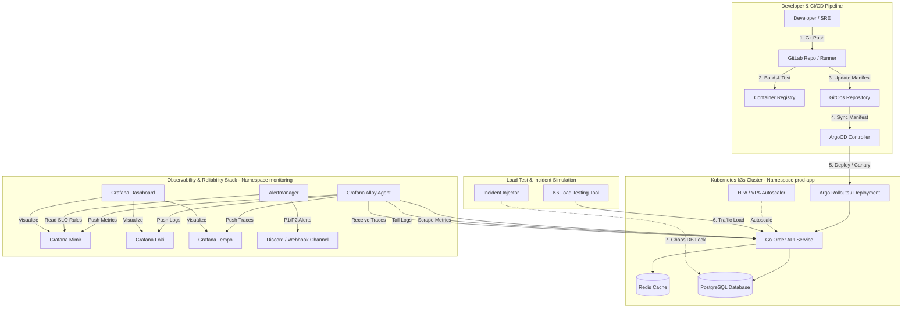
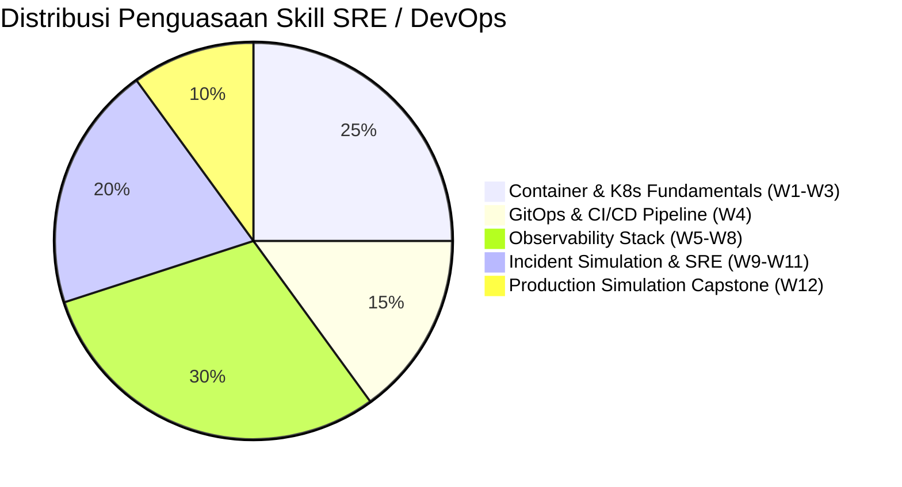

# Minggu 12 — Final Capstone: End-to-End Production Simulation & SRE Platform Certification

Selamat! Anda telah sampai di puncak perjalanan pembelajaran **SRE & DevOps Mini Production Platform** selama 12 Minggu. Modul ini adalah proyek pungkasan (Capstone Project) yang mengintegrasikan seluruh materi dari Minggu 1 hingga Minggu 11 dalam satu skenario simulasi produksi dunia nyata yang utuh di laptop Anda.

---

## 🗺️ Arsitektur Master Platform Produksi (12-Week Integration)

Berikut adalah peta jalan lengkap bagaimana seluruh komponen yang telah Anda bangun berinteraksi secara harmonis:

---

## 📚 Navigasi Modul Minggu 12

Tabel berikut berisi daftar modul pembelajaran terstruktur di dalam direktori `minggu-12/`:

| File Modul | Judul Materi | Ringkasan Pembelajaran |
| :--- | :--- | :--- |
| **`01-environment-integration.md`** | End-to-End Environment Integration & Smoke Test | Integrasi topologi 17 komponen, tabel port mapping, skrip `smoke-test.sh` 8 tingkat. |
| **`02-deployment-baru.md`** | Deployment Baru & GitOps Canary Rollout | Golden Path 7 tahap, GitLab CI multi-stage, Argo Rollouts canary (10% $\rightarrow$ 100%). |
| **`03-load-test.md`** | Comprehensive Load Testing & SLO Validation | 4 skenario K6 (Smoke, Stress, Spike, Soak), validasi SLO 99.9% & latency $p_{95} < 200\text{ms}$. |
| **`04-alerting-response.md`** | Alert Triage Workflow & On-Call Escalation | Matriks keparahan P1/P2/P3, Alertmanager routing, Runbook URL integration, `amtool` silence. |
| **`05-incident-simulation.md`** | Live Incident Simulation & Correlation Drill | Simulasi insiden 02:17 WIB (Latency 8s, Error 18%), korelasik 3 pilar (Mimir $\rightarrow$ Loki $\rightarrow$ Tempo). |
| **`06-recovery-remediation.md`** | Incident Recovery & Fix-Forward GitOps | Emergency remediation (`pg_terminate_backend`), GitOps fix-forward, skrip `recovery-verify.sh`. |
| **`07-final-postmortem.md`** | Blameless Postmortem & Root Cause Analysis | Dokumen Postmortem `#INC-8812` standar Google SRE, 5-Whys, SMART Action Items. |

---

## 📁 Direktori Artifact Manifests & Scripts

Seluruh manifest YAML dan skrip otomatisasi Minggu 12 tersimpan di:
- `minggu-12/manifests/03-k6-comprehensive-loadtest.yaml`: ConfigMap & Job K6 Load Test.
- `minggu-12/manifests/04-alertmanager-routing.yaml`: AlertmanagerConfig & PrometheusRules SLO Fast/Slow Burn.
- `minggu-12/manifests/05-incident-injector.yaml`: Chaos Injector DB Exclusive Lock.
- `minggu-12/recovery-verify.sh`: Skrip verifikasi pemulihan pasca-insiden 4-tier.

---

## 🎓 12-Week Curriculum Competency Matrix (Sertifikasi SRE Mini Platform)

Berikut adalah ringkasan matriks kompetensi yang telah Anda kuasai sepanjang 12 Minggu:

| Minggu | Topik Utama | Status Kompetensi | Output Utama |
| :---: | :--- | :---: | :--- |
| **Minggu 1** | Fundamental Container & Kubernetes | ✅ GRADUATED | Dockerfile multi-stage, Pod, Deployment, Service k3s |
| **Minggu 2** | Kubernetes Workload & State Management | ✅ GRADUATED | StatefulSet PostgreSQL, ConfigMap, Secret, PVC/PV |
| **Minggu 3** | Package Management via Helm | ✅ GRADUATED | Custom Helm Chart `go-app` dengan Go Templating |
| **Minggu 4** | GitLab CI + GitOps ArgoCD | ✅ GRADUATED | Pipeline CI/CD otomatis, ArgoCD Auto-Sync & Self-Healing |
| **Minggu 5** | Metrics Observability (Grafana Mimir) | ✅ GRADUATED | PromQL 4 Golden Signals, Alloy Scrape Config, Mimir TSDB |
| **Minggu 6** | Logging Observability (Grafana Loki) | ✅ GRADUATED | LogQL Query, JSON parser, Structured Logging Go |
| **Minggu 7** | Distributed Tracing (Grafana Tempo) | ✅ GRADUATED | OpenTelemetry Go SDK, Context Propagation, Tempo Spans |
| **Minggu 8** | Dashboard & Alerting System | ✅ GRADUATED | Alertmanager, PrometheusRules, Grafana Dashboard import |
| **Minggu 9** | Incident Simulation I (Basic Failures) | ✅ GRADUATED | Troubleshooting OOMKilled, CrashLoopBackOff, Config Error |
| **Minggu 10** | Incident Simulation II (Advanced Failures) | ✅ GRADUATED | 9 Lab Insiden (CPU Spike, Memory Leak, DB Deadlock, DNS Error) |
| **Minggu 11** | Reliability Engineering (SLO/SLI/SLA) | ✅ GRADUATED | Multi-Window Multi-Burn-Rate Alerts, Runbook, Postmortem |
| **Minggu 12** | Production Simulation (Final Capstone) | ✅ GRADUATED | End-to-End Simulation: Load test, Incident, Recovery, Postmortem |

---

## 🏆 Pernyataan Sertifikasi Mandiri

> **SELAMAT!**  
> Anda kini telah memiliki pemahaman teoritis dan keterampilan praktis yang solid sebagai seorang **SRE / DevOps Engineer**. Anda tidak hanya mampu membuat infrastruktur Kubernetes, tetapi juga paham cara menjaga keandalannya (*reliability*), merespon insiden di tengah malam dengan tenang, dan memulihkan sistem menggunakan standar terbaik industri dunia.
